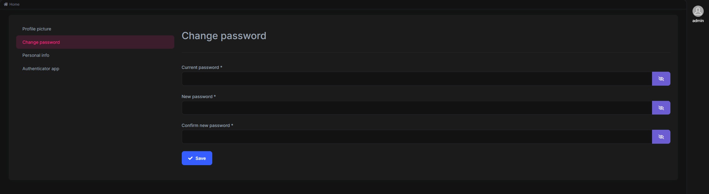
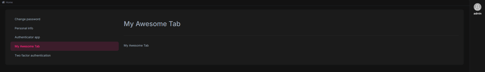

# Manage Profile Page Tabs



The tabs in the manage profile page can be managed via `ManageProfileTabsService` which is exposed by the `@volo/abp.ng.account/public/config` package. You can add, remove, or edit a tab with using this service.

See the example below, covers all features:

```ts
// manage-profile-tabs.provider.ts

import { APP_INITIALIZER, Component } from "@angular/core";
import { TwoFactorTabComponent } from "@volo/abp.ng.account/public";
import {
  eAccountManageProfileTabNames,
  ManageProfileTabsService,
} from "@volo/abp.ng.account/public/config";
import { MyAwesomeTabComponent } from "./my-awesome-tab/my-awesome-tab.component";

@Component({
  standalone: true,
  selector: "abp-my-awesome-tab",
  template: `My Awesome Tab`,
})
class MyAwesomeTabComponent {}

export const MANAGE_PROFILE_TAB_PROVIDER = {
  provide: APP_INITIALIZER,
  useFactory: configureManageProfileTabs,
  deps: [ManageProfileTabsService],
  multi: true,
};

export function configureManageProfileTabs(tabs: ManageProfileTabsService) {
  return () => {
    tabs.add([
      {
        name: "::MyAwesomeTab", // supports localization keys
        order: 5,
        component: MyAwesomeTabComponent,
      },
    ]);

    tabs.patch(eAccountManageProfileTabNames.TwoFactor, {
      name: "Two factor authentication",
      component: TwoFactorTabComponent,
    });

    tabs.remove([eAccountManageProfileTabNames.ProfilePicture]);
  };
}
```

```ts
//app.module.ts

import { MANAGE_PROFILE_TAB_PROVIDER } from "./manage-profile-tabs.provider";

@NgModule({
  providers: [MANAGE_PROFILE_TAB_PROVIDER],
})
export class AppModule {}
```

What we have done above;

- Created the `manage-profile-page-tabs.provider.ts`.
- Determined the `configureManageProfileTabs` function to perform manage profile tabs actions.
  - Added a new tab labeled "My awesome tab".
  - Renamed the "Two factor" tab label.
  - Removed the "Profile picture" tab.
- Determined the `MANAGE_PROFILE_TAB_PROVIDER` to be able to run the `configureManageProfileTabs` function on initialization.
- Registered the `MANAGE_PROFILE_TAB_PROVIDER` to the `AppModule` providers.

See the result:


