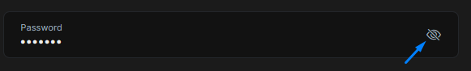

# Show Password Directive

In password input, text can be shown easily via changing input type attribute to `text`. To make this even easier, you can use the `ShowPasswordDirective` which has been exposed by the `@abp/ng.core` package.


## Getting Started
`ShowPasswordDirective` is standalone. In order to use the `ShowPasswordDirective` in an HTML template, import it to related module or your standalone component:

**Importing to NgModule**
```ts
import { ShowPasswordDirective } from '@abp/ng.core';

@NgModule({
  //...
  declarations: [
   ...,
   TestComponent
  ],
  imports: [
   ...,
   ShowPasswordDirective
  ],
})
export class MyFeatureModule {}
```

## Usage

The `ShowPasswordDirective` is very easy to use. The directive's selector is **`abpShowPassword`**. By adding the `abpShowPassword` attribute to an input element, you can activate the `ShowPasswordDirective` for the input element.

See an example usage:

**NgModule Component usage**
```ts
@Component({
  selector: 'test-component',
  template: `
    <div class="d-flex flex-column">
      <label>Password</label>
      <input [abpShowPassword]="showPassword"/>
      <i (click)="showPassword = !showPassword">icon</i>
    </div>
  `
})
export class TestComponent{
  showPassword = false;
}
```
**Standalone Component usage**
```ts
import { ShowPasswordDirective } from '@abp/ng.core';
@Component({
  selector: 'standalone-component',
  standalone: true,
  template: `
    <div class="d-flex flex-column">
      <label>Password</label>
      <input [abpShowPassword]="showPassword"/>
      <i (click)="showPassword = !showPassword">icon</i>
    </div>
  `,
  imports: [ShowPasswordDirective]
})
export class StandaloneComponent{
  showPassword = false;
}
```

The `abpShowPassword` attribute has been added to the `<input>` element. Click icon to activate the `ShowPasswordDirective`.

See the result:



To see password input click icon.


