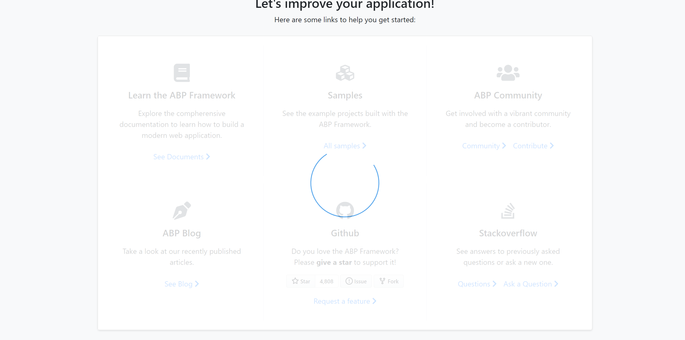

# Blazor UI: Block/Busy Service

UI Block disables (blocks) the page or a part of the page.

## Quick Example

Simply [inject](../../fundamentals/dependency-injection.md) `IBlockUiService` to your page or component and call the `Block/UnBlock` method to disables (blocks) the element.

```csharp
namespace MyProject.Blazor.Pages
{
    public partial class Index
    {
        private readonly IBlockUiService _blockUiService;

        public Index(IBlockUiService _blockUiService)
        {
            _blockUiService = blockUiService;
        }

        public async Task BlockForm()
        {
            /*
              Parameters of Block method:
                selectors: A string containing one or more selectors to match. https://developer.mozilla.org/en-US/docs/Web/API/Document/querySelector#selectors
                busy : Set to true to show a progress indicator on the blocked area.
            */
            await _blockUiService.Block(selectors: "#MySelectors", busy: true);
        }
    }
}
```

The resulting UI will look like below:



Then you can use `_blockUiService.UnBlock()` to re-enable the busy area/page.
