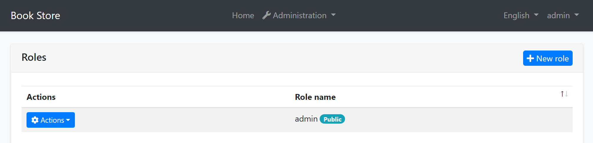

```json
//[doc-seo]
{
    "Description": "Learn how to customize your Blazor app's branding with the `IBrandingProvider` interface for a personalized user experience."
}
```

# Blazor UI: Branding

## IBrandingProvider

`IBrandingProvider` is a simple interface that is used to show the application name and logo on the layout.

The screenshot below shows *MyProject* as the application name:


You can implement the `IBrandingProvider` interface or inherit from the `DefaultBrandingProvider` to set the application name:

````csharp
using Volo.Abp.DependencyInjection;
using Volo.Abp.Ui.Branding;

namespace MyCompanyName.MyProjectName.Blazor
{
    [Dependency(ReplaceServices = true)]
    public class MyProjectNameBrandingProvider : DefaultBrandingProvider
    {
        public override string AppName => "Book Store";
    }
}
````

The result will be like shown below:



`IBrandingProvider` has the following properties:

* `AppName`: The application name.
* `LogoUrl`: A URL to show the application logo.
* `LogoReverseUrl`: A URL to show the application logo on a reverse color theme (dark, for example).

ABP's built-in Blazor themes resolve these URLs for the current application. `logo.png`, `/logo.png` and `~/logo.png` all mean the same application relative URL and include the base path of the application, so they keep working when it is deployed to a non-root path, like an IIS virtual directory. A URL that already contains the path gets it twice. External URLs are used as they are. `LogoReverseUrl` is used by the themes that have a dark style, like LeptonX, and falls back to `LogoUrl`.

> **Note**: The `<base href>` of the host page has to match the path the application is served from, like `<base href="/myapp/" />`.

A logo that the project defines in its own CSS is not resolved. The LeptonX Lite startup templates set the logo that way, so remove that declaration to deploy them to a non-root path.

To resolve a branding URL in a custom theme or component, use `NavigationManager.ResolveBrandingUrl(...)` with `@using Volo.Abp.AspNetCore.Components.Web.Theming.Branding`, or `ResolveBrandingCssUrl(...)` when it is rendered into `url('...')` in CSS.

> **Tip**: `IBrandingProvider` is used in every page refresh. For a multi-tenant application, you can return a tenant specific application name to customize it per tenant.
