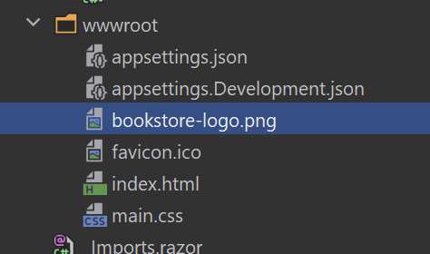
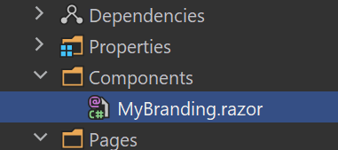

# Blazor UI: Customization / Overriding Components

````json
//[doc-params]
{
    "UI": ["Blazor", "BlazorServer"]
}
````

This document explains how to override the user interface of a depended [application module](../../../modules) or [theme](theming.md) for Blazor applications.

## Overriding a Razor Component

The ABP, pre-built themes and modules define some **re-usable razor components and pages**. These pages and components can be replaced by your application or module.

> Since pages are just the razor components, the same principle is valid for pages too.

### Example: Replacing the Branding Area

The screenshot below was taken from the [Basic Theme](basic-theme.md) comes with the application startup template.


The [Basic Theme](basic-theme.md) defines some razor components for the layout. For example, the highlighted area with the red rectangle above is called *Branding* component. You probably want to customize this component by adding your **own application logo**. Let's see how to do it.

First, create your logo and place under a folder in your web application. We used `wwwroot/bookstore-logo.png` path:



The next step is to create a razor component, like `MyBranding.razor`, in your application:



The content of the `MyBranding.razor` is shown below:


````html
@using Volo.Abp.DependencyInjection
{{if UI == "BlazorServer"}}
@using Volo.Abp.AspNetCore.Components.Server.BasicTheme.Themes.Basic
{{end}}
{{if UI == "Blazor"}}
@using Volo.Abp.AspNetCore.Components.WebAssembly.BasicTheme.Themes.Basic
{{end}}

@inherits Branding
@attribute [ExposeServices(typeof(Branding))]
@attribute [Dependency(ReplaceServices = true)]
<a href="/">
    
</a>
````

Let's explain the code:

* `@inherits Branding` line inherits the Branding component defined by the [Basic Theme](basic-theme.md) (in the {{if UI == "BlazorServer"}}`Volo.Abp.AspNetCore.Components.Server.BasicTheme.Themes.Basic`{{end}} {{if UI == "Blazor"}}`Volo.Abp.AspNetCore.Components.WebAssembly.BasicTheme.Themes.Basic`{{end}} namespace).
* `@attribute [ExposeServices(typeof(Branding))]` registers this service (component) to [dependency injection](../../fundamentals/dependency-injection.md) for the `Branding` service (component).
* `@attribute [Dependency(ReplaceServices = true)]` replaces the `Branding` class (component) with this new `MyBranding` class (component).
* The rest of the code is related the content and styling of the component.

Now, you can run the application to see the result:


> Since the component inherits from the component it is replacing, you can use all the non-private fields/properties/methods of the base component in the derived component.

### Example: Replacing with the Code Behind File

If you prefer to use code-behind file for the C# code of your component, you can use the attributes in the C# side.

**MyBlazor.razor**

````html
{{if UI == "BlazorServer"}}
@using Volo.Abp.AspNetCore.Components.Server.BasicTheme.Themes.Basic
{{end}}
{{if UI == "Blazor"}}
@using Volo.Abp.AspNetCore.Components.WebAssembly.BasicTheme.Themes.Basic
{{end}}
@inherits Branding
<a href="/">
    
</a>
````

**MyBlazor.razor.cs**

````csharp
{{if UI == "BlazorServer"}}
using Volo.Abp.AspNetCore.Components.Server.BasicTheme.Themes.Basic;
{{end}}
{{if UI == "Blazor"}}
using Volo.Abp.AspNetCore.Components.WebAssembly.BasicTheme.Themes.Basic;
{{end}}

using Volo.Abp.DependencyInjection;

namespace MyProject.Blazor.Components
{
    [ExposeServices(typeof(Branding))]
    [Dependency(ReplaceServices = true)]
    public partial class MyBranding
    {

    }
}
````

## Theming

The [Theming](theming.md) system allows you to build your own theme. You can create your theme from scratch or get the [Basic Theme](basic-theme.md) and change however you like.
