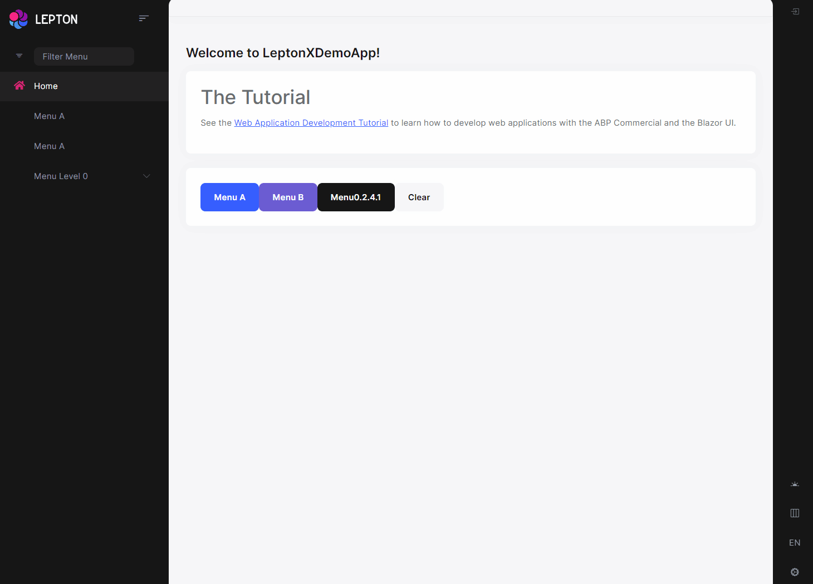

```json
//[doc-params]
{
    "BlazorUI": ["Blazorise", "MudBlazor"]
}
```

```json
//[doc-seo]
{
    "Description": "Learn how to define page-specific elements with PageLayout in ABP Framework, enhancing your application's navigation and title management."
}
```

# Page Layout
PageLayout is used to define page-specific elements across application. 


## Title
Title is used to render page title in the PageHeader.

```csharp
@inject PageLayout PageLayout

@{
    PageLayout.Title = "My Page Title";
}
```

## MenuItemName
Indicates current selected menu item name. Menu item name should match a unique menu item name defined using the [Navigation / Menu system](navigation-menu.md). In this case, it is expected from the theme to make the menu item "active" in the main menu. 

```csharp
@inject PageLayout PageLayout

@code {
    protected override async Task OnInitializedAsync()
    {
        PageLayout.MenuItemName = "MyProjectName.Products";
    }
}
```

Menu item name can be set on runtime too.

{{if BlazorUI == "Blazorise"}}

```html
@inject PageLayout PageLayout

<Button Clicked="SetCategoriesMenuAsSelected">Change Menu</Button>

@code{
    protected void SetCategoriesMenuAsSelected()
    {
        PageLayout.MenuItemName = "MyProjectName.Categories";
    }
}
```

{{end}}

{{if BlazorUI == "MudBlazor"}}

```razor
@inject PageLayout PageLayout

<MudButton OnClick="SetCategoriesMenuAsSelected" Variant="Variant.Filled" Color="Color.Primary">Change Menu</MudButton>

@code{
    protected void SetCategoriesMenuAsSelected()
    {
        PageLayout.MenuItemName = "MyProjectName.Categories";
    }
}
```

{{end}}





> Be aware, The [Basic Theme](basic-theme.md) currently doesn't support the selected menu item since it is not applicable to the top menu. 

## BreadCrumbs
BreadCrumbItems are used to render breadcrumbs in the PageHeader.

{{if BlazorUI == "Blazorise"}}

```csharp
@inject PageLayout PageLayout

@{
    PageLayout.BreadcrumbItems.Add(new BlazoriseUI.BreadcrumbItem("My Page", "/my-page")); 
}
```

{{end}}

{{if BlazorUI == "MudBlazor"}}

```razor
@using MudBlazor
@inject PageLayout PageLayout

@{
    PageLayout.BreadcrumbItems.Add(new BreadcrumbItem("My Page", "/my-page"));
}
```

{{end}}

## Toolbar
ToolbarItems are used to render action toolbar items in the PageHeader.

Check out [Page Toolbar](page-header.md#page-toolbar)

```csharp
@inject PageLayout PageLayout
@{
    PageLayout.ToolbarItems.Add(new PageToolbars.PageToolbarItem(typeof(MyButtonComponent)));
}
```