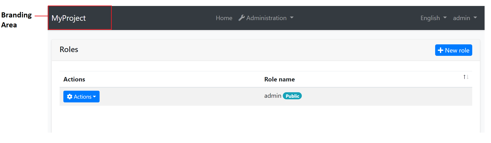
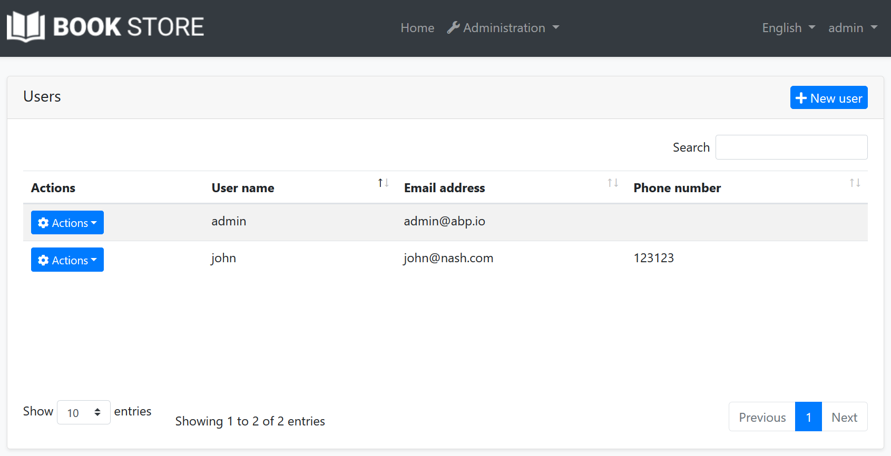

```json
//[doc-seo]
{
    "Description": "Learn how to customize your ASP.NET Core application's branding with `IBrandingProvider` to display your app name and logo effortlessly."
}
```

# ASP.NET Core MVC / Razor Pages: Branding

## IBrandingProvider

`IBrandingProvider` is a simple interface that is used to show the application name and logo on the layout.

The screenshot below shows *MyProject* as the application name:



You can implement the `IBrandingProvider` interface or inherit from the `DefaultBrandingProvider` to set the application name:

````csharp
using Volo.Abp.Ui.Branding;
using Volo.Abp.DependencyInjection;

namespace MyProject.Web
{
    [Dependency(ReplaceServices = true)]
    public class MyProjectBrandingProvider : DefaultBrandingProvider
    {
        public override string AppName => "Book Store";

        public override string LogoUrl => "/logo.png";
    }
}
````

The result will be like shown below:



`IBrandingProvider` has the following properties:

* `AppName`: The application name.
* `LogoUrl`: A URL to show the application logo.
* `LogoReverseUrl`: A URL to show the application logo on a reverse color theme (dark, for example).

ABP's built-in MVC themes resolve these URLs for the current request. `logo.png`, `/logo.png` and `~/logo.png` all mean the same application relative URL and include the `PathBase` of the request, so they keep working when the application is deployed to a non-root path, like an IIS virtual directory. A URL that already contains the path gets it twice. External URLs are used as they are. `LogoReverseUrl` is used by the themes that have a dark style, like LeptonX, and falls back to `LogoUrl`.

A logo that the project defines in its own CSS is not resolved. The LeptonX Lite startup templates set the logo that way, so remove that declaration to deploy them to a non-root path.

To resolve a branding URL in a custom theme or view, use `Url.ResolveBrandingUrl(...)` with `@using Volo.Abp.AspNetCore.Mvc.UI.Theme.Shared.Branding`, or `Url.ResolveBrandingCssUrl(...)` when it is rendered into `url('...')` in CSS.

> **Tip**: `IBrandingProvider` is used in every page refresh. For a multi-tenant application, you can return a tenant specific application name to customize it per tenant.

## IBrandingLogoProvider

Some theme areas need a compact logo, like a collapsed menu. To provide one, make the same branding provider implement both `IBrandingProvider` and `IBrandingLogoProvider`. `DefaultBrandingProvider` implements both, so a derived provider only overrides the icon properties:

````csharp
using Volo.Abp.Ui.Branding;
using Volo.Abp.DependencyInjection;

namespace MyProject.Web
{
    [Dependency(ReplaceServices = true)]
    public class MyProjectBrandingProvider : DefaultBrandingProvider
    {
        public override string AppName => "Book Store";

        public override string LogoUrl => "/logo.png";

        public override string LogoIconUrl => "/logo-icon.png";
    }
}
````

`IBrandingLogoProvider` has the following properties:

* `LogoIconUrl`: A URL to show the compact application logo.
* `LogoIconReverseUrl`: A URL to show the compact application logo on a reverse color theme.

Both properties return `null` by default and follow the same URL rules as `LogoUrl`.

The active theme decides whether and where to use the compact logo. The LeptonX MVC theme enables its compact branding when `LogoIconUrl` is not empty: it uses the compact logo instead of the full logo in its branding areas and shows `AppName` next to it where there is room for both. Dark and dim styles use `LogoIconReverseUrl` and fall back to `LogoIconUrl` when it is not set. Themes that don't support `IBrandingLogoProvider` ignore these properties.

> The compact logo applies to the ASP.NET Core MVC / Razor Pages themes. The Blazor themes resolve the branding URLs by the same rules, see [Blazor UI: Branding](../blazor/branding.md).

## Overriding the Branding Area

You can see the [UI Customization Guide](customization-user-interface.md) to learn how you can replace the branding area with a custom view component.
