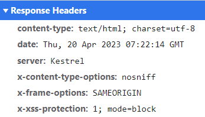

# Security Headers

ABP allows you to add frequently used security headers into your application. The following security headers will be added as response headers to your application if you use the `UseAbpSecurityHeaders` middleware:

* `X-Content-Type-Options`: Tells the browser to not try and guess what a mime-type of a resource might be, and to just take what mime-type the server has returned.
* `X-XSS-Protection`: This is a feature of Internet Explorer, Chrome, and Safari that stops pages from loading when they detect reflected cross-site scripting (XSS) attacks.
* `X-Frame-Options`: This header can be used to indicate whether or not a browser should be allowed to render a page in a `<iframe>` tag. By specifying this header value as *SAMEORIGIN*, you can make it displayed in a frame on the same origin as the page itself.
* `Content-Security-Policy`: This response header allows you to restrict which resources (such as JavaScript, CSS, images, manifests, etc.) can be loaded, and the URLs that they can be loaded from. This security header will only be added if you configure the `AbpSecurityHeadersOptions` class and enable it.

## Configuration

### AbpSecurityHeadersOptions

`AbpSecurityHeadersOptions` is the main class to enable the `Content-Security-Policy` header, define its value and set other security headers that you want to add to your application.

**Example:**

```csharp
Configure<AbpSecurityHeadersOptions>(options => 
{
    options.UseContentSecurityPolicyHeader = true; //false by default
    options.ContentSecurityPolicyValue = "object-src 'none'; form-action 'self'; frame-ancestors 'none'"; //default value

    //adding additional security headers
    options.Headers["Referrer-Policy"] = "no-referrer";
});
```

> If the header is the same, the additional security headers you defined take precedence over the default security headers. In other words, it overrides the default security headers' values.

## Security Headers Middleware

Security Headers middleware is an ASP.NET Core request pipeline [middleware](https://docs.microsoft.com/en-us/aspnet/core/fundamentals/middleware) that adds pre-defined security headers to your application, including `X-Content-Type-Options`, `X-XSS-Protection`, and `X-Frame-Options`. Additionally, this middleware also includes those unique security headers in your application if you configure the `AbpSecurityHeadersOptions` as mentioned above.

**Example:**

```csharp
app.UseAbpSecurityHeaders();
```

> You can add this middleware after `app.UseRouting()` in your module class's `OnApplicationInitialization` method to register it to the request pipeline. This middleware is already configured in the [ABP Commercial Startup Templates](../../../solution-templates/index.md), so you don't need to manually add it if you are using one of these startup templates.

After that, you have registered the `UseAbpSecurityHeaders` middleware into the request pipeline, the defined security headers will be shown in the response headers as in the figure below:



## Content Security Policy Script Nonce

ABP provides a property to add a dynamic script-src nonce value to the Content-Security-Policy header. With this feature, it automatically adds a dynamic nonce value to the header side. And with the help of the script tag helper, it adds this [`script nonce`](https://developer.mozilla.org/en-US/docs/Web/HTML/Global_attributes/nonce) value to the script tags on your pages(The `ScriptNonceTagHelper` in the `Volo.Abp.AspNetCore.Mvc.UI.Bundling` namespace must be attached as a taghelper.).
> If you need to add the nonce script manually, you can use 'Html.GetScriptNonce()' to add the nonce value or 'Html.GetScriptNonceAttribute()' to add the nonce attribute value.

This feature is disabled by default. You can enable it by setting the `UseContentSecurityPolicyScriptNonce` property of the `AbpSecurityHeadersOptions` class to `true`.

### Ignore Script Nonce

You can ignore the script nonce for some pages or some selectors. You can use the `IgnoredScriptNoncePaths` and `IgnoredScriptNonceSelectors` properties of the `AbpSecurityHeadersOptions` class.

**Example:**

```csharp
Configure<AbpSecurityHeadersOptions>(options => 
{
    //adding script-src nonce
    options.UseContentSecurityPolicyScriptNonce = true; //false by default

    //ignore script nonce source for these paths
    options.IgnoredScriptNoncePaths.Add("/my-page");

    //ignore script nonce by Elsa Workflows and other selectors
    options.IgnoredScriptNonceSelectors.Add(context =>
    {
        var endpoint = context.GetEndpoint();
        return Task.FromResult(endpoint?.Metadata.GetMetadata<PageRouteMetadata>()?.RouteTemplate == "/{YOURHOSTPAGE}");
    });
});
```

### Ignore Abp Security Headers

You can ignore the Abp Security Headers for some actions or pages. You can use the `IgnoreAbpSecurityHeaderAttribute` attribute for this.

**Example:**

```csharp
@using Volo.Abp.AspNetCore.Security
@attribute [IgnoreAbpSecurityHeaderAttribute]
```

**Example:**

```csharp
[IgnoreAbpSecurityHeaderAttribute]
public class IndexModel : AbpPageModel
{
    public void OnGet()
    {
    }
}
```
