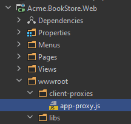

# Static JavaScript API Client Proxies

It is typical to consume your HTTP APIs from your JavaScript code. To do that, you normally deal with low level AJAX calls, like $.ajax, or better [abp.ajax](javascript-api/ajax.md). ABP provides **a better way** to call your HTTP APIs from your JavaScript code: JavaScript API Client Proxies!

## Static vs Dynamic JavaScript Client Proxies

ABP provides **two types** of client proxy generation system. This document explains the **static client proxies**, which generates client-side code in your development time. You can also see the [Dynamic JavaScript API Client Proxies](dynamic-javascript-proxies.md) documentation to learn how to use proxies generated on runtime.

Development-time (static) client proxy generation has a **slight performance advantage** since it doesn't need to obtain the HTTP API definition on runtime. However, you should **re-generate** the client proxy code whenever you change your API endpoint definition. On the other hand, dynamic client proxies are generated on runtime and provides an **easier development experience**.

## A Quick Example

### The Application Service

Assume that you have an application service defined as shown below:

````csharp
using System;
using System.Threading.Tasks;
using Volo.Abp.Application.Dtos;
using Volo.Abp.Application.Services;

namespace Acme.BookStore.Authors
{
    public interface IAuthorAppService : IApplicationService
    {
        Task<AuthorDto> GetAsync(Guid id);

        Task<PagedResultDto<AuthorDto>> GetListAsync(GetAuthorListDto input);

        Task<AuthorDto> CreateAsync(CreateAuthorDto input);

        Task UpdateAsync(Guid id, UpdateAuthorDto input);

        Task DeleteAsync(Guid id);
    }
}
````

> You can follow the [web application development tutorial](../../../tutorials/book-store/part-01.md) to learn how to create [application services](../../architecture/domain-driven-design/application-services.md), expose them as [HTTP APIs](../../api-development/auto-controllers.md) and consume from the JavaScript code as a complete example.

### Generating the JavaScript Code

Server side must be up and running while generating the client proxy code. So, first run the application that hosts your HTTP APIs (can be the Web application or the HttpApi.Host application depending on your solution structure).

Open a command-line terminal in the root folder of your web project (`.csproj`) and type the following command:

````bash
abp generate-proxy -t js -u https://localhost:53929/
````

> If you haven't installed yet, you should install the [ABP CLI](../../../cli). Change the example URL to your application's root URL.

This command should generate the following files under the `ClientProxies` folder:



`app-proxy.js` is the generated proxy file in this example. Here, an example proxy function in this file:

````js
acme.bookStore.authors.author.get = function(id, ajaxParams) {
  return abp.ajax($.extend(true, {
    url: abp.appPath + 'api/app/author/' + id + '',
    type: 'GET'
  }, ajaxParams));
};
````

> `generate-proxy` command generates proxies for only the APIs you've defined in your application (assumes `app` as the module name). If you are developing a modular application, you can specify the `-m` (or `--module`) parameter to specify the module you want to generate proxies. See the *generate-proxy* section in the [ABP CLI](../../../cli) documentation for other options.

### Using the Proxy Functions

To use the proxy functions, first import the `app-proxy.js` file into your page:

````html
<abp-script src="/client-proxies/app-proxy.js"/>
````

> We've used the [abp-script tag helper](bundling-minification.md) in this example. You could use the standard `script` tag, but the `abp-script` is the recommended way of importing JavaScript files to your pages. 

Now, you can call any of the application service methods from your JavaScript code, just like calling a JavaScript function. The JavaScript function has the identical function **name**, **parameters** and the **return value** with the C# method.

**Example: Get a single author**

````js
acme.bookStore.authors.author
    .get("7245a066-5457-4941-8aa7-3004778775f0") //Get id from somewhere!
    .then(function(result){
      console.log(result);
    });
````

**Example: Get the authors list**

````js
acme.bookStore.authors.author.getList({
  maxResultCount: 10
}).then(function(result){
  console.log(result.items);
});
````

**Example: Delete an author**

```js
acme.bookStore.authors.author
    .delete('7245a066-5457-4941-8aa7-3004778775f0') //Get id from somewhere!
    .then(function() {
        abp.notify.info('Successfully deleted!');
    });
```

## Disabling Dynamic JavaScript Proxies

When you create an application or module, the [dynamic client proxy generation](dynamic-javascript-proxies.md) approach is used by default. If you want to use the statically generated client proxies for your application, you should explicitly disable it for your application or module in the `ConfigureServices` method of your [module class](../../architecture/modularity/basics.md) as like in the following example:

````csharp
Configure<DynamicJavaScriptProxyOptions>(options =>
{
    options.DisableModule("app");
});
````

`app` represents the main application in this example, which works if you are creating an application. If you are developing an application module, then use your module's name.

## AJAX Details

JavaScript client proxy functions use the [abp.ajax](javascript-api/ajax.md) under the hood. So, you have the same benefits like **automatic error handling**. Also, you can fully control the AJAX call by providing the options.

### The Return Value

Every function returns a [Deferred object](https://api.jquery.com/category/deferred-object/). That means you can chain with `then` to get the result, `catch` to handle the error, `always` to perform an action once the operation completes (success or failed).

### AJAX Options

Every function gets an additional **last parameter** after your own parameters. The last parameter is called as `ajaxParams`. It is an object that overrides the AJAX options.

**Example: Set `type` and `dataType` AJAX options**

````js
acme.bookStore.authors.author
    .delete('7245a066-5457-4941-8aa7-3004778775f0', {
        type: 'POST',
        dataType: 'xml'
    })
    .then(function() {
        abp.notify.info('Successfully deleted!');
    });
````

See the [jQuery.ajax](https://api.jquery.com/jQuery.ajax/) documentation for all the available options.

## See Also

* [Dynamic JavaScript API Client Proxies](dynamic-javascript-proxies.md)
* [Auto API Controllers](../../api-development/auto-controllers.md)
* [Web Application Development Tutorial](../../../tutorials/book-store/part-01.md)