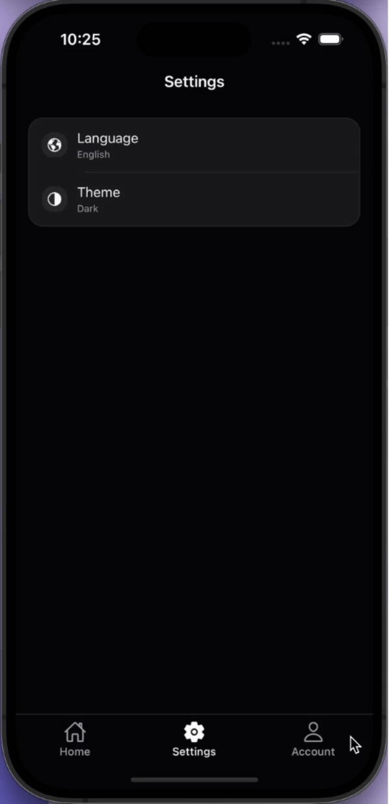
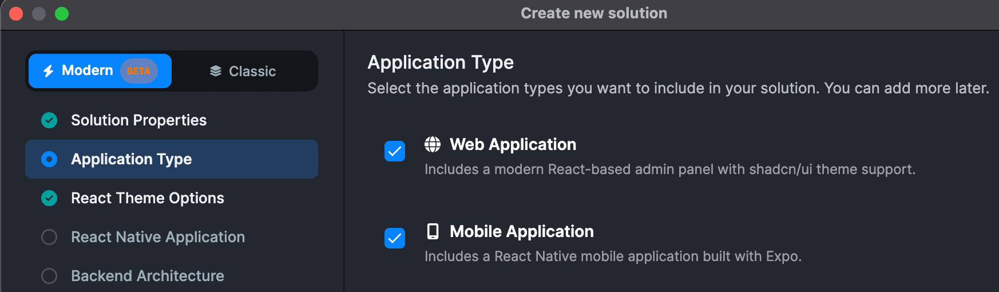
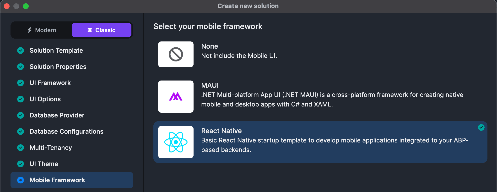
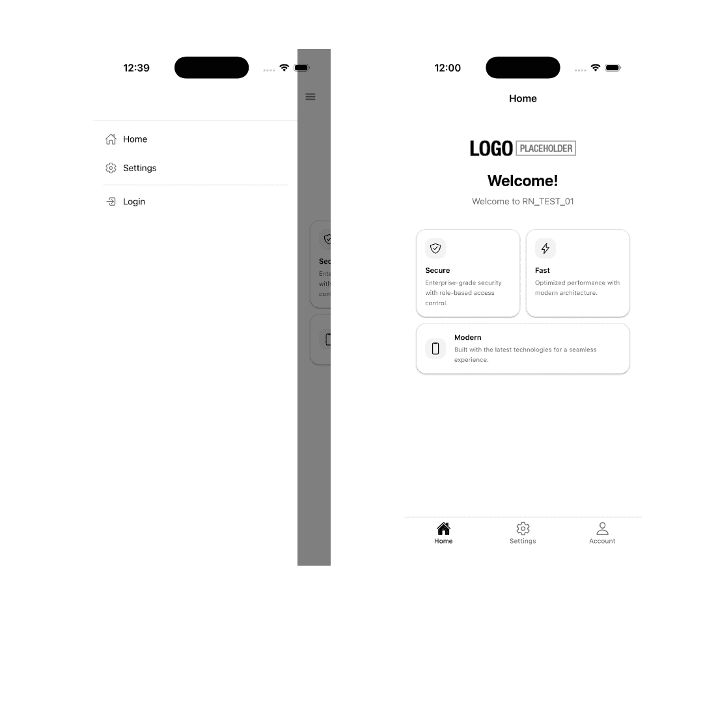

```json
//[doc-seo]
{
  "Description": "Learn how to set up your development environment for React Native with ABP Framework, enabling seamless mobile app integration!"
}
```

```json
//[doc-nav]
{
  "Next": {
    "Name": "Running on Web",
    "Path": "framework/ui/react-native/running-on-web"
  }
}
```

# Getting Started with React Native

> The React Native mobile option is _available for_ **_Team_** _or higher licenses_

The ABP platform provides a basic [React Native](https://reactnative.dev/) startup template to develop mobile applications **integrated with your ABP-based backends**.

> The startup template UI is built with **[NativeWind v4](https://www.nativewind.dev/)** (Tailwind CSS for React Native) on top of a shadcn-inspired neutral palette, with full **light/dark mode** support. See [Styling with NativeWind](styling-with-nativewind.md) for the styling system reference.



## How to Prepare Development Environment

Please follow the steps below to prepare your development environment for React Native.

1. **Install Node.js:** Visit the [Node.js downloads page](https://nodejs.org/en/download/) and download the appropriate Node.js v20.11+ installer for your operating system. Alternatively, you can install [NVM](https://github.com/nvm-sh/nvm) to manage multiple versions of Node.js on your system.
2. **[Optional] Install Yarn:** You can install Yarn v1 (not v2) by following the instructions on [the installation page](https://classic.yarnpkg.com/en/docs/install). Yarn v1 provides a better developer experience compared to npm v6 and below. You can skip this step and use npm, which is built into Node.js.
3. **[Optional] Install VS Code:** [VS Code](https://code.visualstudio.com/) is a free, open-source IDE that works seamlessly with TypeScript. While you can use any IDE, including Visual Studio or Rider, VS Code typically provides the best developer experience for React Native projects.

Additional tools depend on how you plan to run the app — see the [Run the application](#run-the-application) section below.

## How to Start a New React Native Project

You have multiple options to initiate a new React Native project that works with ABP:

### 1. Using ABP Studio

ABP Studio is the most convenient and flexible way to create a React Native application based on the ABP framework. Follow the [tool documentation](../../../studio) and select the mobile option in the solution wizard:

<div style="display:flex; flex-wrap:wrap; gap:1rem; margin:1rem 0; align-items:flex-start;">

<div style="flex:1 1 0; min-width:min(100%, 300px);">

<p style="margin:0.5rem 0 0;"><strong>Modern</strong> template — on the <em>Application Type</em> step, enable <strong>Mobile Application</strong> (React Native with Expo).</p>
</div>

<div style="flex:1 1 0; min-width:min(100%, 300px);">

<p style="margin:0.5rem 0 0;"><strong>Classic</strong> template — on the <em>Mobile Framework</em> step, select <strong>React Native</strong>.</p>
</div>

</div>

### 2. Using ABP CLI

The ABP CLI is another way to create an ABP solution with a React Native application. [Install the ABP CLI](../../../cli) and run the following command in your terminal:

```shell
abp new MyCompanyName.MyProjectName -csf -u <angular or mvc> -m react-native
```

> For more options, visit the [CLI manual](../../../cli).

This command creates a solution containing an **Angular** or **MVC** project (depending on your choice), a **.NET Core** project, and a **React Native** project.

If you want to see the modern React Native template as a finished product, the [Habitly sample](../../../samples/index.md#hanova--habitly) is a good reference point.

## Run the Application

You can choose how you want to run the mobile app:

| Goal                                        | Documentation                                                                                                                                                                |
| ------------------------------------------- | ---------------------------------------------------------------------------------------------------------------------------------------------------------------------------- |
| **Browser testing (fastest)**               | [Running on Web](./running-on-web.md) — ABP Studio **Default** profile or Expo Web + HTTPS proxy at `https://localhost:8443`                                                 |
| **Emulator, simulator, or physical device** | [Running on Device](./running-on-device.md) — **Pro, non-tiered Monolith:** **MobileEmulator** profile or `yarn tunnel:api`; **Tiered / Microservice:** manual backend setup |

> **Before device testing (Monolith):** Install **cloudflared** using Cloudflare's [Download and install cloudflared](https://developers.cloudflare.com/cloudflare-one/networks/connectors/cloudflare-tunnel/downloads/) guide. The template's Quick Tunnel workflow does not require a Cloudflare account or the remaining steps in that document.

Before running, you may need to install dependencies in the React Native project folder:

- **Monolith / Tiered / app-nolayers:** `react-native/`
- **Microservice:** `apps/mobile/react-native/`

Run `yarn install` or `npm install` in that folder.

> **Recommended:** We suggest starting with [Running on Web](./running-on-web.md). Because it requires the fewest setup steps and provides faster development and hot-reload options compared to the physical device tests.

### Related guides

- [Manual Backend Configuration](./manual-backend-configuration.md): This includes a fallback HTTP/local IP setup for Tiered or Microservice architectures (or when Cloudflare tunnels are unavailable).
- [Setting Up Android Emulator Without Android Studio](./setting-up-android-emulator.md): This covers the CLI-based Android emulator setup based on your preference.

The default login credentials, if not changed, are:

- User name: **admin**
- Password: **1q2w3E\***

## Navigation

The startup template ships with **two navigation styles**, switchable when the project is created:

- **Bottom Tab** — _the default_ — three tabs at the bottom of the screen: **Home**, **Settings** and **Account**.
- **Drawer** — a side menu (hamburger) with two items: **Home** and **Settings**.



Every main tab or drawer item is wired to **its own** native stack (`@react-navigation/native-stack`). Pushing more screens stays on that branch: the Back stack belongs to that tab or drawer route and does not mix with others. Bottom Tab and Drawer use the **same screen components**; they differ in how those screens are grouped and opened from the outer shell (and where the sign‑in/sign‑up flow lives in Bottom Tab versus Drawer).

> **How to choose:** The mode is selected in **ABP Studio** during the _Mobile Framework_ step. Switching modes after the project is generated is not a one-line change — you would need to add the missing navigator (and its `@react-navigation/drawer` or `@react-navigation/bottom-tabs` dependency) manually, then update `src/AppContainer.tsx` and `src/navigators/types.ts` to match. Pick the mode upfront when possible.

### Bottom Tab Navigation (default)

The root navigator is `BottomTabNavigator` (`src/navigators/BottomTabNavigator.tsx`) with three stacks:

- **HomeTab** → `HomeNavigator` → `HomeScreen` (hero greeting + feature cards).
- **SettingsTab** → `SettingsNavigator` → `SettingsScreen` (language, theme, profile/password shortcuts).
- **AccountTab** → `AccountNavigator` — _conditional stack_ based on the authentication state read from Redux:
  - **Authenticated:** `AccountScreen` → `ChangePasswordScreen`, `ProfilePictureScreen`.
  - **Guest:** `LoginScreen` → `RegisterScreen`, `ForgotPasswordScreen`, `ResetPasswordScreen`.

Tab bar colors (active/inactive tint, background, border) are sourced from the `useThemeColors` hook so the bar follows the active light/dark theme.

#### The Account Screen

`AccountScreen` (`src/screens/Account/AccountScreen.tsx`) is the home of the AccountTab when the user is signed in. Its layout follows an iOS-style grouped pattern:

1. **Profile header** — circular avatar (profile picture or first-letter fallback), full name and email, centered at the top.
2. **Account actions card** — a single rounded card containing two rows with leading icon chips:
   - **Profile Picture** → navigates to `ProfilePictureScreen`.
   - **Change Password** → navigates to `ChangePasswordScreen`.
3. **Destructive logout button** — an outlined `destructive`-colored button that calls the `useLogout` hook.

### Drawer Navigation (alternative)

When the drawer mode is selected, `DrawerNavigator` (`src/navigators/DrawerNavigator.tsx`) replaces the bottom tabs. It exposes two drawer items:

- **HomeStack** → `HomeNavigator` → `HomeScreen`, plus the auth flow (`LoginScreen`, `RegisterScreen`, `ForgotPasswordScreen`, `ResetPasswordScreen`).
- **SettingsStack** → `SettingsNavigator` → `SettingsScreen`, `ChangePasswordScreen`, `ProfilePictureScreen`.

Note that there is **no `AccountTab` / `AccountScreen` in drawer mode** — auth lives in the Home stack and profile/password actions live in the Settings stack. The drawer side panel itself is fully custom.

#### The Drawer Content

`DrawerContent` (`src/components/DrawerContent/DrawerContent.tsx`) is the custom side panel rendered by `DrawerNavigator` via the `drawerContent` prop. From top to bottom:

1. **User header** — circular avatar (image or first-letter fallback) + full name + email when authenticated.
2. **Divider**.
3. **Navigation items** — Home and Settings rows with leading Ionicons; tapping navigates and closes the drawer.
4. **Auth row** — when authenticated, a **Logout** row that calls `useLogout`; when guest, a **Login** row that navigates to the Login screen inside `HomeStack`.

The whole panel uses NativeWind classes with `dark:` variants, so it follows the active theme automatically.

### Adding a New Screen

To add a screen to either navigation mode:

1. Create the screen component under `src/screens/<FeatureName>/<FeatureName>Screen.tsx` and export it from `src/screens/index.ts`.
2. Register it as a `Stack.Screen` inside the appropriate navigator (e.g. `HomeNavigator`, `SettingsNavigator`, or `AccountNavigator`).
3. Add the route to the matching `*ParamList` in `src/navigators/types.ts` so the screen props stay typed.

If the new screen needs to appear at the _root_ level (a new tab or drawer item rather than a child of an existing stack), edit `BottomTabNavigator.tsx` or `DrawerNavigator.tsx` and update the corresponding `BottomTabParamList` / `RootDrawerParamList` type.

The application is up and running. You can continue to develop your application based on this startup template, or follow the [Book Store mobile tutorial](../../../tutorials/mobile/react-native/index.md).
