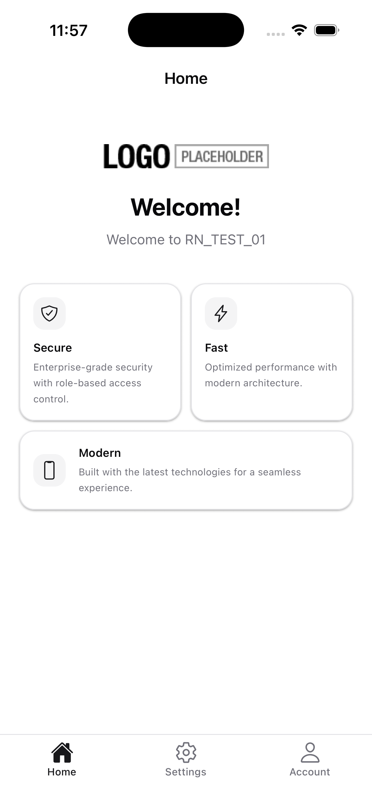

```json
//[doc-seo]
{
    "Description": "Learn how to set up your development environment for React Native with ABP Framework, enabling seamless mobile app integration!"
}
```

```json
//[doc-params]
{
  "Architecture": ["Monolith", "Tiered", "Microservice"]
}
```

# Getting Started with React Native

> The React Native mobile option is *available for* ***Team*** *or higher licenses*

The ABP platform provides a basic [React Native](https://reactnative.dev/) startup template to develop mobile applications **integrated with your ABP-based backends**.

> The startup template UI is built with **[NativeWind v4](https://www.nativewind.dev/)** (Tailwind CSS for React Native) on top of a shadcn-inspired neutral palette, with full **light/dark mode** support. See [Styling with NativeWind](styling-with-nativewind.md) for the styling system reference.

## How to Prepare Development Environment

Please follow the steps below to prepare your development environment for React Native.

1. **Install Node.js:** Visit the [Node.js downloads page](https://nodejs.org/en/download/) and download the appropriate Node.js v20.11+ installer for your operating system. Alternatively, you can install [NVM](https://github.com/nvm-sh/nvm) to manage multiple versions of Node.js on your system.
2. **[Optional] Install Yarn:** You can install Yarn v1 (not v2) by following the instructions on [the installation page](https://classic.yarnpkg.com/en/docs/install). Yarn v1 provides a better developer experience compared to npm v6 and below. You can skip this step and use npm, which is built into Node.js.
3. **[Optional] Install VS Code:** [VS Code](https://code.visualstudio.com/) is a free, open-source IDE that works seamlessly with TypeScript. While you can use any IDE, including Visual Studio or Rider, VS Code typically provides the best developer experience for React Native projects.
4. **[Optional] Install an Emulator/Simulator:** If you want to test on Android emulators or iOS simulators (instead of using the Web View method), you'll need to install one of the following:
  - **Android Studio & Emulator:** Install [Android Studio](https://developer.android.com/studio) and set up an Android Virtual Device (AVD) through the AVD Manager. You can follow the [Android Studio Emulator guide](https://docs.expo.dev/workflow/android-studio-emulator/) on expo.io documentation.
  - **Xcode & iOS Simulator:** On macOS, install [Xcode](https://developer.apple.com/xcode/) from the App Store, which includes the iOS Simulator. You can follow the [iOS Simulator guide](https://docs.expo.dev/workflow/ios-simulator/) on expo.io documentation.
  > **Note:** The Web View method (recommended for quick testing) doesn't require an emulator or simulator. If you prefer a CLI-based approach for Android, you can check the [setting up android emulator without android studio](setting-up-android-emulator.md) guide as an alternative.

## How to Start a New React Native Project

You have multiple options to initiate a new React Native project that works with ABP:

### 1. Using ABP Studio

ABP Studio is the most convenient and flexible way to create a React Native application based on the ABP framework. Follow the [tool documentation](../../../studio) and select the option below:

React Native option

### 2. Using ABP CLI

The ABP CLI is another way to create an ABP solution with a React Native application. [Install the ABP CLI](../../../cli) and run the following command in your terminal:

```shell
abp new MyCompanyName.MyProjectName -csf -u <angular or mvc> -m react-native
```

> For more options, visit the [CLI manual](../../../cli).

This command creates a solution containing an **Angular** or **MVC** project (depending on your choice), a **.NET Core** project, and a **React Native** project.

## Running the React Native Application

> **Recommended:** For faster development and testing, we recommend using the **Web View** option first, as it requires fewer backend modifications. The backend configuration described in the next section is only needed if you want to test on Android emulators or iOS simulators.

Before running the React Native application, install the dependencies by running `yarn install` or `npm install` in the `react-native` directory.

### Web View (Recommended - Quickest Method)

The quickest way to test the application is by using the web view. While testing on a physical device is also supported, we recommend using [local HTTPS development](https://docs.expo.dev/guides/local-https-development/) as it requires fewer backend modifications.

Follow these steps to set up the web view:

1. Navigate to the `react-native` directory and start the application by running:
  ```bash
   yarn web
  ```
2. Generate SSL certificates by running the following command in a separate directory:
  ```bash
   mkcert localhost
  ```
3. Set up the local proxy by running:
  ```bash
   yarn create:local-proxy
  ```
   The default port is `443`. To use a different port, specify the `SOURCE_PORT` environment variable:
4. If you changed the port in the previous step, update the `apiUrl` in `Environment.ts` accordingly.
5. Update the mobile application settings in the database and re-run the migrations. If you specified a custom port, ensure the port is updated in the configuration as well:
  ```json
   "OpenIddict": {
     "Applications": {
       "MyApplication_Mobile": {
         "ClientId": "MyApplication_Mobile",
         "RootUrl": "https://localhost"
       }
     }
   }
  ```

### Running on Emulator/Simulator

If you prefer to test on an Android emulator or iOS simulator, you'll need to configure the backend as described in the section below. Follow these steps:

1. Make sure the [database migration is complete](../../../get-started?UI=NG&DB=EF&Tiered=No#create-the-database) and the [API is up and running](../../../get-started?UI=NG&DB=EF&Tiered=No#run-the-application).
2. Open `react-native` folder and run `yarn install` or `npm install` if you have not already.
3. Open the `Environment.ts` file in the `react-native` folder and replace the `localhost` address in the `apiUrl` and `issuer` properties with your local IP address as shown below:

{{ if Architecture == "Monolith" }}

react native monolith environment local IP

{{ else if Architecture == "Tiered" }}

react native tiered environment local IP

> Make sure that `issuer` matches the running address of the `.AuthServer` project, `apiUrl` matches the running address of the `.HttpApi.Host` or `.Web` project.

{{ else }}

react native microservice environment local IP

> Make sure that `issuer` matches the running address of the `.AuthServer` project, `apiUrl` matches the running address of the `.AuthServer` project.

{{ end }}

1. Run `yarn start` or `npm start`. Wait for the Expo CLI to print the options.

> The React Native application was generated with [Expo](https://expo.io/). Expo is a set of tools built around React Native to help you quickly start an app, and it includes many features.

expo-cli-options

In the image above, you can start the application on an Android emulator, an iOS simulator, or a physical phone by scanning the QR code with the [Expo Client](https://expo.io/tools#client) or by choosing the corresponding option.

### Expo

Press **i** to open the iOS simulator, or scan the QR code from the Expo CLI with your phone to run on a physical device.

### Android Studio

1. Start the emulator in **Android Studio** before running the `yarn start` or `npm start` command.
2. Press **a** to open in Android Studio.



Enter **admin** as the username and **1q2w3E** as the password to log in to the application.

The application is up and running. You can continue to develop your application based on this startup template.

## Navigation

The startup template ships with **two navigation styles**, switchable when the project is created:

- **Bottom Tab** — *the default* — three tabs at the bottom of the screen: **Home**, **Settings** and **Account**.
- **Drawer** — a side menu (hamburger) with two items: **Home** and **Settings**.


Each top-level destination is its own native stack (`@react-navigation/native-stack`), so deeper navigation inside a tab/drawer item keeps that area's history isolated. Both modes share the same screens — only the entry surface and the auth flow placement change.

> **How to choose:** The mode is selected in **ABP Studio** during the *Mobile Framework* step. Switching modes after the project is generated is not a one-line change — you would need to add the missing navigator (and its `@react-navigation/drawer` or `@react-navigation/bottom-tabs` dependency) manually, then update `src/AppContainer.tsx` and `src/navigators/types.ts` to match. Pick the mode upfront when possible.

### Bottom Tab Navigation (default)

The root navigator is `BottomTabNavigator` (`src/navigators/BottomTabNavigator.tsx`) with three stacks:

- **HomeTab** → `HomeNavigator` → `HomeScreen` (hero greeting + feature cards).
- **SettingsTab** → `SettingsNavigator` → `SettingsScreen` (language, theme, profile/password shortcuts).
- **AccountTab** → `AccountNavigator` — *conditional stack* based on the authentication state read from Redux:
  - **Authenticated:** `AccountScreen` → `ChangePasswordScreen`, `ProfilePictureScreen`.
  - **Guest:** `LoginScreen` → `RegisterScreen`, `ForgotPasswordScreen`, `ResetPasswordScreen`.

Tab bar colors (active/inactive tint, background, border) are sourced from the `useThemeColors` hook so the bar follows the active light/dark theme.

#### The Account Screen

`AccountScreen` (`src/screens/Account/AccountScreen.tsx`) is the home of the AccountTab when the user is signed in. Its layout follows an iOS-style grouped pattern:

1. **Profile header** — circular avatar (profile picture or first-letter fallback), full name and email, centered at the top.
2. **Account actions card** — a single rounded card containing two rows with leading icon chips:
   - **Profile Picture** → navigates to `ProfilePictureScreen`.
   - **Change Password** → navigates to `ChangePasswordScreen`.
3. **Destructive logout button** — an outlined `destructive`-colored button that calls the `useLogout` hook.

### Drawer Navigation (alternative)

When the drawer mode is selected, `DrawerNavigator` (`src/navigators/DrawerNavigator.tsx`) replaces the bottom tabs. It exposes two drawer items:

- **HomeStack** → `HomeNavigator` → `HomeScreen`, plus the auth flow (`LoginScreen`, `RegisterScreen`, `ForgotPasswordScreen`, `ResetPasswordScreen`).
- **SettingsStack** → `SettingsNavigator` → `SettingsScreen`, `ChangePasswordScreen`, `ProfilePictureScreen`.

Note that there is **no `AccountTab` / `AccountScreen` in drawer mode** — auth lives in the Home stack and profile/password actions live in the Settings stack. The drawer side panel itself is fully custom.

#### The Drawer Content

`DrawerContent` (`src/components/DrawerContent/DrawerContent.tsx`) is the custom side panel rendered by `DrawerNavigator` via the `drawerContent` prop. From top to bottom:

1. **User header** — circular avatar (image or first-letter fallback) + full name + email when authenticated.
2. **Divider**.
3. **Navigation items** — Home and Settings rows with leading Ionicons; tapping navigates and closes the drawer.
4. **Auth row** — when authenticated, a **Logout** row that calls `useLogout`; when guest, a **Login** row that navigates to the Login screen inside `HomeStack`.

The whole panel uses NativeWind classes with `dark:` variants, so it follows the active theme automatically.

### Adding a New Screen

To add a screen to either navigation mode:

1. Create the screen component under `src/screens/<FeatureName>/<FeatureName>Screen.tsx` and export it from `src/screens/index.ts`.
2. Register it as a `Stack.Screen` inside the appropriate navigator (e.g. `HomeNavigator`, `SettingsNavigator`, or `AccountNavigator`).
3. Add the route to the matching `*ParamList` in `src/navigators/types.ts` so the screen props stay typed.

If the new screen needs to appear at the *root* level (a new tab or drawer item rather than a child of an existing stack), edit `BottomTabNavigator.tsx` or `DrawerNavigator.tsx` and update the corresponding `BottomTabParamList` / `RootDrawerParamList` type.

## How to Configure & Run the Backend (Required for Emulator/Simulator Testing)

> React Native application does not trust the auto-generated .NET HTTPS certificate. You should use **HTTP** during the development.

To disable the HTTPS-only settings of OpenIddict, open the {{ if Architecture == "Monolith" }}`MyProjectNameHttpApiHostModule`{{ else if Architecture == "Tiered" }}`MyProjectNameAuthServerModule`{{ end }} project and add the following code block to the `PreConfigureServices` method:

```csharp
#if DEBUG
    PreConfigure<OpenIddictServerBuilder>(options =>
    {
        options.UseAspNetCore()
            .DisableTransportSecurityRequirement();
    });
#endif
```

> **Important:** Before running the backend application, make sure you have completed the [database migration](../../../get-started?UI=NG&DB=EF&Tiered=No#create-the-database) if you are starting with a fresh database. The backend application requires the database to be properly initialized.

A React Native application running on an Android emulator or a physical phone **cannot connect to the backend** on `localhost`. To resolve this, you need to run the backend application using the `Kestrel` configuration.

{{ if Architecture == "Monolith" }}

React Native monolith host project configuration

- Open the `appsettings.json` file in the `.DbMigrator` folder. Replace the `localhost` address in the `RootUrl` property with your local IP address. Then, run the database migrator.
- Open the `appsettings.Development.json` file in the `.HttpApi.Host` folder. Add this configuration to accept global requests for testing the React Native application in the development environment.
  ```json
  {
    "Kestrel": {
      "Endpoints": {
        "Http": {
          "Url": "http://0.0.0.0:44323" //replace with your host port
        }
      }
    }
  }
  ```

{{ else if Architecture == "Tiered" }}

React Native tiered project configuration

- Open the `appsettings.json` file in the `.DbMigrator` folder. Replace the `localhost` address in the `RootUrl` property with your local IP address. Then, run the database migrator.
- Open the `appsettings.Development.json` file in the `.AuthServer` folder. Add this configuration to accept global requests for testing the React Native application in the development environment.
  ```json
  {
    "Kestrel": {
      "Endpoints": {
        "Http": {
          "Url": "http://0.0.0.0:44337"
        }
      }
    }
  }
  ```
- Open the `appsettings.Development.json` file in the `.HttpApi.Host` folder. Add this configuration to accept global requests. Additionally, you need to configure the authentication server as mentioned above.
  ```json
  {
    "Kestrel": {
      "Endpoints": {
        "Http": {
          "Url": "http://0.0.0.0:44389" //replace with your host port
        }
      }
    },
    "AuthServer": {
      "Authority": "http://192.168.1.37:44337/", //replace with your IP and authentication port
      "MetaAddress": "http://192.168.1.37:44337/",
      "RequireHttpsMetadata": false,
      "Audience": "MyTieredProject" //replace with your application name
    }
  }
  ```

{{ else if Architecture == "Microservice" }}

React Native microservice project configuration

- Open the `appsettings.Development.json` file in the `.AuthServer` folder. Add this configuration to accept global requests for testing the React Native application in the development environment.
  ```json
  {
    "App": {
      "EnablePII": true
    },
    "Kestrel": {
      "Endpoints": {
        "Http": {
          "Url": "http://0.0.0.0:44319"
        }
      }
    }
  }
  ```
- Open the `appsettings.Development.json` file in the `.AdministrationService` folder. Add this configuration to accept global requests for testing the React Native application in the development environment. You should also provide the authentication server configuration. Additionally, you need to apply the same process for all services you will use in the React Native application.
  ```json
  {
    "App": {
      "EnablePII": true
    },
    "Kestrel": {
      "Endpoints": {
        "Http": {
          "Url": "http://0.0.0.0:44357"
        }
      }
    },
    "AuthServer": {
      "Authority": "http://192.168.1.36:44319/",
      "MetaAddress": "http://192.168.1.36:44319/",
      "RequireHttpsMetadata": false,
      "Audience": "AdministrationService"
    }
  }
  ```
- Update the `appsettings.json` file in the `.IdentityService` folder. Replace the `localhost` configuration with your local IP address for the React Native application.
  ```json
  {
    //...
    "OpenIddict": {
      "Applications": {
        //...
        "ReactNative": {
          "RootUrl": "exp://192.168.1.36:19000"
        },
        "MobileGateway": {
          "RootUrl": "http://192.168.1.36:44347/"
        }
        //...
      }
      //...
    }
  }
  ```
- Finally, update the mobile gateway configurations as follows:
  ```json
  //gateways/mobile/MyMicroserviceProject.MobileGateway/Properties/launchSettings.json
  {
    "iisSettings": {
      "windowsAuthentication": false,
      "anonymousAuthentication": true,
      "iisExpress": {
        "applicationUrl": "http://192.168.1.36:44347" //update with your IP address
      }
    },
    "profiles": {
      //...
      "MyMicroserviceProject.MobileGateway": {
        "commandName": "Project",
        "dotnetRunMessages": "true",
        "launchBrowser": true,
        "applicationUrl": "http://192.168.1.36:44347",
        "environmentVariables": {
          "ASPNETCORE_ENVIRONMENT": "Development"
        }
      }
    }
  }
  ```
  ```json
  //gateways/mobile/MyMicroserviceProject.MobileGateway/appsettings.json
  {
    //Update clusters with your IP address
    //...
    "ReverseProxy": {
      //...
      "Clusters": {
        "AuthServer": {
          "Destinations": {
            "AuthServer": {
              "Address": "http://192.168.1.36:44319/"
            }
          }
        },
        "Administration": {
          "Destinations": {
            "Administration": {
              "Address": "http://192.168.1.36:44357/"
            }
          }
        },
        "Saas": {
          "Destinations": {
            "Saas": {
              "Address": "http://192.168.1.36:44330/"
            }
          }
        },
        "Identity": {
          "Destinations": {
            "Identity": {
              "Address": "http://192.168.1.36:44397/"
            }
          }
        },
        "Language": {
          "Destinations": {
            "Identity": {
              "Address": "http://192.168.1.36:44310/"
            }
          }
        }
      }
    }
  }
  ```
  {{ end }}

Run the backend application(s) as described in the [getting started document](../../../get-started).