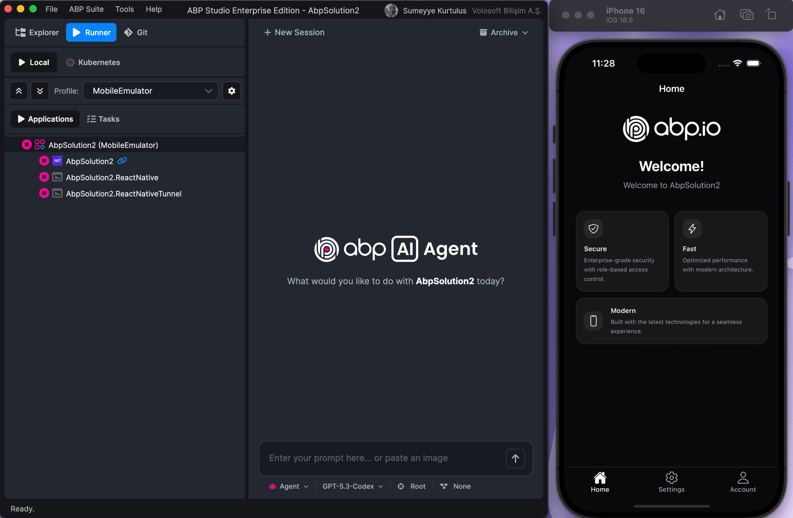
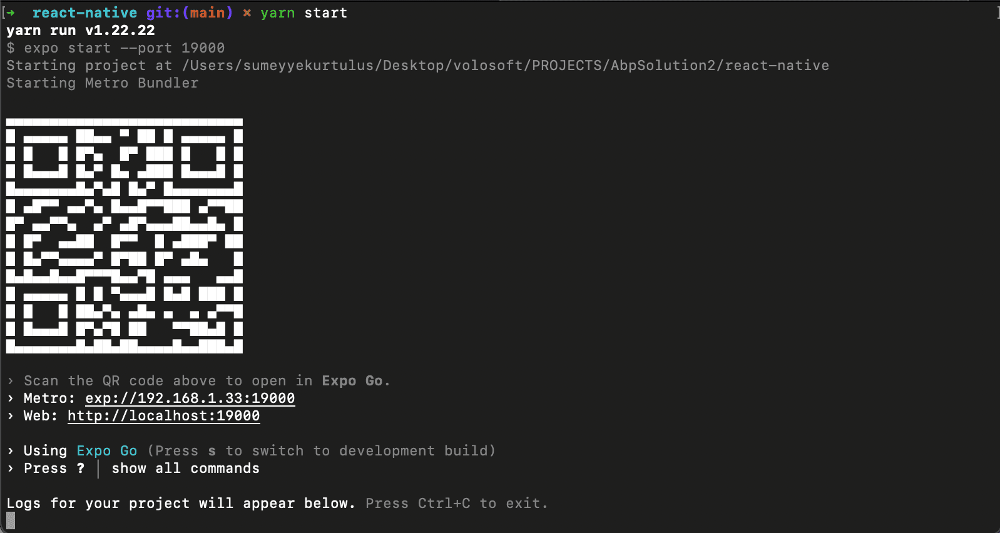

```json
//[doc-seo]
{
  "Description": "Run your ABP React Native application on an Android emulator, iOS simulator, or physical device using ABP Studio or Cloudflare tunnel."
}
```

```json
//[doc-nav]
{
  "Previous": {
    "Name": "Running on Web",
    "Path": "framework/ui/react-native/running-on-web"
  },
  "Next": {
    "Name": "Manual Backend Configuration",
    "Path": "framework/ui/react-native/manual-backend-configuration"
  }
}
```

```json
//[doc-params]
{
  "Architecture": ["Monolith", "Tiered", "Microservice"]
}
```

# Running on a Device

You can use this guide when you want to run the app on an **Android emulator**, **iOS simulator**, or **physical device** instead of in the browser.

For browser testing, see [Running on Web](./running-on-web.md).

## Prerequisites

1. Install dependencies in the React Native project folder:

{{ if Architecture == "Microservice" }}

- `apps/mobile/react-native/`

{{ else }}

- `react-native/`

{{ end }}

2. Complete the [database migration](../../../get-started?UI=NG&DB=EF&Tiered=No#create-the-database) and ensure the backend host is running.
3. Set up an emulator or simulator if needed:
   - **Android:** [Android Studio Emulator guide](https://docs.expo.dev/workflow/android-studio-emulator/) or [Setting Up Android Emulator Without Android Studio](./setting-up-android-emulator.md)
   - **iOS (macOS):** [iOS Simulator guide](https://docs.expo.dev/workflow/ios-simulator/)

{{ if Architecture == "Monolith" }}

1. Install **cloudflared** before using the **MobileEmulator** profile or `yarn tunnel:api`. Follow Cloudflare's [Download and install cloudflared](https://developers.cloudflare.com/cloudflare-one/networks/connectors/cloudflare-tunnel/downloads/) guide. The template uses free Quick Tunnels (`*.trycloudflare.com`) and does not require a Cloudflare account or the remaining locally-managed tunnel steps in that document.

{{ end }}

## Using ABP Studio

{{ if Architecture == "Monolith" }}

### MobileEmulator profile (Recommended)

**Pro, non-tiered Monolith** solutions include a **MobileEmulator** run profile in the [Solution Runner](../../../studio/running-applications). When you start it, ABP Studio specifically runs:

1. The backend host
2. **ReactNativeTunnel** — runs `node scripts/tunnel.js` to expose your local backend through a Cloudflare tunnel
3. **ReactNative** — runs `npx expo start --android` (change the `--android` flag to `--ios` in `MobileEmulator.abprun.json` or via the profile edit option in Solution Runner)

Before the first run:

1. [Install cloudflared](https://developers.cloudflare.com/cloudflare-one/networks/connectors/cloudflare-tunnel/downloads/) if you have not already (see [Prerequisites](#prerequisites)).
2. Switch to the **MobileEmulator** profile in the Solution Runner.
3. Open `react-native/Environment.ts` and follow the inline comments: **uncomment the tunnel configuration block** and **comment out the localhost constants**.

Start an Android emulator (or connect a device), then start the **MobileEmulator** profile.



See [Cloudflare tunnel (manual CLI)](#cloudflare-tunnel-manual-cli) below for what the tunnel script does, and [Automate Localhost Access for Expo](https://abp.io/community/articles/automate-localhost-access-for-expo-a-guide-to-dynamic-7cblqtj3) for architecture details and troubleshooting.

{{ else if Architecture == "Tiered" }}

> **Note:** The **MobileEmulator** run profile is available only for **Pro, non-tiered** solutions. For tiered architectures, follow [Manual Backend Configuration](./manual-backend-configuration.md) and the [manual CLI steps](#manual-cli-without-mobileemulator-profile) below.

{{ else }}

> **Note:** The **MobileEmulator** run profile is not included in the microservice template. Follow [Manual Backend Configuration](./manual-backend-configuration.md) and the [manual CLI steps](#manual-cli-without-mobileemulator-profile) below.

{{ end }}

## Cloudflare tunnel (manual CLI)

{{ if Architecture == "Monolith" }}

Non-tiered React Native templates ship with a Cloudflare tunnel automation script. The tunnel gives your mobile app a temporary **HTTPS** URL (for example `https://example.trycloudflare.com`) that forwards to your local backend — without reconfiguring Kestrel or OpenIddict over HTTP.

> **Prerequisite:** Install **cloudflared** on your machine using Cloudflare's [Download and install cloudflared](https://developers.cloudflare.com/cloudflare-one/networks/connectors/cloudflare-tunnel/downloads/) guide before running `yarn tunnel:api` or the **MobileEmulator** profile.

The template includes:

| Item               | Location                                               |
| ------------------ | ------------------------------------------------------ |
| Tunnel script      | `react-native/scripts/tunnel.js`                       |
| npm script         | `yarn tunnel:api` (runs `node scripts/tunnel.js`)      |
| Generated config   | `react-native/tunnel-config.json` (created at runtime) |
| Environment switch | Inline comments in `react-native/Environment.ts`       |

When `tunnel.js` runs, it:

1. Starts `cloudflared tunnel --url https://localhost:{api-port}` (port matches your backend host).
2. Captures the generated `*.trycloudflare.com` domain from the `cloudflared` output.
3. Writes `tunnel-config.json` and updates the fallback value in `Environment.ts`.

### Steps

1. **Switch `Environment.ts` to tunnel mode.** Open `react-native/Environment.ts` and follow the inline comments:
   - **Uncomment** the tunnel configuration block (the block that reads `tunnel-config.json`).
   - **Comment out** the localhost `apiUrl` / `appUrl` constants.
2. **Start the backend host** if it is not already running.
3. **Start the tunnel** from the `react-native` folder:

```bash
yarn tunnel:api
```

Or:

```bash
npm run tunnel:api
```

Wait until the script prints `✓ Tunnel domain saved`.

4. **Start Expo** in a separate terminal:

```bash
yarn start
```

5. Start your Android emulator, iOS simulator, or connect a physical device.

> **With ABP Studio:** The **MobileEmulator** run profile performs steps 2–4 for you after you update `Environment.ts`.

See [Automate Localhost Access for Expo](https://abp.io/community/articles/automate-localhost-access-for-expo-a-guide-to-dynamic-7cblqtj3) for OAuth redirect considerations, troubleshooting, and development-build guidance.

If Cloudflare tunnels are unavailable, use [Manual Backend Configuration](./manual-backend-configuration.md) as a fallback.

{{ else if Architecture == "Tiered" }}

Tiered templates do not include `tunnel.js` or the `tunnel:api` script. Configure the backend using [Manual Backend Configuration](./manual-backend-configuration.md), or adapt the [Cloudflare tunnel guide](https://abp.io/community/articles/automate-localhost-access-for-expo-a-guide-to-dynamic-7cblqtj3) for your auth server and API host ports.

{{ else }}

Microservice templates do not include `tunnel.js` or the `tunnel:api` script. Configure the backend using [Manual Backend Configuration](./manual-backend-configuration.md), or adapt the [Cloudflare tunnel guide](https://abp.io/community/articles/automate-localhost-access-for-expo-a-guide-to-dynamic-7cblqtj3) for your auth server and mobile gateway ports.

{{ end }}

## Manual CLI (without MobileEmulator profile)

{{ if Architecture == "Monolith" }}

If you are not using the **MobileEmulator** profile, prefer the [Cloudflare tunnel workflow](#cloudflare-tunnel-manual-cli) above. Only use [Manual Backend Configuration](./manual-backend-configuration.md) when tunnels are unavailable.

{{ else }}

1. Configure the backend as described in [Manual Backend Configuration](./manual-backend-configuration.md).
2. Open the `Environment.ts` file in the React Native folder and replace the `localhost` address in the `apiUrl` and `issuer` properties with your local IP address:

{{ if Architecture == "Tiered" }}

> Make sure that `issuer` matches the running address of the `.AuthServer` project, and `apiUrl` matches the running address of the `.HttpApi.Host` or `.Web` project.

{{ else }}

> Make sure that `issuer` matches the running address of the `.AuthServer` project, and `apiUrl` matches the running address of the mobile gateway.

{{ end }}

1. Run `yarn start`, `yarn android`, or `yarn ios`.

{{ end }}

> The React Native application was generated with [Expo](https://expo.io/). Expo is a set of tools built around React Native to help you quickly start an app, and it includes many features.



You can start the application on an Android emulator, an iOS simulator, or a physical phone by scanning the QR code or by choosing the corresponding option in the Expo CLI.

Enter **admin** as the username and **1q2w3E\*** as the password to log in to the application.

### Android Studio

1. Start the emulator in **Android Studio** before running `yarn start`, `yarn android`, or `npm start`.
2. Press **a** in the Expo CLI to open on Android.

### iOS Simulator

1. Press **i** in the Expo CLI to open the iOS simulator (macOS only).
