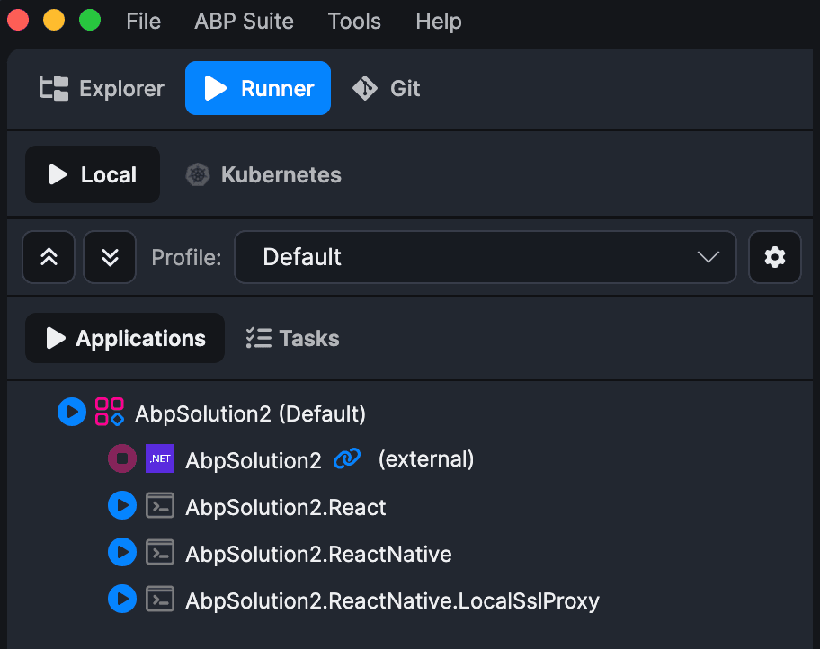
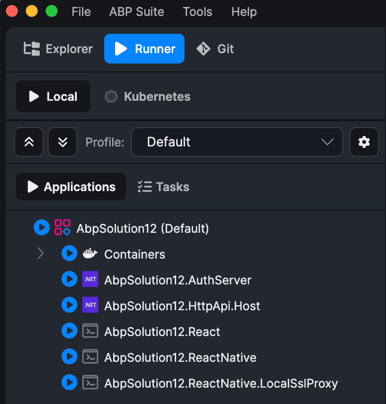
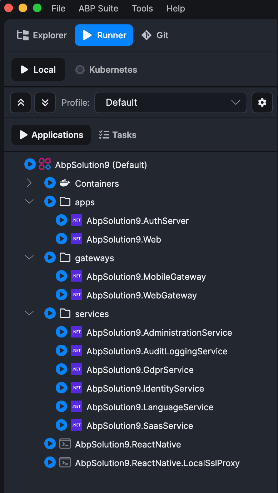
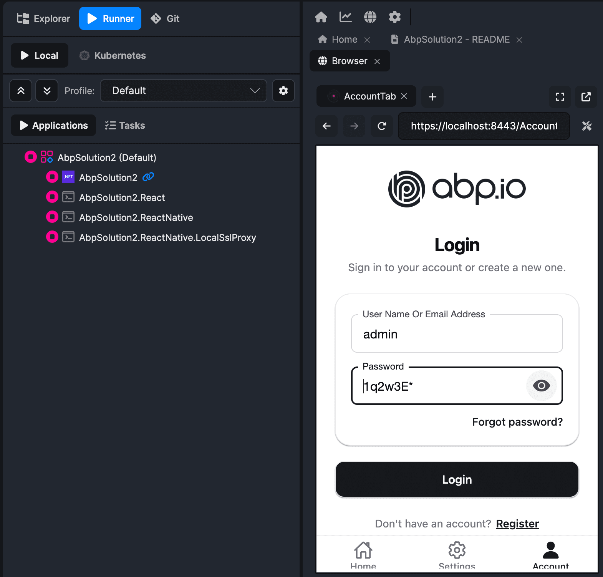

```json
//[doc-seo]
{
  "Description": "Run your ABP React Native application in the browser using ABP Studio or Expo Web with local HTTPS."
}
```

```json
//[doc-params]
{
  "Architecture": ["Monolith", "Tiered", "Microservice"]
}
```

```json
//[doc-nav]
{
  "Previous": {
    "Name": "Overview",
    "Path": "framework/ui/react-native"
  },
  "Next": {
    "Name": "Running on Device",
    "Path": "framework/ui/react-native/running-on-device"
  }
}
```

# Running on Web

Running the React Native app in a browser is the **fastest way to test** login, navigation, and API integrations. No emulator, Cloudflare tunnel, or manual backend configuration is required.

## React Native project folder

{{ if Architecture == "Microservice" }}

- `apps/mobile/react-native/`

{{ else }}

- `react-native/`

{{ end }}

Install dependencies once with `yarn install` or `npm install` in that folder.

## Using ABP Studio (Recommended)

Solutions created with ABP Studio include a **Default** run profile in the [Solution Runner](../../../studio/running-applications).

{{ if Architecture == "Monolith" }}



{{ else if Architecture == "Tiered" }}



{{ else }}



{{ end }}

### One-time setup: Initialize Solution

Run the **Initialize Solution** task from the **Tasks** tab if you have not already. For React Native solutions, this task also creates local SSL certificates (`localhost.pem` and `localhost-key.pem`) in the React Native folder using [mkcert](https://github.com/FiloSottile/mkcert). These certificates are required by the **Default** profile's local SSL proxy.

### Start the Default profile

When you start the **Default** profile, ABP Studio runs these main applications:

1. The backend host
2. **ReactNative.LocalSslProxy** — terminates HTTPS on **`https://localhost:8443`** and forwards to Expo Web on port `8081`
3. **ReactNative** — runs `npx expo start --web` and opens **`https://localhost:8443`** in your browser

The solution template already adds `https://localhost:8443` to backend **CorsOrigins** and **RedirectAllowedUrls**, so no manual backend configuration is required.

{{ if Architecture != "Microservice" }}



{{ end }}

You can enter **admin** as the username and **1q2w3E\*** as the password to log in.

## Manual setup (without ABP Studio)

If you are not using ABP Studio, use Expo Web with a local HTTPS proxy as described in the [Expo local HTTPS development guide](https://docs.expo.dev/guides/local-https-development/).

1. Navigate to the React Native folder and install dependencies if you have not already.
2. Generate SSL certificates in the React Native folder:

```bash
mkcert localhost
```

3. Start Expo Web:

```bash
yarn web
```

4. In a separate terminal, start the local SSL proxy (port `8443` matches the ABP Studio Default profile):

```bash
npx local-ssl-proxy --source 8443 --target 8081 --cert localhost.pem --key localhost-key.pem
```

Alternatively, run `yarn create:local-proxy` and set `SOURCE_PORT=8443` if your template uses a different default port.

1. Open **`https://localhost:8443`** in your browser.

## Next steps

To test on an Android emulator, iOS simulator, or physical device, continue with [Running on Device](./running-on-device.md).
