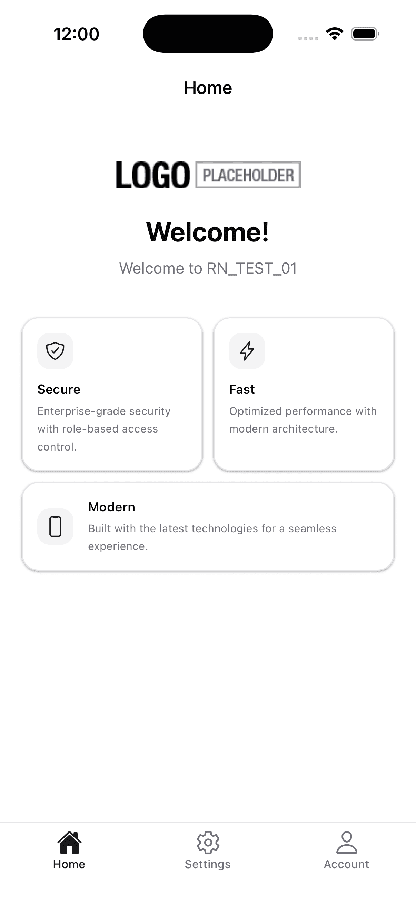

```json
//[doc-seo]
{
    "Description": "Learn how the ABP React Native startup template is styled with NativeWind v4 (Tailwind CSS for React Native), including the semantic color tokens, dark mode and theme customization."
}
```

# Styling with NativeWind

The ABP React Native startup template uses **[NativeWind v4](https://www.nativewind.dev/)** — Tailwind CSS for React Native. Most components are styled through utility `className` props that are compiled at build time, so there is almost no styling runtime cost. The design system is based on the **shadcn/ui** neutral palette and supports **light and dark themes** out of the box.

> This page documents the styling system that ships with the template. For the general getting-started flow (installing tools, running the app, configuring the backend), see [Getting Started with React Native](index.md).



---

## 1. Project Files

NativeWind is wired in through a small set of configuration files at the root of the React Native project:

| File | Purpose |
|------|---------|
| `tailwind.config.js` | Defines the design tokens (colors, spacing, border radius), enables `darkMode: 'class'`, and registers the NativeWind preset. This is the source of truth for the theme. |
| `global.css` | Tailwind entry point with the three base directives (`@tailwind base; @tailwind components; @tailwind utilities;`). |
| `metro.config.js` | Wraps the default Expo Metro config with `withNativeWind(...)` and points it at `global.css`. |
| `babel.config.js` | Adds the `nativewind/babel` preset and sets `jsxImportSource: 'nativewind'` on `babel-preset-expo` so JSX understands the `className` prop. |
| `nativewind-env.d.ts` | TypeScript triple-slash reference (`/// <reference types="nativewind/types" />`) that adds `className` typings to React Native components. |

All of these files come pre-configured in the template. You normally only need to edit `tailwind.config.js` to customize the theme.

---

## 2. Semantic Color Tokens

Instead of raw color names like `bg-zinc-900`, the template exposes a small set of **semantic tokens** that follow the shadcn/ui convention. Each token has a default (light) value and a `dark` variant, and many also carry a paired `foreground` color for text/icons placed on top.

| Token | Use it for |
|-------|-----------|
| `background` / `foreground` | Screen background and primary text. |
| `card` / `card-border` | Surface containers (settings rows, feature cards) and their 1px border. |
| `primary` / `primary-foreground` | Filled call-to-action buttons. |
| `secondary` / `secondary-foreground` | Subtle filled elements such as icon chips inside cards. |
| `muted` / `muted-foreground` | Backgrounds and text for secondary information (subtitles, helper text). |
| `accent` / `accent-foreground` | Highlighted/active state — also used as the active tint of the bottom tab bar. |
| `destructive` / `destructive-foreground` | Delete/danger actions and error states. |
| `border` | Generic separators and outline borders. |
| `input` | Border color for text inputs (Paper `TextInput` outline). |
| `ring` | Focus ring/outline color. |

All token values live in `tailwind.config.js` under `theme.extend.colors`. Refer to that file for the exact hex values.

The template also extends Tailwind's spacing and border-radius scales so paddings and corners stay consistent across screens:

* **Spacing:** `xs` (4px), `sm` (8px), `md` (16px), `lg` (24px), `xl` (32px) — usable as `p-md`, `mt-lg`, `gap-sm`, etc.
* **Border radius:** `rounded-sm` (4px), `rounded-md` (8px), `rounded-lg` (12px), `rounded-xl` (16px), `rounded-2xl` (20px).

---

## 3. Dark Mode

Dark mode is enabled with `darkMode: 'class'` in `tailwind.config.js` and is driven by the device color scheme via NativeWind's `useColorScheme()` hook. Each color token has a sibling `*-dark` (and where applicable `*-dark-foreground`) variant, and components opt into it with the `dark:` prefix on their classes:

```tsx
<View className="flex-1 bg-background dark:bg-background-dark">
  <Text className="text-foreground dark:text-foreground-dark">
    Hello
  </Text>
</View>
```

> **Pattern note.** The token shape used in this template is `{ DEFAULT, dark }` (and `{ foreground, 'dark-foreground' }` where applicable), so the dark-mode class is `dark:bg-background-dark` — not `dark:bg-background`. Follow this convention when you add new screens so the theme switch behaves consistently across the app.

The user can also switch themes manually from the **Settings** screen (system / light / dark), and the choice is persisted via Redux.


---

## 4. The `useThemeColors` Hook

A handful of APIs in the template do not accept a `className` — they need a *color value*. Examples:

* `react-native-paper`'s `TextInput` (which the template still uses for outlined inputs and validation styling).
* React Navigation's `screenOptions` (header background, tab bar tint, etc.).
* The native status bar.

For these cases the template ships a `useThemeColors` hook at `src/hooks/UseThemeColors.ts`. It returns theme-aware values that mirror the Tailwind tokens:

```ts
const {
  primaryContainer,   // Paper TextInput surface
  headerBg,           // Navigator headers
  headerText,
  iconColor,          // Inactive icon tint
  accentColor,        // Active icon tint / focused tab
  destructiveColor,
  inputBorderColor,
} = useThemeColors();
```

**Rule of thumb:** prefer `className` with `dark:` variants whenever the component supports it; reach for `useThemeColors` only for the components listed above.

---

## 5. React Native Paper

`react-native-paper` is still in the template's `package.json`, but its usage has been narrowed down to a single component: **`TextInput`** in outlined mode (used for forms because of its strong validation/error UI). Buttons, lists, modals, drawers, and icons are all NativeWind + `@expo/vector-icons` (Ionicons) now.

If you add new forms, follow the same split:

* Use Paper's `TextInput` (with values from `useThemeColors`) for text fields.
* Use plain `View`/`Text`/`Pressable` with NativeWind classes for everything else.

---

## 6. Customizing the Theme

Most customization happens in `tailwind.config.js`. To introduce a brand color, extend the `colors` map and reuse the `{ DEFAULT, dark }` shape so the `dark:` variants keep working:

```js
// tailwind.config.js
module.exports = {
  // ...
  theme: {
    extend: {
      colors: {
        // ...
        brand: {
          DEFAULT: '#2563eb',
          dark: '#3b82f6',
          foreground: '#ffffff',
          'dark-foreground': '#ffffff',
        },
      },
    },
  },
};
```

You can then use it from any component:

```tsx
<Pressable className="bg-brand dark:bg-brand-dark rounded-lg px-md py-sm">
  <Text className="text-brand-foreground dark:text-brand-dark-foreground font-semibold">
    Get started
  </Text>
</Pressable>
```

If the new color also needs to be reachable from non-`className` APIs (Paper, navigators, status bar), add a matching entry to `useThemeColors` so the rest of the template stays consistent.

---

## 7. Going Further

* [NativeWind documentation](https://www.nativewind.dev/) — class reference, advanced features (variants, animations).
* [Tailwind CSS documentation](https://tailwindcss.com/docs) — utility classes, responsive design, theming.
* [shadcn/ui](https://ui.shadcn.com/) — the design system the color tokens are inspired by.
