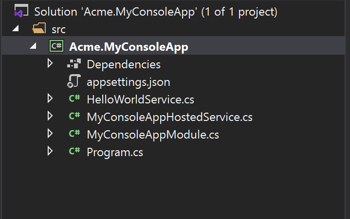

# Console Application Startup Template

This template is used to create a minimalist console application project.

## How to Start With?

First, install the [ABP CLI](../cli) if you haven't installed before:

````bash
dotnet tool install -g Volo.Abp.Studio.Cli
````

Then use the `abp new` command in an empty folder to create a new solution (with the `--old` parameter at the end of the command):

````bash
abp new Acme.MyConsoleApp -t console --old
````

> **Note**: Since this startup template is not provided by the new ABP Studio Templates yet, you need to pass the `--old` parameter at the end of the command to use the old CLI & templating system for this startup template.

`Acme.MyConsoleApp` is the solution name, like *YourCompany.YourProduct*. You can use single level, two-levels or three-levels naming.

## Solution Structure

After you use the above command to create a solution, you will have a solution like shown below:



* `HelloWorldService` is a sample service that implements the `ITransientDependency` interface to register this service to the [dependency injection](../framework/fundamentals/dependency-injection.md) system.