# Get Started with ABP: Creating a Layered Web Application

````json
//[doc-params]
{
    "UI": ["MVC", "Blazor", "BlazorServer", "NG"],
    "DB": ["EF", "Mongo"],
    "Tiered": ["Yes", "No"]
}
````

In this quick start guide, you will learn how to create and run a layered (and potentially modular) web application using [ABP Studio](../studio/index.md).

## Creating a New Solution

> 🛈 This document uses [ABP Studio](../studio/index.md) to create new ABP solutions. **ABP Studio** is in the beta version now. If you have any issues, you can use the [ABP CLI](../cli/index.md) to create new solutions. You can also use the [getting started page](https://abp.io/get-started) to easily build ABP CLI commands for new project creations.

> ABP startup solution templates have many options for your specific needs. If you don't understand an option that probably means you don't need it. We selected common defaults for you, so you can leave these options as they are.

Assuming that you have [installed and logged in](../studio/installation.md) to the application, you should see the following screen when you open ABP Studio:


Select the *File* -> *New Solution* in the main menu, or click the *New solution* button on the Welcome screen to open the *Create new solution* wizard:

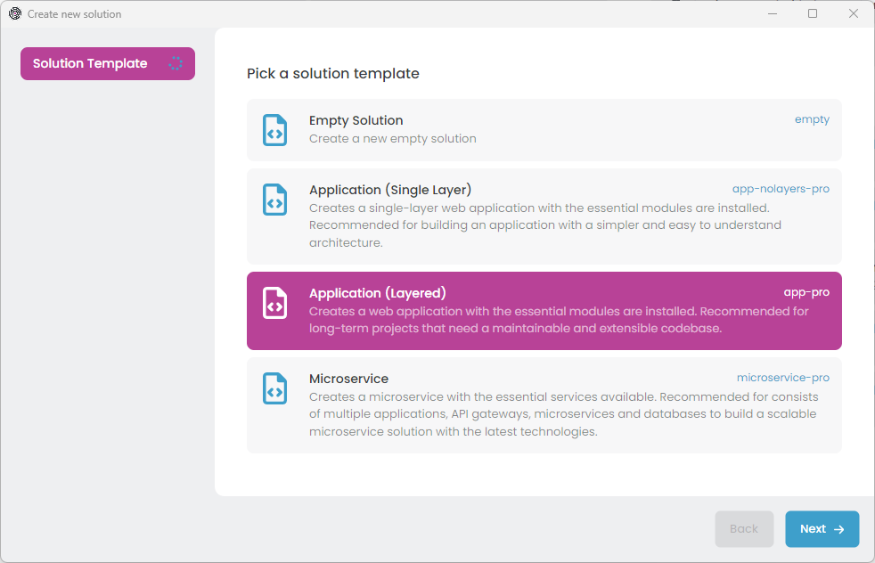

We will use the *Application (Layered)* solution template for this tutorial, so pick it and click the *Next* button:

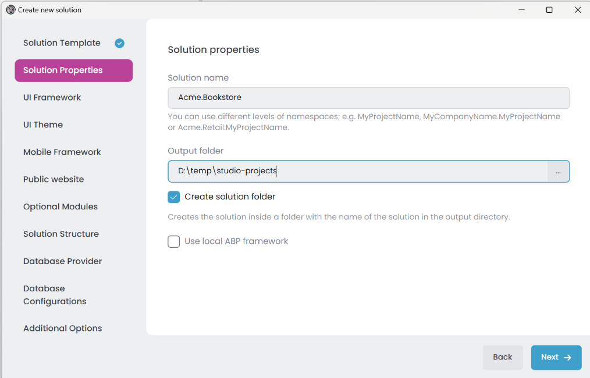

On that screen, you choose a name for your solution. You can use different levels of namespaces; e.g. `BookStore`, `Acme.BookStore` or `Acme.Retail.BookStore`.

Then select an *output folder* to create your solution. The *Create solution folder* option will create a folder in the given output folder with the same name of your solution.

Once your configuration is done, click the *Next* button to navigate to the *UI Framework* selection:

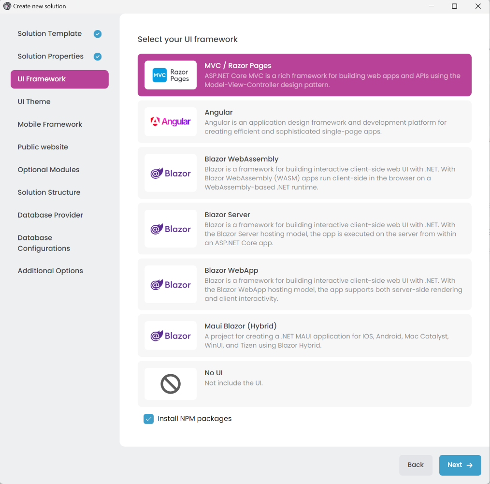

Here, you see all the possible UI options supported by that startup solution template. Pick the **{{ UI_Value }}**.

Notice that; Once you select a UI type, some additional options will be available under the UI Framework list. You can further configure the options or leave them as default and click the *Next* button for the *UI Theme* selection screen:

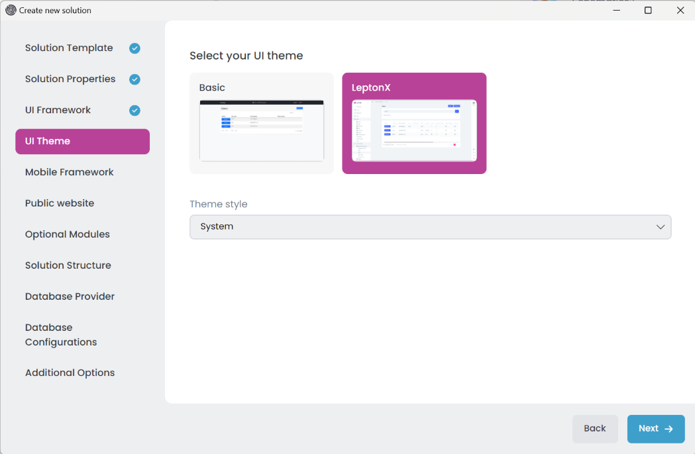

LeptonX is the suggested UI theme that is proper for production usage. Select one of the themes, configure the additional options, and click the *Next* button for the *Mobile Framework* selection:

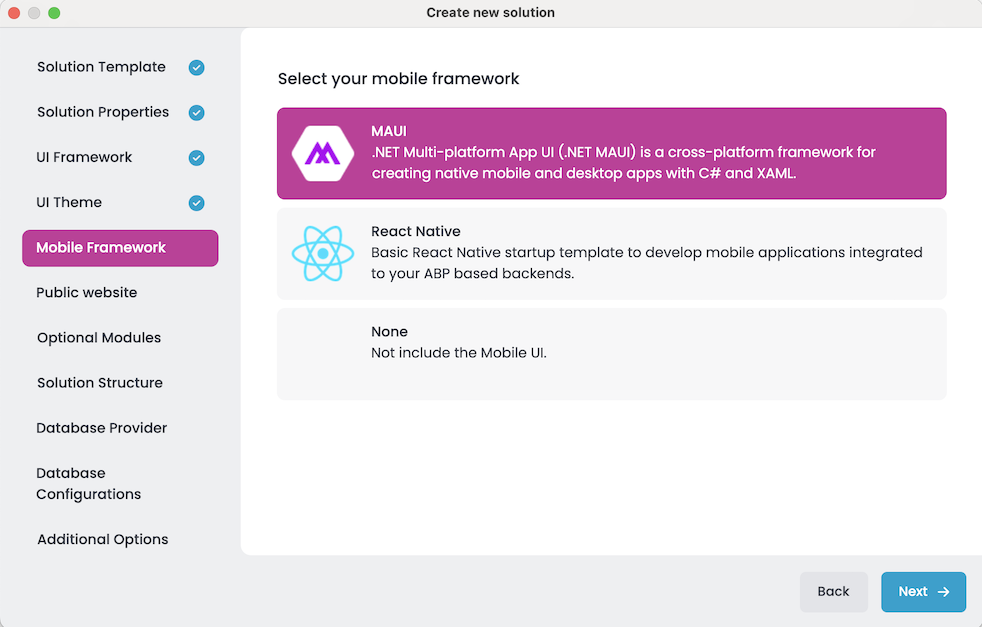

Here, you see all the mobile applications available in that startup solution template. These mobile applications are well-integrated into your solution and can use the same backend with your web application. They are simple (do not have pre-built features as much as the web application) but a very good starting point to build your mobile application.

Pick the one best for you, or select the *None* if you don't want a mobile application in your solution, then click Next to navigate to the *Additional UI options* screen:

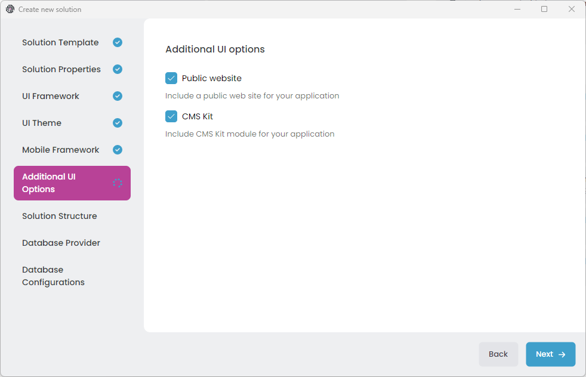

That startup solution template also provides an option to create a second web application inside the solution. The second application is called the Public website, an ASP.NET Core MVC / Razor Page application. It can be used to create a public landing/promotion for your product. It is well integrated into the solution (can share the same services, entities, database, and the same authentication logic, for example). If you want, you can also include the [CMS Kit module](../modules/cms-kit) to your solution to add dynamic content features to your web application.

So, either select the *Public website* or skip it and click the Next button for the *Solution Structure* selection:

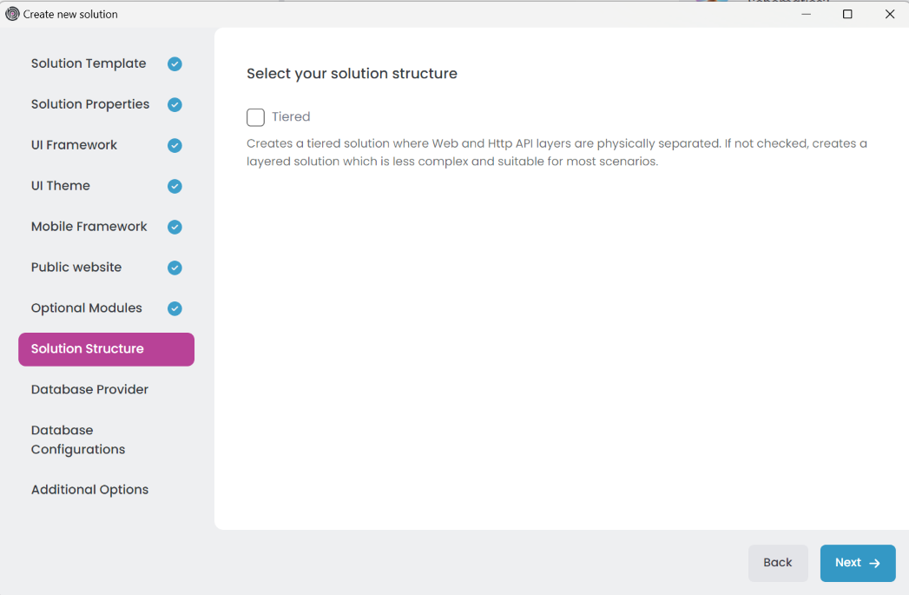

The *Tiered* option is used to physically separate the web application (the UI part) from the backend HTTP APIs. It creates a separate host application that only serves the HTTP (REST) APIs. The web application then performs remote HTTP calls to that application for every operation. If the *Tiered* option is not selected, then the web and HTTP APIs are hosted in a single application, and the calls from the UI layer to the API layer are performed in-process.

The tiered architecture allows you to host the web (UI) application in a server that can not access to your database server. However, it brings a slight loss of performance (because of the HTTP calls between UI and HTTP API applications) and makes your architecture, development, and deployment more complex. If you don't understand the tiered structure, just skip it.

After making your *Tiered* selection, you can click the *Next* button for the *Database Provider* selection:

{{ if DB == "EF" }}
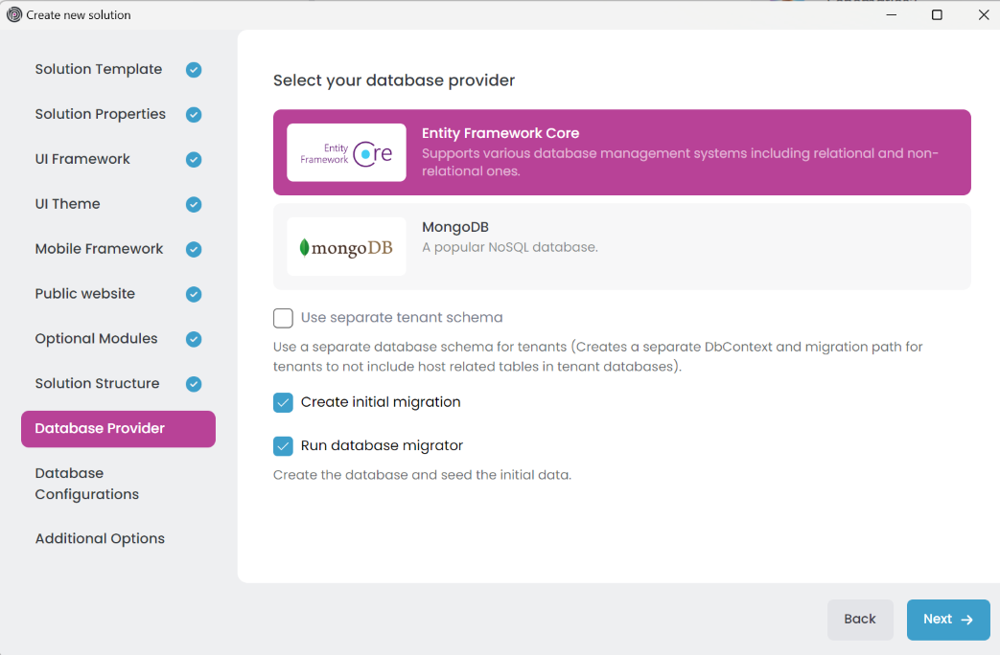
{{ else }}
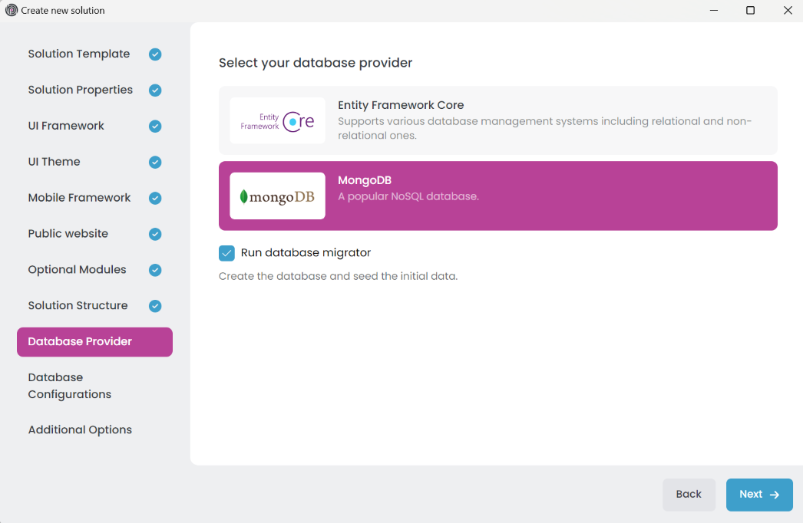
{{ end }}

On that screen, you can decide on your database provider by selecting one of the provided options. There are some additional options for each database provider. Leave them as default or change them based on your preferences, then click the *Next* button for additional *Database Configurations*:

{{ if DB == "EF" }}
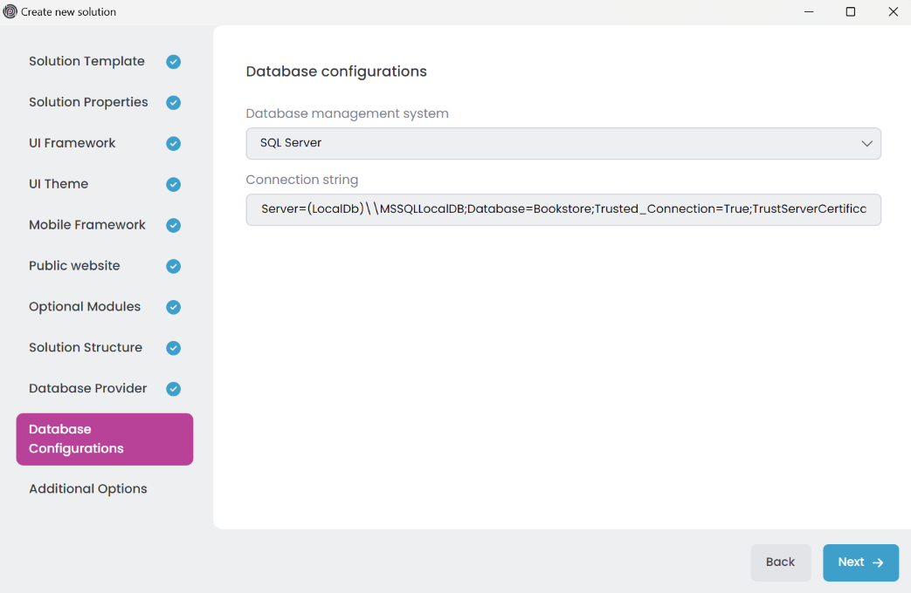
{{ else }}
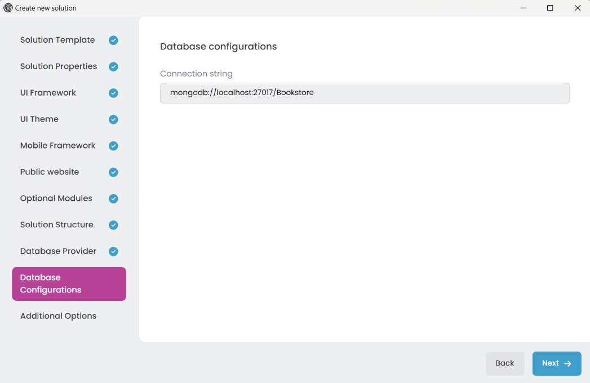
{{ end }}

Here, you can select the database management systems (DBMS){{ if DB == "EF" }} and the connection string{{ end }}. Now, we are ready to allow ABP Studio to create our solution. Just click the *Create* button and let the ABP Studio do the rest for you.

After clicking the Create button, the dialog is closed and your solution is loaded into ABP Studio:

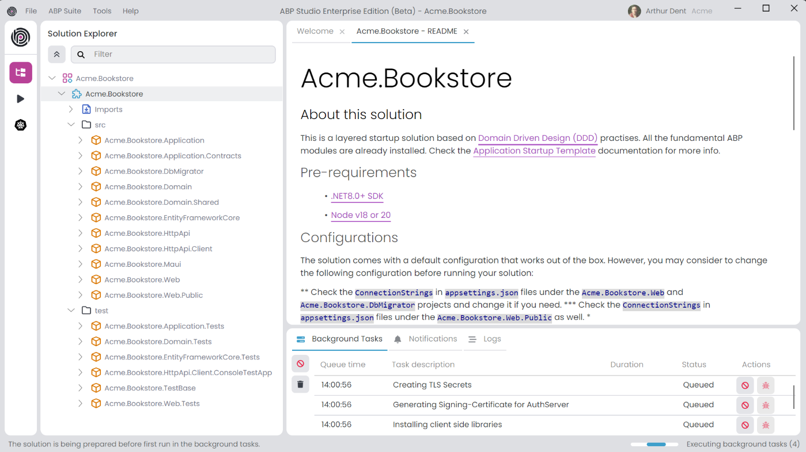

You can explore the solution, but you need to wait for background tasks to be completed before running any application in the solution.

> The solution structure can be different in your case based on the options you've selected.

## Running the Application

After creating your solution, you can open it in your favorite IDE (e.g. Visual Studio, Visual Studio Code or Rider) and start your development. However, ABP Studio provides a *Solution Runner* system. You can use it to easily run and browse your applications in your solution without needing an external tool.

Open the [Solution Runner](../studio/running-applications.md) section on the left side of ABP Studio as shown in the following figure:

> The solution runner structure can be different in your case based on the options you've selected.

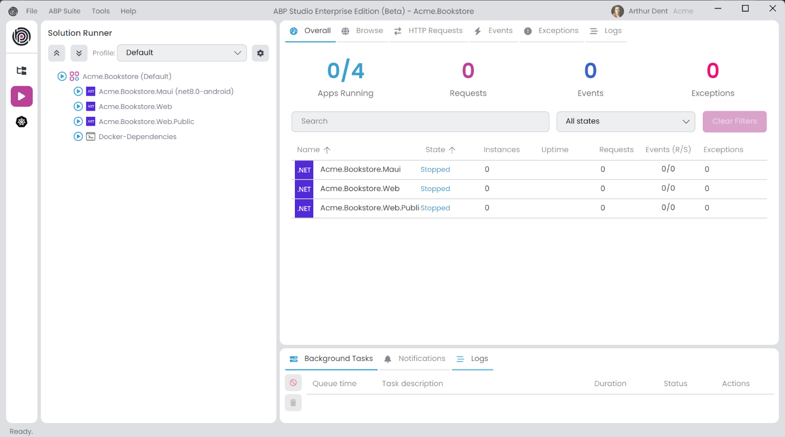

Once you click the *Play* icon on the left side, the section is open in the same place as the Solution Explorer section. ABP Studio also opens the *Application Monitor* view on the main content area. *Application Monitor* shows useful insights for your applications (e.g. *HTTP Request*, *Events* and *Exceptions*) in real-time. You can use it to see the happenings in your applications, so you can easily track errors and many helpful details.

In the Solution Runner section (on the left side) you can see all the runnable applications in the current solution. For the MVC with public website example, we have three applications:

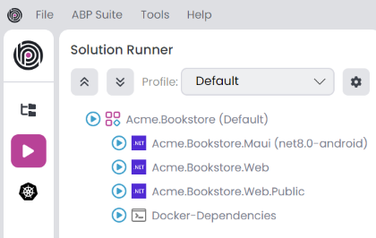

You can run all the applications or start them one by one. To start an application, either click the *Play* icon near to the application or right-click and select the *Run* -> *Start* context menu item.

> For the first run, you'll need to build the application. You can achieve this by selecting *Run* -> *Build & Start* from the context menu.

You can start the following application(s): 

{{ if Tiered == "Yes" }}
- `Docker-Dependencies`
- `Acme.BookStore.AuthServer`
- `Acme.BookStore.HttpApi.Host`
{{ end }}
{{ if UI == "NG" }}
{{ if Tiered == "No" }}- `Acme.BookStore.HttpApi.Host`{{ end }}
- `Acme.BookStore.Angular`
{{ else if UI == "Blazor" }}
{{ if Tiered == "No" }}- `Acme.BookStore.HttpApi.Host`{{ end }}
- `Acme.BookStore.Blazor`
{{ else if UI == "BlazorServer" }}
- `Acme.BookStore.Blazor`
{{ else }}
- `Acme.BookStore.Web`
{{ end }}

{{ if Tiered == "Yes" }} The `Docker-Dependencies` is used to run the infrastructure service (e.g. Redis) in Docker. Start it first, so the web application can properly start.{{ end }}

{{ if Tiered == "Yes" }}
> Notice that the services running in docker-compose are exposed to your localhost. If any service in your localhost is already using the same port(s), you will get an error. In that case, stop your local services first.
{{ end }}

Once the `Acme.BookStore.{{ if UI == "NG" }}Angular{{ else if UI == "BlazorServer" || UI == "Blazor" }}Blazor{{ else }}Web{{ end }}` application started, you can right-click it and select the *Browse* command:

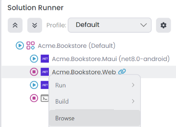

The *Browse* command opens the UI of the web application in the built-in browser:

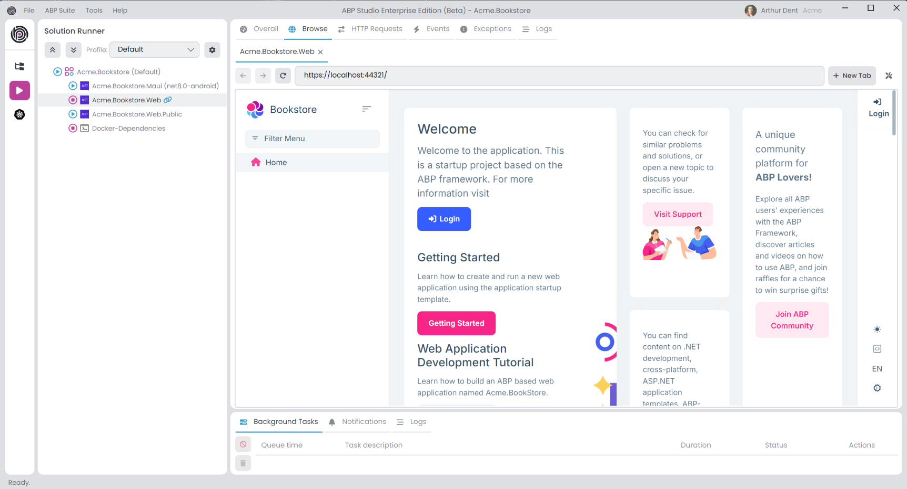

You can browse your application in a full-featured web browser in ABP Studio. Click the *Login* button in the application UI, enter `admin` as username and `1q2w3E*` as password to login to the application.

The following screenshot was taken from the *User Management* page of the [Identity module](../modules/identity.md) that is pre-installed in the application:


## Open the Solution in Visual Studio

You can use any IDE (e.g. Visual Studio, Visual Studio Code or Rider) to develop your solution. Here, we will show Visual Studio as an example.

First of all, we can stop the application(s) in ABP Studio, so it won't conflict when we run it in Visual Studio.{{ if Tiered == "Yes" }} Do not stop the `Docker-Dependencies`, because the application will need the services it runs at runtime.{{ end }}

You can use ABP Studio to open the solution with Visual Studio. Right-click to the `Acme.BookStore` [module](../modules), and select the *Open with* -> *Visual Studio* command:


If the *Visual Studio* command is not available, that means ABP Studio could not detect it on your computer. You can open the solution folder in your local file system (you can use the *Open with* -> *Explorer* as a shortcut) and manually open the solution in Visual Studio.

Once the solution is opened in Visual Studio, you should see a screen like shown below:

> The solution structure can be different in your case based on the options you've selected.

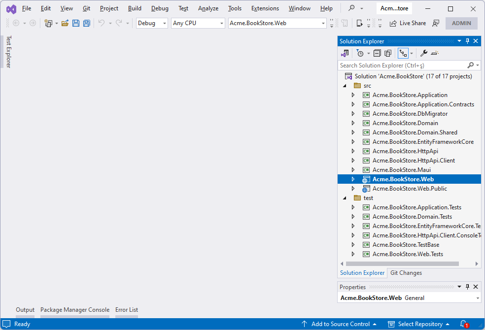

Right-click the `Acme.BookStore.{{ if UI == "NG" || UI == "Blazor" }}HttpApi.Host{{ else if UI == "BlazorServer" }}Blazor{{ else }}Web{{ end }}` project and select the *Set as Startup Project* command. You can then hit *F5* or *Ctrl + F5* to run the web application. It will run and open the application UI in your default browser:

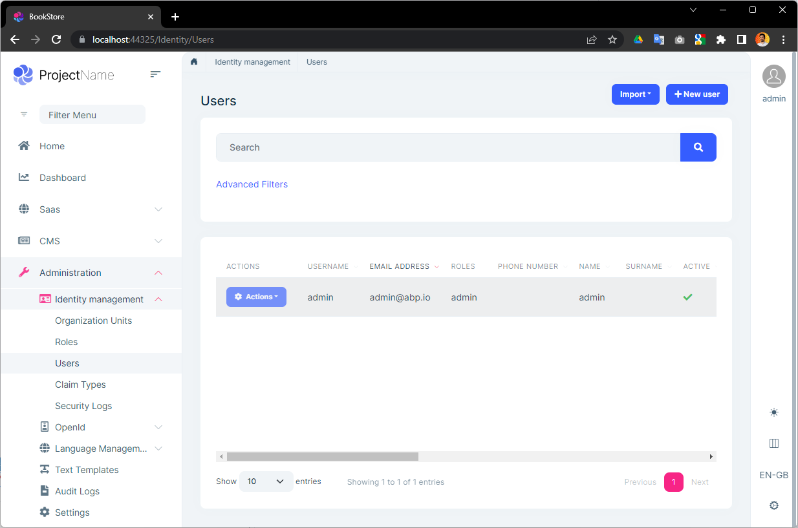

You can use `admin` as username and `1q2w3E*` as default password to login to the application.

## Running the Mobile Application

> Note: If you haven't selected a mobile framework, you can skip this step. 

You can start the following application(s): 

{{ if Tiered == "Yes" }}
- `Docker-Dependencies`
- `Acme.BookStore.AuthServer`
- `Acme.BookStore.HttpApi.Host`
{{ else if UI == "NG" || UI == "Blazor" }}
- `Acme.BookStore.HttpApi.Host`
{{ else if UI == "BlazorServer" }}
- `Acme.BookStore.Blazor`
{{ else }}
- `Acme.BookStore.Web`
{{ end }}
 
Before starting the mobile application, ensure that you configure it for [react-native](../framework/ui/react-native) or [MAUI](../framework/ui/maui).

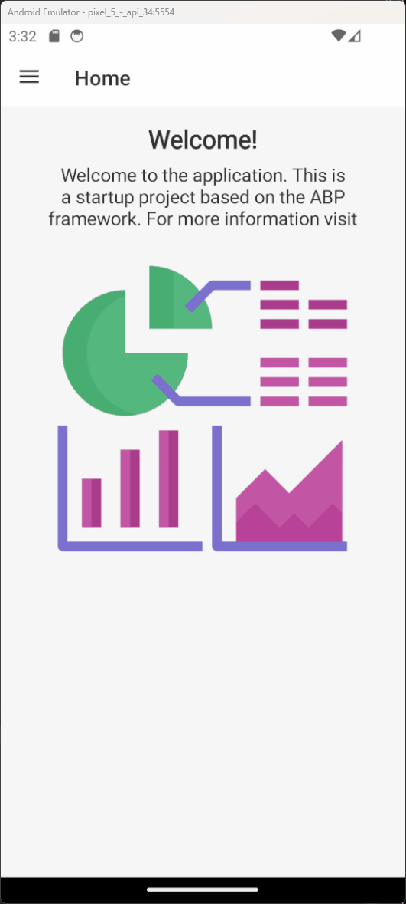

## Running the Public Website

> Note: If you haven't checked public website, you can skip this step.

{{ if Tiered == "Yes" }}After started the `Docker-Dependencies`, `Acme.BookStore.AuthServer` and the `Acme.BookStore.HttpApi.Host` applications.{{ end }} You can start `Acme.BookStore.Web.Public` application.

> For example in non-tiered MVC with public website application: 

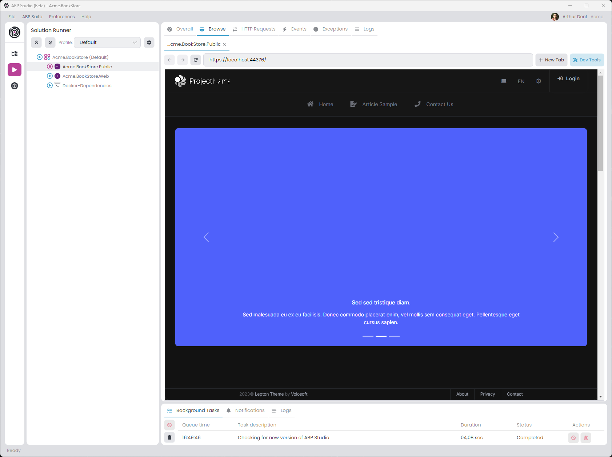
