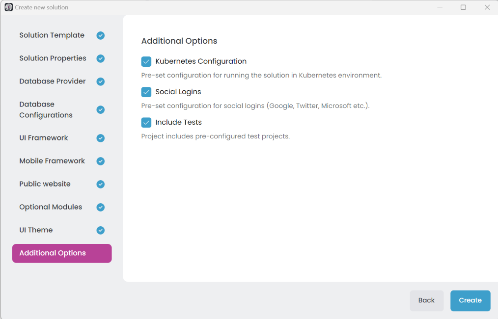

# Get Started with ABP: Creating a Microservice Solution

> You must have an ABP Business or a higher license to use this startup template.

In this quick start guide, you will learn how to create and run a microservice solution using [ABP Studio](../studio/index.md).

## Creating a New Solution

> 🛈 This document uses [ABP Studio](../studio/index.md) to create new ABP solutions. **ABP Studio** is in the beta version now. If you have any issues, you can use the [ABP CLI](../cli/index.md) to create new solutions. You can also use the [getting started page](https://abp.io/get-started) to easily build ABP CLI commands for new project creations.

> ABP startup solution templates have many options for your specific needs. If you don't understand an option that probably means you don't need it. We selected common defaults for you, so you can leave these options as they are.

Assuming that you have [installed and logged in](../studio/installation.md) to the application, you should see the following screen when you open ABP Studio:

Select the *File* -> *New Solution* in the main menu, or click the *New solution* button on the *Welcome* screen to open the *Create new solution* wizard:

We will use the *Microservice* solution template for this tutorial, so pick it and click the *Next* button:

On that screen, you choose a name for your solution. You can use different levels of namespaces; e.g. `CloudCrm`, `Acme.CloudCrm` or `Acme.Solutions.CloudCrm`.

Then select an *output folder* to create your solution. The *Create solution folder* option will create a folder in the given output folder with the same name of your solution.

Once your configuration is done, click the *Next* button to navigate to the *Database Provider* selection:

On that screen, you can decide on your database provider by selecting one of the provided options, then click the *Next* button to navigate to the *Database Configurations* section (only for Entity Framework Core):

Here, select the DBMS right for you, then click the *Next* button to navigate to the *UI Framework* selection:

Here, you see all the possible UI options supported by that startup solution template. You can pick your favorite one and click the *Next* button for the *Mobile Framework* selection screen:

Here, you see all the mobile applications available in that startup solution template. These mobile applications are well-integrated into your solution and can use the same backend with your web application. They are simple (do not have pre-built features as much as the web application) but a very good starting point to build your mobile application.

> If you select a mobile application, an additional API Gateway is created that is only used by the mobile application. 

Pick the one best for you, or select the *None* if you don't want a mobile application in your solution, then click *Next* to navigate to the *Public Website* section:

You can select a public website to be created in your solution. The public website is a simple landing page that can be used to introduce your product, provide documentation, and so on.

Each item in that list is a pre-built application module. You can click the blue icon near to the module name to get more information about the module. You can leave the list as is (so, it installs the most common and used modules for you) or customize based on your preference.

> ABP Studio creates dedicated microservices for some of the modules (e.g. SaaS and GDPR). For others (e.g. Language Management and OpenIddict UI), it installs the modules into existing microservices. So, you may not see a separate service for each selected module.

Installing a module after creating the solution may require manual steps. So, it is better to decide the modules in the beginning. You can create an example solutions before your real solution to explore the solution and modules.

Once you select the desired modules, click the *Next* button for the *UI Theme* selection:

LeptonX is the suggested UI theme that is proper for production usage. Select one of the themes and configure the additional options if you want.

Click the Next button to see *Additional Options* selection:

If you unchecked the *Kubernetes Configuration* option, the solution will not include the Kubernetes configuration files which include the Helm charts and other Kubernetes related files. You can also specify *Social Logins*; if you uncheck this option, the solution will not be configured for social login.

Now, we are ready to allow ABP Studio to create our solution. Just click the *Create* button and let the ABP Studio do the rest for you. After clicking the Create button, the dialog is closed and your solution is loaded into ABP Studio:

You can explore the solution, but you need to wait for background tasks to be completed before running any application in the solution (it can take up to a few minutes to set up all).

> The solution structure can be different in your case based on the options you've selected.

## Exploring the Solution

This **solution** consists of several **modules** shown in the *Solution Explorer* section:

> You can refer the ***[Concepts](../modules)*** document to learn what do **solution** and **module** terms mean.

Each leaf item (e.g. `Acme.CloudCrm.IdentityService` or `Acme.CloudCrm.Web`) in the tree above is an ABP Studio module. They are grouped into solution folders (`apps`, `gateways`, and `services`).

Each module has a separate .NET Solution. You can open a module's (or .NET solution's) folder by right-clicking a module in the *Solution Explorer* tree, select *Open with* -> *Explorer* option as shown below:

If we open the `Acme.CloudCrm.IdentityService` module's path in the explorer, we can see its .NET solution and other files:

This microservice solution is designed to have separate .NET solutions for each service to make it possible to develop independently from the other services and applications.

You can open any module's .NET solution in your favorite IDE and make your development. The following figure is a screenshot from the *Identity* microservice opened in Visual Studio:

If you explore that .NET solution, you will typically see some configuration code, and you won't see any business code. That's because the solution uses [pre-built application modules](../modules) as NuGet packages, and doesn't contain their source code. In this way, you can easily upgrade these application modules when a new version is available.

You will typically add new microservices to the solution and perform your business logic inside these new services (however, you can always want to download the source code of any pre-built application module and include it into your solution to freely customize it).

## Running the Solution

Running a microservice solution is not like running a monolith application where you typically have a single executable. All the applications, services, gateways, and infrastructure components (e.g. Redis, RabbitMQ) should be up and running. Fortunately, ABP Studio provides the *Solution Runner* and *Kubernetes Integration* features to make it easy and enjoyable.

Open the [Solution Runner](../studio/running-applications.md) section on the left side of ABP Studio as shown in the following figure:

Once you click the *Play* icon on the left side, the section is open in the same place as the *Solution Explorer* section. ABP Studio also opens the *Application Monitor* view on the main content area. *Application Monitor* shows useful insights for your applications/services (e.g. *HTTP Request*, *Events*, and *Exceptions*) in real-time. You can use it to see the happenings in your system, so you can easily track errors and many helpful details.

In the *Solution Runner* section (on the left side) you can see all the runnable applications in the current solution:

> All the leaf items in the *Solution Runner* is called as an *Application* as they are executable applications.

> For a faster start process, first start the *Docker-Dependencies*, then you can start all applications.

As shown in the figure above, the executable applications are grouped into folders like `apps`, `gateways`, `infrastructure`, and `services`. You can start/stop them all, a group (folder) of them, or one by one.

Before running the applications, it is good to be sure that all applications are built. To do that, right-click the root item in the *Solution Runner* and select *Build* -> *Build All* action.

> *Solution Runner* doesn't build an application before running it. That provides a great performance gain because most of the time you will work on one or a few services and you don't need to build all of the other applications in every run. However, if you want to build before running, you can right-click an item in the *Solution Runner* tree and select *Run* -> *Build & Start* command.

It will take some time to build all. Once all is done, you can start the system. 

You can click the *Play* button on the root item in Solution Runner to start all the applications. Or you can start `Docker-Dependencies` first, so the database and other infrastructure services get ready before the other applications:

> Docker will fetch the docker images before starting the containers in your first run (if they were not fetched before) and that process may take a few minutes depending on your internet connection speed.  So, please wait for it to completely start. If the process takes more time than you expect, you can right-click on `Docker-Dependencies` and select the *Logs* command to see what's happening.

Once `Docker-Dependencies` is ready, you can click the *Play* button on the root item in Solution Runner to start all the applications.

> Some applications/services may fail on the first run. That may be because of service and database dependencies were not satisfied and an error occurs on the application startup. ABP Studio automatically restarts failing services until it is successfully started. Being completely ready for such a distributed solution may take a while, but it will be eventually started.

Once all the applications are ready, you can right-click the `Web` application and select the *Browse* command:

The *Browse* command opens the web application's UI in the built-in browser of ABP Studio:

You can browse your application in a full-featured web browser in ABP Studio. Click the *Login* button in the application UI, enter `admin` as username and `1q2w3E*` as password to login to the application.

> You can also browse the other applications/services (that provides a UI) inside ABP Studio. In this way, you don't need to use an external browser or manually type the application's URL.

## Developing Services Using the Solution Runner

Solution Runner not only runs a multi-applications system easier, but is also useful while developing your services and applications. In a microservice solution, you typically focus on one or a few services and applications. Assume that you want to make a development in `IdentityService`. You can use the following development flow:

* Start all the applications/services in the solution and test if everything works as expected.
* Stop the `IdentityService` in the Solution Runner.
* Open the `IdentityService`'s .NET solution in your favorite IDE (e.g. Visual Studio). As an easy way of opening it, you can use the *Solution Explorer*, find the `Acme.CloudCrm.IdentityService` module, right-click to it and select the *Open with* -> *Visual Studio* command.
* Make your development in the `IdentityService`.
* Run (with or without debugging) your service in Visual Studio (or another IDE).

Once you run the `IdentityService` in Visual Studio, it will be completely integrated into the rest of the system since they all run in your local machine. In addition, the `IdentityService` application will automatically connect to ABP Studio and send runtime data to it as it works in ABP Studio. When you run an application out of ABP Studio, it is shown as *external* in the Solution Runner and you can't stop it in ABP Studio (you should stop where you've started):

As an alternative approach, especially if you don't need to debug your service, you can enable the watching feature of ABP Studio to automatically re-build and re-start when there is change in your application/service.

To enable watching, right-click the application/service you want to watch, select the *Run* -> *Enable Watch* command as shown in the following figure:

Now, you can make your development on the `IdentityService`. Whenever you save a code file, it is automatically rebuilt and restarted by ABP Studio, so any change will be effective on the running solution in a few seconds.

When you enable watch for an application an *eye* icon is added near to the application:

You can disable watching by right-clicking an application and selecting *Run* -> *Disable Watch* command.

## Kubernetes Integration: Working with Helm Charts

Solution Runner is a great way to locally run all the applications and services of your solution. However, there are some drawbacks:

* If your solution grows and you have tens or hundreds of services, running all the system in your local environment will consume your system resources (CPU, RAM, ...) a lot.
* In the end, your solution will work in a production environment, and Kubernetes is currently the de-facto tool to deploy such distributed solutions. Running your solution in a local or remote Kubernetes environment will be much closer to a production environment.

ABP Studio's [Kubernetes Integration](../studio/kubernetes.md) feature is a great way to deploy your microservice solution to Kubernetes and locally develop your services by integrating your local environment to a Kubernetes cluster.

Open the *Kubernetes* section on the left side of ABP Studio as shown in the following figure:

In the *Helm* tab (shown in the figure above), we can see all the [Helm](https://helm.sh/) charts in the solution (chart files are located in the `etc/helm` folder in the solution folder). All the charts are ready to use and pre-configured for [Docker Desktop](https://www.docker.com/products/docker-desktop/).

> **The solution contains a `README.MD` file under the `etc/helm` folder. Please read it carefully and apply the steps to prepare your development environment.**

In the *Helm* tab, you can right-click the root chart (`cloudcrm` in this example), and select the *Build Docker Image(s)* command:

This command will create local Docker images for all the .NET applications in the solution. Image creation operation will be done in background tasks. You can follow the process in the *Background Tasks* panel at the bottom of ABP Studio:

After building the Docker images, it is ready to install the Helm chart to Kubernetes. To do it, right-click to the root chart (`cloudcrm` in this example), and select the *Install Chart(s)* command:

> Installing chart should be fast. However, it may take time for being fully ready in Kubernetes. For example, if an image of a service (e.g. Redis, Rabbit) was not pulled before, it will need to pull image first.

Once the solution is ready in Kubernetes, you can open a browser and visit the following URL: https://cloudcrm-local-web It will open a web page as shown below:

Click the *Login* link in the application UI, it will redirect you to the *Authentication Server* application, enter `admin` as username and `1q2w3E*` as password to login to the application.

> The services run independently from each other and perform some initial data seed logic on their startups. So, they may fail in their first run. In that case, Kubernetes will re-start them. So, it may initially get some time to make the solution fully ready and working.

If you don't see all the menu items (on the main menu), go to the *Administration* -> *Identity Management* -> *Roles* page, find the `admin` role, select *Actions* -> *Permissions* action:

In the opened dialog, ensure all the permissions are selected, then *Save* the dialog:

It will grant access for all pages. You should refresh the page to see the effect.

## Kubernetes Integration: Connecting to the Cluster

ABP Studio's Kubernetes integration is not just deploying your solution to Kubernetes, but also for providing a convenient development environment that is integrated to Kubernetes.

When you open the *Kubernetes* tab (in the Kubernetes panel), you will see a *Connect* button:

Clicking the *Connect* button will start a process that establishes the VPN connection (it may take a while to prepare the connection - you can see the progress in the *Background Tasks* panel) and load all the services in the Kubernetes cluster in the namespace of that solution:

Now, you can access all the services inside the Kubernetes cluster, including the services those are not exposes out of the cluster. You can use the service name as DNS. For example, you can directly visit `http://cloudcrm-local-identity` in your Browser. You can also right-click to a service or application and select the Browse command to open it's UI in the built-in browser of ABP Studio:

You can even use the other services (e.g. SQL Server or RabbitMQ) from your local computer (even if they were not exposed out of cluster) with their service names. `sa` password for the SQL server is `myPassw@rd` by default, you can use your SQL Server management studio to connect to it and see the databases:

Here the databases inside the SQL Server instance in the Kubernetes cluster:

When you connect to Kubernetes, ABP Studio automatically connects to the applications/services running in the Kubernetes cluster and starts collecting the usage data:

In this way, you can easily track HTTP requests, distributed events, exceptions, logs and other details of your applications.

## Kubernetes Integration: Intercepting Services

The next step is to intercept a service to forward the traffic (coming to that service) to your local computer, so you can run the same service in your local computer to test, debug and develop it. This is the way of connecting two environments (your local machine and the Kubernetes cluster) to develop your services integrated to Kubernetes.

To intercept a service, right-click on it in the *Kubernetes* tab and select the *Enable Interception* command:

It will start the interception process, and finally you will see the *interception icon* near to the intercepted service:

From now on, all the traffic coming to the Audit Logging microservice is redirected to your local computer. If you open the Audit Logging page now (`https://cloudcrm-local-web/AuditLogs`), you get an error, because the request is redirected to your local machine but the Audit Logging service is not running on your local machine yet.

Open the `Acme.CloudCrm.AuditLoggingService` .NET solution in your IDE (e.g. Visual Studio), set the `Acme.CloudCrm.AuditLoggingService` as startup project and run it (using F5 for debug mode or CTRL+F5 to run it without debugging).

Warning: Do not run the application with IIS Express. Interception system can not work with IIS Express. Just switch to the `Acme.CloudCrm.AuditLoggingService` item in the run options:

Once the service starts in your local computer, re-visit the Audit Logging page in the application, and you will see that it works in that case. ABP Studio configures your machine and the application, so it works as it is inside the Kubernetes cluster.

With ABP Studio's interception feature, you can run all the solution in a Kubernetes cluster and run only a single (or a few) services in your local machine, with your IDE. In this way, you can easily focus on running, testing and debugging your service without caring how the rest of the system is configured and launched.

To disable interception for a service, right click it in the *Kubernetes* tab and select the *Disable Interception* command:

A typical development flow can be as the following:

* *Connect* to a Kubernetes cluster where the solution is already deployed (as explained in the *Kubernetes Integration: Connecting to the Cluster* section). You can do it yourself as explained in the *Kubernetes Integration: Working with Helm Charts* section.
* *Intercept* a service you want to develop in your local machine.
* Develop, run, stop, fix, debug, re-run... your service easily in your local environment. You can test your service as integrated to others and visit the application UI in the Kubernetes (you can make it for the Web application as similar).
* Once your development is done, you can *Disable* the interception and re-deploy the service to the Kubernetes cluster.

To re-deploy a service to Kubernetes, right-click the service and select *Commands* -> *Redeploy* command:

ABP Studio will re-build the Docker image and re-install it using the related Helm chart.
