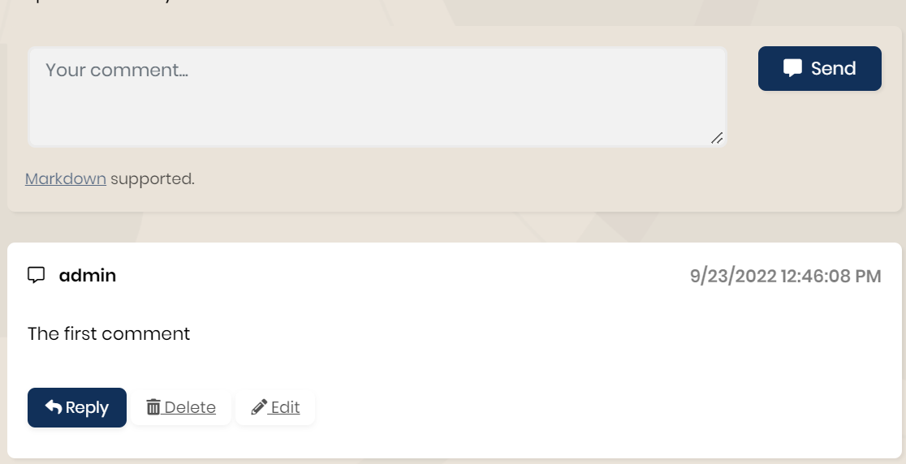

# Add Module to Existing Microservices

> This documentation introduces guidance for adding a module to a microservice for your microservice template project. Eventually, every module has its own documentation and implementation steps. However, some steps can be different for the microservice template. This guide will demonstrate the steps to add a module to an existing microservice.

## Adding a module

After adding a new service to your microservice template by following the [add new microservice guide](../solution-templates/microservice/adding-new-microservices.md), you can add any module to this service in your microservice solution by using the ABP CLI. Use the following command to add the preferred module under the newly added microservice directory:

```powershell
abp add-module CmsKit
```

> To complete the CmsKit module steps, please have a look [here](../modules/cms-kit/index.md).

After completing the module documentation steps you can build your solution and continue with this documentation.

```bash
dotnet build
```

## Using the static proxy

ABP supports [dynamic](../framework/ui/mvc-razor-pages/dynamic-javascript-proxies.md) and [static](../framework/ui/mvc-razor-pages/static-javascript-proxies.md) proxies. Both have advantages and disadvantages. By default, the static proxy is used in the microservice template to remove the coupling between services. The static proxy should be configured manually in the `HttpApiClientModule` of the microservice you have installed your module on as below:

```csharp
public class ProductServiceHttpApiClientModule : AbpModule
{
    public override void ConfigureServices(ServiceConfigurationContext context)
    {
        //Make sure this is `AddStaticHttpClientProxies` 
        context.Services.AddHttpClientProxies(typeof(ProductServiceHttpApiClientModule).Assembly,
            ProductServiceRemoteServiceConsts.RemoteServiceName);

        Configure<AbpVirtualFileSystemOptions>(options =>
        {
            options.FileSets.AddEmbedded<ProductServiceHttpApiClientModule>();
        });
    }
}
```

If the proxy is configured as `AddStaticHttpClientProxies`, you can start creating the static proxies in `ProductService.HttpApi.Client` by using the following command line:

```powershell
abp generate-proxy --type csharp --module cms-kit --url https://localhost:44335
```

> Note: This port is used by `Public-Web`. You can check your port from `launchSetting.json`. The Public Web calls the Public Web Gateway so it has called the related services and has generated proxy files. [For more](../solution-templates/microservice/api-gateways.md) 

> If you have generated a new microservice with the ABP CLI by following the [add new microservice guide](../solution-templates/microservice/adding-new-microservices.md), it should already be configured to use the static proxy.

## Configure Gateways
The microservice template project has two gateway projects.

- **WebGateway** 
- **PublicWebGateway**

The first one is for the admin side and the other one is for the public side. If you would like to use your module on both sides, you should configure `ocelot.json ` in both projects. There is one example below and you need to configure it according to your requirements.

```json
{
    "ServiceKey": "CmsKit",
    "DownstreamPathTemplate": "/api/cms-kit-public/{everything}",
    "DownstreamScheme": "https",
    "DownstreamHostAndPorts": [
        {
            "Host": "localhost",
            "Port": 44361 **This port used in ProductService**
        }
    ],
    "UpstreamPathTemplate": "/api/cms-kit-public/{everything}",
    "UpstreamHttpMethod": [ "Put", "Delete", "Get", "Post" ]
}
```

> You can make different configurations for each method or endpoint for your service and add QoS configurations based on your business requirements. You can check the [ocelot documentation](https://ocelot.readthedocs.io/en/latest/) for more.

## Build Errors Typo

After adding your module completely, you should see some changes on the different pages to the injected dependencies. In `ProductServiceDbContext` the overridden method `OnModelCreating` may be a typo because of the parameter name. For example, the CmsKit comes with the `builder` parameter name but in this class, the parameter name is `modelBuilder`. It's enough to change it with the correct one.

```csharp
[ConnectionStringName(ProductServiceDbProperties.ConnectionStringName)]
public class ProductServiceDbContext : AbpDbContext<ProductServiceDbContext>
{
    protected override void OnModelCreating(ModelBuilder builder)
    {
        //`builder` may be `modelBuilder`
        builder.ConfigureCmsKit();
    }
}
```

## Implementing ICmsKitDbContext

After running the add module command, you should see your migration files under the `Migrations` in the `EntityFrameworkCore` project. If it's empty please make sure whether to implement `IModuleDbContext` or not. Once implemented, the compiler should warn you to import your entities here. Now, you're ready to create your migration properly by using the following command line:

```powershell
dotnet ef migrations add "InitialCmsKit"
```

If you create your migrations properly, you just need to run the project. ABP will handle it automatically.

```csharp
[ConnectionStringName(ProductServiceDbProperties.ConnectionStringName)]
public class ProductServiceDbContext : AbpDbContext<ProductServiceDbContext>, ICmsKitDbContext
{
    public DbSet<Product> Products { get; set; } //It's already defined in the template project.
    public DbSet<Comment> Comments { get; set; }
    public DbSet<CmsUser> User { get; set; }
    //The other implemented entities come from ICmsKitDbContext
}
```

Now you should configure `AbpDbContextOptions` in the `ProductServiceEntityFrameworkCoreModule` under the `EntityFrameworkCore` project.  You should already see the configuration for your service in the `ConfigureServices` method of your project, but you also need to configure it for the new module projects.

```csharp
ProductServiceEntityFrameworkCoreModule
{
    public override void ConfigureServices(ServiceConfigurationContext context)
    {
        //The other congiurations
        Configure<AbpDbContextOptions>(options =>
        {
            //It comes via the microservice template
            options.Configure<ProductServiceDbContext>(c =>
            {
                c.UseSqlServer(b =>
                {
                    b.MigrationsHistoryTable("__ProductService_Migrations");
                });
            });
            //Need to add this configuration for the CmsKit implementation
            options.Configure<CmsKitDbContext>(c =>
            {
                c.UseSqlServer(b =>
                {
                    b.MigrationsHistoryTable("__ProductService_Migrations");
                });
            });
        });
    }
}
```

## Using Component

If you would like to use the defined component in the module on your web page, you should add its related page on NuGet. After adding your package you should add the dependency to `YourModulePublicWebModule` as the following code:

```powershell
abp add-package Volo.CmsKit.Web
```

```csharp
using Volo.CmsKit.Public.Web;

[DependsOn(typeof(CmsKitPublicWebModule))]
public class PublicWebModule : AbpModule
{
    //Configurations
}
```

Now you can use the components on your page. For example it's added into `Index.cshtml` under `PublicWeb\Pages\Products`
```csharp
@using @using Volo.CmsKit.Public.Web.Pages.CmsKit.Shared.Components.Commenting

@await Component.InvokeAsync(typeof(CommentingViewComponent), 
    new {entityType = "quote", entityId = @product.Id})
```

## Configured External User

To submit some components you need to log in to the system. You're already logged in to the system but your module database can be empty, hence you need to check `IdentityService` for this user. 

Firstly you should add the service client to `IdentityServerDataSeeder` under the `IdentityService.HttpApi.Host`

```csharp
//The other configurations
await CreateClientAsync(
    name: "SolutiontName_ProductService",
    scopes: commonScopes.Union(new[]
    {
        "IdentityService"
    }),
    grantTypes: new[] { "client_credentials" },
    secret: "1q2w3e*".Sha256(),
    permissions: new[] { IdentityPermissions.UserLookup.Default } 
);
```

Then change your `appsetting.json` by adding the following code under `ProductService.HttpApi.Host`
```json
"RemoteServices": {
    "AbpIdentity": {
    "BaseUrl": "https://localhost:44388" **IdentityService Port**
    }
},
"IdentityClients": {
    "Default": {
    "GrantType": "client_credentials",
    "ClientId": "SolutiontName_ProductService",
    "ClientSecret": "1q2w3e*",
    "Authority": "https://localhost:44322", **AuthServer Port**
    "Scope": "IdentityService"
    }
}
```

Now add the Nuget package by using the following code and implement it to the module. 

`dotnet add package Volo.Abp.Identity.Pro.HttpApi.Client `

`dotnet add package Volo.Abp.Http.Client.IdentityModel.Web`

Also, add the configuration for `CmsKitCommentOptions`


```csharp
using Volo.CmsKit.Comments;
using Volo.Abp.Identity;
using Volo.Abp.Http.Client.IdentityModel.Web;

[DependsOn(
    typeof(AbpIdentityHttpApiClientModule),
    typeof(AbpHttpClientIdentityModelWebModule)
)]
public class ProductServiceHttpApiHostModule : AbpModule
{
    Configure<CmsKitCommentOptions>(options =>
    {
        options.EntityTypes.Add(new CommentEntityTypeDefinition("quote"));
    });
}
```

Finally, you need to map `CmsKit` to `ProductService` in `SharedHostingModule` under `Shared.Hosting`
```csharp
public override void ConfigureServices(ServiceConfigurationContext context)
{
    Configure<AbpDbConnectionOptions>(options =>
    {
        options.Databases.Configure("ProductService", database =>
        {
            database.MappedConnections.Add("CmsKit");
            database.MappedConnections.Add("ProductService");
        });
    }
}
```

> Note: If you meet the same problem after doing these steps, please remove your volume on Docker and repeat the same steps on `IdentityService` to get the changes. 

If you applied all the steps correctly, you should see the below output after clicking the `Send` button.



