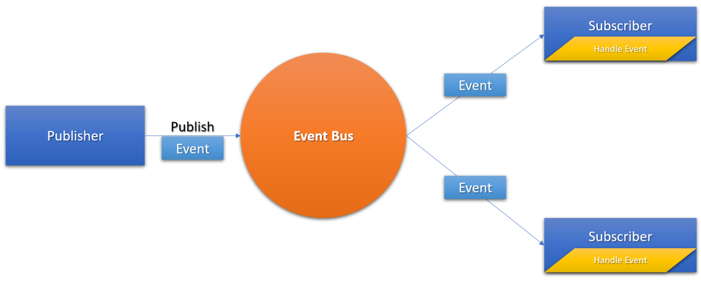
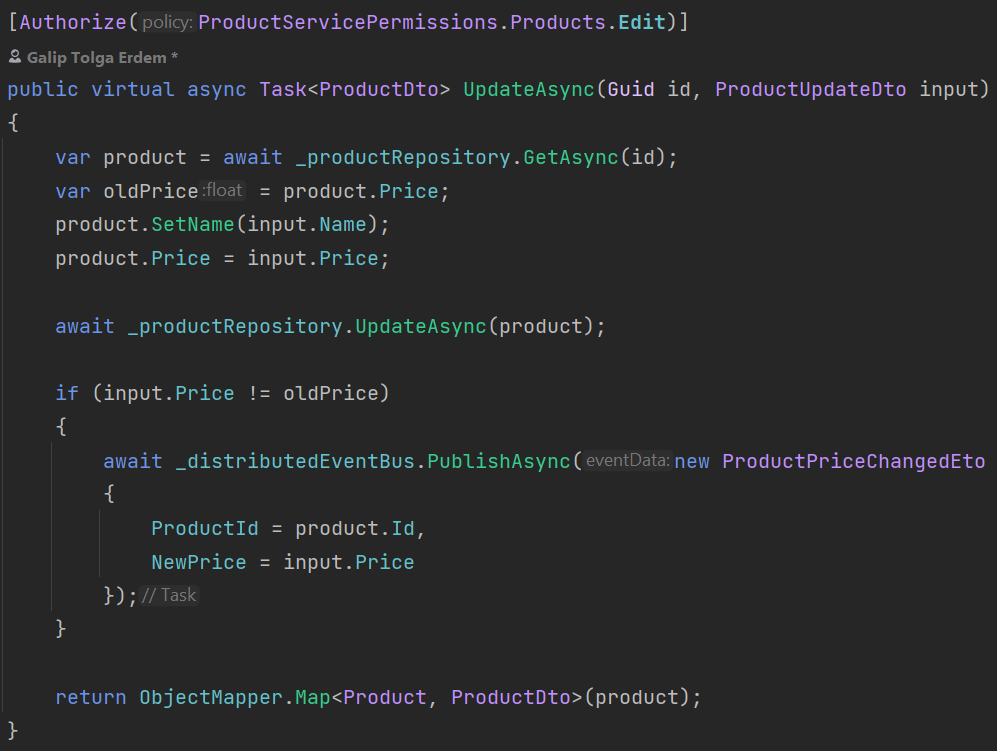
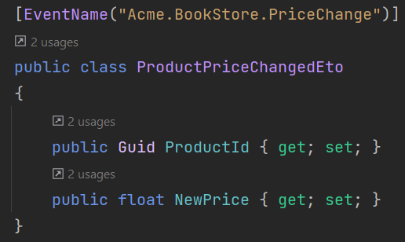
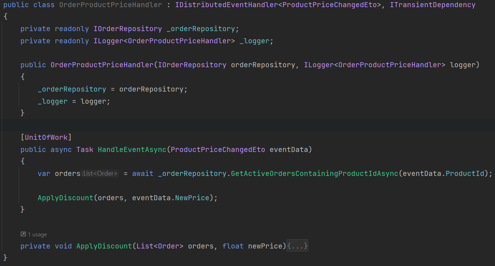

# Asynchronous Communication between Microservices

> This documentation introduces guidance for event based communication between microservices. 

The below sample demonstrates event based communication between **ProductService** and **OrderService**. See [Adding New Microservice Guide](add-microservice.md) to understand how to add a new microservice project (_OrderService_) to your solution.


## Message Broker

Microservices may interact through a central event bus. This is achieved by **publishing event** to event bus and subscribed microservice's handling the events. Apart from communicating with gRPC/HTTP; publisher doesn't need to know about consumer hence reducing the coupling between microservices.





This is also crucial when Data Consistency is important and data duplication between services.


## Sample Scenario

Consider **ProductService** publishes a distributed event whenever product price is **updated**. `ProductAppService` has the following updated method and the [Event Transfer Object](https://docs.abp.io/en/abp/latest/Distributed-Event-Bus#event-transfer-object):





 **OrderService** is one of the subscriber to this event and makes discount if the criteria are met. 

> Note that there can be many other subscriber microservices listening to the same event.


## Updating OrderService Application Contracts

In order to make **ProductPriceChangedEto** available for OrderService application, you need to add the project reference of **ProductService.Application.Contracts** to **OrderService.Application.Contracts**.

**Add csproj reference**:

Open **Acme.BookStore.OrderService.Application.Contracts.csproj** and add the following project reference

```xml
<ProjectReference Include="..\..\..\product\src\Acme.BookStore.ProductService.Application.Contracts\Acme.BookStore.ProductService.Application.Contracts.csproj" />
```

**Add DependsOn attribute**:

Open **OrderServiceApplicationContractsModule.cs** class and add the following module dependency

```csharp
typeof(ProductServiceApplicationContractsModule)
```


## Handling the Distributed Event

Create a handler class that inherits `IDistributedEventHandler<ProductPriceChangedEto>` under **Acme.BookStore.OrderService.BookStore.Application** project.





> Note that you can also handle multiple events in the same handler.


## Auto Events

You can also subscribe to [pre-defined events](../framework/infrastructure/event-bus/distributed/index.md#pre-defined-events). ABP publishes events for **create**, **update** and **delete** operations for an entity once you configure it. Consider you want to update your order whenever a user information is changed.

`IdentityService` using [Identity Module](https://docs.abp.io/en/abp/latest/Modules/Identity#distributed-events) auto publishes `UserEto`. To reference `UserEto`, 

**Add package reference**:

Open **Acme.BookStore.OrderService.Application.csproj** and add the following project reference

```xml
<PackageReference Include="Volo.Abp.Users.Abstractions" Version="4.4.2" />
```

**Create Handler:**

Create a handler class that inherits `IDistributedEventHandler<EntityUpdatedEto<UserEto>>` under **Acme.BookStore.OrderService.BookStore.Application** project as below:

```csharp
public class OrderUserUpdateHandler : IDistributedEventHandler<EntityUpdatedEto<UserEto>>,ITransientDependency
{
    private readonly ILogger<OrderProductPriceHandler> _logger;

    public OrderUserUpdateHandler(ILogger<OrderProductPriceHandler> logger)
    {
        _logger = logger;
    }

    [UnitOfWork]
    public async Task HandleEventAsync(EntityUpdatedEto<UserEto> eventData)
    {
        _logger.LogInformation($"\n{JsonConvert.SerializeObject(eventData.Entity)}");
    }
}
```

> Note: You can also use pre-defined ETO classes like `IdentityUserCreatedEto`. Check the [Pre-Defined Events documentations](../framework/infrastructure/event-bus/distributed/index.md#pre-defined-events) for more.


## See Also

- [Distributed Event Bus](../framework/infrastructure/event-bus/distributed/index.md)
- [Synchronous Communication](synchronous-interservice-communication.md)