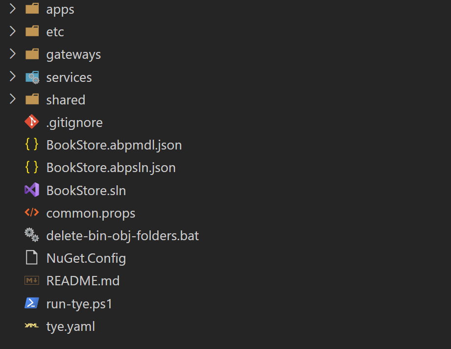

# Change Microservice project to use MongoDB Provider

This guide explains how to change Microservice project to use MongoDB as the database provider.

## Create a new Microservice project

Use the ABP Suite to create a new Microservice project, in this guide we use `BookStore` as project name.

You will get the solution as shown below:



### Replace EF Core references with MongoDB

You need to replace all EF Core references with MongoDB and update module dependencies.

Example:

* Remove `Volo.Abp.EntityFrameworkCore.SqlServer` Nuget package reference.
* Remove `Microsoft.EntityFrameworkCore.Tools` Nuget package reference
* Remove `AbpEntityFrameworkCoreSqlServerModule` depend.
* Replace `Volo.Abp.PermissionManagement.EntityFrameworkCore` with `Volo.Abp.PermissionManagement.MongoDB`.
* Update `AbpPermissionManagementEntityFrameworkCoreModule` to `AbpPermissionManagementMongoDbModule`.

Please complete it in all projects.

### Update Service project

Here we use `BookStore.ProductService` project as an example:

* Remove `ProductServiceDbContextFactory` class.
* Remove `Migrations` folder.
* Remove `ProductServiceDbContextModelCreatingExtensions` class
* Replace `context.Services.AddAbpDbContext` with `context.Services.AddMongoDbContext`.
* Update `ProductServiceDbContext` class to the following:

    ```csharp
    [ConnectionStringName(ProductServiceDbProperties.ConnectionStringName)]
    public class ProductServiceDbContext : AbpMongoDbContext
    {
        public IMongoCollection<Product> Products => Collection<Product>();

        protected override void CreateModel(IMongoModelBuilder modelBuilder)
        {
            modelBuilder.Entity<Product>(b =>
        {
            b.CollectionName = ProductServiceDbProperties.DbTablePrefix + "Products";
        });
        }
    }
    ```

* Update `ProductServiceEntityFrameworkCoreModule` class to the following:

    ```csharp
    [DependsOn(
        typeof(AbpMongoDbModule),
        typeof(ProductServiceDomainModule)
    )]
    public class ProductServiceMongoDbModule : AbpModule
    {
        public override void PreConfigureServices(ServiceConfigurationContext context)
        {
            ProductServiceEfCoreEntityExtensionMappings.Configure();
        }

        public override void ConfigureServices(ServiceConfigurationContext context)
        {

            context.Services.AddMongoDbContext<ProductServiceDbContext>(options =>
            {
                options.AddDefaultRepositories(includeAllEntities: true);
                options.AddRepository<Product, MongoDbProductRepository>();
            });
        }
    }
    ```

* Update `EfCoreProductRepository` class to the following:

    ```csharp
    public class MongoDbProductRepository : MongoDbRepository<ProductServiceDbContext, Product, Guid>, IProductRepository
    {
        public MongoDbProductRepository(IMongoDbContextProvider<ProductServiceDbContext> dbContextProvider)
            : base(dbContextProvider)
        {

        }

        public async Task<List<Product>> GetListAsync(
            string? filterText = null,
            string? name = null,
            float? priceMin = null,
            float? priceMax = null,
            string? sorting = null,
            int maxResultCount = int.MaxValue,
            int skipCount = 0,
            CancellationToken cancellationToken = default)
        {
            var query = ApplyFilter(await GetMongoQueryableAsync(cancellationToken), filterText, name, priceMin, priceMax);
            query = query.OrderBy(string.IsNullOrWhiteSpace(sorting) ? ProductConsts.GetDefaultSorting(false) : sorting);
            return await query.As<IMongoQueryable<Product>>().PageBy<Product, IMongoQueryable<Product>>(skipCount, maxResultCount).ToListAsync(cancellationToken);
        }

        public async Task<long> GetCountAsync(
            string? filterText = null,
            string? name = null,
            float? priceMin = null,
            float? priceMax = null,
            CancellationToken cancellationToken = default)
        {
            var query = ApplyFilter(await GetMongoQueryableAsync(cancellationToken), filterText, name, priceMin, priceMax);
            return await query.As<IMongoQueryable<Product>>().LongCountAsync(GetCancellationToken(cancellationToken));
        }

        protected virtual IQueryable<Product> ApplyFilter(
            IQueryable<Product> query,
            string filterText,
            string? name = null,
            float? priceMin = null,
            float? priceMax = null)
        {
            return query
                    .WhereIf(!string.IsNullOrWhiteSpace(filterText), e => e.Name.Contains(filterText))
                    .WhereIf(!string.IsNullOrWhiteSpace(name), e => e.Name.Contains(name))
                    .WhereIf(priceMin.HasValue, e => e.Price >= priceMin.Value)
                    .WhereIf(priceMax.HasValue, e => e.Price <= priceMax.Value);
        }
    }
    ```

Please complete it in all service projects.

> For other services you may need to change the DbContext interface name. eg: `IPermissionManagementDbContext` to `IPermissionManagementMongoDbContext`.
> You also need to change the dependent module name. eg: `AbpPermissionManagementEntityFrameworkCoreModule` to `AbpPermissionManagementMongoDbModule`.

### Unit Tests

You can refer to [MongoDB.Tests](https://github.com/abpframework/abp/tree/dev/templates/app/aspnet-core/test/MyCompanyName.MyProjectName.MongoDB.Tests) project to replace `EntityFrameworkCore.Tests` project with `MongoDB.Tests` project.

* Define CollectionFixture in each test project. See this [PR](https://github.com/abpframework/abp/pull/3982).
* Add `CollectionAttribute` to each unit test class.

### BookStoreDbMigrationService

Update `BookStoreDbMigrationService` class to the following:

```csharp
public class BookStoreDbMigrationService : ITransientDependency
{
    private readonly ILogger<BookStoreDbMigrationService> _logger;
    private readonly ITenantRepository _tenantRepository;
    private readonly IDataSeeder _dataSeeder;
    private readonly ICurrentTenant _currentTenant;
    private readonly IUnitOfWorkManager _unitOfWorkManager;
    private readonly IServiceProvider _serviceProvider;

    public BookStoreDbMigrationService(
        ILogger<BookStoreDbMigrationService> logger,
        ITenantRepository tenantRepository,
        IDataSeeder dataSeeder,
        ICurrentTenant currentTenant,
        IUnitOfWorkManager unitOfWorkManager,
        IServiceProvider serviceProvider)
    {
        _logger = logger;
        _tenantRepository = tenantRepository;
        _dataSeeder = dataSeeder;
        _currentTenant = currentTenant;
        _unitOfWorkManager = unitOfWorkManager;
        _serviceProvider = serviceProvider;
    }

    public async Task MigrateAsync(CancellationToken cancellationToken)
    {
        await MigrateHostAsync(cancellationToken);
        await MigrateTenantsAsync(cancellationToken);
        _logger.LogInformation("Migration completed!");
    }

    private async Task MigrateHostAsync(CancellationToken cancellationToken)
    {
        _logger.LogInformation("Migrating Host side...");
        await MigrateAllDatabasesAsync(null, cancellationToken);
        await SeedDataAsync();
    }

    private async Task MigrateTenantsAsync(CancellationToken cancellationToken)
    {
        _logger.LogInformation("Migrating tenants...");

        var tenants =
            await _tenantRepository.GetListAsync(includeDetails: true, cancellationToken: cancellationToken);
        var migratedDatabaseSchemas = new HashSet<string>();
        foreach (var tenant in tenants)
        {
            using (_currentTenant.Change(tenant.Id))
            {
                // Database schema migration
                var connectionString = tenant.FindDefaultConnectionString();
                if (!connectionString.IsNullOrWhiteSpace() && //tenant has a separate database
                    !migratedDatabaseSchemas.Contains(connectionString)) //the database was not migrated yet
                {
                    _logger.LogInformation($"Migrating tenant database: {tenant.Name} ({tenant.Id})");
                    await MigrateAllDatabasesAsync(tenant.Id, cancellationToken);
                    migratedDatabaseSchemas.AddIfNotContains(connectionString);
                }

                //Seed data
                _logger.LogInformation($"Seeding tenant data: {tenant.Name} ({tenant.Id})");
                await SeedDataAsync();
            }
        }
    }

    private async Task MigrateAllDatabasesAsync(
        Guid? tenantId,
        CancellationToken cancellationToken)
    {
        using (var uow = _unitOfWorkManager.Begin(requiresNew: true, isTransactional: false))
        {
            var dbContexts = _serviceProvider.GetServices<IAbpMongoDbContext>();

            var connectionStringResolver = _serviceProvider.GetRequiredService<IConnectionStringResolver>();

            if (tenantId != null)
            {
                dbContexts = dbContexts.Where(x => !x.GetType().IsDefined(typeof(IgnoreMultiTenancyAttribute)));
            }

            foreach (var dbContext in dbContexts)
            {
                var connectionString =
                    await connectionStringResolver.ResolveAsync(
                        ConnectionStringNameAttribute.GetConnStringName(dbContext.GetType()));
                if (connectionString.IsNullOrWhiteSpace())
                {
                    continue;
                }
                var mongoUrl = new MongoUrl(connectionString);
                var databaseName = mongoUrl.DatabaseName;
                var client = new MongoClient(mongoUrl);

                if (databaseName.IsNullOrWhiteSpace())
                {
                    databaseName = ConnectionStringNameAttribute.GetConnStringName(dbContext.GetType());
                }

                (dbContext as AbpMongoDbContext)?.InitializeCollections(client.GetDatabase(databaseName));
            }

            await uow.CompleteAsync(cancellationToken);
        }

        _logger.LogInformation(
            $"All databases have been successfully migrated ({(tenantId.HasValue ? $"tenantId: {tenantId}" : "HOST")}).");
    }

    private async Task SeedDataAsync()
    {
        await _dataSeeder.SeedAsync(
            new DataSeedContext(_currentTenant.Id)
                .WithProperty(IdentityDataSeedContributor.AdminEmailPropertyName,
                    IdentityServiceDbProperties.DefaultAdminEmailAddress)
                .WithProperty(IdentityDataSeedContributor.AdminPasswordPropertyName,
                    IdentityServiceDbProperties.DefaultAdminPassword)
        );
    }
}
```

### DatabaseMigrationEventHandlerBase

Update `DatabaseMigrationEventHandlerBase` class to the following:

```csharp
public abstract class DatabaseMigrationEventHandlerBase<TDbContext> :
        ITransientDependency
        where TDbContext : AbpMongoDbContext, IAbpMongoDbContext
{
    protected const string TryCountPropertyName = "TryCount";
    protected const int MaxEventTryCount = 3;

    protected ICurrentTenant CurrentTenant { get; }
    protected IUnitOfWorkManager UnitOfWorkManager { get; }
    protected ITenantStore TenantStore { get; }
    protected ITenantRepository TenantRepository { get; }
    protected IDistributedEventBus DistributedEventBus { get; }
    protected ILogger<DatabaseMigrationEventHandlerBase<TDbContext>> Logger { get; set; }

    protected IServiceProvider ServiceProvider { get; }
    protected string DatabaseName { get; }

    protected DatabaseMigrationEventHandlerBase(
        ICurrentTenant currentTenant,
        IUnitOfWorkManager unitOfWorkManager,
        ITenantStore tenantStore,
        ITenantRepository tenantRepository,
        IDistributedEventBus distributedEventBus,
        string databaseName, IServiceProvider serviceProvider)
    {
        CurrentTenant = currentTenant;
        UnitOfWorkManager = unitOfWorkManager;
        TenantStore = tenantStore;
        DatabaseName = databaseName;
        ServiceProvider = serviceProvider;
        DistributedEventBus = distributedEventBus;
        TenantRepository = tenantRepository;

        Logger = NullLogger<DatabaseMigrationEventHandlerBase<TDbContext>>.Instance;
    }

    /// <summary>
    /// Apply pending EF Core schema migrations to the database.
    /// Returns true if any migration has applied.
    /// </summary>
    protected virtual async Task<bool> MigrateDatabaseSchemaAsync(Guid? tenantId)
    {
        var result = false;

        using (CurrentTenant.Change(tenantId))
        {
            using (var uow = UnitOfWorkManager.Begin(requiresNew: true, isTransactional: false))
            {
                async Task<bool> MigrateDatabaseSchemaWithDbContextAsync()
                {
                    var dbContexts = ServiceProvider.GetServices<IAbpMongoDbContext>();
                    var connectionStringResolver = ServiceProvider.GetRequiredService<IConnectionStringResolver>();

                    if (ServiceProvider.GetRequiredService<ICurrentTenant>().IsAvailable)
                    {
                        dbContexts = dbContexts.Where(x =>
                            !x.GetType().IsDefined(typeof(IgnoreMultiTenancyAttribute)));
                    }

                    foreach (var dbContext in dbContexts)
                    {
                        var connectionString =
                            await connectionStringResolver.ResolveAsync(
                                ConnectionStringNameAttribute.GetConnStringName(dbContext.GetType()));
                        if (connectionString.IsNullOrWhiteSpace())
                        {
                            continue;
                        }
                        var mongoUrl = new MongoUrl(connectionString);
                        var databaseName = mongoUrl.DatabaseName;
                        var client = new MongoClient(mongoUrl);

                        if (databaseName.IsNullOrWhiteSpace())
                        {
                            databaseName = ConnectionStringNameAttribute.GetConnStringName(dbContext.GetType());
                        }

                        (dbContext as AbpMongoDbContext)?.InitializeCollections(client.GetDatabase(databaseName));
                    }

                    return true;
                }

                if (tenantId == null)
                {
                    //Migrating the host database
                    result = await MigrateDatabaseSchemaWithDbContextAsync();
                }
                else
                {
                    var tenantConfiguration = await TenantStore.FindAsync(tenantId.Value);
                    if (!tenantConfiguration.ConnectionStrings.Default.IsNullOrWhiteSpace() ||
                        !tenantConfiguration.ConnectionStrings.GetOrDefault(DatabaseName).IsNullOrWhiteSpace())
                    {
                        //Migrating the tenant database (only if tenant has a separate database)
                        result = await MigrateDatabaseSchemaWithDbContextAsync();
                    }
                }

                await uow.CompleteAsync();
            }
        }

        return result;
    }

    protected virtual async Task HandleErrorOnApplyDatabaseMigrationAsync(
        ApplyDatabaseMigrationsEto eventData,
        Exception exception)
    {
        var tryCount = IncrementEventTryCount(eventData);
        if (tryCount <= MaxEventTryCount)
        {
            Logger.LogWarning(
                $"Could not apply database migrations. Re-queueing the operation. TenantId = {eventData.TenantId}, Database Name = {eventData.DatabaseName}.");
            Logger.LogException(exception, LogLevel.Warning);

            await Task.Delay(RandomHelper.GetRandom(5000, 15000));
            await DistributedEventBus.PublishAsync(eventData);
        }
        else
        {
            Logger.LogError(
                $"Could not apply database migrations. Canceling the operation. TenantId = {eventData.TenantId}, DatabaseName = {eventData.DatabaseName}.");
            Logger.LogException(exception);
        }
    }

    protected virtual async Task HandleErrorTenantCreatedAsync(
        TenantCreatedEto eventData,
        Exception exception)
    {
        var tryCount = IncrementEventTryCount(eventData);
        if (tryCount <= MaxEventTryCount)
        {
            Logger.LogWarning(
                $"Could not perform tenant created event. Re-queueing the operation. TenantId = {eventData.Id}, TenantName = {eventData.Name}.");
            Logger.LogException(exception, LogLevel.Warning);

            await Task.Delay(RandomHelper.GetRandom(5000, 15000));
            await DistributedEventBus.PublishAsync(eventData);
        }
        else
        {
            Logger.LogError(
                $"Could not perform tenant created event. Canceling the operation. TenantId = {eventData.Id}, TenantName = {eventData.Name}.");
            Logger.LogException(exception);
        }
    }

    protected virtual async Task HandleErrorTenantConnectionStringUpdatedAsync(
        TenantConnectionStringUpdatedEto eventData,
        Exception exception)
    {
        var tryCount = IncrementEventTryCount(eventData);
        if (tryCount <= MaxEventTryCount)
        {
            Logger.LogWarning(
                $"Could not perform tenant connection string updated event. Re-queueing the operation. TenantId = {eventData.Id}, TenantName = {eventData.Name}.");
            Logger.LogException(exception, LogLevel.Warning);

            await Task.Delay(RandomHelper.GetRandom(5000, 15000));
            await DistributedEventBus.PublishAsync(eventData);
        }
        else
        {
            Logger.LogError(
                $"Could not perform tenant connection string updated event. Canceling the operation. TenantId = {eventData.Id}, TenantName = {eventData.Name}.");
            Logger.LogException(exception);
        }
    }

    protected virtual async Task QueueTenantMigrationsAsync()
    {
        var tenants = await TenantRepository.GetListWithSeparateConnectionStringAsync();
        foreach (var tenant in tenants)
        {
            await DistributedEventBus.PublishAsync(
                new ApplyDatabaseMigrationsEto
                {
                    DatabaseName = DatabaseName,
                    TenantId = tenant.Id
                }
            );
        }
    }

    private static int GetEventTryCount(EtoBase eventData)
    {
        var tryCountAsString = eventData.Properties.GetOrDefault(TryCountPropertyName);
        if (tryCountAsString.IsNullOrEmpty())
        {
            return 0;
        }

        return int.Parse(tryCountAsString);
    }

    private static void SetEventTryCount(EtoBase eventData, int count)
    {
        eventData.Properties[TryCountPropertyName] = count.ToString();
    }

    private static int IncrementEventTryCount(EtoBase eventData)
    {
        var count = GetEventTryCount(eventData) + 1;
        SetEventTryCount(eventData, count);
        return count;
    }
}
```

You also need to update the constructors of all derived classes of `DatabaseMigrationEventHandlerBase`.

### PendingEfCoreMigrationsChecker

Update `PendingEfCoreMigrationsChecker` class to the following:

```csharp
public abstract class PendingMongoDbMigrationsChecker<TDbContext> : PendingMigrationsCheckerBase where TDbContext : AbpMongoDbContext
{
    protected IUnitOfWorkManager UnitOfWorkManager { get; }
    protected IServiceProvider ServiceProvider { get; }
    protected ICurrentTenant CurrentTenant { get; }
    protected IDistributedEventBus DistributedEventBus { get; }
    protected IAbpDistributedLock DistributedLockProvider { get; }
    protected string DatabaseName { get; }
    protected IDataSeeder DataSeeder { get; }
    
    protected PendingMongoDbMigrationsChecker(
        ILoggerFactory loggerFactory,
        IUnitOfWorkManager unitOfWorkManager,
        IServiceProvider serviceProvider,
        ICurrentTenant currentTenant,
        IDistributedEventBus distributedEventBus,
        IAbpDistributedLock abpDistributedLock,
        string databaseName, 
        IDataSeeder dataSeeder) : base(loggerFactory)
    {
        UnitOfWorkManager = unitOfWorkManager;
        ServiceProvider = serviceProvider;
        CurrentTenant = currentTenant;
        DistributedEventBus = distributedEventBus;
        DistributedLockProvider = abpDistributedLock;
        DatabaseName = databaseName;
        DataSeeder = dataSeeder;
    }
    
    public virtual async Task CheckAndApplyDatabaseMigrationsAsync()
    {
        await TryAsync(async () =>
        {
            using (CurrentTenant.Change(null))
            {
                // Create database tables if needed
                using (var uow = UnitOfWorkManager.Begin(requiresNew: true, isTransactional: false))
                {
                    await MigrateDatabaseSchemaAsync();

                    await DataSeeder.SeedAsync();

                    await uow.CompleteAsync();
                }
            }
        });
    }
    /// <summary>
    /// Apply scheme update for MongoDB Database.
    /// </summary>
    protected virtual async Task<bool> MigrateDatabaseSchemaAsync()
    {
        var result = false;
        await using (var handle = await DistributedLockProvider.TryAcquireAsync("Migration_" + DatabaseName))
        {
            using (var uow = UnitOfWorkManager.Begin(requiresNew: true, isTransactional: false))
            {
                Log.Information($"Lock is acquired for db migration and seeding on database named: {DatabaseName}...");

                if (handle is null)
                {
                    Log.Information($"Handle is null because of the locking for : {DatabaseName}");
                    return false;
                }

                async Task<bool> MigrateDatabaseSchemaWithDbContextAsync()
                {
                    var dbContexts = ServiceProvider.GetServices<IAbpMongoDbContext>();
                    var connectionStringResolver = ServiceProvider.GetRequiredService<IConnectionStringResolver>();

                    foreach (var dbContext in dbContexts)
                    {
                        var connectionString =
                            await connectionStringResolver.ResolveAsync(
                                ConnectionStringNameAttribute.GetConnStringName(dbContext.GetType()));
                        if (connectionString.IsNullOrWhiteSpace())
                        {
                            continue;
                        }

                        var mongoUrl = new MongoUrl(connectionString);
                        var databaseName = mongoUrl.DatabaseName;
                        var client = new MongoClient(mongoUrl);

                        if (databaseName.IsNullOrWhiteSpace())
                        {
                            databaseName = ConnectionStringNameAttribute.GetConnStringName(dbContext.GetType());
                        }

                        (dbContext as AbpMongoDbContext)?.InitializeCollections(client.GetDatabase(databaseName));
                    }

                    return true;
                }

                //Migrating the host database
                result = await MigrateDatabaseSchemaWithDbContextAsync();

                await uow.CompleteAsync();
            }

            return result;
        }
    }
}
```

### Change the Connection Strings

MongoDB connection strings are different than SQL Server connection strings. So, check all appsettings.json files in your solution and replace the connection strings inside them.

### Run the project

Now we are basically done, you can run the application according to the [documentation](../solution-templates/microservice).

> We did not change the project name and folder in the guide, you can change it if you need, eg: `BookStore.ProductService.EntityFrameworkCore` to `BookStore.ProductService.MongoDB`.
