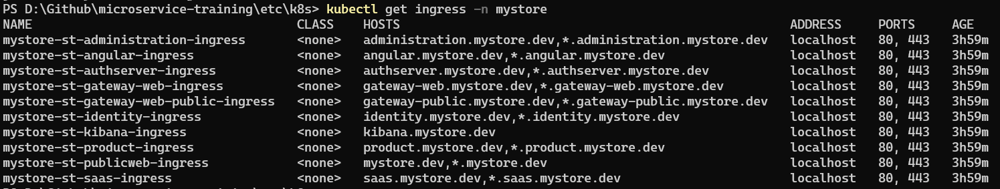

# Multi-tenant Domain Resolving in Microservice Solution

> This documentation introduces guidance for adding multi-tenant domain resolver to your microservice solution. This guide will use **mystore** as the main project name and you can simply replace it with your own project name to adept your solution. This guide will be using existing helm charts for deploying this solution on local kubernetes cluster with mystore domain name.

## Configuring TenantResolver

`DomainTenantResolver` is added via `AbpTenantResolveOptions`. Since all the applications, gateways and the microservices should resolve the subdomain as tenant, it can be configured it in `Shared.Hosting.AspNetCore` module class to make it available for all of them instead of repeating the same configuration.

Navigate to the `MyStoreSharedHostingAspNetCoreModule` and add the following configuration to **ConfigureServices** method:

```powershell
var configuration = context.Services.GetConfiguration();
        
Configure<AbpTenantResolveOptions>(options =>
{
    options.AddDomainTenantResolver(configuration["TenantDomain"]);
});
```

This configuration will allow to add a overridable **TenantDomain** key to the all applications, gateways and microservices' appsettings which will resolve the tenant based on the configuration.

> If the `AbpTenantResolveOptions` namespace can not be found, add the `Volo.Abp.AspNetCore.MultiTenancy` package to your project. You can simply use `abp add-package Volo.Abp.AspNetCore.MultiTenancy` under the **MyStore.SharedHosting.AspNetCore** project.

Now add this configuration to all the application, gateway and microservice appsettings:

```json
"TenantDomain": "https://{0}.authserver.mystore.dev" // in AuthServer appsettings.json
```

```json
"TenantDomain": "https://{0}.mystore.dev" // in PublicWeb appsettings.json
```

```json
"TenantDomain": "https://{0}.gateway-public-web.mystore.dev" // in PublicWebGateway appsettings.json
```

```json
"TenantDomain": "https://{0}.gateway-web.mystore.dev" // in WebGateway appsettings.json
```

```json
"TenantDomain": "https://{0}.administration.mystore.dev" // in AdministrationService appsettings.json
```

```json
"TenantDomain": "https://{0}.identity.mystore.dev" // in IdentityService appsettings.json
```

```json
"TenantDomain": "https://{0}.saas.mystore.dev" // in SaasService appsettings.json
```

```json
"TenantDomain": "https://{0}.product.mystore.dev" // in ProductService appsettings.json
```

This configuration will allow subdomain tenant resolving. Ex, if you have a tenant named **Volosoft**, the applications will resolve this tenant when you navigate to `https://volosoft.authserver.mystore.dev` (or any other app/gateway/microservice).

> If you have more microservices, you need to add this configurations to your other microservice's appsettings.json aswell.

**For angular application**, you don't need to add anything since we will be overriding the angular environment via kubernetes values file.

## Configuring AuthServer

When the tenant try to login from an application (Ex `https://volosoft.angular.mystore.dev`) it will be redirected to AuthServer (`https://volosoft.authserver.mystore.dev`) and you will be seeing a **HTTP 400 error** related to `invalid redirect_uri`. If you check the authserver application logs (under Logs/logs.txt file or console logs), you will notice that the `https://volosoft.angular.mystore.dev` is not a valid redirect_uri since it is not been seeded by the OpenIddictDataSeeder. Only the **host** applications, gateways and microservice URLs are seeded (like `https://angular.mystore.dev`).
Instead of trying to manually add all the tenant domains, you can use **enable AbpOpenIddict wildcard domain support**. That will enable the subdomain support, saving you from manually entering all the *redirect* and *post_logout redirect* URIs.

To enable it, navigate to **MyStoreAuthServerModule** and update the `PreConfigureServices` method:

```csharp
var hostingEnvironment = context.Services.GetHostingEnvironment();        
var configuration = context.Services.GetConfiguration();

PreConfigure<AbpOpenIddictWildcardDomainOptions>(options =>
{
    options.EnableWildcardDomainSupport = true;
    options.WildcardDomainsFormat.Add(configuration["WildCardDomains:AuthServer"]);
    options.WildcardDomainsFormat.Add(configuration["WildCardDomains:Angular"]);
    options.WildcardDomainsFormat.Add(configuration["WildCardDomains:PublicWeb"]);
    options.WildcardDomainsFormat.Add(configuration["WildCardDomains:WebGateway"]);
    options.WildcardDomainsFormat.Add(configuration["WildCardDomains:PublicWebGateway"]);
    options.WildcardDomainsFormat.Add(configuration["WildCardDomains:IdentityService"]);
    options.WildcardDomainsFormat.Add(configuration["WildCardDomains:AdministrationService"]);
    options.WildcardDomainsFormat.Add(configuration["WildCardDomains:SaasService"]);
    options.WildcardDomainsFormat.Add(configuration["WildCardDomains:ProductService"]);
});
```

This configuration will automatically handle the *redirect* and *post_logout redirect* URIs.

Add the configurations to the `appsettings.json` file of the AuthServer project:

```json
"WildCardDomains": {
    "AuthServer": "https://{0}.authserver.mystore.dev",
    "Angular": "https://{0}.angular.mystore.dev",
    "PublicWeb": "https://{0}.mystore.dev",
    "WebGateway": "https://{0}.gateway-web.mystore.dev",
    "PublicWebGateway": "https://{0}.gateway-public-web.mystore.dev",
    "IdentityService": "https://{0}.identity.mystore.dev",
    "AdministrationService": "https://{0}.administration.mystore.dev",
    "SaasService": "https://{0}.saas.mystore.dev",
    "ProductService": "https://{0}.product.mystore.dev"
  },
```

If you have more microservices or applications, you need to add them to handle the *redirect* and *post_logout redirect* URIs of them aswell.

## Configuring PublicWeb/Web/Blazor Server 

The server-side rendering applications like public-web, web and blazor-server apps are using hybrid flow authorization flow. Which contains additional configuration on the module when hosted on containerized environment:

```csharp
if (Convert.ToBoolean(configuration["AuthServer:IsOnK8s"]))
{
    context.Services.Configure<OpenIdConnectOptions>("oidc", options =>
    {
        options.MetadataAddress = configuration["AuthServer:MetaAddress"]!.EnsureEndsWith('/') +
                                  ".well-known/openid-configuration";

        var previousOnRedirectToIdentityProvider = options.Events.OnRedirectToIdentityProvider;
        options.Events.OnRedirectToIdentityProvider = async ctx =>
        {
            // Intercept the redirection so the browser navigates to the right URL in your host
            ctx.ProtocolMessage.IssuerAddress = configuration["AuthServer:Authority"]!.EnsureEndsWith('/') + "connect/authorize";

            if (previousOnRedirectToIdentityProvider != null)
            {
                await previousOnRedirectToIdentityProvider(ctx);
            }
        };
        
        var previousOnRedirectToIdentityProviderForSignOut = options.Events.OnRedirectToIdentityProviderForSignOut;
        options.Events.OnRedirectToIdentityProviderForSignOut = async ctx =>
        {
            // Intercept the redirection for signout so the browser navigates to the right URL in your host
            ctx.ProtocolMessage.IssuerAddress = configuration["AuthServer:Authority"]!.EnsureEndsWith('/') + "connect/logout";

            if (previousOnRedirectToIdentityProviderForSignOut != null)
            {
                await previousOnRedirectToIdentityProviderForSignOut(ctx);
            }
        };
    });
}
```

This configuration contains the *real DNS* of the AuthServer (configuration["AuthServer:Authority"]) and the *.well-known endpoint* (configuration["AuthServer:MetaAddress"]) used to obtain the tokens fromthe internal network. The configuration intercepts the login and logout requests from the browser to redirect to real DNS. When the tenant try to login from the one of these application (Ex `https://volosoft.mystore.dev`) it should be redirected to **tenant's AuthServer** (`https://volosoft.authserver.mystore.dev`) instead of the host's AuthServer (`https://authserver.mystore.dev`).

You need to update this configuration as below to support this functionality:

```csharp
if (Convert.ToBoolean(configuration["AuthServer:IsOnK8s"]))
{
    context.Services.Configure<OpenIdConnectOptions>("oidc", options =>
    {
        options.MetadataAddress = configuration["AuthServer:MetaAddress"]!.EnsureEndsWith('/') +
                                  ".well-known/openid-configuration";

        var previousOnRedirectToIdentityProvider = options.Events.OnRedirectToIdentityProvider;
        options.Events.OnRedirectToIdentityProvider = async ctx =>
        {
            // Intercept the redirection so the browser navigates to the right URL in your host
            ctx.ProtocolMessage.IssuerAddress = configuration["AuthServer:Authority"]!.EnsureEndsWith('/') + "connect/authorize";

            // Resolve the current tenant
            var currentTenant = ctx.HttpContext.RequestServices.GetRequiredService<ICurrentTenant>();
            var tenantDomain = configuration["TenantDomain"];

            // Check if the current tenant is available and the solution is using domain tenant resolver
            if (currentTenant.IsAvailable && !string.IsNullOrEmpty(tenantDomain))
            {
                // Replace "{0}"" string for the tenant authserver. The authority value should be replaced from
                // https://{0}.authserver.mystore.dev to https://tenantName.authserver.mystore.dev
                ctx.ProtocolMessage.IssuerAddress = ctx.ProtocolMessage.IssuerAddress.Replace("{0}", $"{currentTenant.Name}");
            }
            else
            {
                // Keep using the host authserver if there is no tenant
                ctx.ProtocolMessage.IssuerAddress = ctx.ProtocolMessage.IssuerAddress.Replace("{0}.", string.Empty);
            }

            if (previousOnRedirectToIdentityProvider != null)
            {
                await previousOnRedirectToIdentityProvider(ctx);
            }
        };
        
        var previousOnRedirectToIdentityProviderForSignOut = options.Events.OnRedirectToIdentityProviderForSignOut;
        // Similar configuration for Logout request
        options.Events.OnRedirectToIdentityProviderForSignOut = async ctx =>
        {
            // Intercept the redirection for signout so the browser navigates to the right URL in your host
            ctx.ProtocolMessage.IssuerAddress = configuration["AuthServer:Authority"]!.EnsureEndsWith('/') + "connect/logout";

            var currentTenant = ctx.HttpContext.RequestServices.GetRequiredService<ICurrentTenant>();
            var tenantDomain = configuration["TenantDomain"];
            if (currentTenant.IsAvailable && !string.IsNullOrEmpty(tenantDomain))
            {
                ctx.ProtocolMessage.IssuerAddress = ctx.ProtocolMessage.IssuerAddress.Replace("{0}", $"{currentTenant.Name}");
            }
            else
            {
                ctx.ProtocolMessage.IssuerAddress = ctx.ProtocolMessage.IssuerAddress.Replace("{0}.", string.Empty);
            }

            if (previousOnRedirectToIdentityProviderForSignOut != null)
            {
                await previousOnRedirectToIdentityProviderForSignOut(ctx);
            }
        };
    });
}
```

Now you can override the `[AuthServer:Authority]` configuration of your public-web, mvc or blazor-server applications by using `https://{0}.authserver.mystore.dev`.

## Configuring the Microservices for SwaggerUI

The SwaggerUI for the gateways and the microservices are also being configured to resolve the domain as below. Hence, when navigated to the tenant's gateway (or any microservice) SwaggerUI, the Authorization disovery endpoint should be pointing to the tenant's AuthServer instead of the Host's.

Configure the `MetadataAddress` of the SwaggerUI AuthServer configuration to use `https://{0}.authserver.mystore.dev` so the discovery endpoint can be resolved correctly.

> This feature is available after ABP v7.4.3

## Configuring Helm

This configuration will be related to **local Kubernetes cluster deployment** to help you understand how to override the related domain values for the production environment. Some of the steps are optional since there are other ways to handle the *problem*.

### Configuring the Host File

**Problem:** I created a tenant with the name **Volosoft** but when I navigate to tenant application (`https://volosoft.angular.mystore.dev`) the DNS is not resolved and I get the error **Can't reach this page** `DNS_PROBE_FINISHED_NXDOMAIN`.

**Solution:** You need to map the connection between the local kubernetes IP address and the domain name server. Simply update your `Windows/system32/drivers/etc/hosts` (or  `/etc/hosts` in  linux and macos) file assuming you have will use a tenant with name **Volosoft**:

```txt
127.0.0.1 volosoft.angular.mystore.dev
127.0.0.1 volosoft.mystore.dev
127.0.0.1 volosoft.authserver.mystore.dev
127.0.0.1 volosoft.identity.mystore.dev
127.0.0.1 volosoft.administration.mystore.dev
127.0.0.1 volosoft.product.mystore.dev
127.0.0.1 volosoft.saas.mystore.dev
127.0.0.1 volosoft.gateway-web.mystore.dev
127.0.0.1 volosoft.gateway-public.mystore.dev
```

### Configuring SSL Certificate

**Problem:** The default self-signed certificate generation powershell script in the template is only for the host application:

```powershell
mkcert "mystore.dev" "*.mystore.dev"
```

When you navigate to a subdomain like `https://volosoft.authserver.mystore.dev`, the certificate doesn't cover this domain since it doesn't support 2nd depth of sub-domains. Hence, when you navigate `https://volosoft.authserver.mystore.dev` in your local staging environment, there is an untrusted SSL error. 

You can create a different self-signed SSL certificate or expand the extending certificate to be used for sub-domains aswell. To expand it, simply update the `create-tls-secrets.ps1` script (under the k8s/Mystore folder) with:

```powershell
mkcert "mystore.dev" "*.mystore.dev" "*.angular.mystore.dev" "*.mystore.dev" "*.authserver.mystore.dev" "*.identity.mystore.dev" "*.administration.mystore.dev" "*.saas.mystore.dev" "*.product.mystore.dev" "*.gateway-web.mystore.dev" "*.gateway-public.mystore.dev" 
```

After you run the `create-tls-secrets.ps1` script, now it should create kubernetes tls secret for the subdomains aswell.

### Configuring Ingress

Your request from the browser to the subdomain will be accepted by the ingress-controller. The ingress-controller will redirect to the chart ingress based on your request. 

Update your charts ingress.yaml files. Ex for **administration-ingress.yaml**:

{%{
```yaml
spec:
  tls:
  - hosts:
      - {{ .Values.ingress.host }}
    secretName: {{ .Values.ingress.tlsSecret }}
 # An other host with wildcard which will be using the same tls secret created above
  - hosts: 
      - "*.{{ .Values.ingress.host }}"  
    secretName: {{ .Values.ingress.tlsSecret }}
  rules:
  - host: "{{ .Values.ingress.host }}"
    http:
      paths:
      - path: /
        pathType: Prefix
        backend:
          service:
            name: {{ .Release.Name }}-{{ .Chart.Name }}
            port:
              number: 80
  # An other host with wildcard which will be responding to `volosoft.administration.mystore.dev`            
  - host: "*.{{ .Values.ingress.host }}" 
    http:
      paths:
      - path: /
        pathType: Prefix
        backend:
          service:
            name: {{ .Release.Name }}-{{ .Chart.Name }}
            port:
              number: 80
```
}%}

**Update all the application, gateway and microservice ingress.yaml files.** Eventually, when deploy the application, you will be seeing:


### Overriding Environment Variables

Navigate to applications, gateways and microservices' **x-deployment.yaml** file and override the newly introduced `TenantDomain` key:



> **Update all the application, gateway and microservice deployment.yaml files.** 

**For AuthServer, also add the WildCardDomains that is used to handle subdomain *redirect* and *post_logout redirect* URIs to the authserver-deployment.yaml file:**

{%{
```yaml
... Removed for brevity
- name: "TenantDomain"
  value: "{{ .Values.config.tenantDomain }}"
- name: "WildCardDomains__AuthServer"
  value: "{{ .Values.wildCardDomains.authServer }}"
- name: "WildCardDomains__Angular"
  value: "{{ .Values.wildCardDomains.angular }}"
- name: "WildCardDomains__PublicWeb"
  value: "{{ .Values.wildCardDomains.publicWeb }}"
- name: "WildCardDomains__WebGateway"
  value: "{{ .Values.wildCardDomains.webGateway }}"
- name: "WildCardDomains__PublicWebGateway"
  value: "{{ .Values.wildCardDomains.publicWebGateway }}"
- name: "WildCardDomains__IdentityService"
  value: "{{ .Values.wildCardDomains.identityService }}"
- name: "WildCardDomains__AdministrationService"
  value: "{{ .Values.wildCardDomains.administrationService }}"
- name: "WildCardDomains__SaasService"
  value: "{{ .Values.wildCardDomains.saasService }}"
- name: "WildCardDomains__ProductService"
  value: "{{ .Values.wildCardDomains.productService }}"
...
```
}%}

Afterwards, update the **values.yaml** file for all the sub-charts (administration, authserver etc):

```yaml
config:  
  ... Removed for brevity
  tenantDomain: #
```

You can either enter the domain values here (Ex, for administrationService:  `"https://{0}.administration.mystore.dev"` ) or override these values aswell on the **main chart values.yaml** file.

**For AuthServer, also update the authserver .values.yaml file:**

```yaml
config:
  ... Removed for brevity
  tenantDomain: #

wildCardDomains:
  authServer: #
  angular: #
  publicWeb: #
  webGateway:
  publicWebGateway: #
  identityService: #
  administrationService: #
  saasService: #
  productService: #
```

### Overriding Tenant Domain Values

After updating the **deployment.yaml** and **values.yaml** files of all the application, gateway and microservices' navigate to the **mystore chart values.yaml** file located under the k8s/Mystore/values.yaml that overrides all the sub-charts:

**AuthServer:**
{%{
```yaml
# auth-server sub-chart override
authserver:
  config:
    ... Removed for brevity
    corsOrigins: https://*.angular.mystore.dev,https://angular.mystore.dev,https://gateway-web.mystore.dev,https://*.gateway-web.mystore.dev,https://gateway-public.mystore.dev,https://*.gateway-public.mystore.dev,https://identity.mystore.dev,https://*.identity.mystore.dev,https://administration.mystore.dev,https://*.administration.mystore.dev,https://saas.mystore.dev,https://*.saas.mystore.dev,https://product.mystore.dev,https://*.product.mystore.dev
    tenantDomain: "https://{0}.authserver.mystore.dev"
  wildCardDomains:
    authServer: "https://{0}.authserver.mystore.dev"
    angular: "https://{0}.angular.mystore.dev"
    publicWeb: "https://{0}.mystore.dev"
    webGateway: "https://{0}.gateway-web.mystore.dev"
    publicWebGateway: "https://{0}.gateway-public-web.mystore.dev"
    identityService: "https://{0}.identity.mystore.dev"
    administrationService: "https://{0}.administration.mystore.dev"
    saasService: "https://{0}.saas.mystore.dev"
    productService: "https://{0}.product.mystore.dev"  
```
}%}

You may also get CORS error when authenticating SwaggerUI of your gateways or microservices. Add Override the AuthServer CORS values with the subdomain to solve this problem:

**identityService:**



**administrationService:**


**saasService:**


**productService:**


**gateway-web:**


**gateway-web-public:**


**publicweb:**


**angular:**


> If you are using Web or BlazorServer application for back-office, it is similar configuration with the public-web application

Now you can use the `deploy-staging.ps1` script to deploy your solution.

## Result

After creating a new tenant named Volosoft from the angular back-office application:

