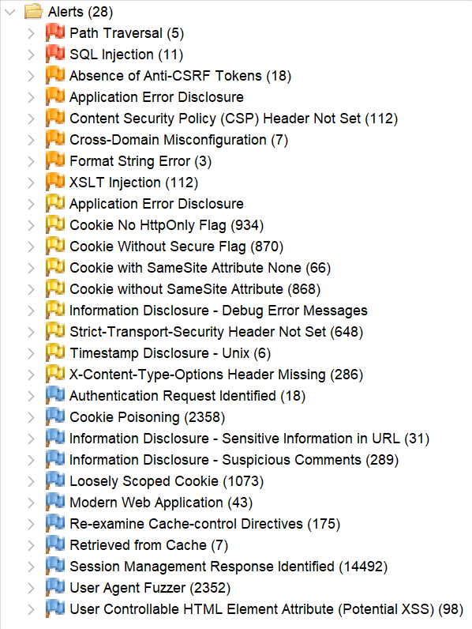
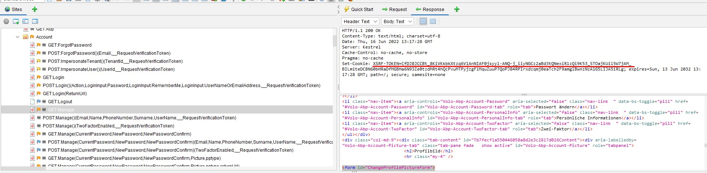
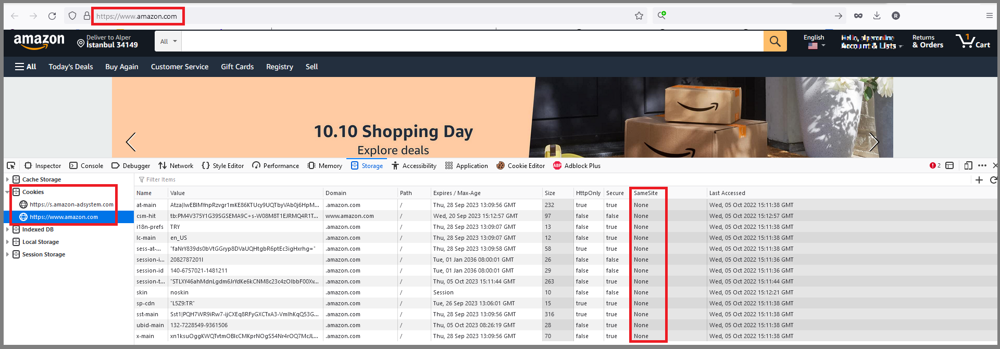
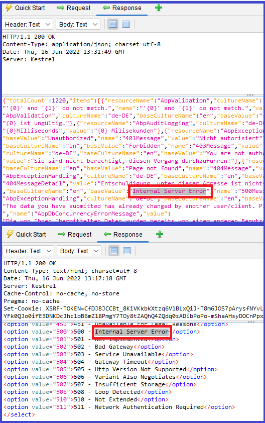
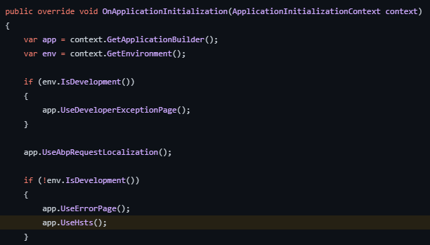

# ABP Penetration Test Report

The ABP Commercial MVC `v8.2.0` application template has been tested against security vulnerabilities by the [OWASP ZAP v2.14.0](https://www.zaproxy.org/) tool. The demo web application was started on the `https://localhost:44349` address. The below alerts have been reported by the pentest tool. These alerts are sorted by the risk level as high, medium, and low. The informational alerts are not mentioned in this document. 

Many of these alerts are **false-positive**, meaning the vulnerability scanner detected these issues, but they are not exploitable. It's clearly explained for each false-positive alert why this alert is a false-positive. 

In the next sections, you will find the affected URLs, attack parameters (request-body), alert descriptions, false-positive explanations, and fixes for the issues. Some positive alerts are already fixed or needed additional actions that can be taken by you. The issue links for the fixes are mentioned in each positive alert.

## Alerts

There are high _(red flag)_, medium _(orange flag)_, low _(yellow flag)_, and informational _(blue flag)_ alerts. 



> The informational alerts are not mentioned in this document. These alerts are not raising any risks on your application and they are optional.

### Path Traversal [Risk: High] - False Positive

- *[GET] - https://localhost:44349/api/audit-logging/audit-logs?startTime=&endTime=&url=&userName=&applicationName=&clientIpAddress=&correlationId=&httpMethod=audit-logs&httpStatusCode=&maxExecutionDuration=&minExecutionDuration=&hasException=true&sorting=executionTime+desc&skipCount=0&maxResultCount=10* (attack: **httpMethod=audit-logs**)
- *[POST] - https://localhost:44349/Account/Login* (attack: **\Login**)
- *[POST] - https://localhost:44349/Account/SecurityLogs* (attack: **\SecurityLogs**)
- *[POST] - https://localhost:44349/Identity/SecurityLogs* (attack: **\SecurityLogs**)

**Description**:

The Path Traversal attack technique allows an attacker access to files, directories, and commands that potentially reside outside the web document root directory. An attacker may manipulate a URL in such a way that the website will execute or reveal the contents of arbitrary files anywhere on the web server. Any device that exposes an HTTP-based interface is potentially vulnerable to Path Traversal.

**Solution**:

This is a **false-positive** alert since ABP does all related checks for this kind of attack on the backend side for these endpoints.

### SQL Injection [Risk: High] - False Positive

* *[POST] — https://localhost:44349/Account/Login* (attack: **1q2w3E* AND 1=1 --**)
* *[POST] — https://localhost:44349/AuditLogs* (attack: **GET' AND '1'='1' --**)
* *[POST] — https://localhost:44349/Identity/SecurityLogs* (attack: **admin' AND '1'='1**)
* *[POST] — https://localhost:44349/api/account/verify-authenticator-code* (attack: **AND '1'='1**)
* *[POST] — https://localhost:44349/Identity/ClaimTypes/CreateModal* (attack: **aaaa AND '1'='1**)
* *[POST] — https://localhost:44349/Identity/OrganizationUnits/\** (attack: **6f4cd0ab-f4eb-7ce0-8b26-3a138af1840d" AND '1'='1**) (also, several other URLs...)
* *[POST] — https://localhost:44349/Identity/ClaimTypes/EditModal* (attack: **aaaa AND '1'='1**)
* *[POST] — https://localhost:44349/LanguageManagement/Texts* (attack: **true" AND "1"="1" --**)
* *[POST] — https://localhost:44349/Account/Manage?CurrentPassword=ZAP%27+AND+%271%27%3D%271%27+--+&NewPassword=ZAP&NewPasswordConfirm=ZAP*

**Description**:

SQL injection may be possible. SQL injection is a web security vulnerability that allows an attacker to interfere with the queries that an application makes to its database. It allows an attacker to view data that they are not normally able to retrieve and perform unauthorized actions.

**Explanation**:

ABP uses Entity Framework Core and LINQ. **It's safe against SQL Injection because it passes all data to the database via SQL parameters.** LINQ queries are not composed by using string manipulation or concatenation, that's why they are not susceptible to traditional SQL injection attacks. Therefore, this is a **false-positive** alert.

### Absence of Anti-CSRF Tokens [Risk: Medium] — False Positive

* *[GET] - https://localhost:44349/Account/LinkUsers/LinkUsersModal?returnUrl=/SettingManagement*
* *[GET] — https://localhost:44349/Account/Manage* (same URL with different query parameters)
* *[GET] - https://localhost:44349/HostDashboard*
* *[GET] - https://localhost:44349/SettingManagement?handler=RenderView&id=Volo.Abp.Account* (other several URLs)

**Description**: 

No Anti-CSRF tokens were found in an HTML submission form.
A cross-site request forgery is an attack that involves forcing a victim to send an HTTP request to a target destination without their knowledge or intent in order to perform an action as the victim. The underlying cause is application functionality using predictable URL/form actions in a repeatable way. The nature of the attack is that CSRF exploits the trust that a website has for a user. By contrast, cross-site scripting (XSS) exploits the trust that a user has in a website. Like XSS, CSRF attacks are not necessarily cross-site, but they can be. Cross-site request forgery is also known as CSRF, XSRF, one-click attack, session riding, confused deputy, and sea surf.

**Explanation:**

This is a **false-positive** alert because ABP provides the Anti-CSRF token via a cookie as seen on the following screenshot:



### Application Error Disclosure [Risk: Medium] - False Positive

- *[GET] — https://localhost:44349/AuditLogs*

**Description**: 

This page contains an error/warning message that may disclose sensitive information like the location of the file that produced the unhandled exception. This information can be used to launch further attacks against the web application. The alert could be a false positive if the error message is found inside a documentation page.

**Explanation**:

There are only one URL that is reported as exposing error messages. This is a **false-positive** alert. The [Audit Logging Module](../modules/audit-logging.md), shows request & response details and exception information, these are not sensitive information and only can be seen by the users whose related permissions are granted.

### Content Security Policy (CSP) Header Not Set [Risk: Medium] — Positive (Fixed)

- *[GET] — https://localhost:44349*
- *[GET] — https://localhost:44349/AbpPermissionManagement/PermissionManagementModal?providerName=R&providerKey=role&providerKeyDisplayName=role*
- *[GET] — https://localhost:44349/Abp/MultiTenancy/TenantSwitchModal*
- *[GET] — https://localhost:44349/Account/AuthorityDelegation/AuthorityDelegationModal*
- *[GET] — https://localhost:44349/Account/AuthorityDelegation/DelegateNewUserModal*
- *[GET] — https://localhost:44349/Account/ForgotPassword _(other several account URLS)_* 
- *[GET] — https://localhost:44349/Account/Login _(other several account URLS)_*
- *[GET] — https://localhost:44349/Account/Register _(other several account URLS)_*
- *[GET] — https://localhost:44349/Account/Manage _(other several account URLS)_*
- *[GET] — https://localhost:44349/Account/Sessions _(other several account URLS)_*

**Description:** 

Content Security Policy (CSP) is an added layer of security that helps to detect and mitigate certain types of attacks, including Cross Site Scripting (XSS) and data injection attacks. These attacks are used for everything from data theft to site defacement or distribution of malware. CSP provides a set of standard HTTP headers that allow website owners to declare approved sources of content that browsers should be allowed to load on a certain page — covered types are JavaScript, CSS, HTML frames, fonts, images and embeddable objects such as Java applets, ActiveX, audio, and video files.

**Solution:** 

Ensure that your web server, application server, load balancer, etc. are configured to set the `Content-Security-Policy` header, to achieve optimal browser support: "Content-Security-Policy" for Chrome 25+, Firefox 23+, and Safari 7+, "X-Content-Security-Policy" for Firefox 4.0+ and Internet Explorer 10+, and "X-WebKit-CSP" for Chrome 14+ and Safari 6+.

This vulnerability has fixed in ABP v7.0. You can check the related issue from [github.com/abpframework/abp/issues/14173](https://github.com/abpframework/abp/issues/14173). You can configure the `AbpSecurityHeadersOptions` and set the `UseContentSecurityPolicyHeader` property as *true* to add the `Content-Security-Policy` header into your application:

```csharp
Configure<AbpSecurityHeadersOptions>(options => 
{
   options.UseContentSecurityPolicyHeader = true; //false by default
});
```

> See [the documentation](../framework/ui/mvc-razor-pages/security-headers.md) for more info.

### Format String Error [Risk: Medium] - False Positive

- *[GET] — https://localhost:44349/Abp/Languages/Switch?culture=ZAP%25n%25s%25n%25s%25n%25s%25n%25s%25n%25s%25n%25s%25n%25s%25n%25s%25n%25s%25n%25s%25n%25s%25n%25s%25n%25s%25n%25s%25n%25s%25n%25s%25n%25s%25n%25s%25n%25s%25n%25s%0A&returnUrl=%2F&uiCulture=ar*
- *[GET] — https://localhost:44349/Abp/ApplicationLocalizationScript?cultureName=ZAP%25n%25s%25n%25s%25n%25s%25n%25s%25n%25s%25n%25s%25n%25s%25n%25s%25n%25s%25n%25s%25n%25s%25n%25s%25n%25s%25n%25s%25n%25s%25n%25s%25n%25s%25n%25s%25n%25s%25n%25s%0A*

**Description:**

A Format String error occurs when the submitted data of an input string is evaluated as a command by the application.

**Solution:**

Rewrite the background program using proper deletion of bad character strings. This will require a recompile of the background executable. 

**Explanation:**

The first affected URL is a **false-positive** alert since it's already fixed and there is not any bad character string in the responses of these endpoints anymore. (It displays an error message such as: *"The selected culture is not valid! Make sure you enter a valid culture name."*).

The second URL is also a **false-positive** alert because there is no bad character string in the response. 

> **Note**: However, it might be possible if you had any sensitive localization key-value pair in your localization entries, because this endpoint returns all localization values to be able to be used in the application. Therefore, keep that in mind while defining new localization entries.

### XSLT Injection [Risk: Medium] - False Positive

- *[GET] — https://localhost:44349/Abp/Languages/Switch?culture=%3Cxsl%3Avalue-of+select%3D%22system-property%28%27xsl%3Avendor%27%29%22%2F%3E&returnUrl=%2F&uiCulture=ar*
- *[POST] — https://localhost:44349/Account/Login _(same URL with different parameters...)_*
- *[POST] — https://localhost:44349/Account/Register _(same URL with different parameters...)_*
- *[POST] — https://localhost:44349/Account/Manage _(same URL with different parameters...)_*
- *[POST] — https://localhost:44349/Account/ForgotPassword _(same URL with different parameters...)_*
- *[POST] — https://localhost:44349/SaasWidgets/LatestTenants _(same URL with different parameters...)_*
- *[POST] — https://localhost:44349/AuditLogs*
  
**Description**: 

Injection using XSL transformations may be possible and may allow an attacker to read system information, read and write files, or execute arbitrary code.

**Explanation**: 

This is a **false-positive** alert. v8.2.0 uses .NET 8 and the XSLT transformation is not possible on .NET5 or higher.

### Application Error Disclosure [Risk: Low] — False Positive

- *[POST] — https://localhost:44349/Account/ImpersonateUser*  

**Description:** 

The reported page contains an error/warning message that may disclose sensitive information like the location of the file that produced the unhandled exception. This information can be used to launch further attacks against the web application. The alert could be a false positive if the error message is found inside a documentation page.

**Explanation:** 

This vulnerability was reported as a **positive** alert because the application ran in `Development` mode. ABP Framework throws exceptions for developers in the `Development` environment. We set the environment to `Production` and re-run the test, then the server sent a *500-Internal Error* without the error disclosed. Therefore this alert is **false-positive**. Further information can be found in the following issue: [github.com/abpframework/abp/issues/14177](https://github.com/abpframework/abp/issues/14177#issuecomment-1268206947).

### Cookie No `HttpOnly` Flag [Risk: Low] — Positive (No need for a fix)

* *[GET] — https://localhost:44349 (and other several URLs...)*
* *[GET] — https://localhost:44349/Abp/Languages/Switch?culture=ar&returnUrl=%2FAccount%2FForgotPassword%3FreturnUrl%3D%2522%252F%253E%253Cxsl%253Avalue-of%2520select%253D%2522system-property(%2527xsl%253Avendor%2527)%2522%252F%253E%253C!--&uiCulture=ar (and other several URLs...)*
* *[GET] — https://localhost:44349/Abp/ApplicationConfigurationScript*

**Description:** 

A cookie has been set without the secure flag, which means that the cookie can be accessed via unencrypted connections.

**Explanation:** 

The following alert is related to the next alert. Therefore, to understand this alert, you can take a look at the next alert: _Cookie Without Secure Flag [Risk: Low]_

### Cookie Without Secure Flag [Risk: Low] — Positive (No need for a fix)

* *[GET] — https://localhost:44349 (and other several URLs...)*
* *[GET] — https://localhost:44349/Abp/Languages/Switch?culture=ar&returnUrl=%2F%3Fpage%3D% (same url with different query parameters...)*

**Description:** A cookie has been set without the secure flag, which means that the cookie can be accessed via unencrypted connections. The following cookies don't have an `httponly` flag.

* `XSRF-TOKEN` (Anti CSRF token cookie)
* `.AspNetCore.Culture` (ASP.NET Core culture cookie)

**Explanation:** 

All the pages that are setting the `XSRF-TOKEN` and `.AspNetCore.Culture` cookies in the HTTP response are reported as "No `HttpOnly` Flag" vulnerability. This is a **positive-alert**. 

> **Note for IDS4 users**: The `idsrv.session` cookie is being used in IDS4 and after ABP 6.x, ABP switched to OpenIddict ([github.com/abpframework/abp/issues/7221](https://github.com/abpframework/abp/issues/7221)). Therefore, this cookie is not being used in the current startup templates and you can ignore this note if you have created your application after v6.0+. However, if you are still using Identity Server 4, there is an issue related to the `idsrv.session` cookie, it cannot be set as `HttpOnly`; you can see the related thread at its own repository: [github.com/IdentityServer/IdentityServer4/issues/3873](https://github.com/IdentityServer/IdentityServer4/issues/3873)

The `.AspNetCore.Culture` and `XSRF-TOKEN` cookies are being retrieved via JavaScript in ABP Angular, MVC and Blazor WASM UIs. Therefore they cannot be set as `HttpOnly`. You can check out the following modules that retrieve these cookies via JavaScript:

* [github.com/abpframework/abp/blob/dev/framework/src/Volo.Abp.Swashbuckle/wwwroot/swagger/ui/abp.swagger.js#L28](https://github.com/abpframework/abp/blob/dev/framework/src/Volo.Abp.Swashbuckle/wwwroot/swagger/ui/abp.swagger.js#L28)
* [github.com/abpframework/abp/blob/dev/modules/cms-kit/src/Volo.CmsKit.Admin.Web/Pages/CmsKit/Pages/update.js#L54](https://github.com/abpframework/abp/blob/dev/modules/cms-kit/src/Volo.CmsKit.Admin.Web/Pages/CmsKit/Pages/update.js#L54)
* [github.com/abpframework/abp/blob/dev/modules/cms-kit/src/Volo.CmsKit.Admin.Web/Pages/CmsKit/Pages/create.js#L84](https://github.com/abpframework/abp/blob/dev/modules/cms-kit/src/Volo.CmsKit.Admin.Web/Pages/CmsKit/Pages/create.js#L84)
* [github.com/abpframework/abp/blob/392beb897bb2d7214db8facba7a2022be7aa837c/modules/cms-kit/src/Volo.CmsKit.Admin.Web/Pages/CmsKit/BlogPosts/update.js#L91](https://github.com/abpframework/abp/blob/392beb897bb2d7214db8facba7a2022be7aa837c/modules/cms-kit/src/Volo.CmsKit.Admin.Web/Pages/CmsKit/BlogPosts/update.js#L91)
* [github.com/abpframework/abp/blob/dev/modules/cms-kit/src/Volo.CmsKit.Admin.Web/Pages/CmsKit/BlogPosts/create.js#L127](https://github.com/abpframework/abp/blob/dev/modules/cms-kit/src/Volo.CmsKit.Admin.Web/Pages/CmsKit/BlogPosts/create.js#L127)
* [github.com/abpframework/abp/blob/dev/modules/docs/app/VoloDocs.Web/wwwroot/libs/abp/jquery/abp.jquery.js#L261](https://github.com/abpframework/abp/blob/dev/modules/docs/app/VoloDocs.Web/wwwroot/libs/abp/jquery/abp.jquery.js#L261)
* [github.com/abpframework/abp/blob/dev/framework/src/Volo.Abp.AspNetCore.Components.Web/Volo/Abp/AspNetCore/Components/Web/AbpBlazorClientHttpMessageHandler.cs#L94](https://github.com/abpframework/abp/blob/dev/framework/src/Volo.Abp.AspNetCore.Components.Web/Volo/Abp/AspNetCore/Components/Web/AbpBlazorClientHttpMessageHandler.cs#L94)

**Setting `XSRF-TOKEN` cookie as `HttpOnly`:**

If you want to set it, you can configure the `TokenCookie` property of the [AbpAntiForgeryOptions](https://github.com/abpframework/abp/blob/dev/framework/src/Volo.Abp.AspNetCore.Mvc/Volo/Abp/AspNetCore/Mvc/AntiForgery/AbpAntiForgeryOptions.cs#L56) class.

**Setting `.AspNetCore.Culture` cookie as `HttpOnly`:**

If you want to set it, you can do it in the [AbpRequestCultureCookieHelper](https://github.com/abpframework/abp/blob/dev/framework/src/Volo.Abp.AspNetCore/Microsoft/AspNetCore/RequestLocalization/AbpRequestCultureCookieHelper.cs#L16) class. Set the option as `HttpOnly = true`.

The related issue for this alert can be found at [github.com/abpframework/abp/issues/14214](https://github.com/abpframework/abp/issues/14214).

### Cookie with SameSite Attribute None [Risk: Low] — Positive (No need for a fix)

* *[GET] — https://localhost:44349 (and other several URLs...)*
* *[GET] — https://localhost:44349/Abp/ApplicationConfigurationScript*
* *[GET] — https://localhost:44349/Account/ForgotPassword (and there are several URLs)*
* *[GET] — https://localhost:44349/Abp/Languages/Switch?culture=ar&returnUrl=%2F%3Fpage%3D%252FAccount%252F%7E%252FAccount%252FLogin&uiCulture=a (and other several URLs...)*

**Description:** 

A cookie has been set with its `SameSite` attribute set to `none`, which means that the cookie can be sent as a result of a `cross-site` request. The `SameSite` attribute is an effective counter measure to cross-site request forgery, cross-site script inclusion, and timing attacks.

**Solution:** 

Ensure that the `SameSite` attribute is set to either `lax` or ideally `strict` for all cookies. You can see the Amazon.com `SameSite` attribute policy. We discussed setting the **SameSite** attribute to `strict` in the following issue [github.com/abpframework/abp/issues/14215](https://github.com/abpframework/abp/issues/14215) and decided to leave this change to the final developer.



### Cookie without `SameSite` Attribute [Risk: Low] — Positive (No need for a fix)

* *[GET] — https://localhost:44349/Abp/Languages/Switch?culture=ar&returnUrl=%2F&uiCulture=ar _(and other several URLs with different query parameters...)_* 

**Description:** 

A cookie has been set with its `SameSite` attribute set to `none`, which means that the cookie can be sent as a result of a `cross-site` request. The `SameSite` attribute is an effective counter measure to cross-site request forgery, cross-site script inclusion, and timing attacks.

**Solution:** 

Ensure that the `SameSite` attribute is set to either `lax` or ideally `strict` for all cookies. We discussed setting the **SameSite** attribute to `strict` in the following issue [github.com/abpframework/abp/issues/14215](https://github.com/abpframework/abp/issues/14215) and decided to leave this change to the final developer.

### Information Disclosure - Debug Error Messages [Risk: Low] — False Positive

* *[GET] - https://localhost:44349/AuditLogs*

**Description:**  

The response appeared to contain common error messages returned by platforms such as ASP.NET, and Web-servers such as IIS and Apache. You can configure the list of common debug messages.

**Solution:**  

Disable debugging messages before pushing them to production.

**Explanation:** 

The response of the endpoints above return localization texts which are not real error messages. As there is no real error in the backend side, this vulnerability is a **false-positive** alert.



### Strict-Transport-Security Header Not Set [Risk: Low] - False Positive

- *[DELETE] — https://localhost:44349/api/feature-management/features?providerName=E&providerKey=49dfb08f-f5ed-0b61-8d37-3a0fc6b61679*
- *[DELETE] — https://localhost:44349/api/identity/claim-types/4c580525-c08f-9280-f729-3a0fc6b9c3fa*
- *[DELETE] — https://localhost:44349/api/account/sessions/de2f8683-f8f4-d3bb-6b7e-3a138af89d1f*
- *[DELETE] — https://localhost:44349/api/language-management/languages/6b311a44-65bd-14ea-1a21-3a0e778b41d5*
- *[DELETE] — https://localhost:44349/api/saas/tenants/c77b1554-5837-3303-9983-3a0e77824bb3*
- *[DELETE] — https://localhost:44349/api/openiddict/scopes?id=af5a66e2-7cbb-cf69-7301-3a0fc6bb0ebf*
- *[GET] — https://localhost:44349/*
- *[GET] — https://localhost:44349/Abp/ApplicationConfigurationScript*
- *[GET] — https://localhost:44349/Abp/ApplicationLocalizationScript?cultureName=zh-Hant*
- other URLS...

**Description**: 

HTTP Strict Transport Security (HSTS) is a web security policy mechanism whereby a web server declares that complying user agents (such as a web browser) are to interact with it using only secure HTTPS connections (i.e. HTTP layered over TLS/SSL). HSTS is an IETF standards track protocol and is specified.

**Solution**: 

Enabling HSTS on production.

**Explanation**: 

This vulnerability was reported as a positive alert because the application ran in `Development` mode. We enable HSTS on `Production` mode as can be seen in the image below, therefore this is a **false-positive** alert.



### Timestamp Disclosure - Unix [Risk: Low] - False Positive

- *[GET] — https://localhost:44349/libs/zxcvbn/zxcvbn.js?=*

**Description**: 

A timestamp was disclosed by the application/web server - Unix

**Solution**:

Manually confirm that the timestamp data is not sensitive, and that the data cannot be aggregated to disclose exploitable patterns.

**Explanation**: 

This vulnerability was reported as a positive alert, because ABP uses the [zxcvbn](https://github.com/dropbox/zxcvbn) library for [password complexity indicators](https://docs.abp.io/en/commercial/latest/ui/angular/password-complexity-indicator-component). This library is one of the most used password strength estimator and it does not disclosure any sensitive data related to web server's timestamp and therefore it's a **false-positive** alert.

### X-Content-Type-Options Header Missing [Risk: Low] - Positive (Fixed)

- *[GET] — https://localhost:44349/client-proxies/account-proxy.js?_v=638550091940000000 (and other client-proxies related URLs)*
- *[GET] — https://localhost:44349/favicon.svg*
- *[GET] — https://localhost:44349/global-styles.css?_v=638556076064360335*
- *[GET] — https://localhost:44349/libs/@fortawesome/fontawesome-free/css/all.css?_v=%5CWEB-INF%5Cweb.xml (other several URLs...)*
- other URLs...

**Description**: 

The Anti-MIME-Sniffing header `X-Content-Type-Options` was not set to 'nosniff'. This allows older versions of Internet Explorer and Chrome to perform MIME-sniffing on the response body, potentially causing the response body to be interpreted and displayed as a content type other than the declared content type. Current (early 2014) and legacy versions of Firefox will use the declared content type (if one is set), rather than performing MIME-sniffing.

**Solution**:

Ensure that the application/web server sets the Content-Type header appropriately, and that it sets the X-Content-Type-Options header to 'nosniff' for all web pages.

If possible, ensure that the end user uses a standards-compliant and modern web browser that does not perform MIME-sniffing at all, or that can be directed by the web application/web server to not perform MIME-sniffing.

**Explanation**: 

The `X-Content-Type-Options` header allows you to avoid MIME type sniffing by saying that the MIME types are deliberately configured. This headeer is not strictly required, but it is highly recommended for security reasons. While modern browsers have improved security features, you can still set this header for ensuring the security of web applications.

You can add the [ABP's Security Header Middleware](https://docs.abp.io/en/abp/latest/UI/AspNetCore/Security-Headers#security-headers-middleware) into the request pipeline to set the `X-Content-Type-Options` as *no-sniff*. Also, this middleware adds other pre-defined security headers to your application, including `X-XSS-Protection`, `X-Frame-Options` and `Content-Security-Policy` (if it's enabled). Read the documentation for more info: [https://docs.abp.io/en/abp/latest/UI/AspNetCore/Security-Headers](https://docs.abp.io/en/abp/latest/UI/AspNetCore/Security-Headers).

## Other Alerts

The following alerts are reported by the community or our customers in v8.1+.

### Disclosed Microsoft Client Secret [Risk: Medium] - Positive (No need for a fix)

* *[GET] — https://localhost:44349/setting-management*

**Description**: 

Secrets shall never be exposed to unauthorized parties. This exposure can result from improper storage, insecure transmission, or inadequate access controls. In this specific case the owner of the user account is authorized to read and modify the secret. In case of administrative accounts, it could lead to further damages, by performing lateral movements, by using the credentials to access other services.

**Explanation**: 

The endpoint `/setting-management/` requires permission to be visited and can only be accessed via authorized users. It is the setting page to configure the application settings including the *default localization language*, *timezone*, *layout type*, *password settings* and more...

### Incorrect Session Handling – Insufficient Session Termination [Risk: Low]  - Positive 

* *[GET] — https://localhost:44349/Account/Logout*

**Description**: 

Application logout functionality does not terminate the user's session. This increases the risk of unauthorized application access via successful session hijacking attacks, users leaving their computers unattended, and/or a local attacker utilizing the browser history. On logout, user sessions should be invalidated and all relevant session identifiers, authentication tokens and application state information deleted or overwritten both on server and on client side.

**Explanation**: 

You can track the status of this case at [github.com/abpframework/abp/issues/19576](https://github.com/abpframework/abp/issues/19576).

### Information Disclosure via Configuration Scripts [Risk: Low] - Positive (No need for a fix)

- *[GET] — https://localhost:44349/Abp/ApplicationConfigurationScript* or *https://localhost:44349/api/abp/application-configuration*
- *[GET] — https://localhost:44349/Abp/ServiceProxyScript*

**Description**: 

When users authenticate to the application, their browsers issue requests to 2 endpoints that host configuration scripts for the application framework. The first contains information about the passwords that are accepted by the application. This information can be used by the attackers to narrow down their dictionaries and only focus on the possible passwords for their
attacks. The second, on the other hand, discloses some endpoints that are unavailable to the users with low privileges.

**Explanation**: 

* **Application Configuration Script**: 

  These 2 endpoints are used by ABP application templates. The first one `/Abp/ApplicationConfigurationScript` provides configuration and user based definitions with JSON format. This data is important for SPA based applications to get the current language, localization texts, policies, settings, user info, current tenant or time zone information. This is not a data leak. User specific data can only be accessed after user logon. Other data are application-wide used not dangerous for unauthenticated users. For more information about Application Configuration, check out [docs.abp.io/en/abp/latest/API/Application-Configuration](https://docs.abp.io/en/abp/latest/API/Application-Configuration)

* **Service Proxy Script**:

  This endpoint provides auto-generated JavaScript AJAX call methods for the backend operations. This may disclosure information about the host API methods. On the other hand, it makes easy to consume the HTTP APIs from JavaScript side. ABP Application Services are automatically converted to JavaScript proxies. But it does not mean that these JavaScript methods can be executed anonymously. The attacker still needs to log in to perform operations. For more information about Service Proxy Script, check out [docs.abp.io/en/abp/latest/UI/AspNetCore/Dynamic-JavaScript-Proxies](https://docs.abp.io/en/abp/latest/UI/AspNetCore/Dynamic-JavaScript-Proxies). If you want to disable this functionality, check out [github.com/abpframework/abp/issues/12297](https://github.com/abpframework/abp/issues/12297)

### User E-mail Address Enumeration [Risk: Low] - Positive

* *[GET] — https://localhost:44349/Account/ForgotPassword*

**Description**: 

It is possible to collect valid email addresses by interacting with the "Forgot Password" function of the
application. This vulnerability is useful to increase the efficiency of brute force attacks. 

**Explanation**: 

If the email is known, it is easier to find the corresponding password. With the "Forgot Password" function, the attacker can enumerate valid email addresses as the function returns `Cannot find the given email` error, when there is no user registered with the provided e-mail address. This vulnerability has been fixed with v8.2, see the related issue for more info: [github.com/abpframework/abp/issues/19588](https://github.com/abpframework/abp/issues/19588).

### Software Version Disclosure [Risk: Low] - Positive (No need for a fix)

* *[GET] — https://localhost:44349/*

**Description**: 

The assessed web server discloses its version number within the HTTP response headers. This information facilitates attackers in planning future attacks and can be used in the automation of the attack process. It is unnecessary to share this information with the clients of the web application. The vulnerability can be verified by issuing HTTP requests and inspecting HTTP response headers. HTTP header "Server" contains the version information.
The following header was received in server responses: `Server: Microsoft-IIS/10.0` or `Server: Microsoft-HTTPAPI/2.0`. 

**Explanation**: 

This is not directly related to ABP. It's a header added by the IIS server. So you can disable this header with the `web.config` file:

```xml
<?xml version="1.0" encoding="UTF-8"?>
<configuration>
    <system.webServer>
        <security>
            <requestFiltering removeServerHeader="true" />
        </security>
    </system.webServer>
</configuration>
```

The following issue has been opened for this vulnerability, you can follow it at [github.com/abpframework/abp/issues/19589](https://github.com/abpframework/abp/issues/19589).