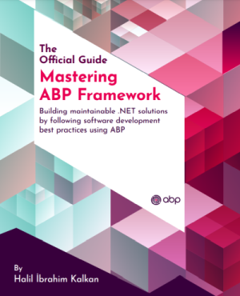

# ABP Documentation

ABP offers an **opinionated architecture** to build enterprise software solutions with **best practices** on top of the **.NET** and the **ASP.NET Core** platforms. It provides the fundamental infrastructure, production-ready startup templates, pre-built application modules, UI themes, tooling, guides and documentation to implement that architecture properly and **automate the details** and repetitive works as much as possible.

## Why ABP Platform?
The following pages outline why you should use the ABP Platform and how it is used:

* [Why choose ABP?](https://abp.io/why-choose-abp)
* [How it works?](https://abp.io/how-it-works)
* [Return on investment](https://abp.io/return-on-investment)

## Get Started

The [Getting Started](get-started) guide can be used to create and run ABP based solutions with different options and details.

After getting started, you can read the following documents:

* [Todo Application Tutorial](tutorials/todo) to create your first ABP application.
* [Book Store Application Tutorial](tutorials/book-store/part-01.md) to build a full-featured and real-life web application with ABP.

### UI Framework Options

ABP can work with any UI framework, while the following frameworks are supported and well-integrated out of the box:

### Database Provider Options

ABP can work with any database provider, while the following providers are supported and well-integrated out of the box:

## The ABP Platform

ABP **bridges the gap** between ASP.NET Core and **real-world business application requirements**, allowing you to focus on your business code.

The following diagram contains the core components of the **ABP Platform** and shows how ABP sits between **ASP.NET Core** and **Your Application**:

## Exploring the Documentation

ABP has a **comprehensive documentation** that not only explains ABP, but also includes **guides** and **samples** to help you on creating a **maintainable solution** by introducing and discussing common **software development principle and best practices**.

The next sections highlight important ABP components and provides links to related documents.

### The Framework

#### Architecture

ABP offers a complete, modular and layered software architecture based on [Domain Driven Design](./framework/architecture/domain-driven-design) principles and patterns. It also provides the necessary infrastructure to implement this architecture.

* See the [Modularity](./framework/architecture/modularity/basics.md) document to understand the module system.
* [Implementing Domain Driven Design book](https://abp.io/books/implementing-domain-driven-design?ref=doc) is an ultimate guide for who want to understand and implement the DDD with ABP.
* [Microservice Architecture](./framework/architecture/microservices) document explains how ABP helps to create a microservice solution.
* [Multi-Tenancy](./framework/architecture/multi-tenancy) document introduces multi-tenancy and explores the ABP multi-tenancy infrastructure.

#### Infrastructure

There are a lot of features provided by ABP to achieve real world scenarios easier, like [Event Bus](./framework/infrastructure/event-bus), [Background Job System](./framework/infrastructure/background-jobs), [Audit Logging](./framework/infrastructure/audit-logging.md), [BLOB Storing](./framework/infrastructure/blob-storing), [Data Seeding](./framework/infrastructure/data-seeding.md), [Data Filtering](./framework/infrastructure/data-filtering.md).

#### Cross Cutting Concerns

ABP also simplifies (and even automates wherever possible) cross cutting concerns and common non-functional requirements like [Exception Handling](./framework/fundamentals/exception-handling.md), [Validation](./framework/fundamentals/validation.md), [Authorization](./framework/fundamentals/authorization.md), [Localization](./framework/fundamentals/localization.md), [Caching](./framework/fundamentals/caching.md), [Dependency Injection](./framework/fundamentals/dependency-injection.md), [Setting Management](./framework/infrastructure/settings.md), etc. 

### Tooling

ABP Platform provides tooling to help you in your daily development.

#### ABP Studio

[ABP Studio](studio) is a cross-platform desktop application for ABP and .NET developers. It aims to provide a comfortable development environment for you by automating things, providing insights about your solution, making develop, run, browse, monitor, trace and deploy your solutions much easier.

#### ABP Suite

[ABP Suite](suite) is a tool to assist your application development. Its main functionality is to automatically generate CRUD-style pages once you define your entities and their relations.

#### ABP CLI

[ABP CLI](cli.md) is a command-line tool to create new solutions and automate the things with your ABP based solutions.

### Startup Templates

The [Startup templates](./solution-templates/index.md) are pre-built Visual Studio solution templates. You can create your own solution based on these templates to **immediately start your development**.

### Application Modules

Application Modules provides pre-built application modules those implement common business requirements. See the [Application Modules](modules) document for all pre-built modules.

### UI Themes

ABP provides a UI theming system where you can use [pre-built themes](ui-themes) for your solution or build your own UI themes.

## Books

### Mastering ABP Framework

*Mastering ABP Framework* is an ultimate guide to get started and expertise with the ABP Framework. It is authored by Halil İbrahim Kalkan, the creator and the lead developer of the ABP Framework.

**[Click here to see the details and order the book](https://abp.io/books/mastering-abp-framework)**.

### Free E-Book: Implementing Domain Driven Design

A **practical guide** for implementing Domain Driven Design (DDD). While the implementation details are **based on the ABP** infrastructure, the basic concepts, principles and models can be applied to any solution, even if it is not a .NET solution.

**[Click here to get your free copy](https://abp.io/books/implementing-domain-driven-design?ref=doc).**

## Samples

See the [sample projects](samples) built with ABP.

## ABP Community

The [ABP Community](https://abp.io/community/) website is a central place to publish articles and share knowledge about ABP.

## Blog

Follow the [ABP Blog](https://abp.io/blog/) to learn the latest happenings in the ABP Platform.

## The Source Code

ABP's source code is hosted on GitHub. See [the source code](https://github.com/abpframework).

### Want to Contribute?

ABP is a community-driven open source project. See [the contribution guide](contribution) if you want to be a part of this project.
