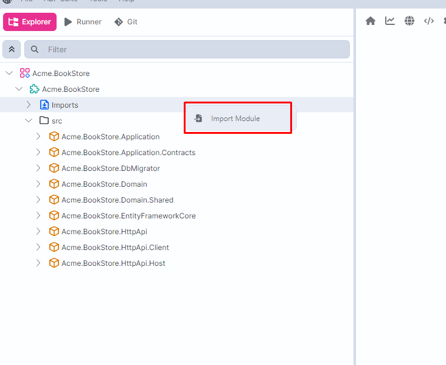
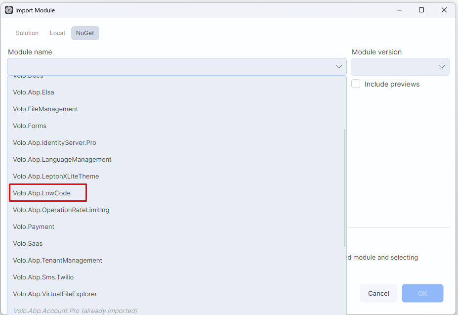
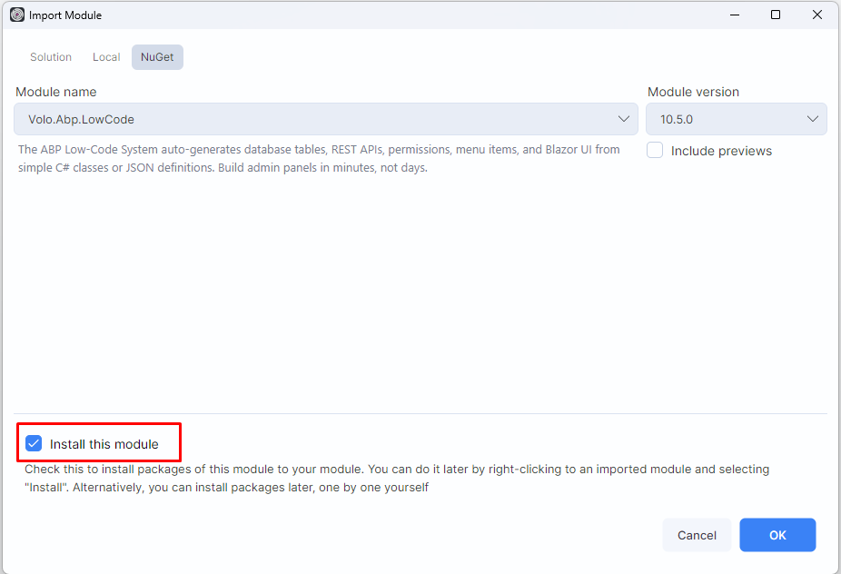
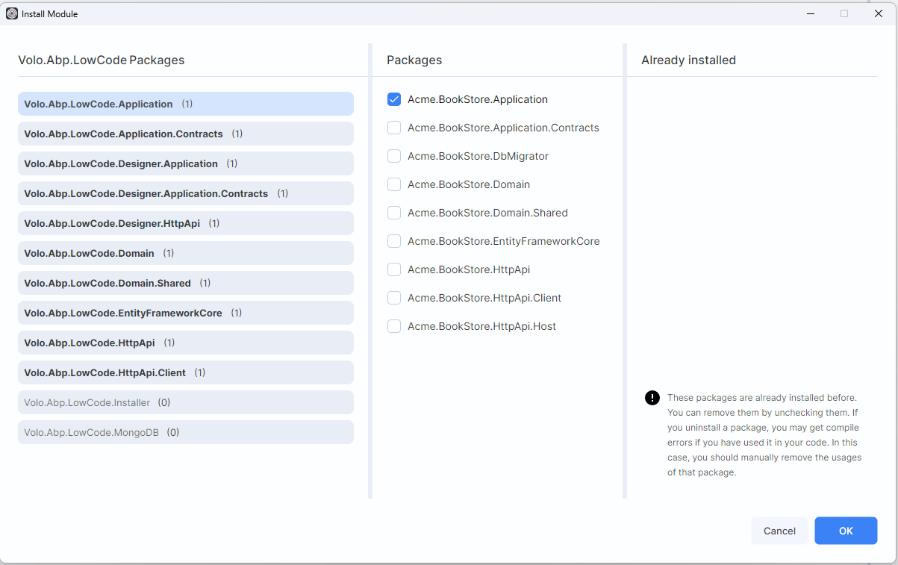

```json
//[doc-seo]
{
    "Description": "Add ABP Low-Code to an existing EF Core solution. Import the backend module from ABP Studio, then manually add the _Dynamic initializer, host/migrator wiring, and React runtime integration."
}
```

# Add Low-Code to an Existing Solution

> **Preview:** The Low-Code System is currently in preview. APIs, generated files, designer behavior, and React runtime details may change before general availability.

This guide explains how to add the ABP Low-Code System to an existing solution instead of generating a new solution with Low-Code enabled from the beginning.

This workflow was first verified on July 21, 2026 on an existing layered `Acme.BookStore` solution and reverified end to end on July 22, 2026 with a fresh layered MVC solution created with ABP `10.5.0` and .NET `10`.

## Supported Scenarios

This guide is for existing solutions that meet these conditions:

* **Database provider:** EF Core relational provider
* **Architecture:** Layered, modular monolith, or no-layers
* **Frontend:** React is supported, but its runtime integration is currently **manual**

This guide does **not** cover:

* MongoDB solutions
* Microservice solutions

## What ABP Studio Import Adds

When you import `Volo.Abp.LowCode` from ABP Studio, Studio can add the backend package references and the related ABP module dependencies for you.

In the verified `Acme.BookStore` example, the import step added or updated:

* `Volo.Abp.LowCode.*` package references in the backend projects
* `[DependsOn]` entries in the ABP module classes
* EF Core runtime calls such as `builder.ConfigureLowCode()` and `builder.ConfigureDynamicEntities()`
* an `Added_DynamicEntities_LowCode` migration in templates where Studio can run the EF Core migration flow

The import step did **not** create everything needed for a fully working Low-Code solution. You still need to add:

* The `_Dynamic` source-controlled model folder
* The Low-Code initializer class
* Host startup wiring for model initialization and `--check-lowcode-model-files`
* Design-time EF Core wiring in the DbContext factory
* The default `DynamicEntity` repository and Low-Code custom endpoint mapping
* Verification of Studio's DbContext call order and generated migration
* React runtime package and route/menu integration

## Step 1: Import the Backend Module in ABP Studio

Open your solution in **ABP Studio**.

Right-click the module root or use the **Imports** node and select **Import Module**:



In the **NuGet** tab, select `Volo.Abp.LowCode`:



Keep **Install this module** checked and continue:



Studio then opens the **Packages** dialog.

For a **layered** solution, Studio already suggests the correct packages for the correct layers. You can accept the suggested selection and continue.

For **no-layers** and similar compatible templates, the flow is the same: accept the suggested package selection and continue.



Studio can also create a migration and insert the two Low-Code model configuration calls. Inspect both results instead of adding a second migration immediately. In the verified ABP `10.5.0` solution, Studio appended both calls after `base.OnModelCreating(builder)`; `ConfigureDynamicEntities()` had to be moved before the base call as shown in Step 5.

## Step 2: Create the `_Dynamic` Folder

After the import step, create the source-controlled `_Dynamic` folder manually.

Use these locations:

| Solution type | `_Dynamic` location |
|---------------|---------------------|
| Layered / modular monolith | `src/<YourProject>.Domain/_Dynamic/` |
| No-layers | `<YourProject>/_Dynamic/` |

If your solution contains multiple modules, put `_Dynamic` under the domain project of the module that should own the low-code entities and pages.

Create this folder structure:

```text
_Dynamic/
  model/
    backgroundJobs/
    backgroundWorkers/
    endpoints/
    entities/
    enums/
    eventHandlers/
    forms/
    pageGroups/
    pages/
    permissions/
  model-examples/
```

You can keep these folders empty at first. If you want starter descriptors, create a temporary Low-Code enabled solution with the same template and copy its `model-examples/` contents.

Git does not track empty directories. Add a `.gitkeep` file to each empty directory or commit an initial descriptor so a fresh checkout contains the required structure.

## Step 3: Add the Low-Code Initializer

Create a `<ProjectName>LowCodeInitializer.cs` file inside `_Dynamic/`.

For a layered solution, the file typically lives at:

```text
src/<YourProject>.Domain/_Dynamic/<YourProject>LowCodeInitializer.cs
```

Example:

```csharp
using System;
using System.IO;
using System.Threading.Tasks;
using Volo.Abp.Identity;
using Volo.Abp.LowCode.Configuration;
using Volo.Abp.LowCode.Modeling;
using Volo.Abp.Threading;

namespace <RootNamespace>._Dynamic;

public static class <ProjectName>LowCodeInitializer
{
    private static readonly AsyncOneTimeRunner ConfigurationRunner = new();
    private static readonly AsyncOneTimeRunner InitializationRunner = new();

    public static async Task InitializeAsync()
    {
        await ConfigureAsync();
        await InitializationRunner.RunAsync(DynamicModelManager.Instance.InitializeAsync);
    }

    public static async Task ConfigureAsync()
    {
        await ConfigurationRunner.RunAsync(() =>
        {
            AbpDynamicEntityConfig.ReferencedEntityList.Add<IdentityUser>(
                nameof(IdentityUser.UserName),
                nameof(IdentityUser.Email)
            )
                .WithShortcut("user")
                .AsUserReference()
                .WithViewPermission("AbpIdentity.Users");

            AbpDynamicEntityConfig.SourceAssemblies.Add(
                new DynamicEntityAssemblyInfo(
                    typeof(<AssemblyMarkerModule>).Assembly,
                    rootNamespace: "<RootNamespace>",
                    projectRootPath: ResolveSourcePath()
                )
            );

            return Task.CompletedTask;
        });
    }

    private static string? ResolveSourcePath()
    {
        var baseDir = AppContext.BaseDirectory;
        var current = new DirectoryInfo(baseDir);

        for (int i = 0; i < 10 && current != null; i++)
        {
            var candidate = Path.Combine(current.FullName, "<ProjectRootRelativePath>");
            if (Directory.Exists(Path.Combine(candidate, "_Dynamic")))
            {
                return candidate;
            }

            current = current.Parent;
        }

        return null;
    }
}
```

Replace these placeholders:

* `<ProjectName>`: `BookStore`
* `<RootNamespace>`: `Acme.BookStore`
* `<AssemblyMarkerModule>`:
  * layered: `<YourProject>DomainModule`
  * no-layers: `<YourProject>Module`
* `<ProjectRootRelativePath>`:
  * layered: `src/<YourProject>.Domain`
  * no-layers: `<YourProject>`

The `IdentityUser` registration is the same pattern used by the generated templates. It gives you a ready-to-use user reference in the designer.

## Step 4: Include `_Dynamic` Files in the Project

Add `_Dynamic` as content and embed its JSON descriptors.

For a layered solution, add this to `src/<YourProject>.Domain/<YourProject>.Domain.csproj`:

```xml
<ItemGroup>
  <Content Include="_Dynamic\**\*">
    <CopyToOutputDirectory>PreserveNewest</CopyToOutputDirectory>
    <CopyToPublishDirectory>PreserveNewest</CopyToPublishDirectory>
  </Content>
  <EmbeddedResource Include="_Dynamic\model\**\*.json">
    <LogicalName>$(RootNamespace).$([System.String]::Copy('%(Identity)').Replace('\', '.').Replace('/', '.'))</LogicalName>
  </EmbeddedResource>
</ItemGroup>
```

For a no-layers solution, add the same block to the main host project file instead.

## Step 5: Wire the Backend Startup

### Host Program

Update the main runnable backend host `Program.cs`:

* layered React or Angular template: `src/<YourProject>.HttpApi.Host/Program.cs`
* layered MVC, Razor Pages, Blazor Server, or Blazor Web App template: the runnable `src/<YourProject>.Web/Program.cs` or equivalent web host
* no-layers: `<YourProject>/Program.cs`

* add `using <RootNamespace>._Dynamic;`
* add `using Volo.Abp.LowCode.Modeling;`
* handle `--check-lowcode-model-files`
* call `await <ProjectName>LowCodeInitializer.InitializeAsync();` before the normal startup

Add this pattern before your normal startup code:

```csharp
if (LowCodeModelFileCheckCommandLineRunner.IsCommand(args))
{
    await <ProjectName>LowCodeInitializer.ConfigureAsync();
    return await LowCodeModelFileCheckCommandLineRunner.RunAsync(
        args,
        Log.Information,
        Log.Warning,
        Log.Error);
}

await <ProjectName>LowCodeInitializer.InitializeAsync();
```

### DbMigrator

For a layered solution, update `src/<YourProject>.DbMigrator/Program.cs` and call the initializer before `RunConsoleAsync()`:

```csharp
await <ProjectName>LowCodeInitializer.InitializeAsync();
await CreateHostBuilder(args).RunConsoleAsync();
```

For a no-layers solution, the main host typically handles migration mode itself by using `--migrate-database`. In that case, keep the initializer in the main host startup path.

### DbContext Model Configuration Order

The order of the Low-Code model configuration calls is significant. Implement `IDbContextWithDynamicEntities` and keep this exact order in the application's EF Core DbContext:

```csharp
public class <ProjectName>DbContext
    : AbpDbContext<<ProjectName>DbContext>,
      IDbContextWithDynamicEntities
{
    protected override void OnModelCreating(ModelBuilder builder)
    {
        builder.ConfigureDynamicEntities();

        base.OnModelCreating(builder);

        builder.ConfigureLowCode();
    }
}
```

`ConfigureDynamicEntities()` must run before `base.OnModelCreating(builder)` so the dynamic entity mappings are available when ABP applies its base model conventions. Keep `ConfigureLowCode()` after the base call, as shown above. Reordering or omitting these calls can produce an incomplete migration model or a runtime EF Core model that differs from the design-time model.

Run the Low-Code initializer before creating the DbContext for design-time migration operations. The runtime host, DbMigrator, and design-time factory must all build the same Low-Code model before migrations are generated or applied.

### Design-Time DbContext Factory

Update the EF Core DbContext factory:

* add `using <RootNamespace>._Dynamic;`
* add `using Volo.Abp.LowCode.EntityFrameworkCore;`
* add `using Volo.Abp.Threading;`

Then call:

```csharp
LowCodeEfCoreTypeBuilderExtensions.Configure();
AsyncHelper.RunSync(<ProjectName>LowCodeInitializer.InitializeAsync);
```

This is required for design-time EF Core operations such as migrations.

### Dynamic Entity Repository

Add the default repository explicitly in the EF Core module. Studio package import does not guarantee that an existing `AddAbpDbContext` block is updated:

```csharp
using Volo.Abp.LowCode.Entities;

context.Services.AddAbpDbContext<<ProjectName>DbContext>(options =>
{
    options.AddDefaultRepositories(includeAllEntities: true);
    options.AddDefaultRepository<DynamicEntity>();
});
```

### Low-Code Custom Endpoints

Map generated custom endpoints inside the host's existing `UseConfiguredEndpoints` call:

```csharp
using Volo.Abp.LowCode.Endpoints;

app.UseConfiguredEndpoints(endpoints =>
{
    endpoints.UseLowCodeCustomEndpoints();
});
```

Do not add a second `UseConfiguredEndpoints` block. Extend the existing block so conventional controllers, generated endpoints, and any later scoped SPA fallback share the same endpoint pipeline.

### Verify the Migration

After all runtime and design-time wiring is complete, check whether Studio's migration still matches the final model:

```powershell
dotnet ef migrations has-pending-model-changes `
  --project src\<YourProject>.EntityFrameworkCore `
  --startup-project src\<YourProject>.DbMigrator `
  --no-build
```

If the command reports no changes, keep the Studio-generated migration and do not add an empty or duplicate migration. If changes remain, inspect the existing migration first and then create one migration from the fully configured model.

## Step 6: Add Admin Console for the Designer

Studio imports the Designer application and HTTP API packages, but an existing runnable host may not contain the Admin Console browser shell. Check the host project for `Volo.Abp.AdminConsole` and its module class for `AbpAdminConsoleModule`.

If they are absent, add Admin Console to the runnable host. This is the only CLI-based module installation in this guide; Low-Code itself must still be imported with Studio:

```powershell
abp add-package Volo.Abp.AdminConsole `
  --project "src\<YourProject>.Web\<YourProject>.Web.csproj" `
  --version <AbpVersion>
```

Use `.HttpApi.Host` instead of `.Web` when that is the solution's runnable backend host. Confirm that the host module depends on `AbpAdminConsoleModule`.

Keep the existing application at `/` and enable Admin Console under `/admin-console`:

```json
{
  "AdminConsole": {
    "IsEnabled": true,
    "RedirectRootToAdminConsole": false,
    "Authority": "https://localhost:<host-port>",
    "ClientId": "<YourProject>_AdminConsole",
    "Scope": "openid profile email offline_access <YourProject>"
  }
}
```

Add a dedicated Admin Console entry to the DbMigrator's `OpenIddict:Applications` configuration and seed it as a public web client. Do not reuse the MVC, Angular, React runtime, Blazor, or Swagger client.

```json
{
  "<YourProject>_AdminConsole": {
    "ClientId": "<YourProject>_AdminConsole",
    "RootUrl": "https://localhost:<host-port>/admin-console"
  }
}
```

Seed authorization code, refresh token, `LinkLogin`, and `Impersonation` grants with these exact callback shapes:

```text
https://localhost:<host-port>/admin-console/
https://localhost:<host-port>/admin-console/silent-renew.html
```

Use the trailing-slash Admin Console URL as the post-logout URI. Run DbMigrator again so the OIDC client and `AbpLowCodeDesigner.*` permission definitions are seeded.

Admin Console is a separate frontend with its own layout, assets, navigation, and OIDC lifecycle. By default, it can expose Admin Console interfaces from other installed modules in addition to Low-Code. Hiding an entry changes UI composition only; it does not uninstall that module, disable its API, or replace authorization. If the product requires a Designer-only Admin Console, implement an explicit fail-closed module discovery allowlist and account for the built-in home page's static management cards, which can still link to omitted routes that return `404`.

## Step 7: Add the React Runtime Manually

ABP Studio import currently does not retrofit the React runtime automatically. You need to add the React side manually.

### Install the Packages

Use the package manager already used by your `react/` folder and keep the version aligned with the rest of your ABP packages:

```bash
npm install @volo/abp-react-lowcode@~10.5.0 @fortawesome/fontawesome-free@6.5.1
```

The generated Low-Code React templates also include `@fortawesome/fontawesome-free` because dynamic page and page-group icons are stored as Font Awesome class names.

### Import Font Awesome CSS

Add this to `react/src/main.tsx`:

```tsx
import '@fortawesome/fontawesome-free/css/all.min.css'
```

### Configure the Runtime

In `react/src/App.tsx`:

* import `configureLowCode` and `LowCodeLocalizationProvider`
* pass your Axios instance, notifications, localization callback, and router navigation
* wrap the router with `LowCodeLocalizationProvider`

Use the same pattern as the generated template:

```tsx
configureLowCode({
  axios: api,
  onError: (err) => toast.error(err.message),
  onSuccess: (message) => toast.success(message),
  translate,
  navigate: (path) => router.navigate({ to: path }),
})
```

The Low-Code React source template contains the Axios antiforgery configuration below, but do not assume every distributed template artifact contains it. A fresh ABP `10.5.0` React Low-Code solution generated during this verification omitted both values even though the source template contained them. Always inspect the generated shared Axios instance, keep the values when present, and add them when absent. Do not create a second client for Low-Code requests.

```ts
export const api = axios.create({
  // Existing base URL and headers...
  xsrfCookieName: 'XSRF-TOKEN',
  xsrfHeaderName: 'RequestVerificationToken',
})
```

Without these values, Low-Code reads can succeed while create, update, delete, and import requests fail with `400`. Do not disable backend antiforgery validation as a workaround.

For a complete runtime example, see [React Runtime](react-runtime.md).

### Add Dynamic Routes

In `react/src/routes/router.tsx`, add:

```tsx
import { createDynamicRoutes } from '@volo/abp-react-lowcode'
import { authGuard } from '@/lib/routing/guards'

const dynamicEntityRoute = createDynamicRoutes(rootRoute, {
  beforeLoad: authGuard,
})
```

Then add `dynamicEntityRoute` to the route tree.

### Add Dynamic Menu Items

In your sidebar or main navigation component:

* import `useMenuItems`
* map `DynamicMenuItemDefinition` objects into your menu structure
* merge the dynamic menu items with your static route configuration

Typical pattern:

```tsx
const { isAuthenticated } = useAuth()
const { data: dynamicMenuItems } = useMenuItems({
  enabled: isAuthenticated,
})

const dynamicRouteConfig = useMemo(
  () => (dynamicMenuItems ?? []).map(menuItemToRouteConfig),
  [dynamicMenuItems]
)

const visibleItems = useMemo(
  () => sortRouteItems([...visibleStaticItems, ...visibleDynamicItems]),
  [visibleStaticItems, visibleDynamicItems]
)
```

If you want to use the same icon behavior as the generated template, render the `item.icon` value as a Font Awesome class.

Do not request the Low-Code menu for an anonymous user. The backend filters the returned page tree by the current user's generated page permissions and removes empty groups. The route guard remains required because hiding a menu item is only a navigation concern; generated page and endpoint permissions are the authorization boundary.

### Exclude the Package from Vite OptimizeDeps

In `react/vite.config.ts`, add:

```ts
optimizeDeps: {
  exclude: ['@volo/abp-react-lowcode'],
},
```

## Step 8: Validate the Installation

### Backend Validation

Run the solution build:

```bash
dotnet build
```

Validate the descriptor files:

```bash
dotnet run --project src/<YourProject>.HttpApi.Host -- --check-lowcode-model-files
```

For a layered MVC or Blazor application, use its runnable `.Web` project instead of `.HttpApi.Host`.

For no-layers:

```bash
dotnet run --project <YourProject> -- --check-lowcode-model-files
```

### Database Validation

For layered solutions:

```powershell
Push-Location src\<YourProject>.DbMigrator
dotnet run --no-build
Pop-Location
```

Run from the DbMigrator project directory when `appsettings.secrets.json` is stored there. `AddAppSettingsSecretsJson()` resolves its path relative to the process content root/current directory; running the same binary from the solution root can make a commercial module terminate with `ABP-LIC-0020` even though the project-local file exists. Do not commit or print the license value.

For no-layers:

```bash
dotnet run --project <YourProject> -- --migrate-database
```

### React Validation

Build the React app:

```bash
npm run build
```

If you only want to test the runtime interactively, you can also run the React development server and open the host plus React app together.

Do not stop at a successful build. In a browser, verify all of the following:

1. Anonymous users do not see or request dynamic menu items.
2. A signed-in user with no visible generated page does not see `Dynamic`.
3. Creating a page in Designer makes `Dynamic` appear only for a user who can access that page.
4. The generated page definition and data requests return `200`.
5. A create or update request includes `RequestVerificationToken` and succeeds.
6. Opening a dynamic deep link anonymously returns to the exact same `/lowcode/dynamic/<page-name>` URL after login.
7. `/admin-console/lowcode-designer` opens with `AbpLowCodeDesigner.Default`, and `/` still opens the existing application.
8. If a module discovery allowlist is used, `/admin-console/api/modules` enables only the intended module keys and direct omitted routes return `404`.

## Step 9: Open the Designer

After the backend is running, open:

```text
https://localhost:<host-port>/admin-console/lowcode-designer
```

If you already copied or created active page descriptors under `_Dynamic/model/pages`, open them at:

```text
http://localhost:<react-port>/dynamic/<page-name>
```

## Troubleshooting

| Symptom | Likely cause |
|---------|--------------|
| `--check-lowcode-model-files` works but no low-code pages appear | `_Dynamic` exists, but you do not have any active descriptors under `model/` yet |
| `Invalid object name ...` | The descriptors are active, but the database schema has not been migrated yet |
| `/admin-console/lowcode-designer` returns `404` | The runnable host does not contain `Volo.Abp.AdminConsole`/`AbpAdminConsoleModule`, or Studio did not install the Designer HTTP API packages into the host. |
| `/admin-console/lowcode-designer` returns `403` in an existing solution | The admin role does not have the `AbpLowCodeDesigner.Default` permission yet. This can happen when Low-Code is added after the database was already created. Re-run your migration/seed flow and verify the permission grant. |
| Admin Console also shows other management interfaces | This is expected when other installed modules expose Admin Console UIs. Use an explicit discovery allowlist if the product requires Designer-only composition; authorization and backend APIs remain separate. |
| Admin Console links to an omitted module from its home page | In ABP `10.5.0`, the built-in home cards and Quick Navigation links are static. Link users directly to Designer or customize the Admin Console frontend; omitted routes still return `404`. |
| Designer opens but user lookups show raw IDs | The `IdentityUser` reference registration is missing from the initializer |
| React app has no dynamic menu items | The user is anonymous, `useMenuItems` is not wired into your navigation, or the signed-in user does not have any generated page permission |
| Dynamic routes do not resolve | `createDynamicRoutes` was not added to the router tree |
| Dynamic menu icons do not render | Font Awesome CSS is missing or you mapped icons differently |
| Low-Code mutations redirect to `/Error?httpStatusCode=400` | The API exists, but the ABP antiforgery header is missing. Configure Axios to read `XSRF-TOKEN` and send `RequestVerificationToken`. |
| DbMigrator exits with `ABP-LIC-0020` although a secrets file exists | Run it from the project directory that contains `appsettings.secrets.json`, or provide the license through the deployment's supported secret configuration. Never move the value into source-controlled settings. |
| Studio already created `Added_DynamicEntities_LowCode` | Inspect it and run `has-pending-model-changes` after completing the manual wiring. Do not create another migration when the final model has no pending changes. |

## See Also

* [Low-Code System](index.md)
* [Designer](designer.md)
* [React Runtime](react-runtime.md)
* [Model Descriptor Files](model-json.md)
