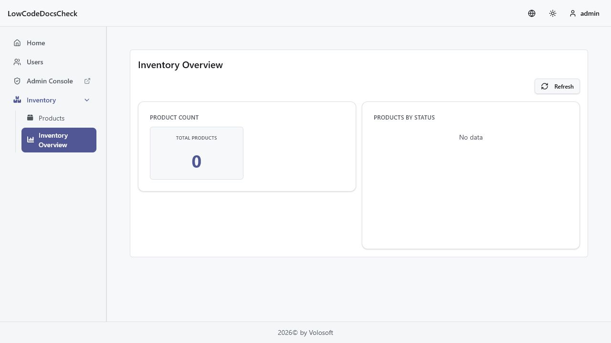

```json
//[doc-seo]
{
    "Description": "Define ABP Low-Code dashboard pages, visualizations, filters, layout, permissions, and React runtime data flow."
}
```

# Dashboards

Dashboards are low-code pages that render charts, lists, and number widgets from low-code entity data. A dashboard is still a page, so it uses the normal page name, title, icon, order, group, and permission model, but its page type is `dashboard` and its page definition carries a nested `dashboard` payload.

The runtime below was generated from a low-code dashboard page definition:



## Dashboard Pages

Dashboard pages live in the normal page descriptor collection. In source-controlled models, a dashboard page still belongs under `pages/`, not a separate dashboard folder.

Typical page-level fields include:

* `name`
* `title`
* `icon`
* `type: "dashboard"`
* `group`
* `order`
* `permissionConfig`
* `dashboard`

Runtime routes use the same dynamic page convention:

```text
/dynamic/<page-name>
```

## Layout Model

The stored dashboard descriptor uses a **flat visualization list**. Each visualization defines its own placement:

* `row`: zero-based visual row index
* `order`: order within the row
* `width`: current dashboard grid width, typically `1` or `2`

At runtime, the React UI groups those flat visualizations into rendered rows. This is similar to form layouts: storage stays flat, rendering derives the grouped structure.

```json
{
  "name": "sales-dashboard",
  "title": "Sales Dashboard",
  "type": "dashboard",
  "group": "analytics",
  "dashboard": {
    "description": "Operational sales view",
    "globalFilters": [
      { "type": "dateRange" }
    ],
    "visualizations": [
      {
        "name": "sales-by-status",
        "type": "chart",
        "title": "Sales by Status",
        "row": 0,
        "order": 0,
        "width": 2,
        "entityName": "Acme.Sales.Order",
        "chart": {
          "chartType": "bar",
          "xAxis": { "property": "Status" },
          "yAxis": [
            { "aggregation": "count", "label": "Orders" }
          ]
        }
      },
      {
        "name": "totals",
        "type": "numberContainer",
        "title": "Totals",
        "row": 1,
        "order": 0,
        "width": 2,
        "numberContainer": {
          "items": [
            {
              "name": "order-count",
              "title": "Order Count",
              "entityName": "Acme.Sales.Order",
              "aggregation": "count",
              "format": "number"
            }
          ]
        }
      }
    ]
  }
}
```

## Visualization Types

The current dashboard visualization types are:

* `chart`
* `list`
* `numberContainer`

### Chart

Chart visualizations define:

* `chartType`: `bar`, `line`, `pie`, or `donut`
* `xAxis`
* one or more `yAxis` aggregation series
* optional `maxItems`
* optional `showRecordCount`
* optional bar orientation

### List

List visualizations define:

* `fields`
* optional `sortBy`
* `maxRows`
* `rowHeight`
* optional `colorBy`

### Number Container

Number containers hold one or more number items. Each item can define:

* `aggregation`
* `aggregationProperty`
* `format`
* `color`
* entity-specific filters and global date filter linkage
* click-through behavior

## Filters and Interactivity

Dashboards support three filter layers:

* `globalFilters` for page-level controls such as date range
* visualization-level `filter` for fixed query constraints
* visualization `userFilters` for interactive filtering exposed to the runtime user

Other useful dashboard interaction fields include:

* `globalDateFilterProperty`
* `showDescriptionAsTooltip`
* `clickToSeeRecords`

These options let a dashboard stay compact while still allowing drill-down behavior in the runtime.

## Runtime Shape

The runtime definition exposed to React is grouped by rows and items, even though the stored descriptor is flat. The React runtime uses:

* `useDashboardDefinition`
* `useDashboardData`
* `GET /api/low-code/ui/dashboards/{pageName}`
* `POST /api/low-code/dashboards/{pageName}/data`

See [React Runtime](react-runtime.md) for hook-level details and route integration.

## Permissions and Menu Placement

Dashboard pages are read-oriented. Generated dashboard page operations are **view only**, so the usual CRUD operation set does not apply.

Dashboard pages can still:

* appear inside a [Page Group](page-groups.md)
* carry a menu icon and order
* use explicit or generated page permission configuration

Menu placement is handled at the page level through the normal `group` and `order` fields.

## See Also

* [React Runtime](react-runtime.md)
* [Low-Code Designer](designer.md)
* [Page Groups](page-groups.md)
* [Model Descriptor Files](model-json.md)
