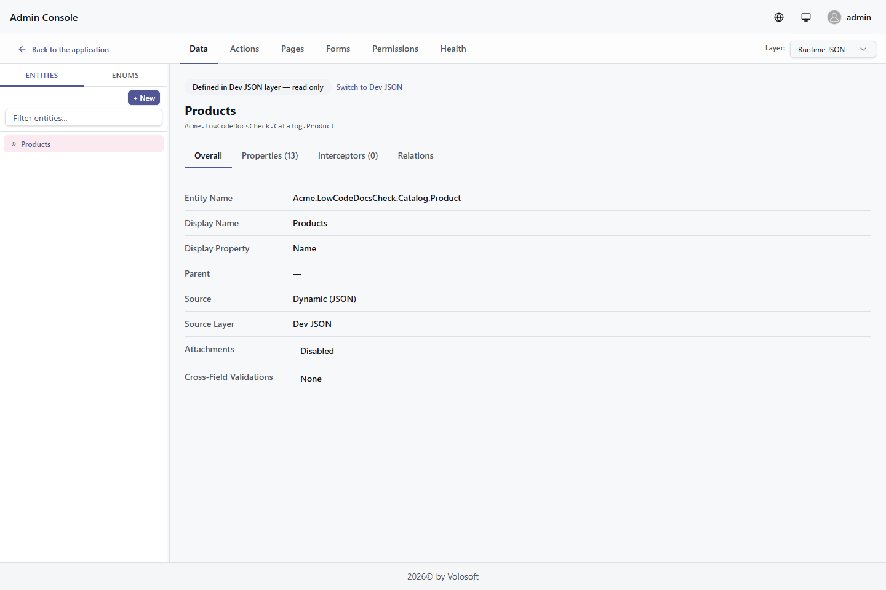

```json
//[doc-seo]
{
    "Description": "Use the ABP Admin Console Low-Code Designer to create dynamic entities, pages, forms, relations, filters, permissions, and model health checks."
}
```

# Low-Code Designer

> **Preview:** The Low-Code Designer is part of the preview Low-Code System. Designer screens, metadata fields, and validation rules may change before general availability.

The Low-Code Designer is available in ABP Admin Console. It is the main UI for building and maintaining low-code descriptor metadata.

```text
/admin-console/lowcode-designer
```

The designer works with layered descriptor metadata. In development, generated projects include source-controlled descriptor files under `_Dynamic` and a generated initializer. The designer can also persist changes to the database JSON layer, depending on the selected layer and permissions.


## Permissions and Layers

Designer APIs require the low-code designer permission. Users who can open runtime pages do not automatically get designer access.

The selected layer controls whether the designer can save changes. Read-only layers can be inspected but not mutated, and the designer blocks edits to layers that are not currently selected. Check the active layer before changing entities, pages, forms, scripts, or permissions.

## Sections

| Section | Purpose |
|---------|---------|
| Data | Entities, enums, properties, relations, inherited fields, and reference entities |
| Actions | Script-backed custom endpoints, event handlers, background jobs, workers, and model actions |
| Pages | Runtime pages, menu placement, page type, grid/card fields, filters, sorting, dashboards, and linked forms |
| Forms | Create/edit forms, tabs, groups, fields, controls, defaults, and actions |
| Permissions | Generated permission names and access control |
| Health | Model validation and runtime readiness checks |

## Data

Use **Data** to define the domain model.

Entities contain properties, display names, display property configuration, inherited audit fields, relations, and optional interceptors. Enums are created once and then used by enum properties.




### Relations

Relations are driven by foreign key properties. The designer shows direct N to 1 relations and many-to-many relations that are modeled through junction entities.


For reference entities such as `IdentityUser`, register the entity in the generated `_Dynamic` initializer. The designer and runtime can then show friendly display values instead of raw IDs.

## Pages

Use **Pages** to expose an entity in the React runtime.

Use [Page Groups](page-groups.md) to organize runtime menu folders and [Dashboards](dashboards.md) when a page type needs dashboard-specific descriptor details.

Pages can define data grid, kanban, calendar, gallery, standalone form, and dashboard experiences. A data grid page can define:

* Title and icon
* Menu group and order
* Entity
* Create and edit forms
* Visible grid/card fields
* Export fields for Excel, CSV, download-link columns, and file bundles
* Field labels and column widths
* Default sorting
* Filter fields and defaults
* File/image export defaults when the page has exportable file fields
* Whether file bundle ZIP export is allowed

Kanban pages add `groupByProperty`, calendar pages add date/time properties, gallery pages can use an image property, form pages reference a named form, and dashboard pages define rows and visualizations.


Pages are exposed in React under `/dynamic/<page-name>` and can also appear as dynamic menu items.

The **View Fields** section controls what users see in the runtime view. The separate **Export Fields** section controls what may leave the page through Excel, CSV, download-link columns, or file bundles. A visible field can be excluded from export, and an exportable field can be hidden from the page but still available through **Export options > All exportable fields**. Use the bulk actions to copy visible fields into the export policy, enable all fields, or disable all fields.

Open **Export Fields > More settings** only when you need custom export details. If **Use default export settings** is enabled, export uses display labels, the view field order, file name output, and file bundle export enabled. Turn it off to customize export labels, assign a separate export order, choose **Default File/Image Output**, or disable **Allow file bundle export**. File/image output controls appear only when the page has file or image fields, and they stay inactive until at least one file/image field is exportable.

## Forms

Use **Forms** to define create and edit experiences.

Forms can contain:

* Tabs
* Groups
* Ordered fields
* Control types
* Placeholder and help text
* Default values
* Required and validation behavior
* Conditional rules for hide/show, enable/disable, and set value behavior
* Save actions such as "save and new"

Source-controlled forms still need valid layout placements. If a form shows `No fields in this group`, check the matching descriptor file and make sure the group uses `layout.tabs[].groups[].fields[]` placements whose `fieldId` values match the form field definitions.

For example, this form defines three fields and places those same field IDs into the group layout:

```json
{
  "fields": [
    { "id": "name", "label": "Name", "type": "text", "binding": "Name" },
    { "id": "price", "label": "Price", "type": "money", "binding": "Price" },
    { "id": "is-active", "label": "Active", "type": "checkbox", "binding": "IsActive" }
  ],
  "layout": {
    "tabs": [
      {
        "groups": [
          {
            "fields": [
              { "fieldId": "name", "row": 0, "colSpan": 4 },
              { "fieldId": "price", "row": 1, "colSpan": 2 },
              { "fieldId": "is-active", "row": 1, "colSpan": 2 }
            ]
          }
        ]
      }
    ]
  }
}
```

The designer and runtime read the flat `fields[]` placement list shown above. If placements are missing, or if a placement points to a different ID such as `isActive` instead of `is-active`, the form can load but the group may stay visually empty.


## Filters

Filters are configured per page and rendered by the React runtime. The runtime uses type-specific operators to keep the UI simple:

* String fields use text operators.
* Number and money fields use range and comparison operators.
* Date fields use date labels such as on, after, and before.
* Boolean fields use `All / Yes / No`.
* File and image fields use `Has value` with `All / Yes / No`.

The URL query parameter keeps the existing `lcFilters` format, so bookmarked filtered pages continue to work.

## Permissions

Dynamic permissions are generated for entities and pages. Use the **Permissions** section to review names and grant access through the normal ABP permission management UI.

Generated pages and menus are permission-aware. If a user cannot access a page, the runtime does not show the menu item and API calls remain protected by backend authorization.

## Actions and Scripts

Use **Actions** only when descriptor metadata and standard CRUD behavior are not enough. The scripting surface can define custom HTTP endpoints, distributed event handlers, background jobs, and scheduled background workers. Scripts run server-side and use the [Scripting API](scripting-api.md).

JavaScript editors in the Designer provide syntax highlighting, service autocomplete, entity name autocomplete, entity property autocomplete, enum autocomplete, and an **Available context** list. The context list reflects the services enabled for the selected script type. The `fileFields` and `imageFields` context items are selector trees for `File` and `Image` properties used by the file and image helpers; they are not lists of every entity property.

Endpoint and event handler editors include **Test JavaScript**. Dry-run execution runs the current editor content without saving it, rolls back database writes, captures email/event/job/file side effects, and resolves outbound HTTP calls through test mocks. See [Script Actions](script-actions.md) for action descriptors and dry-run behavior.

## Health

Use **Health** before shipping changes. It helps catch missing display properties, invalid relation targets, form/page references, script problems, and other model issues that would otherwise surface at runtime. See [Health](health.md) for the selected-layer snapshot scope and the typical problem classes it helps you review.

## MCP Integration

The Designer and the low-code MCP surface overlap when the selected layer is **Runtime JSON**, but they are not the same editing surface. The Designer can inspect source-controlled and runtime layers, while [MCP Integration](mcp.md) is intentionally runtime-only and targets the database-backed model. Use the Designer when you want interactive editing and visual feedback. Use MCP when an agent or script needs a structured read, validate, apply, and health-check workflow against the runtime model.

After MCP-driven changes, reopen the relevant Designer section or review [Health](health.md) before reporting the model as ready.

## Source Control

For source-controlled models, keep the `_Dynamic` descriptor files and the generated initializer in your application repository. Use [Model Descriptor Files](model-json.md), [Attributes & Fluent API](fluent-api.md), and [Reference Entities](reference-entities.md) for advanced editing and integration details.
