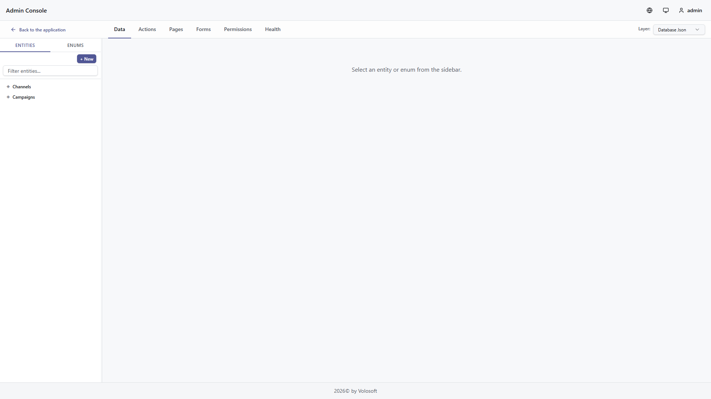
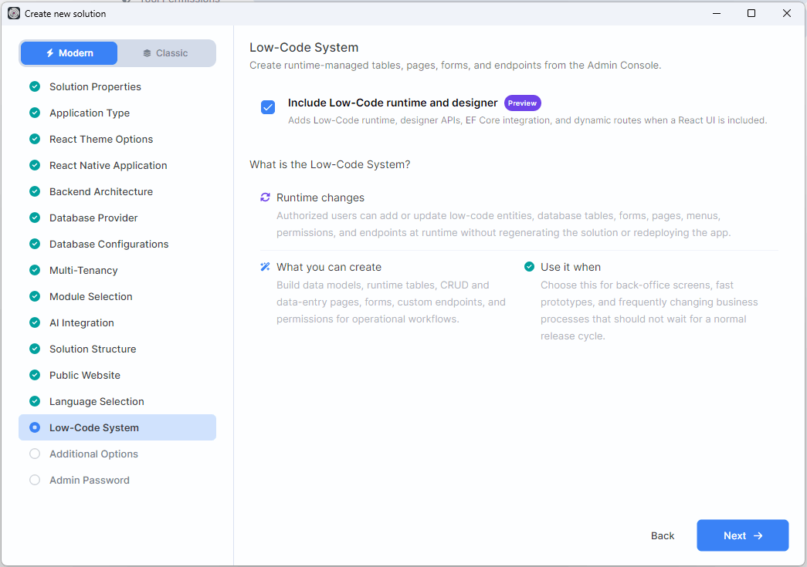
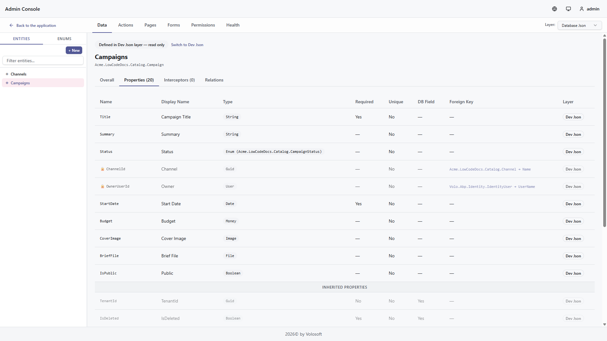
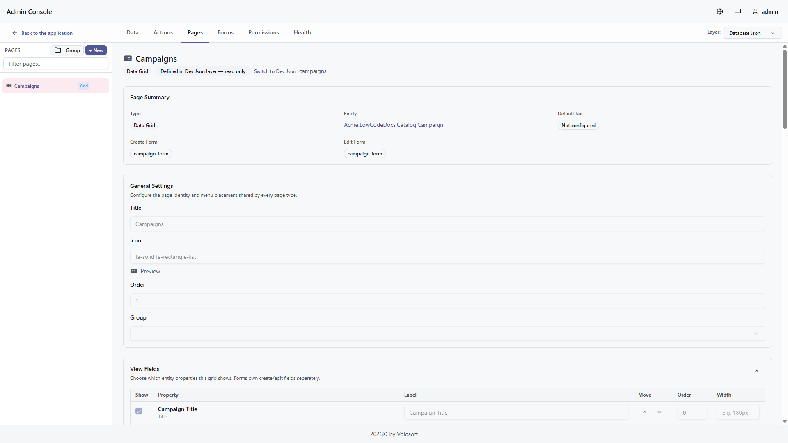
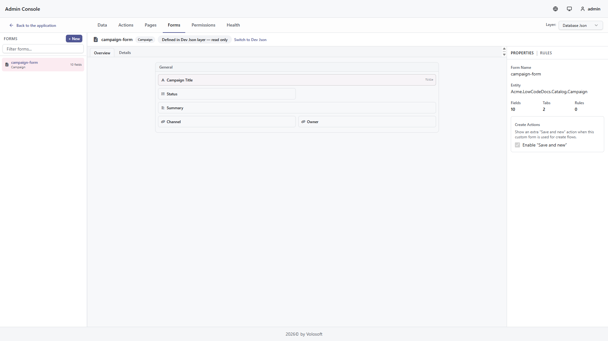
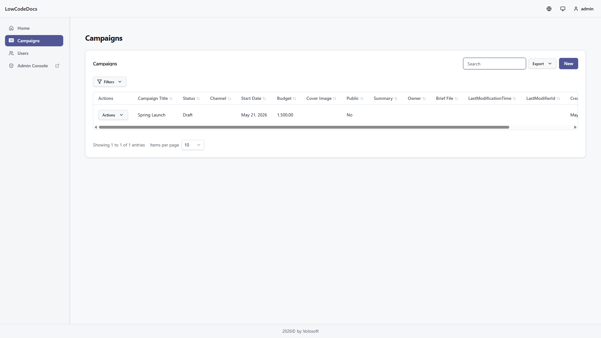
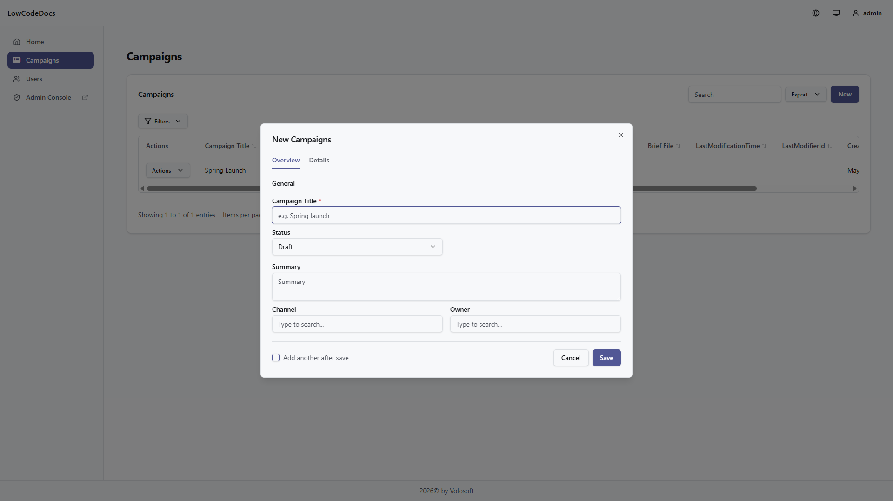
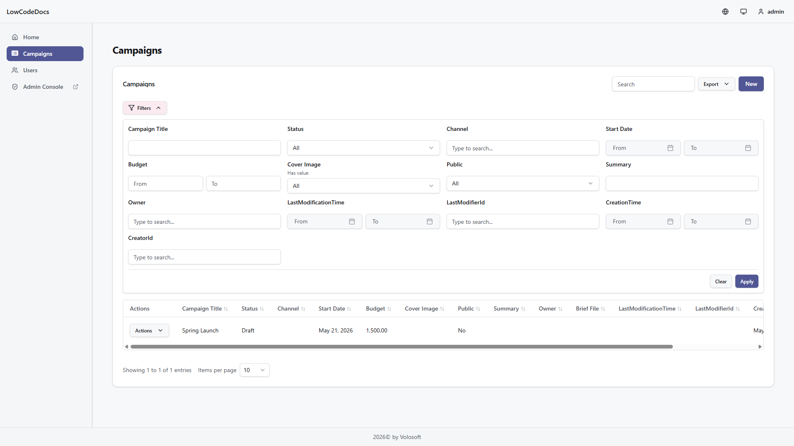
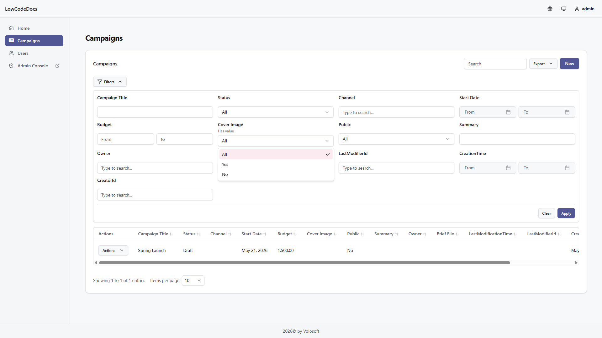

# Low-Code System

```json
//[doc-seo]
{
    "Description": "ABP Low-Code System: design dynamic entities, forms, pages, permissions, menus, filters, and React runtime pages with the Admin Console Low-Code Designer."
}
```

> You must have an ABP Team or a higher license to use this module.

> **Preview:** The Low-Code System is currently in preview. APIs, designer behavior, generated metadata, and React runtime details may change before general availability. Use it for evaluation and controlled projects, and review release notes before upgrading.

The ABP Low-Code System lets you build data-driven admin screens from metadata. The primary workflow is the **Low-Code Designer** in ABP Admin Console, backed by the **React runtime** in your application.

Use the designer to model entities, enums, properties, relations, pages, forms, filters, permissions, actions, and health checks. The runtime uses the same metadata to provide:

* CRUD REST APIs
* EF Core dynamic entity tables
* Permission definitions
* Dynamic menu items
* React data grid, kanban, calendar, gallery, form, and dashboard pages
* Create and edit forms
* Advanced filters
* Excel, CSV, and file bundle export

No DTO, repository, application service, controller, or React CRUD page is required for the standard flow.



## Supported UI

Low-Code runtime UI is currently documented for **React**. The backend model, APIs, permissions, scripting, and custom endpoint infrastructure are shared by the module, but the UI walkthroughs in this section focus on Admin Console plus React.

## How to Enable

The Low-Code System is an optional [ABP Studio](../studio/index.md) feature for modern application templates. In the modern wizard, the **Low-Code System** step is available for layered, single-layer, and modular monolith solutions. The step is skipped for microservice architecture and disabled when MongoDB is selected because runtime-managed tables require EF Core.



Enable **Include Low-Code runtime and designer** to add the low-code runtime, designer APIs, EF Core integration, and, when a React web UI is included, the generated React runtime wiring and dynamic routes.

ABP Studio creates the required backend module references, dynamic model initializer, EF Core configuration, and Admin Console integration. When the solution also includes the React web application, Studio adds the `@volo/abp-react-lowcode` package, dynamic routes, and menu integration for `/dynamic/...` runtime pages.

The generated React project includes:

* `@volo/abp-react-lowcode`
* `configureLowCode`
* `LowCodeLocalizationProvider`
* `createDynamicRoutes`
* `useMenuItems`
* Page, form, dashboard, file, and attachment hooks

If you already have a compatible solution and want to retrofit Low-Code later, see [Add Low-Code to an Existing Solution](add-to-existing-solution.md). When the existing UI is MVC, Razor Pages, Angular, or Blazor, continue with [Use Low-Code from a Non-React Application](non-react-ui-integration.md) for the companion runtime and navigation integration.

The host application wires the low-code modules, calls the generated `_Dynamic` initializer, configures EF Core dynamic entities, and seeds the required OpenIddict clients.

Generated solutions keep source-controlled low-code assets under `_Dynamic`:

* Layered and modular monolith solutions: `src/<YourApp>.Domain/_Dynamic/`
* Single-layer solutions: `<YourApp>.Host/_Dynamic/`

The `_Dynamic` folder includes the generated initializer, a `model/` directory that the runtime scans, and a `model-examples/` directory with sample descriptors that stay inactive until copied into `model/`.

Copying files from `model-examples/` into `model/` activates the descriptors, but persisted entity changes still follow the normal source-controlled migration flow. Run the generated database or low-code migration task before expecting `/dynamic/...` pages or `/api/low-code/pages/.../data` endpoints to read and write the backing table safely.

## Run the Application

After ABP Studio creates the solution, use **Solution Runner** to run the backend host and the React application. Run the database migration task before opening the runtime pages.

The generated solution README contains the exact command-line equivalents if you prefer to run the projects outside ABP Studio.

If you generate a solution inside another repository, make sure parent build files such as `Directory.Packages.props` are not inherited accidentally. Use an empty output folder outside another solution, or isolate the generated solution's MSBuild configuration before running `dotnet build`.

Open Admin Console and navigate to **Low-Code Designer** after the backend is running:

```text
https://localhost:<host-port>/admin-console/lowcode-designer
```

Open generated runtime pages after the React application is running:

```text
http://localhost:<react-port>/dynamic/<page-name>
```

If a copied sample page returns `403`, grant the generated low-code permissions to the role or user you are testing with through the standard ABP permission management UI.

If you edit descriptor JSON files manually, validate them before running migrations or publishing changes:

```bash
dotnet run --project <startup-project> -- --check-lowcode-model-files
```

The generated startup project accepts `--model-directory <path-to-_Dynamic/model>` when you want to validate a specific folder instead of the configured source assemblies.

## Designer Workflow

The designer is the day-to-day entry point.

1. Use **Data** to create entities, enums, properties, and relations.
2. Use **Pages** to choose a page type, menu placement, fields, default sorting, filters, dashboards, and linked forms.
3. Use **Forms** to arrange create and edit forms with tabs, groups, controls, validations, and actions.
4. Use **Permissions** to review generated permissions and control access.
5. Use **Actions** and **Interceptors** when the standard CRUD flow needs custom logic, endpoints, event handlers, jobs, or workers.
6. Use **Health** to review model issues before publishing changes.

The screens below follow that common designer flow from data to page setup to forms:







For virtual fields calculated from the current record, related records, or related-record aggregates, see [Calculated and Rollup Properties](formula-properties.md). For the provider-safe scalar syntax used by calculated properties and formula backfills, see the [Low-Code Expression Language](expression-language.md) reference.

## React Runtime

React runtime pages are generated from the same metadata. The examples below show a generated data grid and its create form. The same runtime can render kanban, calendar, gallery, standalone form, and dashboard page definitions.





## Filters

React low-code filters are type-aware. The runtime shows only operators that make sense for the field type. For example:



* Text fields support contains, equals, starts with, ends with, and has value.
* Numeric fields support equals, comparison, between, and has value.
* Date fields use date-friendly labels such as on, after, before, and between.
* Boolean fields use an `All / Yes / No` value selector.
* File and image fields use the same `All / Yes / No` selector behind a `Has value` filter.

In the current screenshot set, the dropdown below is shown on the `Active` boolean filter. The same three-value selector is also used by `Has value` filters on file and image fields.



## Export

Every dynamic entity page can export data to Excel or CSV. Pages with file or image fields can also export a file bundle as a ZIP. Export requests use the current search, sorting, and filters from the runtime view, so a filtered page exports the matching subset instead of the whole entity.

The React runtime exports visible exportable columns by default. These columns and their default order come from the page-level **Export Fields** settings in the Low-Code Designer. A field can be visible but not exportable, or hidden but still available in the **All exportable fields** option. Use this when a page should display operational data that should not leave the system through Excel or CSV. Server-only fields are always excluded, and foreign key values are displayed through their configured display property.

File and image fields are exported as file names by default. Export options can expand those fields into metadata columns or temporary download-link columns. Download-link columns include file name, URL, expiry, content type, size, dimensions, and status. The links are short-lived and should be treated like signed download links, not permanent public URLs.

Use **Files (.zip)** when users need the actual uploaded files. The action appears only when the Designer allows file bundle export and at least one selected file/image field is exportable. The ZIP contains `manifest.csv` and files under `files/{recordId}/{fieldName}/{safeFileName}`. The manifest records missing, malformed, unlinked, and limit-skipped files instead of failing the whole export.

Spreadsheet and ZIP exports require a short-lived, single-use download token. The token is bound to the tenant, page, entity, child page, and foreign-access context. File download links use separate short-lived tokens bound to the exported file value. Spreadsheet formula-like text values are escaped before writing CSV or Excel headers and cells.

| Endpoint | Description |
|----------|-------------|
| `GET /api/low-code/pages/{pageName}/download-token` | Gets a short-lived download token |
| `GET /api/low-code/pages/{pageName}/export/excel` | Exports filtered data as Excel |
| `GET /api/low-code/pages/{pageName}/export/csv` | Exports filtered data as CSV |
| `GET /api/low-code/pages/{pageName}/export/files` | Exports selected file/image fields as a ZIP bundle |
| `GET /api/low-code/pages/export/files/{token}` | Downloads one temporary file link created by spreadsheet export |

Useful export settings:

| Setting | Default | Purpose |
|---------|---------|---------|
| `LowCode:Export:MaxRows` | `100000` | Maximum rows in one all-filtered export |
| `LowCode:Export:DownloadTokenLifetimeSeconds` | `30` | Download token lifetime |
| `LowCode:Export:FileLinkTokenLifetimeSeconds` | `900` | Temporary file link lifetime |
| `LowCode:Export:MaxFileBundleFiles` | `1000` | Maximum files in one ZIP export |
| `LowCode:Export:MaxFileBundleBytes` | `268435456` | Maximum total file bytes in one ZIP export |

## Advanced Configuration

The designer stores and reads the same descriptor metadata described in the reference pages below. Use these pages when you need source-controlled descriptor files, custom startup wiring, script handlers, or low-level integration details.

| Topic | Use it for |
|-------|------------|
| [Designer](designer.md) | Admin Console tabs, entity/page/form setup, permissions, and health |
| [Calculated and Rollup Properties](formula-properties.md) | Virtual scalar formulas and related-record aggregates authored in the Designer |
| [Low-Code Expression Language](expression-language.md) | Provider-safe scalar syntax used by calculated properties and formula backfills |
| [Add Low-Code to an Existing Solution](add-to-existing-solution.md) | Retrofitting an existing EF Core solution with Studio import plus manual backend and React wiring |
| [Use Low-Code from a Non-React Application](non-react-ui-integration.md) | Keeping an MVC, Razor Pages, Angular, or Blazor UI while hosting the React Low-Code runtime and Designer alongside it |
| [React Runtime](react-runtime.md) | React package wiring, routes, menu items, filters, forms, and export |
| [Health](health.md) | Selected-layer readiness review across entities, pages, forms, page groups, permissions, and scripts |
| [Dashboards](dashboards.md) | Dashboard page descriptors, visualization layout, filters, and runtime data flow |
| [Page Groups](page-groups.md) | Dynamic menu folders, nesting, ordering, and page grouping |
| [MCP Integration](mcp.md) | Remote MCP endpoint, OpenIddict token setup, and authenticated runtime automation |
| [Attributes & Fluent API](fluent-api.md) | Source-controlled C# metadata and runtime overrides |
| [Model Descriptor Files](model-json.md) | JSON descriptor files and public descriptor schemas used by the designer and runtime |
| [Reference Entities](reference-entities.md) | Lookups to existing entities such as Identity users |
| [Code Integration](code-integration.md) | Moving between low-code models and regular C# code in both directions |
| [Foreign Access](foreign-access.md) | Access to related dynamic entities through relations |
| [Interceptors](interceptors.md) | JavaScript lifecycle logic for CRUD operations |
| [Custom Endpoints](custom-endpoints.md) | JavaScript-backed REST endpoints |
| [Script Actions](script-actions.md) | Event handlers, background jobs, background workers, script editor, and dry-run testing |
| [Scripting API](scripting-api.md) | Server-side script context and helpers |

## Runtime Internals

The generated pages are powered by these services:

* `DynamicEntityAppService` handles CRUD, list queries, filtering, sorting, and export.
* `DynamicPageAppService` exposes page-based CRUD, file, attachment, lookup, child, foreign-access, and export endpoints.
* `DynamicEntityUIAppService` returns page, form, dashboard, field, filter, and menu metadata.
* `DynamicPermissionDefinitionProvider` creates permissions for dynamic entities.
* `CustomEndpointExecutor` runs JavaScript-backed custom endpoints.
* EF Core maps dynamic entities as shared-type entities.

## See Also

* [Low-Code Designer](designer.md)
* [Calculated and Rollup Properties](formula-properties.md)
* [Low-Code Expression Language](expression-language.md)
* [Add Low-Code to an Existing Solution](add-to-existing-solution.md)
* [Use Low-Code from a Non-React Application](non-react-ui-integration.md)
* [React Runtime](react-runtime.md)
* [Health](health.md)
* [Dashboards](dashboards.md)
* [Page Groups](page-groups.md)
* [MCP Integration](mcp.md)
* [Code Integration](code-integration.md)
* [Model Descriptor Files](model-json.md)
