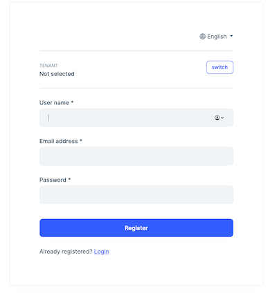
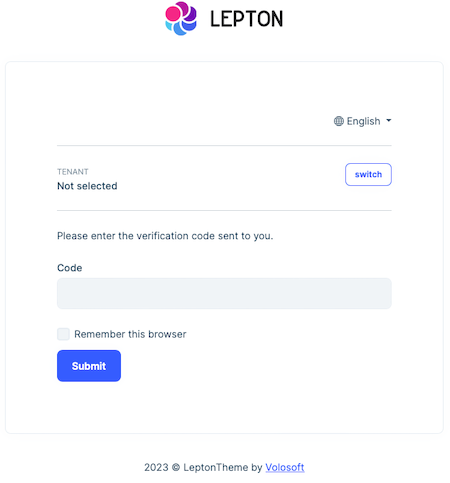
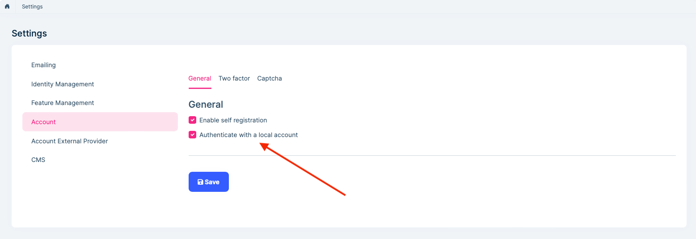
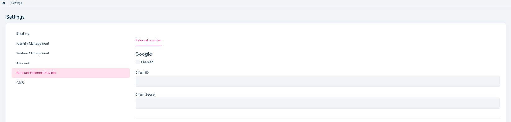

# Account Module (Pro)

> You must have an ABP Team or a higher license to use this module.

This module implements the Login, Register, Forgot Password, Email Confirmation, Password Reset, sending and confirming Two-Factor Authentication, user lockout, switch between tenants functionalities of an application;

* Built on the [Microsoft's ASP.NET Core Identity](https://docs.microsoft.com/en-us/aspnet/core/security/authentication/identity) library.
* OpenIddict Grant and Consent pages.
* Setting page to manage **self registration** and two-factor authentication.

See [the module description page](https://abp.io/modules/Volo.Account.Pro) for an overview of the module features.

## How to Install

The account is pre-installed in [the startup templates](../solution-templates/layered-web-application/index.md). So, no need to manually install it.

## Packages

This module follows the [module development best practices guide](../framework/architecture/best-practices) and consists of several NuGet and NPM packages. See the guide if you want to understand the packages and the relations between them.

You can visit the [Account module package list page](https://abp.io/packages?moduleName=Volo.Account.Pro) to see a list of packages related to this module.

## User Interface

### Menu Items

This module doesn't define any menu items.

### Pages

#### Login Page

The login page is used to log in to the system.


#### Register Page

The register page allows new users to register to your system.



#### Two-Factor Authentication

The identity module allows two-factor authentication pages.

##### Send Security Code

Send security code page allows selecting a two-factor authentication provider (Email, Phone etc...) and sends a security code to the user via the selected provider.


##### Verify Security Code

Verify security code page verifies the security code sent to the user and if the code is verified, the user logs in to the system.



## Data Seed

This module doesn't seed any data.

## Options

### AbpIdentityAspNetCoreOptions

`AbpAccountOptions` can be configured in the UI layer in the `ConfigureServices` method of your [module](../framework/architecture/modularity/basics.md). Example:

````csharp
Configure<AbpAccountOptions>(options =>
{
    //Set options here...
});
````

`AbpAccountOptions` properties:

* `WindowsAuthenticationSchemeName` (default: Windows): Name of the Windows authentication scheme.

### AbpProfilePictureOptions

`AbpProfilePictureOptions` can be configured in the UI layer in the `ConfigureServices` method of your [module](../framework/architecture/modularity/basics.md). Example:

````csharp
Configure<AbpProfilePictureOptions>(options =>
{
    //Set options here...
});
````

`AbpProfilePictureOptions` properties:

* `EnableImageCompression` (default: false): Enables the image compression for the profile picture. When enabled, the selected compression library will compress the profile picture to decrease the image size. For more information see [image manipulation](../framework/infrastructure/image-manipulation.md)

## Local login

The user can't log in through the local account and use the local account-related features such as `register` and `find password` if this setting is disabled.

If you use `Social / External Logins`, It is automatically called for authentication when logging in.




## Social / External Logins

The account module implements a social/external login system. All you need to do is to install & configure the provider you want to use.

The application startup template comes with **Twitter**, **Google** and **Microsoft** logins pre-installed. You can configure the client id and secrets on the Settings page:



The social/External login system is compatible with the multi-tenancy. Each tenant can configure their own provider settings if your application is multi-tenant.

### Install a new External Login

Follow the steps below to install a new external/social login. We will show Facebook authentication as an example.

> When you follow the steps below, the provider settings (e.g., ClientId and ClientSecret) will be managed on the settings page on the UI and will support multi-tenancy as explained above. If you don't want these features, follow [the standard way](../social-external-logins.md) to install and configure the provider.

#### Add the NuGet Package

Add the [Microsoft.AspNetCore.Authentication.Facebook](https://www.nuget.org/packages/Microsoft.AspNetCore.Authentication.Facebook) package to your project. Based on your architecture, this can be `.Web`, `.IdentityServer` (for tiered setup) or `.Host` project.

#### Configure the Provider

Use the `.AddFacebook(...)` and `WithDynamicOptions()` extension methods in the `ConfigureServices` method of your module:

````csharp
context.Services.AddAuthentication()
    .AddFacebook(facebook =>
    {
        facebook.Scope.Add("email");
        facebook.Scope.Add("public_profile");
    })
    .WithDynamicOptions<FacebookOptions>(
        FacebookDefaults.AuthenticationScheme,
        options =>
        {
            options.WithProperty(x => x.AppId);
            options.WithProperty(x => x.AppSecret, isSecret: true);
        }
    );
````

* `AddFacebook()` is the standard method that you can set hard-coded configuration.
* `WithDynamicOptions<FacebookOptions>` is provided by the Account Module which makes possible to configure the provided properties on the UI.

### IPostConfigureAccountExternalProviderOptions

Some external logins may be initialized based on dynamic properties. You can implement an `IPostConfigureAccountExternalProviderOptions` to initialize again after dynamic properties are initialized.

Example `OpenIdConnect`:

````csharp
public class OpenIdConnectPostConfigureAccountExternalProviderOptions : IPostConfigureAccountExternalProviderOptions<OpenIdConnectOptions>
{
    private readonly IEnumerable<IPostConfigureOptions<OpenIdConnectOptions>> _postConfigureOptions;
    public OpenIdConnectPostConfigureAccountExternalProviderOptions(IEnumerable<IPostConfigureOptions<OpenIdConnectOptions>> postConfigureOptions)
    {
        _postConfigureOptions = postConfigureOptions;
    }
    public Task PostConfigureAsync(string name, OpenIdConnectOptions options)
    {
        foreach (var configureOption in _postConfigureOptions)
        {
            configureOption.PostConfigure(name, options);
        }
        return Task.CompletedTask;
    }
}
````

````csharp
context.Services.AddAuthentication()
	.AddOpenIdConnect("AzureOpenId", "Azure AD", options =>
	{
		options.ResponseType = OpenIdConnectResponseType.CodeIdToken;
		options.RequireHttpsMetadata = false;
		options.SaveTokens = true;
		options.GetClaimsFromUserInfoEndpoint = true;
		options.Scope.Add("email");
		options.ClaimActions.MapJsonKey(ClaimTypes.NameIdentifier, "sub");
		options.CallbackPath = configuration["AzureAd:CallbackPath"];
	})
	.WithDynamicOptions<OpenIdConnectOptions, OpenIdConnectHandler>(
		"AzureOpenId",
		options =>
		{
			options.WithProperty(x => x.Authority);
			options.WithProperty(x => x.ClientId);
			options.WithProperty(x => x.ClientSecret, isSecret: true);
		}
	);
context.Services.TryAddEnumerable(ServiceDescriptor.Singleton<IPostConfigureAccountExternalProviderOptions<OpenIdConnectOptions>, OpenIdConnectPostConfigureAccountExternalProviderOptions>());
````

#### For Tiered / Separate IdentityServer Solutions

If your `.IdentityServer` is separated from the `.Host` project, then the `.Host` project should also be configured.

* Add the [Microsoft.AspNetCore.Authentication.Facebook](https://www.nuget.org/packages/Microsoft.AspNetCore.Authentication.Facebook) package to your `.Host` project.
* Add `WithDynamicOptions<FacebookOptions>()` configuration into the `ConfigureServices` method of your module (just copy the all code above and remove the `.AddFacebook(...)` part since it is only needed in the IdentityServer side).

## Internals

### Settings

See the `IAccountSettingNames` class members for all settings defined for this module.

### Application Layer

#### Application Services

* `AccountAppService` (implements `IAccountAppService`): Implements the use cases of the register and password reset UIs.
* `AccountSettingsAppService` (implements `IAccountSettingsAppService`):  Implements the use case of the account settings UI.

### Permissions

See the `AccountPermissions` class members for all permissions defined for this module.


### Angular UI

#### Installation

In order to configure the application to use the `AccountPublicModule` and the `AccountAdminModule`, you first need to import `AccountPublicConfigModule` from `@volo/abp.ng.account/public/config` and `AccountAdminConfigModule` from `@volo/abp.ng.account/admin/config` to root module. Config modules has a static `forRoot` method which you should call for a proper configuration.

```js
// app.module.ts
import { AccountAdminConfigModule } from '@volo/abp.ng.account/admin/config';
import { AccountPublicConfigModule } from '@volo/abp.ng.account/public/config';

@NgModule({
  imports: [
    // other imports
    AccountPublicConfigModule.forRoot(),
    AccountAdminConfigModule.forRoot(),
    // other imports
  ],
  // ...
})
export class AppModule {}
```

The `AccountPublicModule` should be imported and lazy-loaded in your routing module. It has a static `forLazy` method for configuration. Available options are listed below. It is available for import from `@volo/abp.ng.account/public`.

```js
// app-routing.module.ts
const routes: Routes = [
  // other route definitions
  {
    path: 'account',
    loadChildren: () =>
      import('@volo/abp.ng.account/public').then(m => m.AccountPublicModule.forLazy(/* options here */)),
  },
];

@NgModule(/* AppRoutingModule metadata */)
export class AppRoutingModule {}
```

> If you have generated your project via the startup template, you do not have to do anything, because it already has the modules.

<h4 id="h-account-module-options">Options</h4>

You can modify the look and behavior of the module pages by passing the following options to `AccountModule.forLazy` static method:

- **redirectUrl**: Default redirect URL after logging in.
- **entityActionContributors:** Changes grid actions. Please check [Entity Action Extensions for Angular](../framework/ui/angular/entity-action-extensions.md) for details.
- **toolbarActionContributors:** Changes page toolbar. Please check [Page Toolbar Extensions for Angular](../framework/ui/angular/page-toolbar-extensions.md) for details.
- **entityPropContributors:** Changes table columns. Please check [Data Table Column Extensions for Angular](../framework/ui/angular/data-table-column-extensions.md) for details.

#### Services / Models

Account module services and models are generated via `generate-proxy` command of the [ABP CLI](../cli). If you need the module's proxies, you can run the following commands in the Angular project directory.

The command below generates `AccountPublicModule` proxies:

```bash
abp generate-proxy --module account
```

The command below generates `AccountAdminModule` proxies:
```bash
abp generate-proxy --module accountAdmin
```

#### Replaceable Components

`eAccountComponents` enum provides all replaceable component keys. It is available for import from `@volo/abp.ng.account/public`.

Please check [Component Replacement document](../framework/ui/angular/component-replacement.md) for details.


#### Remote Endpoint URL

The Account module remote endpoint URLs can be configured in the environment files.

```js
export const environment = {
  // other configurations
  apis: {
    default: {
      url: 'default url here',
    },
    AbpAccountPublic: {
      url: 'AbpAccountPublic remote url here'
    },
    AbpAccountAdmin: {
      url: 'AbpAccountAdmin remote url here'
    },
    // other api configurations
  },
};
```

The Account module remote URL configurations shown above are optional. If you don't set any URLs, the `default.url` will be used as fallback.

### MauiBlazor UI

#### Resource Owner Password Flow

OAuth is preconfigured as authorization code flow in MauiBlazor application templates by default. If you added the account module to your project, you can switch the flow to resource owner password flow by changing the OAuth configuration in the `appsettings.json` files as shown below:

```json
"OAuthConfig": {
    "Authority": "https://localhost:44305", // AuthServer url
    "RequireHttpsMetadata": "true",
    "ClientId": "MyProjectName_MauiBlazor",
    "RedirectUri": "myprojectnamemauiblazor://",
    "PostLogoutRedirectUri": "myprojectnamemauiblazor://",
    "Scope": "offline_access MyProjectName",
    "GrantType": "password"
}
```

## Distributed Events

This module doesn't define any additional distributed event. See the [standard distributed events](../framework/infrastructure/event-bus).

## See Also

* [Authority Delegation](./account/authority-delegation.md)
* [Impersonation](./account/impersonation.md)
* [Linked Accounts](./account/linkedaccounts.md)
* [Session Management](./account/session-management.md)
