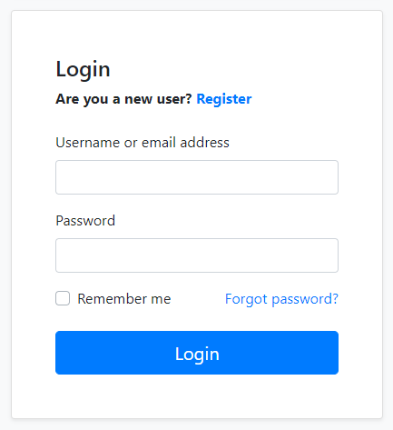
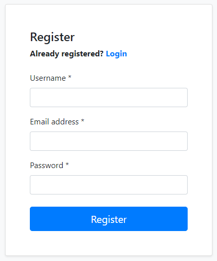
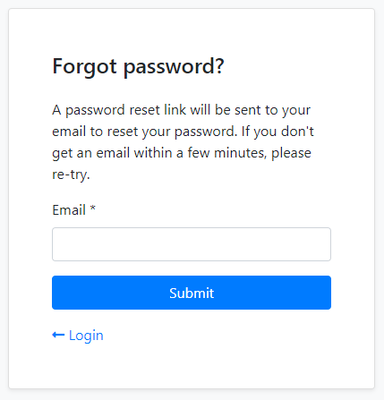
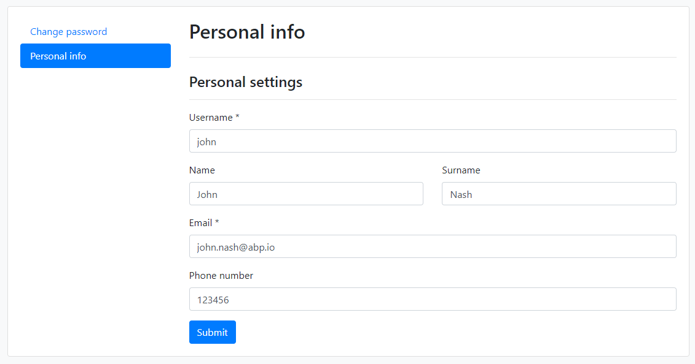

```json
//[doc-seo]
{
    "Description": "Explore the Account Module for ABP Framework, featuring essential authentication functions like login, registration, and account management with advanced integration options."
}
```

# Account Module

Account module implements the basic authentication features like **login**, **register**, **forgot password** and **account management**.

This module is based on [Microsoft's Identity library](https://docs.microsoft.com/en-us/aspnet/core/security/authentication/identity) and the [Identity Module](./identity.md). It has [IdentityServer](https://github.com/IdentityServer) integration (based on the [IdentityServer Module](./identity-server.md)) and [OpenIddict](https://github.com/openiddict) integration (based on the [OpenIddict Module](./openiddict.md)) to provide **single sign-on**, access control and other advanced authentication features.

## How to Install

This module comes as pre-installed (as NuGet/NPM packages). You can continue to use it as package and get updates easily, or you can include its source code into your solution (see `get-source` [CLI](../cli) command) to develop your custom module.

### The Source Code

The source code of this module can be accessed [here](https://github.com/abpframework/abp/tree/dev/modules/account). The source code is licensed with [MIT](https://choosealicense.com/licenses/mit/), so you can freely use and customize it.

## User Interface

This section introduces the main pages provided by this module.

### Login

`/Account/Login` page provides the login functionality.



Social/external login buttons becomes visible if you setup it. See the *Social/External Logins* section below. Register and Forgot password and links redirect to the pages explained in the next sections.

### Register

`/Account/Register` page provides the new user registration functionality.



New users receive every Identity role marked as `Default`.

### Forgot Password & Reset Password

`/Account/ForgotPassword` page provides a way of sending password reset link to user's email address. The user then clicks to the link and determines a new password.



> The host part of the password reset link is built from `AppUrlOptions.Applications["MVC"].RootUrl`. Configure it if the default `App:SelfUrl` isn't what you want users to see in emails — for example, when you use subdomain-based multi-tenancy and want the link to point to the tenant's subdomain. See [Application URLs](../framework/infrastructure/app-urls.md).

### Account Management

`/Account/Manage` page is used to change password and personal information of the user.



`IdentitySettingNames.User.IsUserNameUpdateEnabled` and `IdentitySettingNames.User.IsEmailUpdateEnabled` control whether the profile application service accepts changes to those fields. Both settings are `true` by default. External users can't change a local password; the built-in MVC profile page omits the password group for them and the application service rejects a password change.

### Login and Registration Settings

The Account module defines two client-visible settings. Both are `true` by default:

* `AccountSettingNames.IsSelfRegistrationEnabled` controls self-registration. It is enforced by `IAccountAppService.RegisterAsync` as well as the built-in registration pages.
* `AccountSettingNames.EnableLocalLogin` controls the local username/password login UI and handlers in the MVC Account pages, the OpenIddict and IdentityServer integrations, and the Angular Account layout. In Angular, `AuthWrapperService` reads the setting; the Basic Theme's `AuthWrapperComponent` shows the account content when it is enabled and a no-login-schemes warning when it is disabled.

These settings are independent. Disabling local login doesn't disable the registration application service. Set `IsSelfRegistrationEnabled` to `false` as well when users must not create local accounts. Change the values with `ISettingManager` like other [settings](../framework/infrastructure/settings.md). Global or tenant values are normally appropriate because the login and registration requests run before a user is authenticated.

### Extending the MVC Profile Page

The MVC `/Account/Manage` page is built from the contributors in `ProfileManagementPageOptions.Contributors`. Implement `IProfileManagementPageContributor` to add a group backed by a view component, then register it from your module:

```csharp
Configure<ProfileManagementPageOptions>(options =>
{
    options.Contributors.Add(new MyProfileManagementPageContributor());
});
```

Each contributor receives a `ProfileManagementPageCreationContext` and appends `ProfileManagementPageGroup` instances to its `Groups` collection. Contributors run in registration order on both GET and POST requests, and can resolve services through `context.ServiceProvider` when visibility depends on the current user or another runtime condition.

### Angular UI Extensibility

The Angular `createRoutes` function accepts three module-specific options: `redirectUrl`, `isPersonalSettingsChangedConfirmationActive` and `editFormPropContributors`. The form contributor key is `eAccountComponents.PersonalSettings`. The login, register, forgot-password, reset-password and manage-profile routes are also registered with the corresponding `eAccountComponents` keys for [component replacement](../framework/ui/angular/component-replacement.md). See [Dynamic Form Extensions](../framework/ui/angular/dynamic-form-extensions.md) for the contributor pattern.

## OpenIddict Integration

[Volo.Abp.Account.Web.OpenIddict](https://www.nuget.org/packages/Volo.Abp.Account.Web.OpenIddict) package provides integration for the [OpenIddict](https://github.com/openiddict). This package comes as installed with the [application startup template](../solution-templates/layered-web-application). See the [OpenIddict Module](./openiddict.md) documentation.

## IdentityServer Integration

[Volo.Abp.Account.Web.IdentityServer](https://www.nuget.org/packages/Volo.Abp.Account.Web.IdentityServer) package provides integration for the [IdentityServer](https://github.com/IdentityServer). This package comes as installed with the [application startup template](../solution-templates/layered-web-application/index.md). See the [IdentityServer Module](./identity-server.md) documentation.

## Social/External Logins

The Account Module has already configured to handle social or external logins out of the box. You can follow the ASP.NET Core documentation to add a social/external login provider to your application.

The MVC login and registration pages also recognize a Windows authentication scheme. `AbpAccountOptions.WindowsAuthenticationSchemeName` identifies that scheme and defaults to `"Windows"`. Set it when the registered scheme uses another name:

```csharp
Configure<AbpAccountOptions>(options =>
{
    options.WindowsAuthenticationSchemeName = "Negotiate";
});
```

### Example: Facebook Authentication

Follow the [ASP.NET Core Facebook integration document](https://docs.microsoft.com/en-us/aspnet/core/security/authentication/social/facebook-logins) to support the Facebook login for your application.

#### Add the NuGet Package

Add the [Microsoft.AspNetCore.Authentication.Facebook](https://www.nuget.org/packages/Microsoft.AspNetCore.Authentication.Facebook) package to your project. Based on your architecture, this can be `.Web`, `.IdentityServer` (for tiered setup) or `.Host` project.

#### Configure the Provider

Use the `.AddFacebook(...)` extension method in the `ConfigureServices` method of your [module](../framework/architecture/modularity/basics.md), to configure the client:

````csharp
context.Services.AddAuthentication()
    .AddFacebook(facebook =>
    {
        facebook.AppId = "...";
        facebook.AppSecret = "...";
        facebook.Scope.Add("email");
        facebook.Scope.Add("public_profile");
    });
````

> It would be a better practice to use the `appsettings.json` or the ASP.NET Core User Secrets system to store your credentials, instead of a hard-coded value like that. Follow the [Microsoft's document](https://docs.microsoft.com/en-us/aspnet/core/security/authentication/social/facebook-logins) to learn the user secrets usage.
