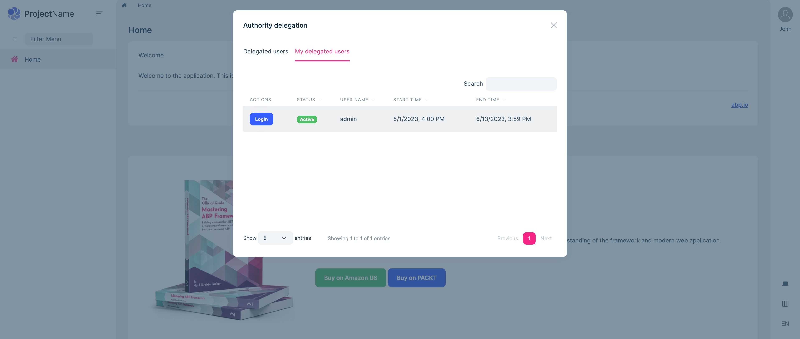
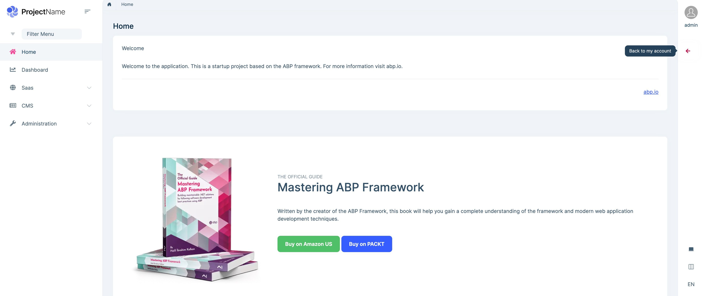

# Authority Delegation

Authority Delegation is a way of delegating the responsibility of the current user to a different user(s) for a limited time. Thus, the user can switch to the delegated user's account and perform actions on their behalf.

## Enable/Disable Authority Delegation

Authority Delegation is enabled by default in [ABP Startup Templates](../../solution-templates) since v7.2. However, if your ABP version is lower than 7.2, you need to manually enable it. 

>The Authority Delegation feature uses the impersonation system internally, therefore make sure you have correctly configured the [impersonation feature](./impersonation.md) before enabling the Authority Delegation.

You can enable the Authority Delegation feature by reading the following sections according to your UI option.

### MVC Tiered & Microservice MVC UI

```csharp
private Task ConfigureUserMenuAsync(MenuConfigurationContext context)
{
    var authServerUrl = _configuration["AuthServer:Authority"] ?? "~";
    var uiResource = context.GetLocalizer<AbpUiResource>();
    var accountResource = context.GetLocalizer<AccountResource>();
    var currentUser = context.ServiceProvider.GetRequiredService<ICurrentUser>();
    var options = context.ServiceProvider.GetRequiredService<IOptions<AbpAccountAuthorityDelegationOptions>>();

    // Add the authority delegation user menu
    if (currentUser.FindImpersonatorUserId() == null && options.Value.EnableDelegatedImpersonation)
    {
        context.Menu.AddItem(new ApplicationMenuItem("Account.AuthorityDelegation", accountResource["AuthorityDelegation"], url: "javascript:void(0)", icon: "fa fa-users"));
    }

    context.Menu.AddItem(new ApplicationMenuItem("Account.Manage", accountResource["MyAccount"], $"{authServerUrl.EnsureEndsWith('/')}Account/Manage", icon: "fa fa-cog", order: 1000, null, "_blank").RequireAuthenticated());
    context.Menu.AddItem(new ApplicationMenuItem("Account.SecurityLogs", accountResource["MySecurityLogs"], $"{authServerUrl.EnsureEndsWith('/')}Account/SecurityLogs", icon: "fa fa-cog", target: "_blank").RequireAuthenticated());
    context.Menu.AddItem(new ApplicationMenuItem("Account.Logout", uiResource["Logout"], url: "~/Account/Logout", icon: "fa fa-power-off", order: int.MaxValue - 1000).RequireAuthenticated());

    return Task.CompletedTask;
}
```

### Blazor Tiered & Microservice Blazor UI

```csharp
private Task ConfigureUserMenuAsync(MenuConfigurationContext context)
{
    var authServerUrl = _configuration["AuthServer:Authority"] ?? "~";
    var uiResource = context.GetLocalizer<AbpUiResource>();
    var accountResource = context.GetLocalizer<AccountResource>();
    var currentUser = context.ServiceProvider.GetRequiredService<ICurrentUser>();
    var options = context.ServiceProvider.GetRequiredService<IOptions<AbpAccountAuthorityDelegationOptions>>();

    // Add the authority delegation user menu
    if (currentUser.FindImpersonatorUserId() == null && options.Value.EnableDelegatedImpersonation)
    {
        context.Menu.AddItem(new ApplicationMenuItem("Account.AuthorityDelegation", accountResource["AuthorityDelegation"], url: "javascript:void(0)", icon: "fa fa-users").UseComponent(typeof(AuthorityDelegationModal)));
    }

    context.Menu.AddItem(new ApplicationMenuItem("Account.Manage", accountResource["MyAccount"], $"{authServerUrl.EnsureEndsWith('/')}Account/Manage", icon: "fa fa-cog", order: 1000, null, "_blank").RequireAuthenticated());
    context.Menu.AddItem(new ApplicationMenuItem("Account.SecurityLogs", accountResource["MySecurityLogs"], $"{authServerUrl.EnsureEndsWith('/')}Account/SecurityLogs", icon: "fa fa-cog", target: "_blank").RequireAuthenticated());
    context.Menu.AddItem(new ApplicationMenuItem("Account.Logout", uiResource["Logout"], url: "~/Account/Logout", icon: "fa fa-power-off", order: int.MaxValue - 1000).RequireAuthenticated());

    return Task.CompletedTask;
}
```

> **Note:** Currently, the Blazor Tiered UI is not implemented yet, we are aiming to make it available in v7.3.

## User Interface (UI)

### Delegating a new user

You can see the `Authority Delegation` menu item under the user menu. When you click the menu, a modal will open, and in the first tab of the modal, you will see the list of delegated users:


You can click the `Delegate New User` button to delegate a new user:


* You can specify a time range to ensure the delegation is only available within the time range.
* You can make multiple delegates to the same user and set different delegate time ranges.

> You have to enter the full username to query and delegate a user.

> The delegation has three states: `Expired`, `Active`, and `Future`. These states are set automatically by checking the specified time interval.

### My delegated users

You can see a list of users who delegated you to login on their behalf of them, as in the figure below:



You can click the `Login` button to log in to the application as a delegated user and go back to your account by clicking the `Back to my account` icon:


