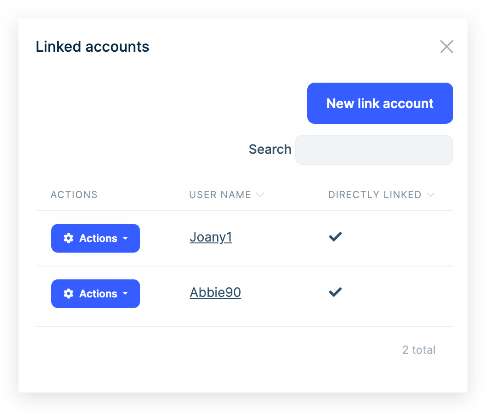
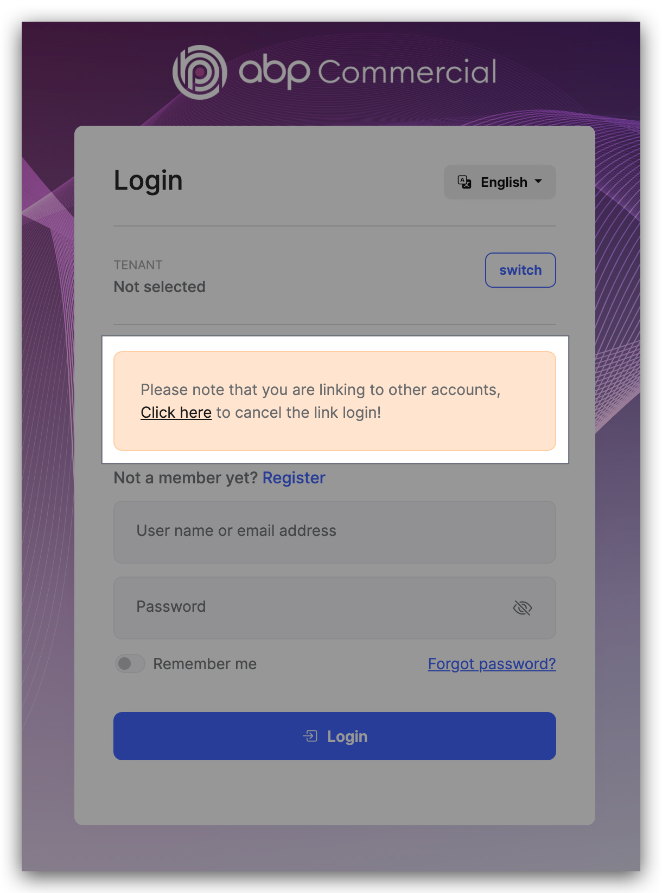
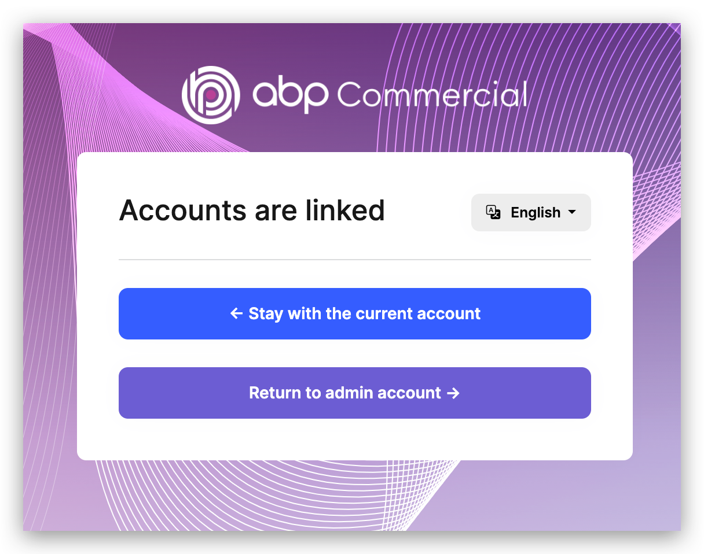
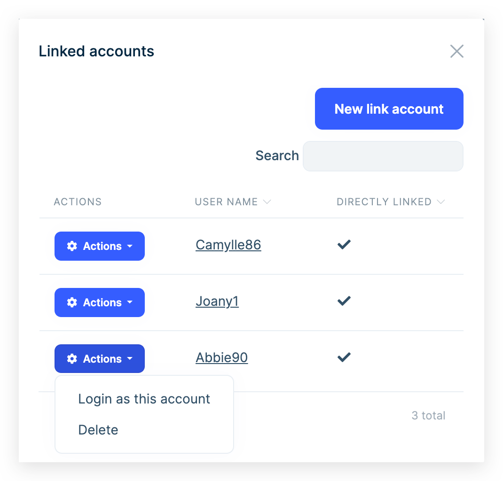
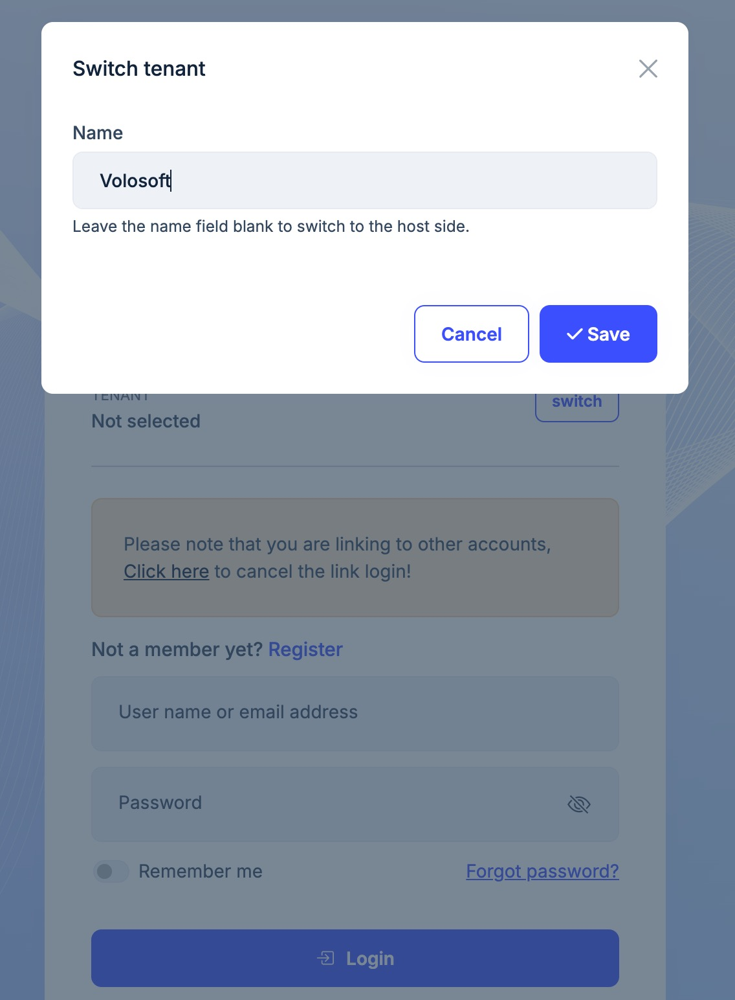
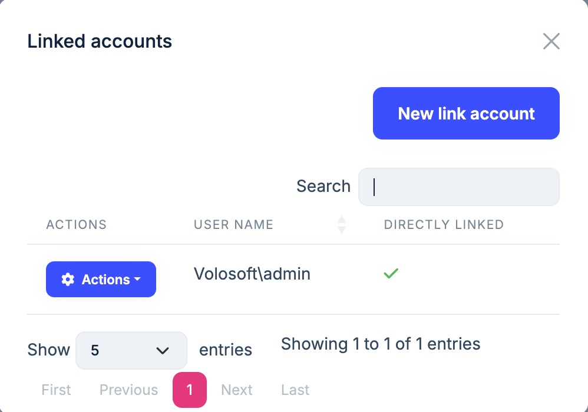
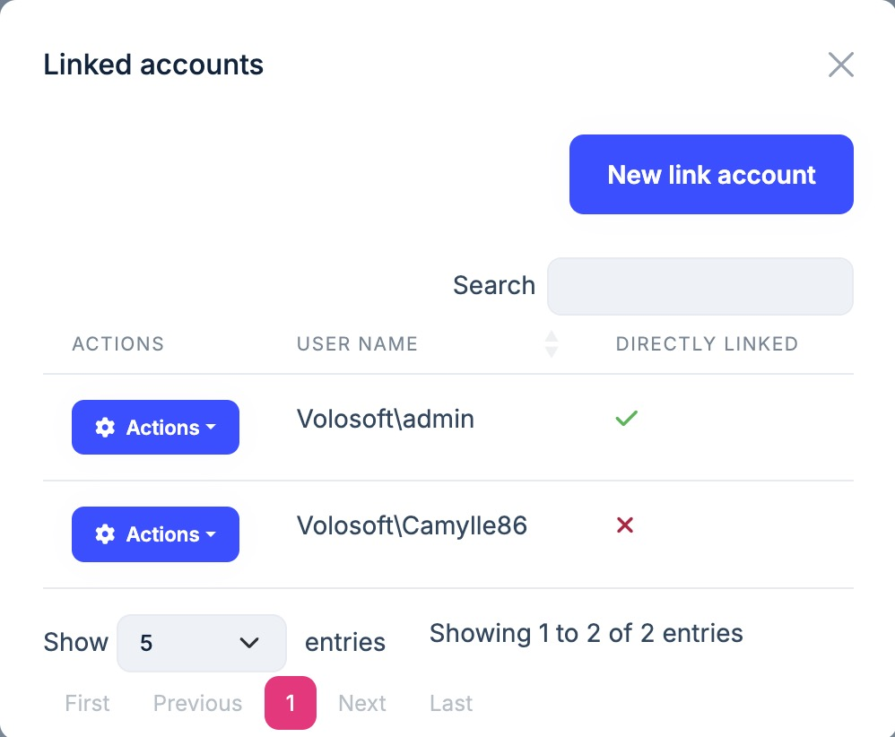

# Linked Accounts

Linked accounts are used to link multiple accounts to each other. In this way, a user can easily navigate through his/her accounts using this feature.

## User Interface (UI)

### Linked accounts

You can see the `Linked accounts` menu item under the user menu. When you click the menu, a modal will open, and in the first tab of the modal, you will see the list of linked accounts:

You can click the `New link user` button to link a new user:

> You'll be logged out from the current account and logging in with another account. Once you do it, two accounts will be linked.

You will see the following message on the login page when you try to linked a new account:

Enter the username and password of the account you want to link and click the `Login` button. If the login is successful, you will see the following page, You can stay with the current account or return to the previous account.

### Login with linked accounts

You can login with linked accounts or delete it from the `Linked accounts` modal.

## Multi-tenancy

Linked accounts can be used in multi-tenancy. You can link accounts from different tenants.

Enter the tenant name to link the account from another tenant's account:

You can see and login with linked accounts from different tenants:

## Indirect link

You can link accounts indirectly. For example, if account A is linked to account B and account B is linked to account C, account A is indirectly linked to account C. 

You can see the indirect link in the `Linked accounts` modal:

