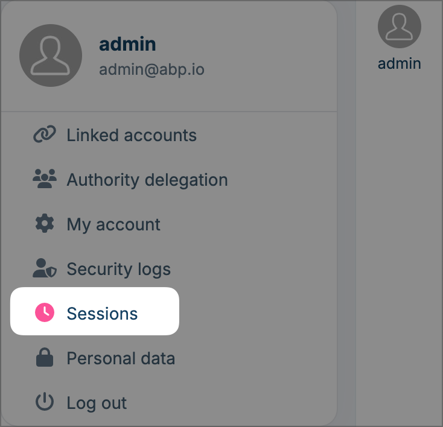
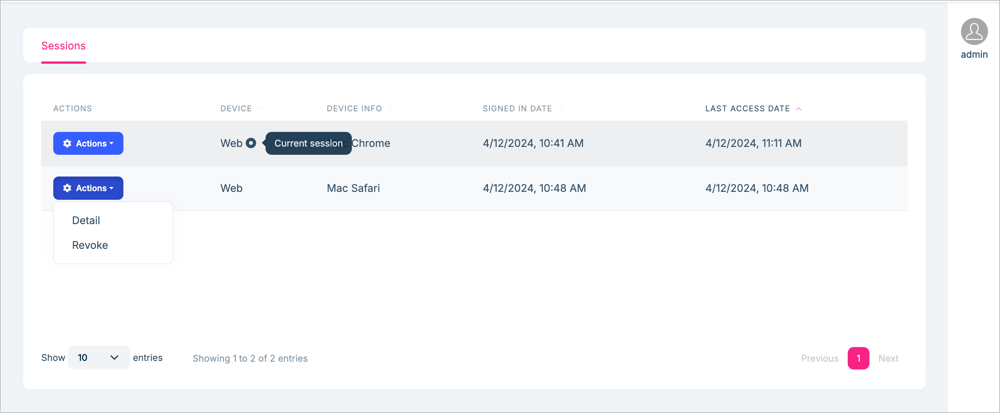
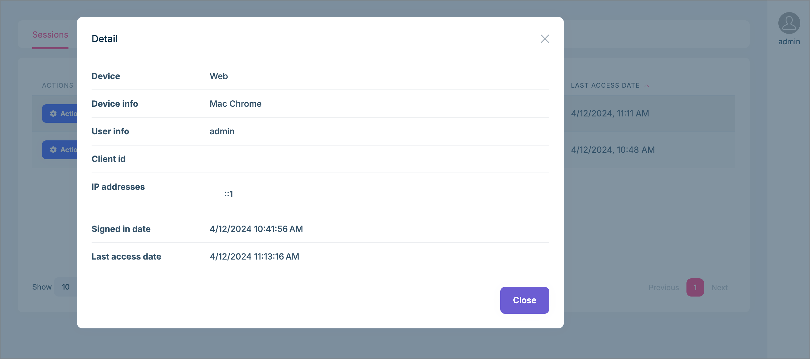

# Session Management

Session Management feature allows you to prevent concurrent login and manage user sessions.

See the [Session Management](../identity/session-management.md) of Identity Pro document to learn more about this feature.

## Manage my sessions

As usual, you can view/manage your own sessions in the `My Sessions` page of the Account Pro module.

