```json
//[doc-seo]
{
    "Description": "Manage persisted AI workspaces, providers, RAG data sources, MCP tools and remote AI clients with the ABP AI Management module."
}
```

# AI Management (Pro)

> You must have an ABP Team or a higher license to use this module.

This module implements AI (Artificial Intelligence) management capabilities on top of the [Artificial Intelligence Workspaces](../../framework/infrastructure/artificial-intelligence/index.md) feature of the ABP Framework and allows managing workspaces dynamically from the application, including UI components and API endpoints.

## How to Install

The **AI Management Module** is not included in [the startup templates](../../solution-templates/layered-web-application/index.md) by default. However, when creating a new application with [ABP Studio](../../studio/overview.md), you can easily enable it during setup via the *AI Integration* step in the project creation wizard. Alternatively, you can install it using the ABP CLI or ABP Studio:

**Using ABP CLI:**

```bash
abp add-module Volo.AIManagement
```

**Using ABP Studio:**

Open ABP Studio, navigate to your solution explorer, **Right Click** on the project and select **Import Module**. Choose `Volo.AIManagement` from `NuGet` tab and check the "Install this Module" checkbox. Click the "OK" button to install the module.

### Adding an AI Provider

> [!IMPORTANT]
> The AI Management module requires **at least one AI provider** package to be installed. Without a provider, the module won't be able to create chat clients for your workspaces.

Install one of the built-in provider packages using the ABP CLI:

**For OpenAI (including Azure OpenAI-compatible endpoints):**

```bash
abp add-package Volo.AIManagement.OpenAI
```

**For Ollama (local AI models):**

```bash
abp add-package Volo.AIManagement.Ollama
```

> [!IMPORTANT]
> If you use Ollama, make sure the Ollama server is installed and running, and that the models referenced by your workspace are already available locally. Before configuring an Ollama workspace, pull the chat model and any embedding model you plan to use. For example:
>
> ```bash
> ollama pull llama3.2
> ollama pull nomic-embed-text
> ```
>
> Replace the model names with the exact models you configure in the workspace. `nomic-embed-text` is an embedding-only model and can't be used as a chat model.

> [!TIP]
> You can install multiple provider packages to support different AI providers simultaneously in your workspaces.

If you need to integrate with a provider that isn't covered by the built-in packages, you can implement your own. See the [Implementing Custom AI Provider Factories](#implementing-custom-ai-provider-factories) section for details.

### Adding RAG Dependencies

> [!TIP]
> RAG is entirely optional. All other AI Management features work without any RAG dependencies installed.

Retrieval-Augmented Generation (RAG) support requires both an embedding provider and a vector store provider.

Install at least one embedding provider package:

```bash
abp add-package Volo.AIManagement.OpenAI
# or
abp add-package Volo.AIManagement.Ollama
```

Install at least one vector store package:

```bash
abp add-package Volo.AIManagement.VectorStores.MongoDB
# or
abp add-package Volo.AIManagement.VectorStores.Pgvector
# or
abp add-package Volo.AIManagement.VectorStores.Qdrant
```

> [!NOTE]
> Available provider names in workspace settings come from registered factories at startup. Built-in names are `OpenAI` and `Ollama` for embedding providers, and `MongoDb`, `Pgvector`, and `Qdrant` for vector stores.

## Packages

This module follows the [module development best practices guide](../../framework/architecture/best-practices) and consists of several NuGet and NPM packages. See the guide if you want to understand the packages and relations between them.

You can visit [AI Management module package list page](https://abp.io/packages?moduleName=Volo.AIManagement) to see list of packages related with this module.

AI Management module packages are designed for various usage scenarios. Packages are grouped by the usage scenario as `Volo.AIManagement.*` and `Volo.AIManagement.Client.*`. This structure helps to separate the use-cases clearly.

## User Interface

This module provides administration and client UI for the following UI stacks:

* **MVC / Razor Pages** UI
* **Angular** UI
* **Blazorise** UI (Server & WebAssembly)
* **MudBlazor** UI (Server & WebAssembly)
* **React Admin Console** management UI

### Menu Items

The **AI Management Module** adds the following items to the "Main" menu:

* **AI Management**: Root menu item for AI Management module. (`AIManagement`)
  * **Workspaces**: Workspace management page. (`AIManagement.Workspaces`)
  * **MCP Servers**: MCP server management page. (`AIManagement.McpServers`)

`AIManagementMenus` class has the constants for the menu item names.

### Pages

#### Workspace Management

Workspaces page is used to manage AI workspaces in the system. You can create, edit, duplicate, and delete workspaces.

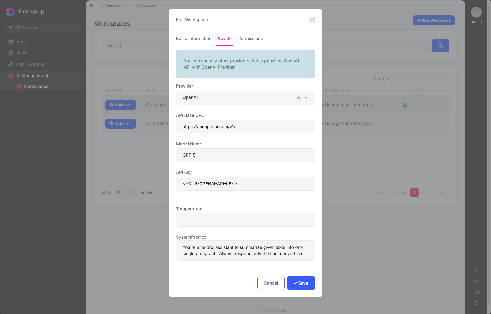

You can create a new workspace or edit an existing workspace in this page. The workspace configuration includes:

* **Name**: Unique identifier for the workspace (cannot contain spaces)
* **Provider**: AI provider (OpenAI, Ollama, or custom providers)
* **Model**: AI model name (e.g., gpt-4, mistral)
* **API Key**: Authentication key (if required by provider)
* **API Base URL**: Custom endpoint URL (optional)
* **System Prompt**: Default system instructions
* **Temperature**: Provider-specific response randomness
* **Embedder Provider / Model**: Embedding generator used for RAG
* **Vector Store Provider / Settings**: Storage backend and connection settings for document vectors

The **Application Name** is assigned by the application that creates or synchronizes the workspace. Workspace access is managed from the resource permission action; it is not a field in the create/edit form.

#### Chat Interface

The AI Management module includes a built-in chat interface for testing workspaces. You can:

* Select a workspace from available workspaces
* Send messages and receive AI responses
* Test streaming responses
* Verify workspace configuration before using in production

> Access the chat interface at: `/AIManagement/Workspaces/{WorkspaceName}`

#### MCP Servers

The [MCP (Model Context Protocol)](https://modelcontextprotocol.io/) Servers page allows you to manage external MCP servers that can be used as tools by your AI workspaces. MCP enables AI models to interact with external services, databases, APIs, and more through a standardized protocol.

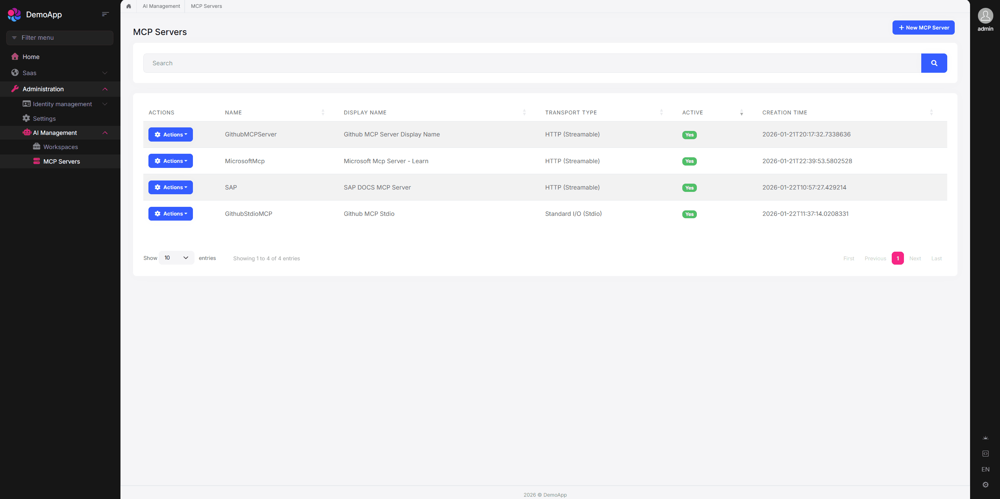

You can create, edit, delete, and test MCP server connections. Each MCP server supports one of the following transport types:

* **Stdio**: Runs a local command (e.g., `npx`, `dotnet`, `python`) with arguments and environment variables.
* **SSE**: Connects to a remote server using Server-Sent Events.
* **StreamableHttp**: Connects to a remote server using the Streamable HTTP transport.

For HTTP-based transports (SSE and StreamableHttp), you can configure authentication:

* **None**: No authentication.
* **API Key**: Sends an API key in the header.
* **Bearer**: Sends a Bearer token in the Authorization header.
* **Custom**: Sends a custom header name/value pair.

You can test the connection to an MCP server after creating it. The test verifies connectivity and lists available tools from the server.

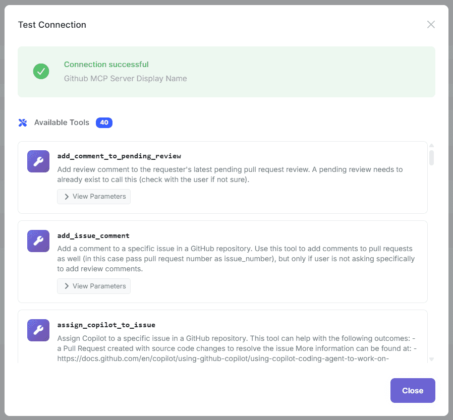

Once MCP servers are defined, you can associate them with workspaces. Navigate to a workspace's edit page and configure which MCP servers should be available as tools for that workspace.

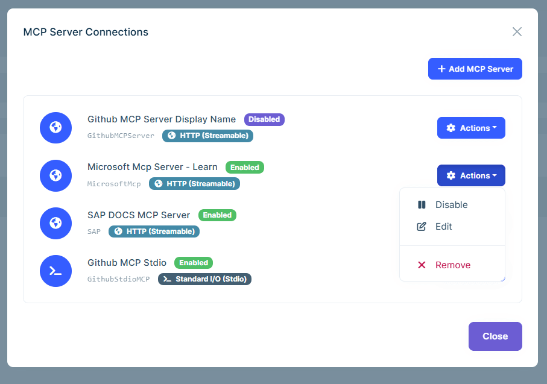

When a workspace has MCP servers associated, the AI model can invoke tools from those servers during chat conversations. Tool calls and results are displayed in the chat interface.

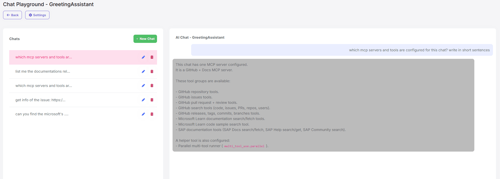

##### MCP Timeouts

Use `McpClientFactoryOptions` when an MCP server needs more time to initialize or when a stdio connection test starts a slow process:

```csharp
Configure<McpClientFactoryOptions>(options =>
{
    options.DefaultTimeoutMs = 180_000;
    options.StdioInitializationTimeoutMs = 240_000;
    options.StdioConnectionTestTimeoutSeconds = 300;
});
```

`DefaultTimeoutMs` defaults to 120 seconds and applies to HTTP transports and, unless overridden, stdio initialization. `StdioConnectionTestTimeoutSeconds` defaults to 180 seconds and is constrained to 30-600 seconds by the connection-test service. HTTP connection tests use a fixed one-minute timeout.

#### Workspace Data Sources

Workspace Data Sources page is used to upload and manage RAG documents per workspace. Uploaded files are processed and indexed in the background.

* Supported file extensions: `.txt`, `.md`, `.pdf` (configurable)
* Maximum file size: `10 MB` (configurable)
* Each uploaded file can be re-indexed individually or re-indexed in bulk per workspace
* Deleting a data source also removes its vector embeddings and document chunks

> Access the page from workspace details, or navigate to `/AIManagement/WorkspaceDataSources?WorkspaceId={WorkspaceId}`.

> [!TIP]
> You can customize the allowed file extensions and maximum file size via `WorkspaceDataSourceOptions`. See [Configuring Data Source Upload Options](#configuring-data-source-upload-options) for details.

## Workspace Configuration

Workspaces are the core concept of the AI Management module. A workspace represents an AI provider configuration that can be used throughout your application.

### Workspace Properties

When creating or managing a workspace, you can configure the following properties:

| Property                      | Required | Description                                                    |
| ----------------------------- | -------- | -------------------------------------------------------------- |
| `Name`                        | Yes      | Unique workspace identifier (cannot contain spaces)            |
| `Provider`                    | Yes*     | AI provider name (e.g., "OpenAI", "Ollama")                    |
| `ModelName`                   | Yes*     | Model identifier (e.g., "gpt-4", "mistral")                    |
| `ApiKey`                      | No       | API authentication key (required by some providers)            |
| `ApiBaseUrl`                  | No       | Custom endpoint URL (defaults to provider's default)           |
| `SystemPrompt`                | No       | Default system prompt for all conversations                    |
| `Temperature`                 | No       | Provider-specific response randomness                           |
| `Description`                 | No       | Workspace description                                          |
| `IsActive`                    | No       | Enable/disable the workspace (default: true)                   |
| `ApplicationName`             | No       | Application identity recorded during creation or synchronization |
| `RequiredPermissionName`      | No       | Optional policy checked by client consumption services         |
| `IsSystem`                    | No       | Whether the workspace was synchronized from code               |
| `OverrideSystemConfiguration` | No       | Allow database configuration to override code-defined settings |
| `EmbedderProvider`            | No       | Embedding provider name (e.g., "OpenAI", "Ollama")             |
| `EmbedderModelName`           | No       | Embedding model identifier (e.g., "text-embedding-3-small")    |
| `EmbedderApiKey`              | No       | API key for embedding provider                                 |
| `EmbedderApiBaseUrl`          | No       | Custom embedding endpoint URL                                  |
| `VectorStoreProvider`         | No       | Vector store provider name (e.g., "MongoDb", "Pgvector", "Qdrant") |
| `VectorStoreSettings`         | No       | Provider-specific connection setting string                    |

**\*Not required for system workspaces**

### System vs Dynamic Workspaces

The AI Management module supports two types of workspaces:

#### System Workspaces

* **Defined in code** using `PreConfigure<AbpAIWorkspaceOptions>`
* **Cannot be deleted** through the UI
* **Use the code-defined chat client by default**; persisted provider settings take effect only when `OverrideSystemConfiguration` is enabled
* **Useful for** application-critical AI features that must always be available
* **Synchronized automatically** when the application starts

Example:

```csharp
public override void PreConfigureServices(ServiceConfigurationContext context)
{
    PreConfigure<AbpAIWorkspaceOptions>(options =>
    {
        options.Workspaces.Configure<MyAssistantWorkspace>();
    });
}
```

Configure the code-defined keyed client with the [Framework AI provider integration](../../framework/infrastructure/artificial-intelligence/index.md) used by your application.

At startup, AI Management records the registered chat, embedding and vector-store providers and synchronizes the code-defined workspace names for the current application. When at least one code-defined workspace remains, names removed from that application's configuration are also removed from its synchronized set. An empty workspace collection skips the update, so removing the last code-defined workspace doesn't delete its persisted record automatically. Synchronization errors are logged without stopping application startup.

You can disable startup synchronization or override the recorded application name:

```csharp
Configure<WorkspaceUpdaterOptions>(options =>
{
    options.AutoUpdateAtStartup = false;
    options.ApplicationName = "MyAIGateway";
});
```

Disabling synchronization means code-defined workspaces are not added to or updated in the management database automatically. Their code-defined keyed clients can still be resolved by the Framework AI infrastructure.

#### Dynamic Workspaces

* **Created through the UI** or programmatically via `ApplicationWorkspaceManager` and `IWorkspaceRepository`
* **Fully manageable** - can be created, updated, activated/deactivated, and deleted
* **Stored in database** with all configuration
* **Ideal for** user-customizable AI features

Example (data seeding):

```csharp
public class WorkspaceDataSeederContributor : IDataSeedContributor, ITransientDependency
{
    private readonly IConfiguration _configuration;
    private readonly IWorkspaceRepository _workspaceRepository;
    private readonly ApplicationWorkspaceManager _applicationWorkspaceManager;

    public WorkspaceDataSeederContributor(
        IConfiguration configuration,
        IWorkspaceRepository workspaceRepository,
        ApplicationWorkspaceManager applicationWorkspaceManager)
    {
        _configuration = configuration;
        _workspaceRepository = workspaceRepository;
        _applicationWorkspaceManager = applicationWorkspaceManager;
    }

    public async Task SeedAsync(DataSeedContext context)
    {
        var workspace = await _applicationWorkspaceManager.CreateAsync(
            name: "CustomerSupportWorkspace",
            provider: "OpenAI",
            modelName: "gpt-4");

        workspace.ApiKey = _configuration["AI:OpenAI:ApiKey"];
        workspace.SystemPrompt = "You are a helpful customer support assistant.";

        await _workspaceRepository.InsertAsync(workspace);
    }
}
```

> [!WARNING]
> Provider API keys, embedding keys, vector-store connection settings, MCP headers and MCP credentials are sensitive persisted configuration. Do not hard-code them in source control. Restrict workspace and MCP administration permissions, protect the application database and configuration backups, and supply secrets from a secure configuration provider. Duplicating a workspace also duplicates its provider and RAG configuration, including credentials.

### Resolution Precedence

When an application requests a workspace chat client, AI Management resolves it in this order:

1. If no persisted configuration exists, the workspace is inactive, or it is a system workspace with `OverrideSystemConfiguration = false`, resolution first tries the code-defined keyed `IChatClient` and then the default `IChatClient`.
2. An active dynamic workspace, or an overridden system workspace, uses the factory registered for its persisted `Provider` value.

If neither fallback exists, an inactive workspace produces an inactive-workspace error; the other fallback cases produce a provider-not-found error. A configured provider without a registered factory also produces a provider-not-found error.

### Workspace Naming Rules

* Workspace names **must be unique**
* Workspace names **cannot contain spaces** (use underscores or camelCase)

Workspace names are global identifiers in an AI Management database. Workspaces, MCP server configurations, data sources and the data-source blob container are not tenant-scoped entities. In a multi-tenant application, use workspace resource permissions and application-level design to control access; do not treat these records or blobs as tenant-isolated storage.

## RAG with File Upload

The AI Management module supports RAG (Retrieval-Augmented Generation), which enables workspaces to answer questions based on the content of uploaded documents. When RAG is configured, the AI model searches the uploaded documents for relevant information before generating a response.

### Supported File Formats

By default, the following file formats are supported:

* **PDF** (.pdf)
* **Markdown** (.md)
* **Text** (.txt)

Default maximum file size: **10 MB**.

> [!TIP]
> Both the allowed file extensions and the maximum file size are configurable via `WorkspaceDataSourceOptions`. See [Configuring Data Source Upload Options](#configuring-data-source-upload-options) for details.

### Prerequisites

RAG requires an **embedder** and a **vector store** to be configured on the workspace:

* **Embedder**: Converts documents and queries into vector embeddings. You can use any provider that supports embedding generation (e.g., OpenAI `text-embedding-3-small`, Ollama `nomic-embed-text`).
* **Vector Store**: Stores and retrieves vector embeddings. Supported providers: **MongoDb**, **Pgvector**, and **Qdrant**.

> [!IMPORTANT]
> If the workspace uses Ollama for chat or embeddings, the configured model names must exist in the local Ollama instance first. For example, if you configure `ModelName = "llama3.2"` and `EmbedderModelName = "nomic-embed-text"`, pull both models before using the workspace:
>
> ```bash
> ollama pull llama3.2
> ollama pull nomic-embed-text
> ```

### Configuring RAG on a Workspace

To enable RAG for a workspace, configure the embedder and vector store settings in the workspace edit page.

#### Configuring Embedder

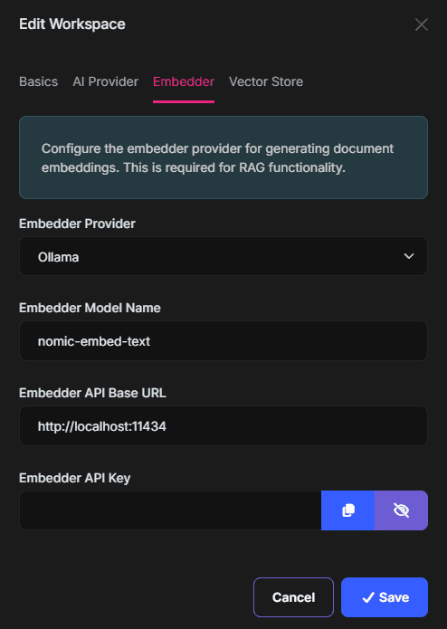

The **Embedder** tab allows you to configure how documents and queries are converted into vector embeddings:

* **Embedder Provider**: The provider for generating embeddings (e.g., "OpenAI", "Ollama").
* **Embedder Model Name**: The embedding model (e.g., "text-embedding-3-small", "nomic-embed-text").
* **Embedder Base URL**: The endpoint URL for the embedder (optional if using the default endpoint).

#### Configuring Vector Store

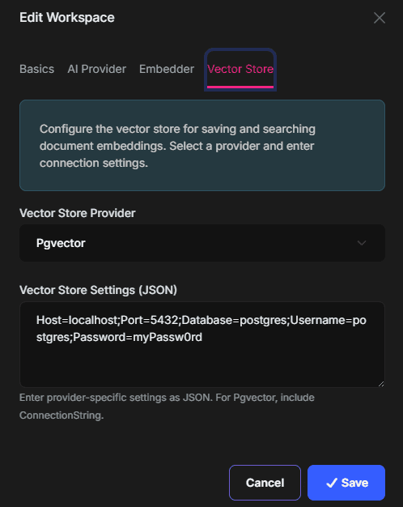

The **Vector Store** section allows you to configure where the generated embeddings are stored and retrieved:

* **Vector Store Provider**: The vector store to use (e.g., "Pgvector", "MongoDb", "Qdrant").
* **Vector Store Settings**: The connection string for the vector store (e.g., `Host=localhost;Port=5432;Database=postgres;Username=postgres;Password=myPassword`).

### Uploading Documents

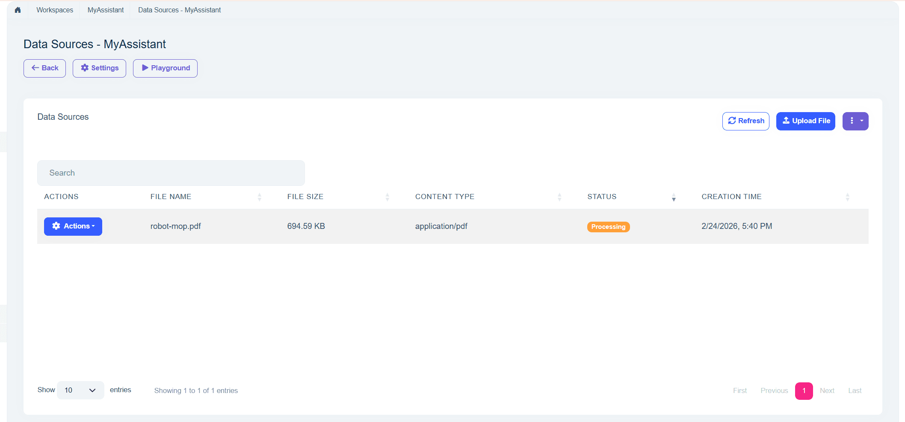

Once RAG is configured on a workspace, you can upload documents through the workspace management UI. Uploaded documents are automatically processed -- their content is chunked, embedded, and stored in the configured vector store. You can then ask questions in the chat interface, and the AI model will use the uploaded documents as context.

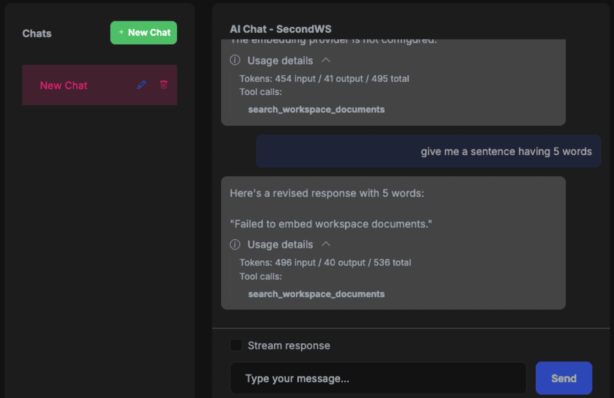

### RAG Configuration & Indexing Flow

RAG is enabled per workspace when both embedding and vector store settings are configured.

#### VectorStoreSettings Format

`VectorStoreSettings` is passed to the selected provider factory as a connection setting string:

* `MongoDb`: Standard MongoDB connection string including database name.
* `Pgvector`: Standard PostgreSQL/Npgsql connection string.
* `Qdrant`: Qdrant endpoint string (`http://host:port`, `https://host:port`, or `host:port`). The current provider discards the URL scheme and creates a non-TLS client from only the host and port. Do not rely on an `https://` value to enable TLS.

> [!IMPORTANT]
> The `MongoDb` vector-store provider requires MongoDB Atlas or an Atlas CLI local deployment because it uses `$vectorSearch`. Standard MongoDB Docker images do not provide this feature. Create an Atlas Vector Search index named `vector_index` on the `AIVectorEmbeddings` collection, with `Embedding` as the vector field, cosine similarity and dimensions matching the configured embedding model. The provider creates the collection and its regular workspace index, but it does not create the Atlas vector index.

The Pgvector provider creates the target database when its credentials permit it, enables the `vector` extension and creates workspace tables lazily. Qdrant creates a workspace-specific collection when the first vector is stored. The service account therefore needs the corresponding database, extension, table or collection privileges.

#### Document Processing Pipeline

When a file is uploaded as a workspace data source:

1. File is stored in blob storage.
2. `IndexDocumentJob` is queued.
3. `DocumentProcessingManager` extracts text using content-type-specific extractors.
4. Text is chunked with `1000` characters as a target size. The normal paragraph path carries up to `200` characters into the next chunk; oversized paragraphs are split by line with a `50`-character carry. An indivisible line can produce a chunk larger than the target.
5. Embeddings are generated in ordered batches and stored through the configured vector store.
6. The data source is marked as processed (`IsProcessed = true`) after the final batch succeeds.

Each indexing run has an identifier and a per-data-source distributed lock. Stale and duplicate batches are ignored, while an out-of-order batch is retried by the background job system. A failed run can therefore leave partial vector data until a retry succeeds or the data source is re-indexed again.

#### Workspace Data Source HTTP API

The module exposes workspace data source endpoints under `/api/ai-management/workspace-data-sources`:

* `POST /workspace/{workspaceId}`: Upload a new file.
* `GET /by-workspace/{workspaceId}`: List data sources for a workspace.
* `GET /{id}`: Get a data source.
* `PUT /{id}`: Update data source metadata.
* `DELETE /{id}`: Delete data source, its vector embeddings, document chunks, and underlying blob.
* `GET /{id}/download`: Download original file.
* `POST /{id}/reindex`: Re-index a single file.
* `POST /workspace/{workspaceId}/reindex-all`: Re-index all files in a workspace.

#### Chat Integration Behavior

When an active dynamic workspace, or a system workspace with `OverrideSystemConfiguration = true`, is resolved through its persisted provider factory and has embedder configuration, AI Management wraps the factory-created client with a document search tool function named `search_documents`. The keyed/default fallback branches described in [Resolution Precedence](#resolution-precedence) return their code-defined client directly and don't add persisted RAG or MCP tools.

* The tool delegates to `IDocumentSearchService` (`DocumentSearchService` by default).
* The search currently uses `TopK = 5` chunks.
* If RAG retrieval fails, chat continues without injected context.

The underlying chat client must be a `FunctionInvokingChatClient`. The built-in OpenAI and Ollama factories add function invocation automatically. A custom chat factory must build its client with `ChatClientBuilder.UseFunctionInvocation()` before RAG or MCP tools can execute.

#### Automatic Reindexing on Configuration Changes

When workspace embedder or vector store configuration changes, AI Management automatically:

* Initializes the new vector store configuration (if needed).
* Attempts to delete existing embeddings when the embedder provider or model changes.
* Re-queues all workspace data sources for re-indexing.

Embedding cleanup and automatic re-index queueing are best-effort follow-up operations. Their failures are logged without rolling back the workspace update. Use the data-source page's **Re-index All** action after correcting the configuration if automatic re-indexing could not be queued.

### Configuring Indexing Options

`AIManagementIndexingOptions` controls the work performed by background indexing jobs:

```csharp
Configure<AIManagementIndexingOptions>(options =>
{
    options.EmbeddingBatchSize = 100;
    options.MaxConcurrentIndexingJobs = 2;
    options.DistributedLockTimeoutSeconds = 15;
});
```

| Property | Default | Description |
| -------- | ------- | ----------- |
| `EmbeddingBatchSize` | `50` | Maximum chunks embedded and stored by one batch job |
| `MaxConcurrentIndexingJobs` | `1` | Maximum indexing batches running concurrently across the application |
| `DistributedLockTimeoutSeconds` | `0` | Time to wait for an indexing lock; `0` performs an immediate attempt |

Increase concurrency only after checking the embedding provider's rate limits and vector-store capacity. The concurrency limiter and the per-data-source lock both use the [distributed lock](../../framework/infrastructure/distributed-locking.md), so they apply across all application instances when a distributed lock provider is configured (with the default in-process implementation, they only cover a single process). The per-data-source lock prevents two batches from mutating the same data source concurrently.

### Configuring Data Source Upload Options

The `WorkspaceDataSourceOptions` class allows you to customize the file upload constraints for workspace data sources. You can configure the allowed file extensions, maximum file size, and content type mappings.

```csharp
public override void ConfigureServices(ServiceConfigurationContext context)
{
    Configure<WorkspaceDataSourceOptions>(options =>
    {
        // Allow log files to use the built-in plain-text extractor.
        options.AllowedFileExtensions = [".txt", ".md", ".pdf", ".log"];

        // Increase the maximum file size to 50 MB
        options.MaxFileSize = 50 * 1024 * 1024;

        options.ContentTypeMap[".log"] = "text/plain";
    });
}
```

#### Available Properties

| Property                | Type                         | Default                                      | Description                                                |
| ----------------------- | ---------------------------- | -------------------------------------------- | ---------------------------------------------------------- |
| `AllowedFileExtensions` | `string[]`                   | `{ ".txt", ".md", ".pdf" }`                  | File extensions allowed for upload                         |
| `MaxFileSize`           | `long`                       | `10485760` (10 MB)                           | Maximum file size in bytes                                 |
| `ContentTypeMap`        | `Dictionary<string, string>` | `.txt`, `.md`, `.pdf` with their MIME types   | Maps file extensions to MIME content types                 |

Adding an extension and MIME mapping only allows the upload. The mapped content type must also be supported by an `IDocumentTextExtractor`. Implement and register an extractor when adding a format that cannot use the built-in plain-text, Markdown or PDF extractors.

The options class also provides helper methods:

| Method                       | Description                                                          |
| ---------------------------- | -------------------------------------------------------------------- |
| `GetMaxFileSizeDisplay()`    | Returns a human-readable size string (e.g., "10MB", "512KB")        |
| `GetAllowedExtensionsDisplay()` | Returns a comma-separated display string (e.g., ".txt, .md, .pdf")  |
| `GetAcceptAttribute()`       | Returns a string for the HTML `accept` attribute (e.g., ".txt,.md,.pdf") |

#### Hosting-Level Upload Limits

`WorkspaceDataSourceOptions.MaxFileSize` controls the module-level validation, but your hosting stack may reject large uploads before the request reaches AI Management. If you increase `MaxFileSize`, make sure the underlying server and proxy limits are also updated.

Typical limits to review:

* **ASP.NET Core form/multipart limit** (`FormOptions.MultipartBodyLengthLimit`)
* **Kestrel request body limit** (`KestrelServerLimits.MaxRequestBodySize`)
* **IIS request filtering limit** (`maxAllowedContentLength`)
* **Reverse proxy limits** such as **Nginx** (`client_max_body_size`)

Example ASP.NET Core configuration:

```csharp
using Microsoft.AspNetCore.Http.Features;

public override void ConfigureServices(ServiceConfigurationContext context)
{
    Configure<WorkspaceDataSourceOptions>(options =>
    {
        options.MaxFileSize = 50 * 1024 * 1024;
    });

    Configure<FormOptions>(options =>
    {
        options.MultipartBodyLengthLimit = 50 * 1024 * 1024;
    });
}
```

```csharp
builder.WebHost.ConfigureKestrel(options =>
{
    options.Limits.MaxRequestBodySize = 50 * 1024 * 1024;
});
```

Example IIS configuration in `web.config`:

```xml
<configuration>
  <system.webServer>
    <security>
      <requestFiltering>
        <requestLimits maxAllowedContentLength="52428800" />
      </requestFiltering>
    </security>
  </system.webServer>
</configuration>
```

Example Nginx configuration:

```nginx
server {
    client_max_body_size 50M;
}
```

If you are hosting behind another proxy or gateway (for example Apache, YARP, Azure App Gateway, Cloudflare, or Kubernetes ingress), ensure its request-body limit is also greater than or equal to the configured `MaxFileSize`.

## Permissions

The AI Management module defines the following permissions:

| Permission                       | Description              |
| -------------------------------- | ------------------------ |
| `AIManagement.Workspaces`        | View workspaces          |
| `AIManagement.Workspaces.Create` | Create new workspaces    |
| `AIManagement.Workspaces.Update` | Edit existing workspaces |
| `AIManagement.Workspaces.Delete` | Delete workspaces        |
| `AIManagement.Workspaces.Playground` | Access workspace chat playground |
| `AIManagement.Workspaces.ManagePermissions` | Manage workspace resource permissions |
| `Volo.AIManagement.Workspaces.Workspace.Consume` | Consume a specific workspace; granted as a resource permission |
| `AIManagement.McpServers`        | View MCP servers         |
| `AIManagement.McpServers.Create` | Create new MCP servers   |
| `AIManagement.McpServers.Update` | Edit existing MCP servers|
| `AIManagement.McpServers.Delete` | Delete MCP servers       |

The module also defines workspace data source permissions for RAG document operations:

| Permission                                    | Description                         |
| --------------------------------------------- | ----------------------------------- |
| `AIManagement.WorkspaceDataSources`           | View workspace data sources         |
| `AIManagement.WorkspaceDataSources.Create`    | Upload documents                    |
| `AIManagement.WorkspaceDataSources.Update`    | Update data source metadata         |
| `AIManagement.WorkspaceDataSources.Delete`    | Delete uploaded documents           |
| `AIManagement.WorkspaceDataSources.Download`  | Download original uploaded file     |
| `AIManagement.WorkspaceDataSources.ReIndex`   | Re-index one or all workspace files |

### Workspace Consumption Authorization

The `IChatCompletionClientAppService` client API, OpenAI-compatible API and MCP tool catalog authorize a workspace when the current user satisfies any one of these conditions:

1. The user has `AIManagement.Workspaces.Playground`.
2. The workspace has a `RequiredPermissionName` and the user has that policy.
3. The user has the `Volo.AIManagement.Workspaces.Workspace.Consume` resource permission for that workspace ID.

Use the **Manage Permissions** action on the workspace page to grant the per-workspace resource permission. `AIManagement.Workspaces.ManagePermissions` controls access to that action.

`RequiredPermissionName` is a programmatic alternative for workspaces tied to an application permission:

```csharp
var workspace = await _applicationWorkspaceManager.CreateAsync(
    name: "PremiumWorkspace",
    provider: "OpenAI",
    modelName: "gpt-4"
);
workspace.RequiredPermissionName = MyAppPermissions.AccessPremiumWorkspaces;
await _workspaceRepository.InsertAsync(workspace);
```

Administrative workspace and data-source endpoints still use the module permissions in the tables above. A workspace consumption grant does not grant permission to edit the workspace, manage its credentials or upload RAG documents.

## Usage Scenarios

The AI Management module is designed to support various usage patterns, from simple standalone AI integration to complex microservice architectures. The module provides two main package groups to support different scenarios:

- **`Volo.AIManagement.*`** packages for hosting AI Management with full database and management capabilities
- **`Volo.AIManagement.Client.*`** packages for client applications that consume AI services

### Scenario 1: No AI Management Dependency

**Use this when:** You want to use AI in your application without any dependency on the AI Management module.

In this scenario, use the ABP Framework AI infrastructure and configure provider clients in code. No AI Management database, administration UI or commercial client packages are involved. See [Artificial Intelligence](../../framework/infrastructure/artificial-intelligence/index.md) for the current static workspace registration and consumption APIs.

### Scenario 2: AI Management with Domain Layer Dependency (Local Execution)

**Use this when:** You want to host the full AI Management module inside your application with database storage and management UI.

In this scenario, you install the AI Management module with its database layer, which allows you to manage AI workspaces dynamically through the UI or data seeding.

**Required Packages:**

**Minimum (backend only):**

- `Volo.AIManagement.EntityFrameworkCore` (or `Volo.AIManagement.MongoDB`)
- `Volo.AIManagement.OpenAI` (or another AI provider package)
- For RAG: `Volo.AIManagement.VectorStores.MongoDB` or another vector store package (`Volo.AIManagement.VectorStores.Pgvector`, `Volo.AIManagement.VectorStores.Qdrant`)

**Full installation (with UI and API):**

- `Volo.AIManagement.EntityFrameworkCore` (or `Volo.AIManagement.MongoDB`)
- `Volo.AIManagement.Application`
- `Volo.AIManagement.HttpApi`
- `Volo.AIManagement.Web` (for management UI)
- `Volo.AIManagement.OpenAI` (or another AI provider package)
- For RAG: `Volo.AIManagement.VectorStores.MongoDB` or another vector store package (`Volo.AIManagement.VectorStores.Pgvector`, `Volo.AIManagement.VectorStores.Qdrant`)

> Note: `Volo.AIManagement.EntityFrameworkCore` transitively includes `Volo.AIManagement.Domain` and `Volo.Abp.AI.AIManagement` packages.

Define dynamic workspaces through:

- The AI Management UI (navigate to AI Management > Workspaces)
- Data seeding in your `DataSeeder` class

For a system workspace, define the typed workspace and its code client as described in [System Workspaces](#system-workspaces). Enable `OverrideSystemConfiguration` on that workspace only when persisted provider settings should replace the code client.

### Scenario 3: AI Management Client with Remote Execution

**Use this when:** You want to use AI capabilities without managing AI configuration yourself, and let a dedicated AI Management microservice handle everything.

In this scenario, your application communicates with a separate AI Management microservice that manages configurations and communicates with AI providers on your behalf. The AI Management service handles all AI provider interactions.

**Required Packages:**

- `Volo.AIManagement.Client.HttpApi.Client`

**Configuration:**

Add the remote service endpoint in your `appsettings.json`:

```json
{
  "RemoteServices": {
    "AIManagementClient": {
      "BaseUrl": "https://your-ai-management-service.com/"
    }
  }
}
```

**Usage:**

```csharp
public class MyService
{
    private readonly IChatCompletionClientAppService _chatService;

    public MyService(IChatCompletionClientAppService chatService)
    {
        _chatService = chatService;
    }

    public async Task<string> GetAIResponseAsync(string workspaceName, string prompt)
    {
        var request = new ChatClientCompletionRequestDto
        {
            Messages =
            [
                new ChatMessageDto { Role = ChatRole.User, Content = prompt }
            ]
        };

        var response = await _chatService.ChatCompletionsAsync(workspaceName, request);
        return response.Text;
    }

    // For streaming responses
    public async IAsyncEnumerable<string> StreamAIResponseAsync(string workspaceName, string prompt)
    {
        var request = new ChatClientCompletionRequestDto
        {
            Messages =
            [
                new ChatMessageDto { Role = ChatRole.User, Content = prompt }
            ]
        };

        await foreach (var update in _chatService.StreamChatCompletionsAsync(workspaceName, request))
        {
            yield return update.Text;
        }
    }
}
```

### Scenario 4: Exposing Client HTTP Endpoints (Proxy Pattern)

**Use this when:** You want your application to act as a proxy/API gateway, exposing AI capabilities to other services or client applications.

This scenario builds on Scenario 3, but your application exposes its own HTTP endpoints that other applications can call. Your application then forwards these requests to the AI Management service.

**Required Packages:**

- `Volo.AIManagement.Client.HttpApi.Client` (to communicate with AI Management service)
- `Volo.AIManagement.Client.Application` (application services)
- `Volo.AIManagement.Client.HttpApi` (to expose HTTP endpoints)
- `Volo.AIManagement.Client.Web` (optional, for UI components)

**Configuration:**

Same as Scenario 3, configure the remote AI Management service in `appsettings.json`.

**Usage:**

Once configured, other applications can call your application's endpoints:

- `POST /api/chat-completion/{workspaceName}` for chat completions
- `POST /api/chat-completion/{workspaceName}/stream` for streaming responses

Your application acts as a proxy, forwarding these requests to the AI Management microservice.

### Comparison Table

| Scenario                  | Database Required | Manages Config | Executes AI    | Exposes API | Use Case                                  |
| ------------------------- | ----------------- | -------------- | -------------- | ----------- | ----------------------------------------- |
| **1. No AI Management**   | No                | Code           | Local          | Optional    | Simple apps, no config management needed  |
| **2. Full AI Management** | Yes               | Database/UI    | Local          | Optional    | Monoliths, services managing their own AI |
| **3. Client Remote**      | No                | Remote Service | Remote Service | No          | Microservices consuming AI centrally      |
| **4. Client Proxy**       | No                | Remote Service | Remote Service | Yes         | API Gateway pattern, proxy services       |

## OpenAI-Compatible API

The AI Management module exposes an **OpenAI-compatible REST API** at the `/v1` path. This allows any application or tool that supports the OpenAI API format -- such as [AnythingLLM](https://anythingllm.com/), [Open WebUI](https://openwebui.com/), [Dify](https://dify.ai/), or custom scripts using the OpenAI SDK -- to connect directly to your AI Management instance.

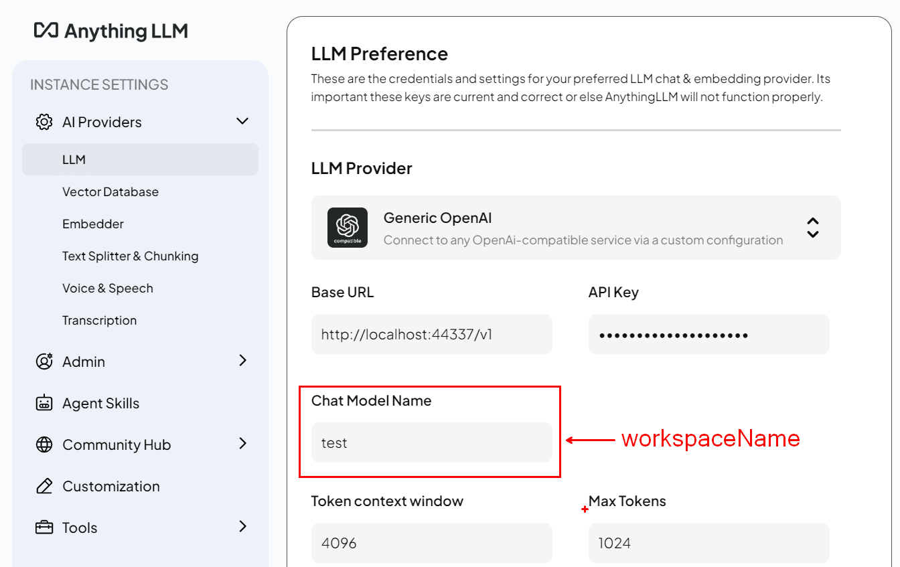

Each AI Management **workspace** appears as a selectable model in the client application. The workspace's configured AI provider handles the actual inference transparently.

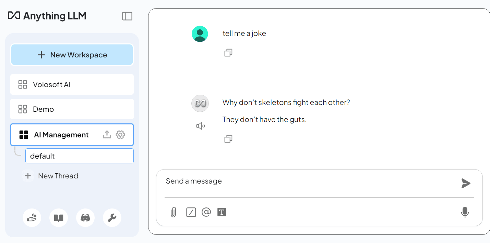

### Available Endpoints

| Endpoint                     | Method | Description                                     |
| ---------------------------- | ------ | ----------------------------------------------- |
| `/v1/chat/completions`       | POST   | Chat completions (streaming and non-streaming)  |
| `/v1/completions`            | POST   | Legacy text completions                         |
| `/v1/models`                 | GET    | List available models (workspaces)              |
| `/v1/models/{modelId}`       | GET    | Retrieve a single model (workspace)             |
| `/v1/embeddings`             | POST   | Generate embeddings                             |

All endpoints require an authenticated user. Non-browser API clients normally send an access token as a **Bearer token** in the `Authorization` header.

The value of `model` is an AI Management workspace name, not the provider's model name. `GET /v1/models` returns only workspaces the current user is authorized to consume. The same workspace authorization is applied before chat, completion, model and embedding operations.

The module also exposes file-management routes backed by workspace data sources. They require workspace-specific parameters and are not a drop-in implementation of the OpenAI Files API. Use the [Workspace Data Source HTTP API](#workspace-data-source-http-api) for portable upload, list, download, delete and re-index operations.

### Usage

The general pattern for connecting any OpenAI-compatible client:

* **Base URL**: `https://<your-app-url>/v1`
* **API Key**: A valid Bearer token obtained from your application's authentication endpoint.
* **Model**: One of the workspace names returned by `GET /v1/models`.

**Example with the OpenAI Python SDK:**

```python
from openai import OpenAI

client = OpenAI(
    base_url="https://localhost:44336/v1",
    api_key="<your-token>"
)

response = client.chat.completions.create(
    model="MyWorkspace",
    messages=[{"role": "user", "content": "Hello!"}]
)
print(response.choices[0].message.content)
```

**Example with cURL:**

```bash
curl -X POST https://localhost:44336/v1/chat/completions \
  -H "Authorization: Bearer <your-token>" \
  -H "Content-Type: application/json" \
  -d '{
    "model": "MyWorkspace",
    "messages": [{"role": "user", "content": "Hello!"}]
  }'
```

> The OpenAI-compatible `/v1` endpoints are provided by `Volo.AIManagement.Client.HttpApi`. `Volo.AIManagement.HttpApi` instead exposes the management and integration APIs.

## Client Usage

AI Management uses different packages depending on the usage scenario:

- **`Volo.AIManagement.*` packages**: These contain the core AI functionality for applications that host and manage AI operations. The application and HTTP API packages expose management and integration services.

- **`Volo.AIManagement.Client.*` packages**: These are designed for applications that need to consume AI services from a remote application. They provide both server and client side of remote access to the AI services.

### MVC / Razor Pages UI

**List of packages:**
- `Volo.AIManagement.Client.Application`
- `Volo.AIManagement.Client.Application.Contracts`
- `Volo.AIManagement.Client.HttpApi`
- `Volo.AIManagement.Client.HttpApi.Client`
- `Volo.AIManagement.Client.Web`

#### The Chat Widget

The `Volo.AIManagement.Client.Web` package provides a chat widget to allow you to easily integrate a chat interface into your application that uses a specific AI workspace named `ChatClientChatViewComponent`.

##### Basic Usage

You can invoke the `ChatClientChatViewComponent` Widget in your razor page with the following code:

```csharp
@await Component.InvokeAsync(typeof(ChatClientChatViewComponent), new ChatClientChatViewModel
{
    WorkspaceName = "mylama",
})
```

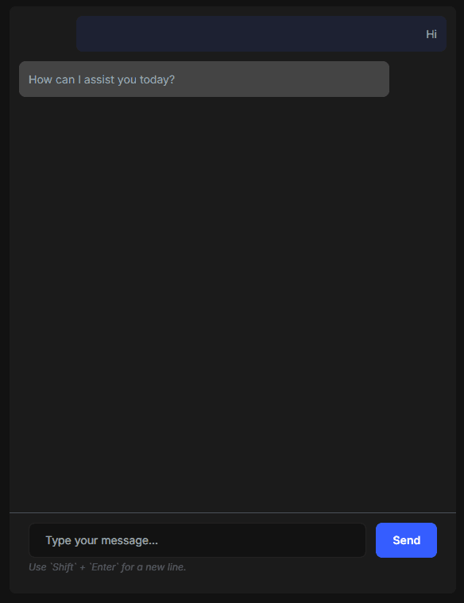

##### Properties

You can customize the chat widget with the following properties:

- `WorkspaceName`: The name of the workspace to use.
- `ComponentId`: Unique identifier for accessing the component via JavaScript API (stored in abp.chatComponents).
- `ConversationId`: The unique identifier for persisting and retrieving chat history from client-side storage.
- `Title`: The title of the chat widget.
- `ShowStreamCheckbox`: Whether to show the stream checkbox. Allows user to toggle streaming on and off. Default is `false`.
- `UseStreaming`: Default streaming behavior. Can be overridden by user when `ShowStreamCheckbox` is true.
- `DisableWhenNoConversation`: Disables input until a `ConversationId` is selected. Default is `false`.
- `ShowUsageDetails`: Shows token usage and tool calls for assistant messages. Default is `true`.
- `ShowDetailedSourceInformation`: Shows chunk-level RAG source details instead of grouping sources by file. Default is `false`.

```csharp
@await Component.InvokeAsync(typeof(ChatClientChatViewComponent), new ChatClientChatViewModel
{
    WorkspaceName = "mylama",
    ComponentId = "mylama-chat",
    ConversationId = "mylama-conversation-" + @CurrentUser.Id,
    Title = "My Custom Title",
    ShowStreamCheckbox = true,
    UseStreaming = true
})
```

##### Using the Conversation Id

You can use the `ConversationId` property to specify the id of the conversation to use. When the Conversation Id is provided, the chat will be stored at the client side and will be retrieved when the user revisits the page that contains the chat widget. If it's not provided or provided as **null**, the chat will be temporary and will not be saved, it'll be lost when the component lifetime ends. 

```csharp
@await Component.InvokeAsync(typeof(ChatClientChatViewComponent), new ChatClientChatViewModel
{
    WorkspaceName = "mylama",
    ConversationId = "my-support-conversation-" + @CurrentUser.Id
})
```

##### JavaScript API

The chat components are initialized automatically when the ViewComponent is rendered in the page. All the initialized components in the page are stored in the `abp.chatComponents` object. You can retrieve a specific component by its `ComponentId` which is defined while invoking the ViewComponent.

```csharp
@await Component.InvokeAsync(typeof(ChatClientChatViewComponent), new ChatClientChatViewModel
{
    WorkspaceName = "mylama",
    ComponentId = "mylama-chat"
})
```

You can then use the JavaScript API to interact with the component.
```js
var chatComponent = abp.chatComponents.get('mylama-chat');
```

Once you have the component, you can use the following functions to interact with it:

```js
// Switch to a different conversation
chatComponent.switchConversation(conversationId);

// Create a new conversation with a specific model
chatComponent.createConversation(conversationId, modelName);

// Clear the current conversation history
chatComponent.clearConversation();

// Get the current conversation ID (returns null for ephemeral conversations)
var currentId = chatComponent.getCurrentConversationId();

// Initialize with a specific conversation ID
chatComponent.initialize(conversationId);

// Send a message programmatically
chatComponent.sendMessage();

// Listen to events
chatComponent.on('messageSent', function(data) {
    console.log('Message sent:', data.message);
    console.log('Conversation ID:', data.conversationId);
    console.log('Is first message:', data.isFirstMessage);
});

chatComponent.on('messageReceived', function(data) {
    console.log('AI response:', data.message);
    console.log('Conversation ID:', data.conversationId);
    console.log('Is streaming:', data.isStreaming);
});

chatComponent.on('streamStarted', function(data) {
    console.log('Streaming started for conversation:', data.conversationId);
});

// Remove event listeners
chatComponent.off('messageSent', callbackFunction);
```

**Best-practices:**
- Don't try to access the component at the page load time, it's not guaranteed to be initialized yet. Get the component whenever you need it to make sure it's **initialized** and the **latest state** is applied.

❌ Don't do this
```js
(function(){
    var chatComponent = abp.chatComponents.get('mylama-chat');
    $('#my-button').on('click', function() {
        chatComponent.clearConversation();
    });
});
```

✅ Do this
```js
(function(){
    $('#my-button').on('click', function() {
        var chatComponent = abp.chatComponents.get('mylama-chat');
        chatComponent.clearConversation();
    });
});
```

### Angular UI

#### Installation

In order to configure the application to use the AI Management module, you first need to import `provideAIManagementConfig` from `@volo/abp.ng.ai-management/config` to root application configuration. Then, you will need to append it to the `appConfig` array:

```ts
// app.config.ts
import { ApplicationConfig } from '@angular/core';
import { provideAIManagementConfig } from '@volo/abp.ng.ai-management/config';

export const appConfig: ApplicationConfig = {
  providers: [
    // ...
    provideAIManagementConfig(),
  ],
};
```

The AI Management module should be imported and lazy-loaded in your routing array. It has a `createRoutes` function for configuration and is available from `@volo/abp.ng.ai-management`.

```ts
// app.routes.ts
import { Routes } from '@angular/router';

const APP_ROUTES: Routes = [
  // ...
  {
    path: 'ai-management',
    loadChildren: () =>
      import('@volo/abp.ng.ai-management').then(m => m.createRoutes()),
  },
];
```

`createRoutes` optionally accepts `AIManagementConfigOptions`. It provides entity-action, toolbar-action and entity-property contributors for workspaces and MCP servers, plus create/edit form contributors for workspaces. The Workspaces, Chat Playground, MCP Servers and Workspace Data Sources routes also use keys from `eAIManagementComponents`, so they can be replaced through ABP's replaceable component system.

#### Services / Models

AI Management module services and models are generated via `generate-proxy` command of the [ABP CLI](../../cli). If you need the module's proxies, you can run the following command in the Angular project directory:

```bash
abp generate-proxy --module aiManagement
```

#### Remote Endpoint URL

The AI Management module remote endpoint URLs can be configured in the environment files.

```js
export const environment = {
  // other configurations
  apis: {
    default: {
      url: 'default url here',
    },
    AIManagement: {
      url: 'AI Management remote url here',
    },
    AIManagementClient: {
      url: 'AI Management client remote url here',
    },
    // other api configurations
  },
};
```

Use `AIManagement` for management and integration proxies. Non-streaming requests from the Angular chat widget use the generated `ChatCompletionClientService` proxy with `AIManagementClient`. When streaming is enabled, both the stream-start POST request and the subsequent EventSource connection use `default.url` instead of `AIManagementClient`.

Both named entries are optional and generated proxy requests fall back independently to `default.url`. `default.url` is also the global fallback for other ABP and application requests that don't specify a configured named API, so changing it redirects those requests too.

For split hosting, configure `AIManagement` and `AIManagementClient` for their respective hosts. Before pointing `default.url` to the client API and enabling streaming, make sure every other request uses an appropriate named API or that the client host provides or forwards all endpoints that still rely on the global fallback.

#### The Chat Widget

The `@volo/abp.ng.ai-management` package provides a `ChatInterfaceComponent` (`abp-chat-interface`) that you can use to embed a chat interface into your Angular application that communicates with a specific AI workspace.

**Example: You can use the `abp-chat-interface` component in your template**:

```html
<abp-chat-interface
  [workspaceName]="'mylama'"
  [conversationId]="'my-conversation-id'"
  [showUsageDetails]="true"
  [showStreamCheckbox]="true"
/>
```

- `workspaceName` (required): The name of the workspace to use.
- `conversationId`: The unique identifier for persisting and retrieving chat history from client-side storage. When provided, the history is restored for the current user and workspace.
- `providerName`: The name of the AI provider. Used for displaying contextual error messages.
- `allowEphemeral`: Allows sending without a `conversationId`. The default is `false`; set it to `true` for an in-memory conversation that is discarded with the component.
- `showUsageDetails`: Shows usage and tool-call details. Default is `true`.
- `showStreamCheckbox`: Shows the streaming toggle. Default is `true`.

The component emits `messageSent` and `messageReceived` events for application-level conversation orchestration.

### Blazor UI

#### Remote Endpoint URL

The AI Management module remote endpoint URLs can be configured in your `appsettings.json`:

```json
{
  "RemoteServices": {
    "Default": {
      "BaseUrl": "Default url here"
    },
    "AIManagement": {
      "BaseUrl": "AI Management remote url here"
    },
    "AIManagementClient": {
      "BaseUrl": "AI Management client remote url here"
    }
  }
}
```

Use the `AIManagement` remote service for management and integration clients. Use `AIManagementClient` for the remote chat and OpenAI-compatible client APIs. Blazor WebAssembly uses the standard ABP remote-service configuration shown above; it doesn't require a module-specific options class. If a named `BaseUrl` isn't set, ABP uses `Default.BaseUrl` as the fallback.

#### The Chat Widget

The `Volo.AIManagement.Client.Blazor` package provides a `ChatClientChat` Blazor component that you can use to embed a chat interface into your Blazor application that communicates with a specific AI workspace.

**Example: You can use the `ChatClientChat` component in your Blazor page:**

```xml
<ChatClientChat WorkspaceName="mylama"
                ConversationId="@("my-conversation-" + CurrentUser.Id)"
                ShowStreamCheckbox="true"
                OnFirstMessage="HandleFirstMessageAsync" />
```

- `WorkspaceName` (required): The name of the workspace to use.
- `ConversationId` (required to send messages): The unique identifier for persisting and retrieving chat history from client-side storage. The component disables message input while this value is null or empty.
- `Title`: The title displayed in the chat widget header.
- `ShowStreamCheckbox`: Whether to show a checkbox that allows the user to toggle streaming on and off. Default is `false`.
- `UseStreaming`: Initial streaming mode. Default is `true`.
- `ShowUsageDetails`: Shows token usage and tool calls. Default is `true` in the Blazorise component.
- `ShowDetailedSourceInformation`: Shows chunk-level RAG source information. Default is `true` in the Blazorise component.
- `OnFirstMessage`: An `EventCallback<FirstMessageEventArgs>` that is triggered when the first message is sent in a conversation. It can be used to determine the chat title after the first prompt like applied in the chat playground. The event args contain `ConversationId` and `Message` properties.

The MudBlazor package exposes the same core `WorkspaceName`, `ConversationId`, `Title`, `ShowStreamCheckbox` and `OnFirstMessage` parameters. The detailed usage/source display parameters above are specific to the Blazorise component.

```xml
<ChatClientChat WorkspaceName="mylama"
                ConversationId="@("my-support-conversation-" + CurrentUser.Id)"
                Title="My Custom Title"
                ShowStreamCheckbox="true"
                OnFirstMessage="@HandleFirstMessage" />
```

## Reading Dynamic Workspace Configuration

Use `IWorkspaceConfigurationStore` when trusted server-side code needs the persisted workspace configuration without resolving an `IChatClient`. The store has local and remote implementations for the corresponding deployment scenarios.

```csharp
public class MyService
{
    private readonly IWorkspaceConfigurationStore _workspaceConfigurationStore;
    public MyService(IWorkspaceConfigurationStore workspaceConfigurationStore)
    {
        _workspaceConfigurationStore = workspaceConfigurationStore;
    }

    public async Task<string?> GetModelNameAsync()
    {
        var configuration = await _workspaceConfigurationStore
            .GetOrNullAsync("MyWorkspace");

        return configuration?.ModelName;
    }
}
```

The returned configuration can include provider credentials. Keep it inside trusted server-side services and do not serialize it into an application response. Use `IChatClient<TWorkspace>` or `IChatCompletionClientAppService` when you only need to execute a chat request.

## Implementing Custom AI Provider Factories

AI Management provides built-in OpenAI and Ollama factories through the `Volo.AIManagement.OpenAI` and `Volo.AIManagement.Ollama` packages. You can add another provider by implementing a custom `IChatClientFactory`.

### Understanding the Factory Pattern

The AI Management module uses a factory pattern to create `IChatClient` instances based on the provider configuration stored in the database. Each provider name needs one registered factory implementation.

### Creating a Custom Factory

The following example registers a separate `CustomOllama` provider to demonstrate the factory contract. Use the built-in `Volo.AIManagement.Ollama` package when you only need the standard Ollama integration.

#### Step 1: Install the Provider's NuGet Package

First, install the AI provider's package. For Ollama:

```bash
dotnet add package OllamaSharp
```

#### Step 2: Implement the `IChatClientFactory` Interface

Create a factory class that implements `IChatClientFactory`:

```csharp
using System;
using System.Threading.Tasks;
using Microsoft.Extensions.AI;
using OllamaSharp;
using Volo.AIManagement.Factory;
using Volo.Abp.DependencyInjection;

namespace YourNamespace;

public class CustomOllamaChatClientFactory : IChatClientFactory, ITransientDependency
{
    public string Provider => "CustomOllama";

    public Task<IChatClient> CreateAsync(ChatClientCreationConfiguration configuration)
    {
        var builder = new ChatClientBuilder(sp => new OllamaApiClient(
            configuration.ApiBaseUrl ?? "http://localhost:11434",
            configuration.ModelName ?? throw new InvalidOperationException("A model is required.")));

        builder.UseFunctionInvocation();
        return Task.FromResult<IChatClient>(builder.Build());
    }
}
```

#### Step 3: Register the Factory

Register your factory in your module's `ConfigureServices` method:

```csharp
public override void ConfigureServices(ServiceConfigurationContext context)
{
    Configure<ChatClientFactoryOptions>(options =>
    {
        options.AddFactory<CustomOllamaChatClientFactory>("CustomOllama");
    });
}
```

> [!IMPORTANT]
> Validate every required configuration value in the factory. Build a `FunctionInvokingChatClient` with `UseFunctionInvocation()` when the workspace can use RAG or MCP tools.

### Available Configuration Properties

The `ChatClientCreationConfiguration` object provides the following properties from the database:

| Property                 | Type    | Description                                 |
| ------------------------ | ------- | ------------------------------------------- |
| `Name`                   | string  | Workspace name                              |
| `WorkspaceId`            | Guid?   | Persisted workspace ID, when available      |
| `Provider`               | string  | Provider name (e.g., "OpenAI", "Ollama")    |
| `ApiKey`                 | string? | API key for authentication                  |
| `ModelName`              | string  | Model identifier (e.g., "gpt-4", "mistral") |
| `SystemPrompt`           | string? | Default system prompt for the workspace     |
| `Temperature`            | float?  | Temperature setting for response generation |
| `ApiBaseUrl`             | string? | Custom API endpoint URL                     |
| `Description`            | string? | Workspace description                       |
| `IsActive`               | bool    | Whether the workspace is active             |
| `IsSystem`               | bool    | Whether it's a system workspace             |
| `OverrideSystemConfiguration` | bool | Whether persisted settings override a system workspace |
| `RequiredPermissionName` | string? | Permission required to use this workspace   |
| `HasEmbedderConfiguration` | bool | Whether the workspace has embedder/RAG configuration |

### Example: Azure OpenAI Factory

Here's an example of implementing a factory for Azure OpenAI:

Install the `Azure.AI.OpenAI` and `Microsoft.Extensions.AI.OpenAI` NuGet packages before adding this factory (the `AsIChatClient()` extension method comes from `Microsoft.Extensions.AI.OpenAI`).

```csharp
using System;
using System.Threading.Tasks;
using Azure.AI.OpenAI;
using Azure;
using Microsoft.Extensions.AI;
using Volo.AIManagement.Factory;
using Volo.Abp.DependencyInjection;

namespace YourNamespace;

public class AzureOpenAIChatClientFactory : IChatClientFactory, ITransientDependency
{
    public string Provider => "AzureOpenAI";

    public Task<IChatClient> CreateAsync(ChatClientCreationConfiguration configuration)
    {
        var client = new AzureOpenAIClient(
            new Uri(configuration.ApiBaseUrl ?? throw new ArgumentNullException(nameof(configuration.ApiBaseUrl))),
            new AzureKeyCredential(configuration.ApiKey ?? throw new ArgumentNullException(nameof(configuration.ApiKey)))
        );

        var modelName = configuration.ModelName ??
            throw new ArgumentNullException(nameof(configuration.ModelName));
        var builder = new ChatClientBuilder(sp =>
            client.GetChatClient(modelName).AsIChatClient());

        builder.UseFunctionInvocation();
        return Task.FromResult<IChatClient>(builder.Build());
    }
}
```

### Using Your Custom Provider

After implementing and registering your factory:

1. **Through UI**: Navigate to the AI Management workspaces page and create a new workspace:
   
   - Select your provider name (for this example, `CustomOllama`)
   - Configure the API settings
   - Set the model name

2. **Through Code** (data seeding):

```csharp
var workspace = await _applicationWorkspaceManager.CreateAsync(
    name: "MyCustomOllamaWorkspace",
    provider: "CustomOllama",
    modelName: "mistral"
);
workspace.ApiBaseUrl = "http://localhost:11434";
workspace.Description = "Local Ollama workspace";
await _workspaceRepository.InsertAsync(workspace);
```

> **Tip**: The provider name you use in `AddFactory<TFactory>("ProviderName")` must match the provider name stored in the workspace configuration in the database.

## Internals

### Domain Layer

The AI Management module follows Domain-Driven Design principles and has a well-structured domain layer.

#### Aggregates

- **Workspace**: The main aggregate root representing an AI workspace configuration.
- **McpServer**: Aggregate root representing an MCP server configuration.

#### Repositories

The following custom repositories are defined:

- `IWorkspaceRepository`: Repository for workspace management with custom queries.
- `IMcpServerRepository`: Repository for MCP server management with custom queries.

#### Domain Services

- `ApplicationWorkspaceManager`: Manages workspace operations and validations.
- `McpServerManager`: Manages MCP server operations and validations.
- `WorkspaceConfigurationStore`: Retrieves workspace configuration with caching. Implements `IWorkspaceConfigurationStore` interface.
- `ChatClientResolver`: Resolves the appropriate `IChatClient` implementation for a workspace.
- `EmbeddingClientResolver`: Resolves the appropriate embedding client for a workspace (used by RAG).
- `IMcpToolProvider`: Resolves and aggregates MCP tools from all connected MCP servers for a workspace.
- `IMcpServerConfigurationStore`: Retrieves MCP server configurations for workspaces.
- `VectorStoreResolver`: Resolves the configured vector store implementation for a workspace.
- `VectorStoreInitializer`: Initializes vector store artifacts for newly configured workspaces.
- `RagService`: Generates query embeddings and retrieves relevant chunks from vector stores.
- `DocumentProcessingManager`: Extracts and chunks uploaded document contents.
- `WorkspaceDataSourceManager`: Manages data source lifecycle including file deletion with full cleanup (vector embeddings, document chunks, and blob storage).

#### Integration Services

The module exposes the following integration services for inter-service communication:

- `IAIChatCompletionIntegrationService`: Executes AI chat completions remotely.
- `IAIEmbeddingIntegrationService`: Generates embeddings remotely.
- `IWorkspaceConfigurationIntegrationService`: Retrieves workspace configuration for remote setup.
- `IWorkspaceIntegrationService`: Manages workspaces remotely.

> Integration services are exposed at `/integration-api` prefix and marked with `[IntegrationService]` attribute.

### Application Layer

#### Application Services

- `WorkspaceAppService`: CRUD operations for workspace management.
- `McpServerAppService`: CRUD operations for MCP server management.
- `WorkspaceDataSourceAppService`: Upload, list, download, and re-index workspace documents.
- `ChatCompletionClientAppService`: Client-side chat completion services.
- `OpenAICompatibleChatAppService`: OpenAI-compatible API endpoint services.
- `AIChatCompletionIntegrationService`: Integration service for remote AI execution. Returns RAG metadata fields (`HasRagContext`, `RagChunkCount`) and tool call details. Note: `RagChunkCount` reflects the number of RAG tool invocations, not the number of retrieved chunks.

### Caching

Workspace configurations are cached for performance. The cache key format:

```text
WorkspaceConfiguration:{WorkspaceName}
```

The cache is invalidated when workspaces are created, updated or deleted. A rename invalidates both the old and current workspace names, and invalidation participates in the current unit of work.

### HttpApi Client Layer

- `IntegrationWorkspaceConfigurationStore`: Integration service for remote workspace configuration retrieval. Implements `IWorkspaceConfigurationStore` interface.

## See Also

- [Artificial Intelligence Infrastructure](../../framework/infrastructure/artificial-intelligence/index.md): Learn about the underlying AI workspace infrastructure
- [Microsoft.Extensions.AI](https://learn.microsoft.com/en-us/dotnet/ai/): Microsoft's unified AI abstractions
- [Microsoft Agent Framework](https://learn.microsoft.com/en-us/agent-framework/overview/agent-framework-overview): Microsoft's Agent Framework
- [Semantic Kernel](https://learn.microsoft.com/en-us/semantic-kernel/): Microsoft's Semantic Kernel integration
