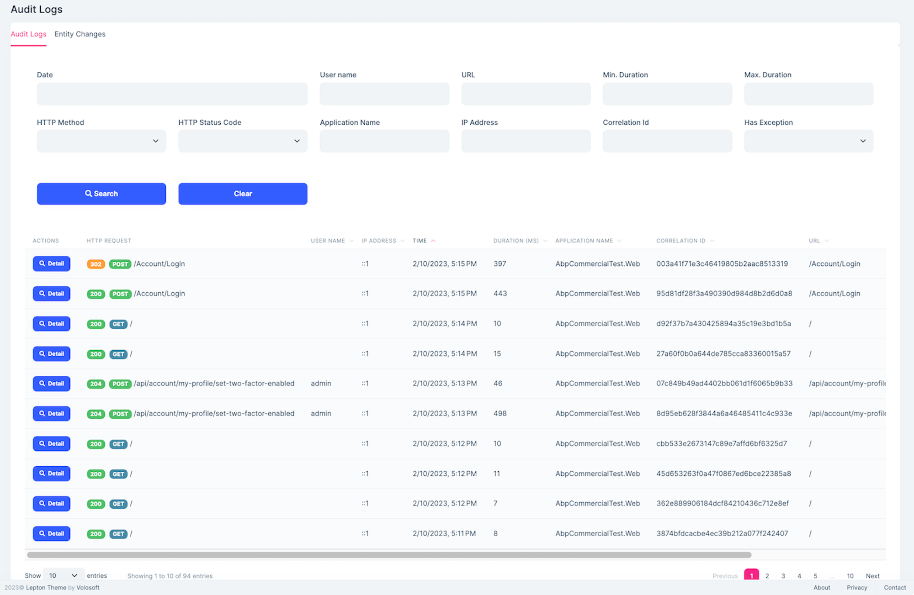
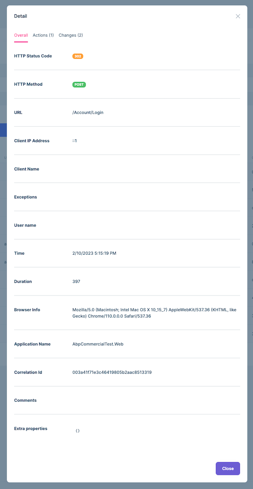
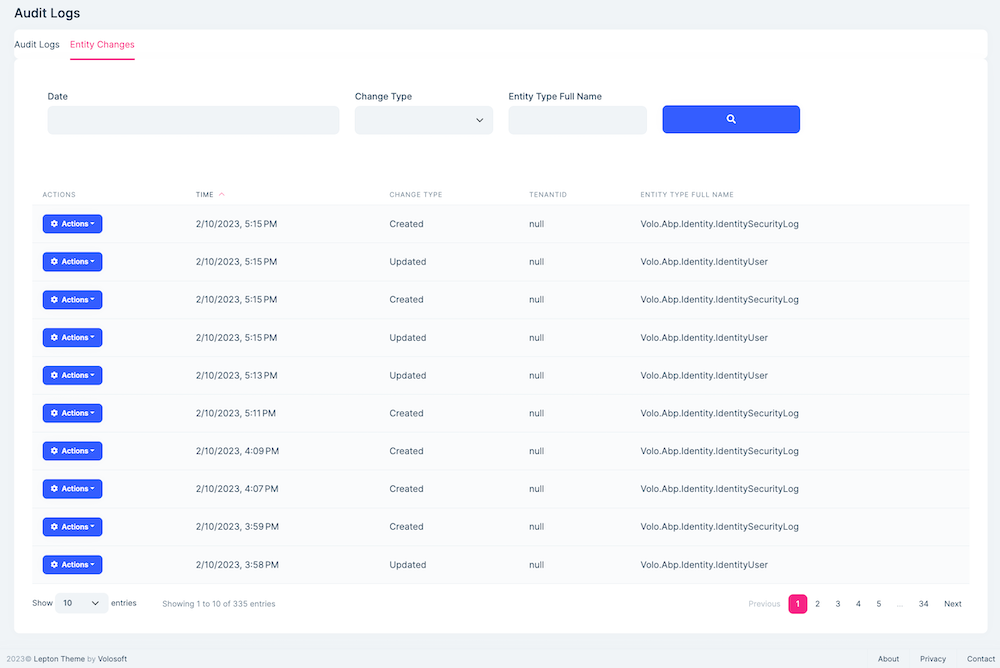
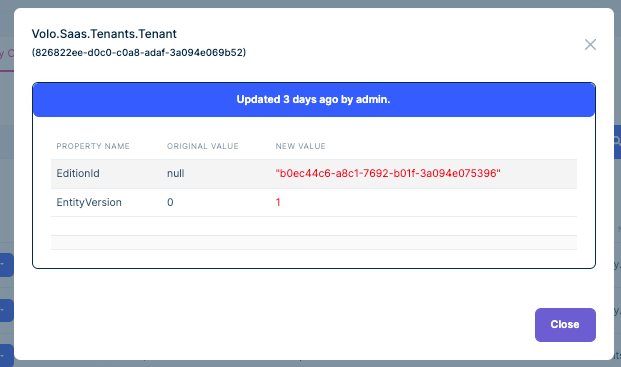
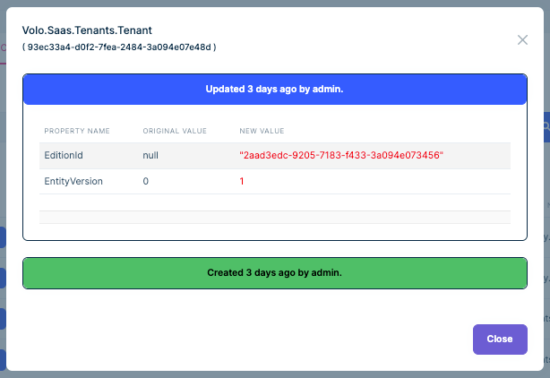

# Audit Logging module

This module implements the Audit Logging system of an application;

* See all audit logs of the system and filter audit logs easily.
* View audit log details, executed actions and changed entities.
* See all changes of entities and filter entity change logs.
* View details of an entity change. 
* View all changes of an entity. 
* This module also defines reusable "Average Execution Duration Per Day" and "Error Rate" widgets.

See [the module description page](https://commercial.abp.io/modules/Volo.AuditLogging.Ui) for an overview of the module features.

## How to install

Identity is pre-installed in [the startup templates](../Startup-Templates/Index). So, no need to manually install it.

### Packages

This module follows the [module development best practices guide](https://docs.abp.io/en/abp/latest/Best-Practices/Index) and consists of several NuGet and NPM packages. See the guide if you want to understand the packages and relations between them.

You can visit [Audit Logging module package list page](https://abp.io/packages?moduleName=Volo.AuditLogging.Ui) to see list of packages related with this module.

## User interface

### Menu items

Audit logs module adds the following items to the "Main" menu, under the "Administration" menu item:

* **Audit Logs**: List, view and filter audit logs and entity changes.

`IAbpAuditLoggingMainMenuNames` class has the constants for the menu item names.

### Pages

#### Audit Logs

Audit logs tab is used to list, view and filter audit logs and entity changes in the system. 




Each line on the list contains basic information about an audit log like HTTP Status Code, HTTP Method, Execution Time etc...

##### Audit Log Details

You can view details of an audit log by clicking the magnifier icon on each audit log line:



* **Overall:** This tab contains detailed information about audit log.
* **Actions:** This tab shows list of actions (controller actions and application service method calls with their parameters) executed during a web request.
* **Changes:** This tab shows changed entities during the web request.

#### Entity Changes

Entity changes tab is used to list, view and filter entity change logs. 




Each line on the list contains basic information about an entity change log like Time (time of change), Change Type etc...

##### Change Details Modal

You can view details of an entity change log by clicking the "Change Details" action item in the entity change log list:




##### Full Change History Modal

You can view details of all changes of an entity by clicking the "Full Change History" action item in the entity change log list:



## Data seed

This module doesn't seed any data.

## Options

### AbpAuditingOptions

`AbpAuditingOptions` can be configured in the UI layer, in the `ConfigureServices` method of your [module](https://docs.abp.io/en/abp/latest/Module-Development-Basics). Example:

````csharp
Configure<AbpAuditingOptions>(options =>
{
    //Set options here...
});
````

To see `AbpAuditingOptions` properties, please see its [documentation](https://docs.abp.io/en/abp/latest/Audit-Logging#abpauditingoptions).

## Internals

### Domain layer

#### Aggregates

This module follows the [Entity Best Practices & Conventions](https://docs.abp.io/en/abp/latest/Best-Practices/Entities) guide.

##### AuditLog

An audit log is a security-relevant chronological record, set of records, and/or destination and source of records that provide documentary evidence of the sequence of activities that have affected at any time a specific operation, procedure, or event.

* `AuditLog` (aggregate root): Represents an audit log in the system.
  * `EntityChange` (collection): Changed entities of audit log.
  * `AuditLogAction` (collection): Executed actions of audit log.

#### Repositories

This module follows the [Repository Best Practices & Conventions](https://docs.abp.io/en/abp/latest/Best-Practices/Repositories) guide.

Following custom repositories are defined for this module:

* `IAuditLogRepository`

### Application layer

#### Application services

* `AuditLogsAppService` (implements `IAuditLogsAppService`): Implements the use cases of the audit logs management UI.

### Database providers

#### Common

##### Table / collection prefix & schema

All tables/collections use the `Abp` prefix by default. Set static properties on the `AbpAuditLoggingDbProperties` class if you need to change the table prefix or set a schema name (if supported by your database provider).

##### Connection string

This module uses `AbpAuditLogging` for the connection string name. If you don't define a connection string with this name, it fallbacks to the `Default` connection string.

See the [connection strings](https://docs.abp.io/en/abp/latest/Connection-Strings) documentation for details.

#### Entity Framework Core

##### Tables

* **AbpAuditLogs**
  * AbpAuditLogActions
  * AbpEntityChanges
    * AbpEntityPropertyChanges

#### MongoDB

##### Collections

* **AbpAuditLogs**

### Permissions

See the `AbpAuditLoggingPermissions` class members for all permissions defined for this module.


### Angular UI

#### Installation

In order to configure the application to use the `AuditLoggingModule`, you first need to import `AuditLoggingConfigModule` from `@volo/abp.ng.audit-logging/config` to root module. `AuditLoggingConfigModule` has a static `forRoot` method which you should call for a proper configuration.

```js
// app.module.ts
import { AuditLoggingConfigModule } from '@volo/abp.ng.audit-logging/config';

@NgModule({
  imports: [
    // other imports
    AuditLoggingConfigModule.forRoot(),
    // other imports
  ],
  // ...
})
export class AppModule {}
```

The `AuditLoggingModule` should be imported and lazy-loaded in your routing module. It has a static `forLazy` method for configuration. Available options are listed below. It is available for import from `@volo/abp.ng.audit-logging`.

```js
// app-routing.module.ts
const routes: Routes = [
  // other route definitions
  {
    path: 'audit-logs',
    loadChildren: () =>
      import('@volo/abp.ng.audit-logging').then(m => m.AuditLoggingModule.forLazy(/* options here */)),
  },
];

@NgModule(/* AppRoutingModule metadata */)
export class AppRoutingModule {}
```

> If you have generated your project via the startup template, you do not have to do anything, because it already has both `AuditLoggingConfigModule` and `AuditLoggingModule`.

<h4 id="h-audit-logging-module-options">Options</h4>

You can modify the look and behavior of the module pages by passing the following options to `AuditLoggingModule.forLazy` static method:

- **entityActionContributors:** Changes grid actions. Please check [Entity Action Extensions for Angular](https://docs.abp.io/en/abp/latest/UI/Angular/Entity-Action-Extensions) for details.
- **toolbarActionContributors:** Changes page toolbar. Please check [Page Toolbar Extensions for Angular](https://docs.abp.io/en/abp/latest/UI/Angular/Page-Toolbar-Extensions) for details.
- **entityPropContributors:** Changes table columns. Please check [Data Table Column Extensions for Angular](https://docs.abp.io/en/abp/latest/UI/Angular/Data-Table-Column-Extensions) for details.


#### Services / Models

Audit Logging module services and models are generated via `generate-proxy` command of the [ABP CLI](https://docs.abp.io/en/abp/latest/CLI). If you need the module's proxies, you can run the following command in the Angular project directory:

```bash
abp generate-proxy --module auditLogging
```

#### Replaceable Components

`eAuditLoggingComponents` enum provides all replaceable component keys. It is available for import from `@volo/abp.ng.audit-logging`.

Please check [Component Replacement document](https://docs.abp.io/en/abp/latest/UI/Angular/Component-Replacement) for details.


#### Remote Endpoint URL

The Audit Logging module remote endpoint URL can be configured in the environment files.

```js
export const environment = {
  // other configurations
  apis: {
    default: {
      url: 'default url here',
    },
    AbpAuditLogging: {
      url: 'Audit Logging remote url here'
    }
    // other api configurations
  },
};
```

The Audit Logging module remote URL configuration shown above is optional. If you don't set a URL, the `default.url` will be used as fallback.

## Distributed Events

This module doesn't define any additional distributed event. See the [standard distributed events](https://docs.abp.io/en/abp/latest/Distributed-Event-Bus).
