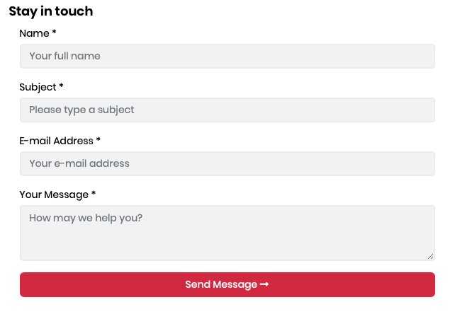
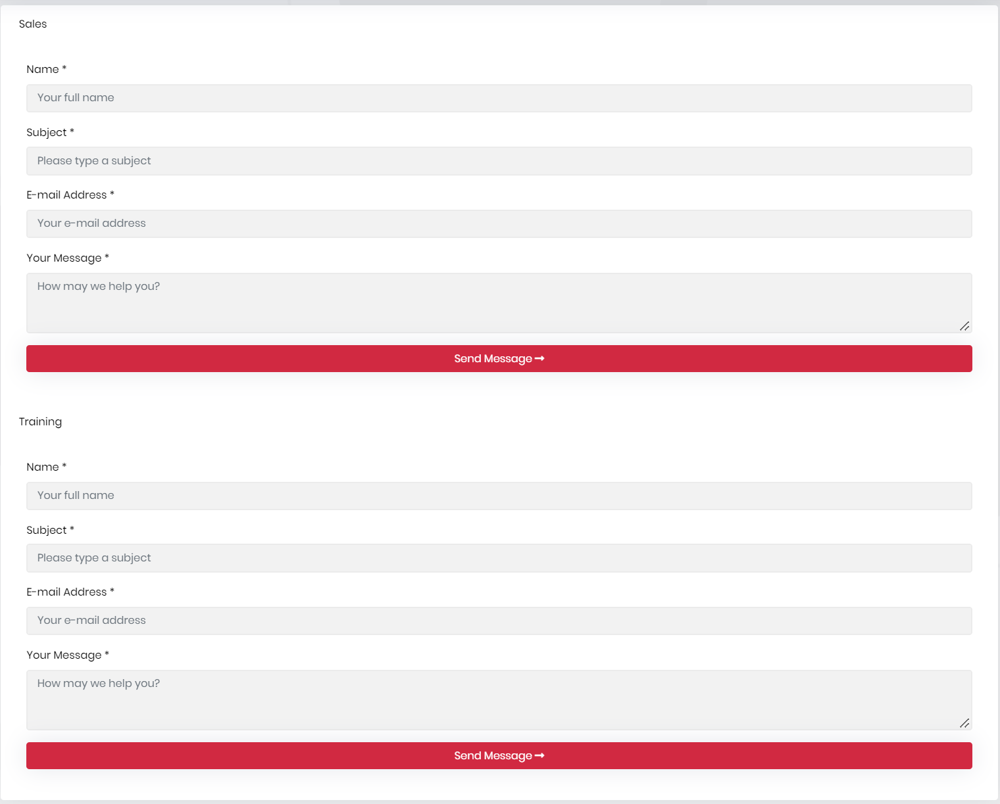
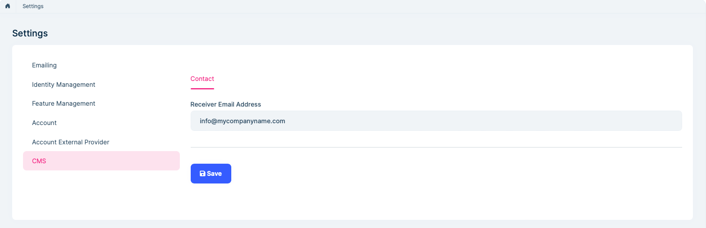

# CMS Kit Pro: Contact Management

> You must have an ABP Team or a higher license to use CMS Kit Pro module's features.

CMS Kit provides a widget to create a contact form on your website.

## Enabling the Contact Management System

By default, CMS Kit features are disabled. Therefore, you need to enable the features you want, before starting to use it. You can use the [Global Feature](../framework/infrastructure/global-features.md) system to enable/disable CMS Kit features on development time. Alternatively, you can use the ABP's [Feature System](../framework/infrastructure/features.md) to disable a CMS Kit feature on runtime.

> Check the ["How to Install" section of the CMS Kit Module documentation](index.md#how-to-install) to see how to enable/disable CMS Kit features on development time.

## Contact Widget

The contact management system provides a contact form [widget](../../framework/ui/mvc-razor-pages/widgets.md) to create contact forms on the UI:

```csharp
@await Component.InvokeAsync(typeof(ContactViewComponent))
```

Here, a screenshot from the widget:



## Multiple Contact Widgets

The contact management system allows you to create multiple contact forms. You can define a named contact widget as below:

```csharp
@await Component.InvokeAsync(typeof(ContactViewComponent), new
{
    contactName = "Sales"
});
```

Then, you need to configure the defined contact widgets in the `ConfigureServices` method of your module class:

```csharp
Configure<CmsKitContactConfigOptions>(options =>
{
    options.AddContact("Sales", "info@sales.com");
    options.AddContact("Training", "info@training.com");
});
```

Here, is a screenshot that shows multiple contact forms on a page:




## Options

You can configure the `CmsKitContactOptions` to enable/disable recaptcha for contact form in the `ConfigureServices` method of your [module](../../framework/architecture/modularity/basics.md).

Example:

```csharp
Configure<CmsKitContactOptions>(options =>
{
    options.IsRecaptchaEnabled = true; //false by default
});
```

`CmsKitContactOptions` properties:

* `IsRecaptchaEnabled` (default: false): This flag enables or disables the reCaptcha for the contact form. You can set it as **true** if you want to use reCaptcha in your contact form.

If you set **IsRecaptchaEnabled** as **true**, you also need to specify **SiteKey** and **SiteSecret** options for reCaptcha. To do that, add **CmsKit:Contact** section into your `appsettings.json` file:

```json
{
    "CmsKit": {
        "Contact": {
            "SiteKey": "your-site-key",
            "SiteSecret": "your-site-secret"
        }
    }
}
```

## Settings 

You can configure the receiver (email address) by using the CMS tab in the settings page. 



## Internals

* `ContactEmailSender` is used to send emails to notify the configured receiver when a new contact form entry arrives.
