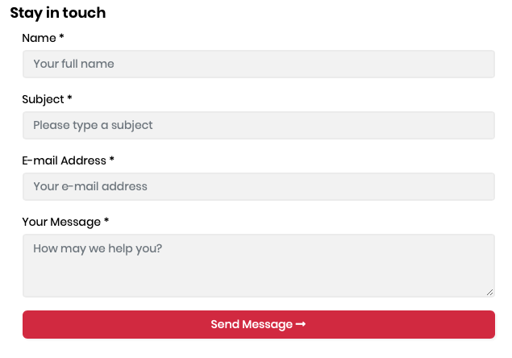
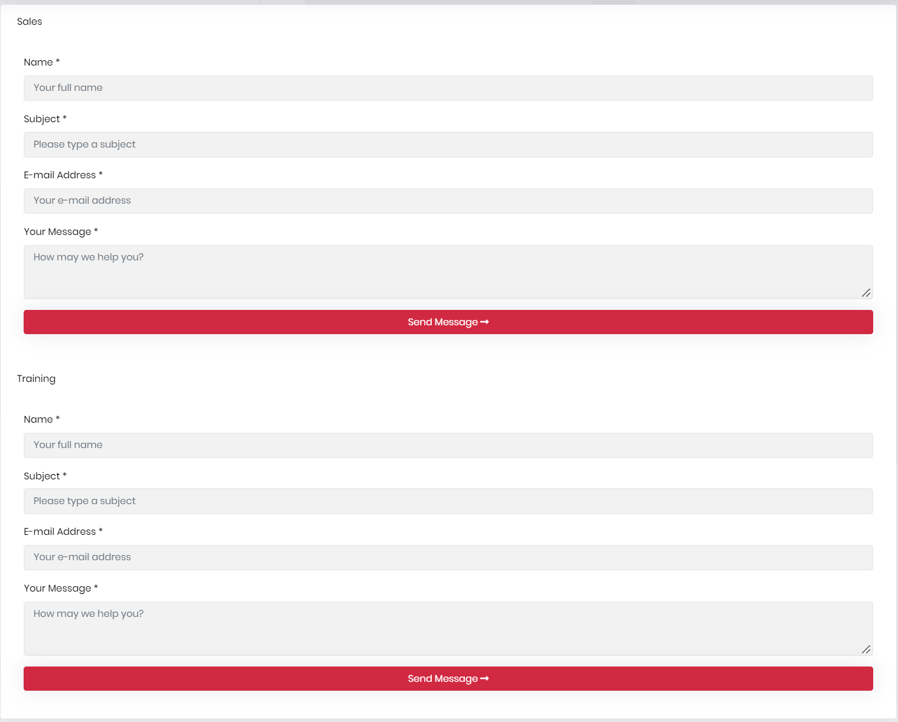
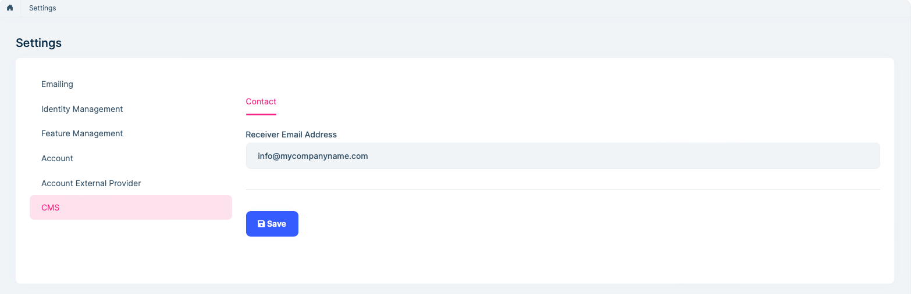

```json
//[doc-seo]
{
    "Description": "Discover how to enable and utilize the CMS Kit Pro contact form widget for efficient contact management on your website with ABP Framework."
}
```

# CMS Kit Pro: Contact Management

> You must have an [ABP Team or a higher license](https://abp.io/pricing) to use CMS Kit Pro module's features.

CMS Kit provides a widget to create a contact form on your website.

## Enabling the Contact Management System

By default, CMS Kit features are disabled. Therefore, you need to enable the features you want before starting to use them. You can use the [Global Feature](../../framework/infrastructure/global-features.md) system to enable or disable CMS Kit features at development time. Alternatively, you can use ABP's [Feature System](../../framework/infrastructure/features.md) to disable a CMS Kit feature at runtime.

> Check the ["How to Install" section of the CMS Kit Module documentation](index.md#how-to-install) to see how to enable or disable CMS Kit features at development time.

## Contact Widget

The contact management system provides a contact form [widget](../../framework/ui/mvc-razor-pages/widgets.md) to create contact forms on the UI:

```csharp
@await Component.InvokeAsync(typeof(ContactViewComponent), new { })
```

Here is a screenshot of the widget:



## Multiple Contact Widgets

The contact management system allows you to create multiple contact forms with different receivers. You can define a named contact widget as shown below:

```csharp
@await Component.InvokeAsync(typeof(ContactViewComponent), new
{
    contactName = "Sales"
});
```

Then, configure the receiver for each name in the `ConfigureServices` method of your module class:

```csharp
Configure<CmsKitContactConfigOptions>(options =>
{
    options.AddContact("Sales", "info@sales.com");
    options.AddContact("Training", "info@training.com");
});
```

The following screenshot shows multiple contact forms on a page:



When the submitted `contactName` matches a configured entry, that entry's receiver is used. Otherwise, the module uses the receiver email address configured on the CMS settings page. The contact name is also prefixed to the email subject when it is not empty.

## Options

You can configure `CmsKitContactOptions` to enable or disable reCAPTCHA for the contact form in the `ConfigureServices` method of your [module](../../framework/architecture/modularity/basics.md).

Example:

```csharp
Configure<CmsKitContactOptions>(options =>
{
    options.IsRecaptchaEnabled = true;
});
```

`CmsKitContactOptions` properties:

* `IsRecaptchaEnabled` (default: `false`): Enables reCAPTCHA v3 validation for public contact submissions.

If you set `IsRecaptchaEnabled` to `true`, also specify `SiteKey` and `SiteSecret` for reCAPTCHA. Add the `CmsKit:Contact` section to your `appsettings.json` file:

```json
{
    "CmsKit": {
        "Contact": {
            "SiteKey": "your-site-key",
            "SiteSecret": "your-site-secret"
        }
    }
}
```

## Settings

You can configure the fallback receiver email address on the CMS tab of the settings page. This setting is tenant-aware and is used when the form has no matching named receiver. Its default value is `info@mycompanyname.com`; replace it with an address that belongs to your application before deploying to production.



## Internals

* `ContactEmailSender` is used to send emails to notify the configured receiver when a new contact form entry arrives.
