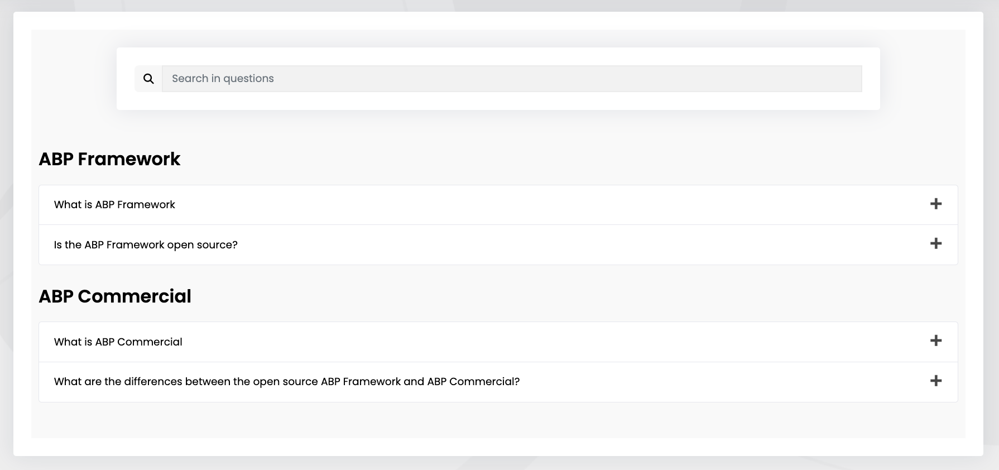
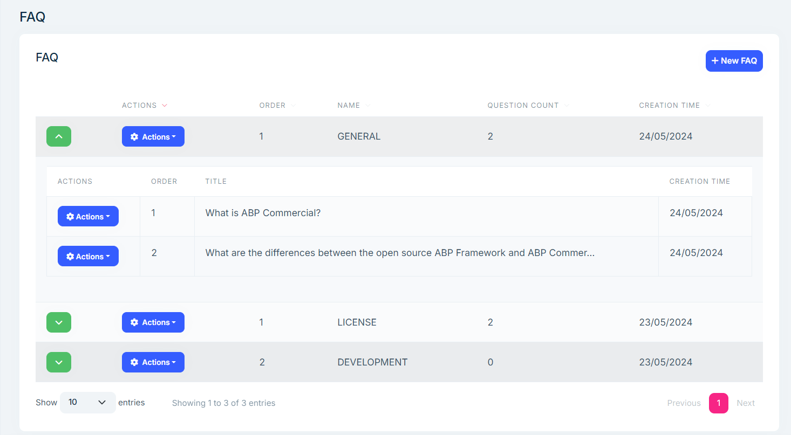
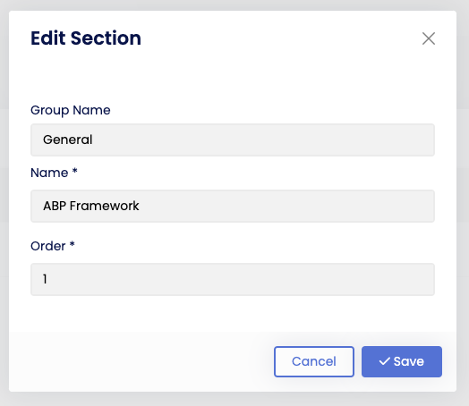
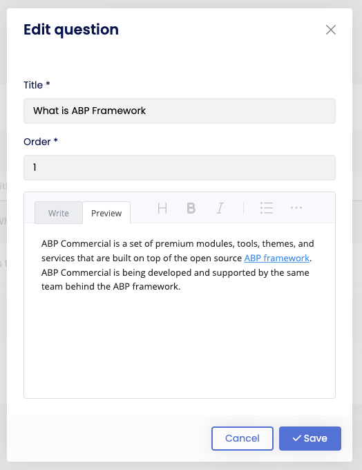

# CMS Kit Pro: FAQ System

> You must have an ABP Team or a higher license to use CMS Kit Pro module's features.

The CMS kit provides a **FAQ** system to allow users to create, edit and delete FAQ's. Here is a screenshot of the FAQ widget:



## Enabling the FAQ System

By default, CMS Kit features are disabled. Therefore, you need to enable the features you want, before starting to use it. You can use the [Global Feature](../../framework/infrastructure/global-features.md) system to enable/disable CMS Kit features on development time. Alternatively, you can use the ABP Framework's [Feature System](../../framework/infrastructure/features.md) to disable a CMS Kit feature on runtime.

> Check the ["How to Install" section of the CMS Kit Module documentation](index.md#how-to-install) to see how to enable/disable CMS Kit features on development time.

## User Interface

### Menu Items

CMS Kit module admin side adds the following items to the main menu, under the **CMS** menu item:

**FAQ's**: FAQ management page.

`CmsKitProAdminMenus` class has the constants for the menu item names.

### Pages

You can list, create, update and delete sections and their questions FAQ's on the admin side of your solution.





## Faq Widget

The FAQ system provides a FAQ [widget](../../framework/ui/mvc-razor-pages/widgets.md) for users to display FAQ's. You can place the widget on a page like below:

```csharp
@await Component.InvokeAsync(
    typeof(FaqViewComponent),
    new
    {
        groupName = "Community",
        name = "Development"
    })
```

`FaqViewComponent` parameters:
- `groupName` (optional): It allows to specify which FAQ group to show. If not specified, all groups will be shown.
- `sectionName` (optional): It is used to determine which section within the specified group will be shown. If not specified, all sections in the related group will be shown.

The FAQ system can also be used in combination with the [dynamic widget](../cms-kit/dynamic-widget.md) feature.

## Options

The FAQ system provides a mechanism to group sections by group name. For example, if you want to use the FAQ system for  community and support page, you need to define two group names named Community and Support and add sections under these groups. So, before using the FAQ system, you need to define groups. For that, you can use `FaqOptions`. `FaqOptions` can be configured at the domain layer, in the `ConfigureServices` method of your [module]../../framework/architecture/modularity/basics.md).

```csharp
Configure<FaqOptions>(options =>
{
    options.SetGroups(new[] { "General", "Community", "Support" });
});
```

`FaqOptions` properties:

- `Groups`: Dictionary of defined groups in the FAQ system. The `options.SetGroups` method is a shortcut to add a new groups to this dictionary.

## Internals

### Domain Layer

#### Aggregates

This module follows the [Entity Best Practices & Conventions](../../framework/architecture/best-practices/entities.md) guide.

##### FAQ

A FAQ represents a generated FAQ with its questions: 

- `FaqSection` (aggregate root): Represents the defined FAQ sections related to the FAQ in the system.
- `FaqQuestion` (aggregate root): Represents the defined FAQ questions with section identifier related to the FAQ in the system.

#### Repositories

This module follows the guidelines of [Repository Best Practices & Conventions](../../framework/architecture/best-practices/repositories.md).

The following special repositories are defined for these features:

- `IFaqSectionRepository`
- `IFaqQuestionRepository`


#### Domain services

This module follows the [Domain Services Best Practices & Conventions](../../framework/architecture/best-practices/domain-services.md) guide.


### Application layer

#### Application services

- `FaqSectionAdminAppService` (implements `IFaqSectionAdminAppService`): Implements the use cases of FAQ section management for admin side.
- `FaqQuestionAdminAppService` (implements `IFaqQuestionAdminAppService`): Implements the use cases of FAQ question management for admin side.
- `FaqSectionPublicAppService` (implements `IFaqSectionPublicAppService`): Implements the use cases of FAQ's for public websites.

### Database providers

#### Common

##### Table / collection prefix & schema

All tables/collections use the `Cms` prefix by default. Set static properties on the `CmsKitDbProperties` class if you need to change the table prefix or set a schema name (if supported by your database provider).

##### Connection string

This module uses `CmsKit` for the connection string name. If you don't define a connection string with this name, it fallbacks to the `Default` connection string.

See the [connection strings](../../framework/fundamentals/connection-strings.md) documentation for details.

#### Entity Framework Core

##### Tables

- CmsFaqSections
- CmsFaqQuestions

#### MongoDB

##### Collections

- CmsFaqSections
- CmsFaqQuestions

## Entity Extensions

Check the ["Entity Extensions" section of the CMS Kit Module documentation](index.md#entity-extensions) to see how to extend entities of the FAQ Feature of the CMS Kit Pro module.