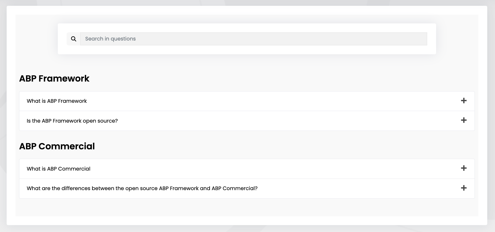
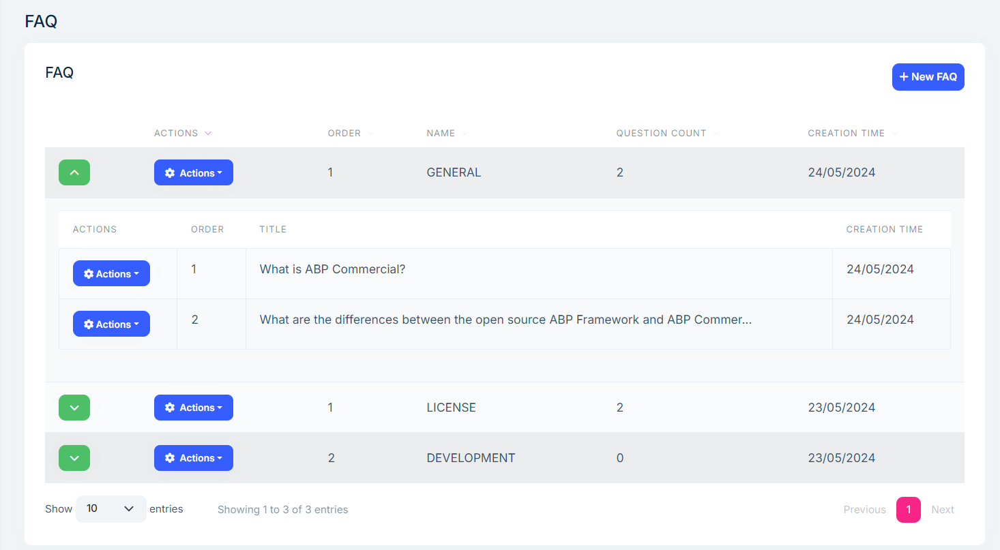
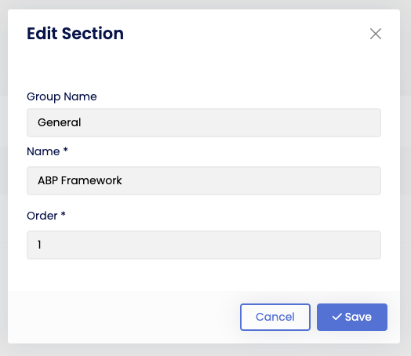
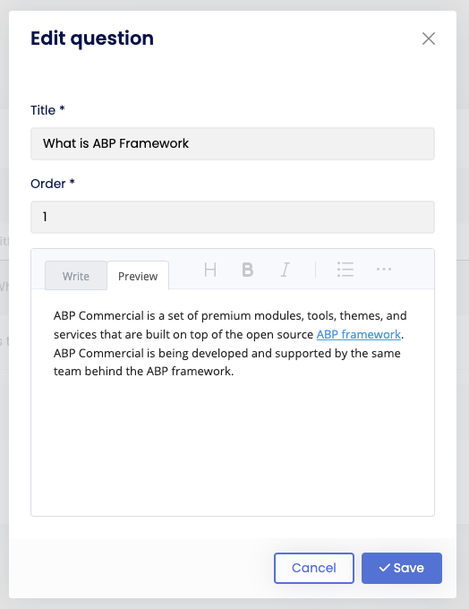

```json
//[doc-seo]
{
    "Description": "Discover how to implement and manage the FAQ system in CMS Kit Pro, including enabling features and customizing the user interface."
}
```

# CMS Kit Pro: FAQ System

> You must have an [ABP Team or a higher license](https://abp.io/pricing) to use CMS Kit Pro module's features.

CMS Kit Pro provides an **FAQ** system to organize questions into groups and sections and display them on public pages. Here is a screenshot of the FAQ widget:



## Enabling the FAQ System

By default, CMS Kit features are disabled. Therefore, you need to enable the features you want before starting to use them. You can use the [Global Feature](../../framework/infrastructure/global-features.md) system to enable or disable CMS Kit features at development time. Alternatively, you can use ABP's [Feature System](../../framework/infrastructure/features.md) to disable a CMS Kit feature at runtime.

> Check the ["How to Install" section of the CMS Kit Module documentation](index.md#how-to-install) to see how to enable or disable CMS Kit features at development time.

## User Interface

### Menu Items

CMS Kit module admin side adds the following items to the main menu, under the **CMS** menu item:

**FAQs**: FAQ group, section and question management page.

`CmsKitProAdminMenus` class has the constants for the menu item names.

### Pages

You can list, create, update and delete FAQ groups, sections and questions on the admin side of your solution. A group contains sections, and a section contains questions.





## FAQ Widget

The FAQ system provides an FAQ [widget](../../framework/ui/mvc-razor-pages/widgets.md) for displaying FAQs. You can place the widget on a page as shown below:

```csharp
@await Component.InvokeAsync(
    typeof(FaqViewComponent),
    new
    {
        groupName = "Community",
        sectionName = "Development"
    })
```

`FaqViewComponent` parameters:

- `groupName` (required): Specifies the FAQ group to show. Create this group on the FAQ administration page before rendering the widget.
- `sectionName` (optional): Specifies a section within the selected group. If it is not set, all sections in the group are shown.

The FAQ system can also be used in combination with the [dynamic widget](../cms-kit/dynamic-widget.md) feature.

## FAQ Groups

FAQ groups are persisted data and are managed from the FAQ administration page. Create groups such as `Community` or `Support`, then assign each section to one of those groups. Group names must be unique.

## Internals

### Domain Layer

#### Aggregates

This module follows the [Entity Best Practices & Conventions](../../framework/architecture/best-practices/entities.md) guide.

##### FAQ

An FAQ represents a generated FAQ with its questions:

- `FaqSection` (aggregate root): Represents the defined FAQ sections related to the FAQ in the system.
- `FaqQuestion` (aggregate root): Represents the defined FAQ questions with section identifier related to the FAQ in the system.
- `FaqGroup` (aggregate root): Represents a named group that contains FAQ sections.

#### Repositories

This module follows the guidelines of [Repository Best Practices & Conventions](../../framework/architecture/best-practices/repositories.md).

The following special repositories are defined for these features:

- `IFaqSectionRepository`
- `IFaqQuestionRepository`
- `IFaqGroupRepository`


#### Domain services

This module follows the [Domain Services Best Practices & Conventions](../../framework/architecture/best-practices/domain-services.md) guide.


### Application layer

#### Application services

- `FaqSectionAdminAppService` (implements `IFaqSectionAdminAppService`): Implements the use cases of FAQ section management for admin side.
- `FaqQuestionAdminAppService` (implements `IFaqQuestionAdminAppService`): Implements the use cases of FAQ question management for admin side.
- `FaqGroupAdminAppService` (implements `IFaqGroupAdminAppService`): Implements the use cases of FAQ group management for admin side.
- `FaqSectionPublicAppService` (implements `IFaqSectionPublicAppService`): Implements the use cases of FAQs for public websites.
- `FaqGroupPublicAppService` (implements `IFaqGroupPublicAppService`): Finds FAQ groups by name for public widgets.

### Database providers

#### Common

##### Table / collection prefix & schema

All tables/collections use the `Cms` prefix by default. Set static properties on the `AbpCmsKitDbProperties` class if you need to change the table prefix or set a schema name (if supported by your database provider).

##### Connection string

This module uses `CmsKit` for the connection string name. If you don't define a connection string with this name, it falls back to the `Default` connection string.

See the [connection strings](../../framework/fundamentals/connection-strings.md) documentation for details.

#### Entity Framework Core

##### Tables

- CmsFaqSections
- CmsFaqQuestions
- CmsFaqGroups

#### MongoDB

##### Collections

- CmsFaqSections
- CmsFaqQuestions
- CmsFaqGroups
