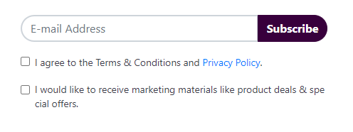
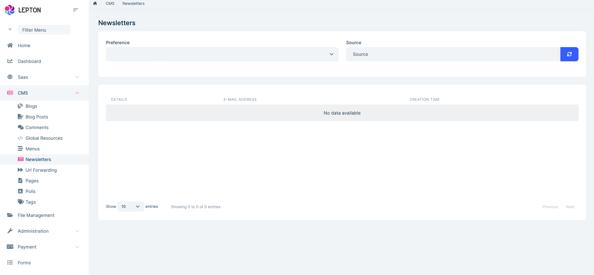
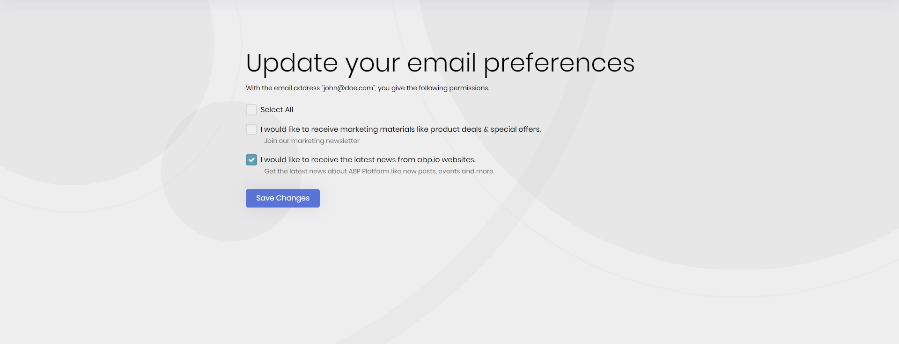

# CMS Kit Pro: Newsletter System

> You must have an ABP Team or a higher license to use CMS Kit Pro module's features.

CMS Kit provides a **newsletter** system to allow users to subscribe to newsletters. Here a screenshot of the newsletter subscription widget:



## Enabling the Newsletter System

By default, CMS Kit features are disabled. Therefore, you need to enable the features you want, before starting to use it. You can use the [Global Feature](../../framework/infrastructure/global-features.md) system to enable/disable CMS Kit features on development time. Alternatively, you can use the ABP's [Feature System](../../framework/infrastructure/features.md) to disable a CMS Kit feature on runtime.

> Check the ["How to Install" section of the CMS Kit Module documentation](index.md#how-to-install) to see how to enable/disable CMS Kit features on development time.

## User Interface

### Menu Items

**Newsletters**: Opens the newsletter subscription management page.

### Pages

#### Newsletters

You can then view the subscribers and export the list as CSV file, in the admin side of your solution:



#### Email Preferences Management

You (and users of your public web application) can manage your email preferences and unsubscribe from newsletters by visiting the **Email Preferences page** (*/cms/newsletter/email-preferences*), in the public side of your solution:



## The Newsletter Subscription Widget

The newsletter subscription system provides a newsletter subscription [widget](../../framework/ui/mvc-razor-pages/widgets.md) to allow users to subscribe to a newsletter. 
You can simply place the widget on a page like below: 

```csharp
@await Component.InvokeAsync(
  typeof(NewsletterViewComponent),
  new
  {
      preference = "TechNewsletter",
      source = "Footer",
      requestAdditionalPreferencesLater = false
  })
```

When you're adding the newsletter component, you can the specify `source` parameter to see where users subscribe to newsletters. See the options to understand the preferences.

## Options

Before using the newsletter system, you need to define the preferences. You can use the `NewsletterOptions` type to define preferences. `NewsletterOptions` can be configured in the domain layer, in the `ConfigureServices` method of your [module](../../framework/architecture/modularity/basics.md).

**Example:**

```csharp
options.AddPreference("TechNewsletter",
    new NewsletterPreferenceDefinition(
        "Daily Technology Newsletter",
        privacyPolicyConfirmation: "I accept the <a href='/privacy-policy'>Privacy Policy</a>.")
    )
);
```

`NewsletterOptions` properties:

- `Preferences`: List of defined newsletter preferences (`NewsletterPreferenceDefinition`) in the newsletter system.
- `WidgetViewPath`: Default view path for all newsletter preferences.

`NewsletterPreferenceDefinition` properties:

- `Preference`: Name of the preference. We will use this field while displaying the newsletter component on the UI.
- `PrivacyPolicyConfirmation`: Privacy policy confirmation text shown in the newsletter subscription widget.
- `AdditionalPreferences`: Additional preference list that will show up after a user subscribes to the newsletter.
- `WidgetPath`: If you want to use a different newsletter widget instead of the default widget, you can specify the newsletter widget path using this field.

## Internals

### Domain Layer

#### Aggregates

This module follows the [Entity Best Practices & Conventions](../../framework/architecture/best-practices/entities.md) guide.

##### NewsletterRecord

A newsletter record represents a newsletter subscription for a specific email address

- `NewsletterRecord` (aggregate root): Represents a newsletter subscription in the system.

#### Repositories

This module follows the [Repository Best Practices & Conventions](../../framework/architecture/best-practices/repositories.md) guide.

Following custom repositories are defined for this feature:

- `INewsletterRecordRepository`

#### Domain services

This module follows the [Domain Services Best Practices & Conventions](../../framework/architecture/best-practices/domain-services.md) guide.

##### Newsletter Record Manager

`NewsletterRecordManager` is used to perform some operations for the `NewsletterRecord` aggregate root.

### Application layer

#### Application services

- `NewsletterRecordAdminAppService` (implements `INewsletterRecordAdminAppService`): Implements the use cases of newsletter subscription management.
- `NewsletterRecordPublicAppService` (implements `INewsletterRecordPublicAppService`): Implements the use cases of newsletter subscription for public websites.

### Database providers

#### Common

##### Table / collection prefix & schema

All tables/collections use the `Cms` prefix by default. Set static properties on the `CmsKitDbProperties` class if you need to change the table prefix or set a schema name (if supported by your database provider).

##### Connection string

This module uses `CmsKit` for the connection string name. If you don't define a connection string with this name, it fallbacks to the `Default` connection string.

See the [connection strings](../../framework/fundamentals/connection-strings.md) documentation for details.

#### Entity Framework Core

##### Tables

- CmsNewsletterRecords
  - CmsNewsletterPreferences

#### MongoDB

##### Collections

- **CmsNewsletterRecords**

## Entity Extensions

Check the ["Entity Extensions" section of the CMS Kit Module documentation](index.md#entity-extensions) to see how to extend entities of the Newsletter Feature of the CMS Kit Pro module.