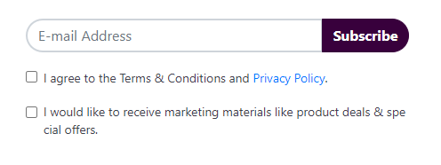
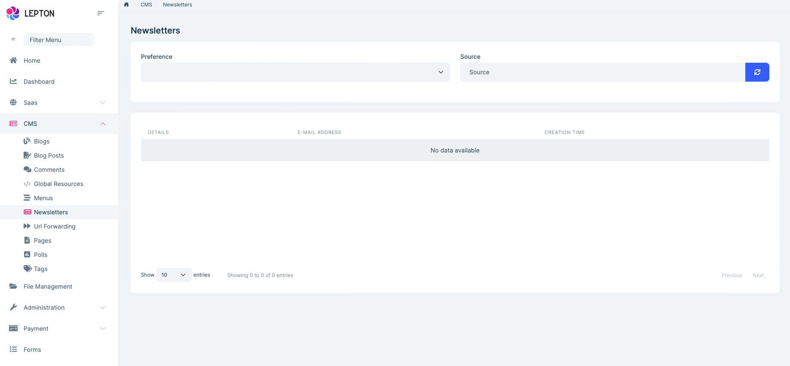
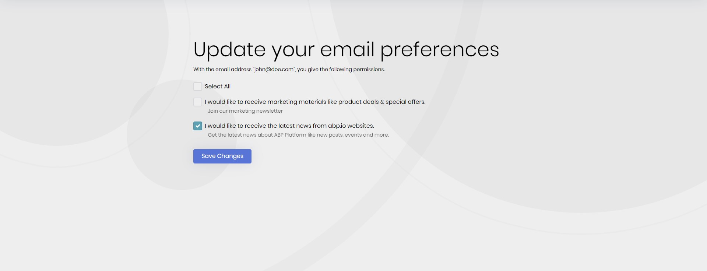

```json
//[doc-seo]
{
    "Description": "Discover how to enable and manage the newsletter system in CMS Kit Pro, enhancing user engagement with subscription features."
}
```

# CMS Kit Pro: Newsletter System

> You must have an [ABP Team or a higher license](https://abp.io/pricing) to use CMS Kit Pro module's features.

CMS Kit provides a **newsletter** system that allows users to subscribe to newsletters. Here is a screenshot of the newsletter subscription widget:



## Enabling the Newsletter System

By default, CMS Kit features are disabled. Therefore, you need to enable the features you want before starting to use them. You can use the [Global Feature](../../framework/infrastructure/global-features.md) system to enable or disable CMS Kit features at development time. Alternatively, you can use ABP's [Feature System](../../framework/infrastructure/features.md) to disable a CMS Kit feature at runtime.

> Check the ["How to Install" section of the CMS Kit Module documentation](index.md#how-to-install) to see how to enable or disable CMS Kit features at development time.

## User Interface

### Menu Items

**Newsletters**: Opens the newsletter subscription management page.

### Pages

#### Newsletters

You can view subscribers, edit their preferences, import subscriptions from a CSV file and export the filtered list as a CSV file on the admin side of your solution:



#### Email Preferences Management

Users can manage their email preferences and unsubscribe from newsletters on the public **Email Preferences** page at `/cms/newsletter/email-preferences`:



## The Newsletter Subscription Widget

The newsletter subscription system provides a newsletter subscription [widget](../../framework/ui/mvc-razor-pages/widgets.md) to allow users to subscribe to a newsletter. You can place the widget on a page as shown below:

```csharp
@await Component.InvokeAsync(
  typeof(NewsletterViewComponent),
  new
  {
      preference = "TechNewsletter",
      source = "Footer",
      requestAdditionalPreferencesLater = false
})
```

The `preference` and `source` parameters are required. `preference` must match a registered preference. Use `source` to distinguish where subscriptions originate, such as `Footer` or `Blog`. If `requestAdditionalPreferencesLater` is `true`, the widget requests the additional subscriptions in the success dialog instead of the initial form. You can also pass `privacyPolicyConfirmation` to override the preference's configured privacy-policy text for that widget instance.

New subscriptions require email confirmation. Once confirmed, users can manage all registered preferences from `/cms/newsletter/email-preferences`; disabling every preference removes the subscription record.

## Options

Before using the newsletter system, you need to define the preferences. You can use the `NewsletterOptions` type to define preferences. `NewsletterOptions` can be configured in the domain layer, in the `ConfigureServices` method of your [module](../../framework/architecture/modularity/basics.md).

**Example:**

```csharp
Configure<NewsletterOptions>(options =>
{
    options.AddPreference(
        "ProductUpdates",
        new NewsletterPreferenceDefinition(
            new LocalizableString(
                typeof(MyProjectResource),
                "Newsletter:ProductUpdates")
        )
    );

    options.AddPreference(
        "TechNewsletter",
        new NewsletterPreferenceDefinition(
            new LocalizableString(
                typeof(MyProjectResource),
                "Newsletter:TechNewsletter"),
            definition: new LocalizableString(
                typeof(MyProjectResource),
                "Newsletter:TechNewsletterDescription"),
            privacyPolicyConfirmation: new LocalizableString(
                typeof(MyProjectResource),
                "Newsletter:PrivacyPolicyConfirmation"),
            additionalPreferences: new List<string> { "ProductUpdates" }
        )
    );
});
```

`NewsletterOptions` properties:

- `Preferences`: Dictionary of registered preference names and their `NewsletterPreferenceDefinition` values.
- `WidgetViewPath`: Default view path for all newsletter preferences.

`NewsletterPreferenceDefinition` properties:

- `Preference`: Name of the preference. We will use this field while displaying the newsletter component on the UI.
- `DisplayPreference`: Localizable display name of the preference.
- `Definition`: Optional localizable description shown on the email preferences page.
- `PrivacyPolicyConfirmation`: Privacy policy confirmation text for the newsletter subscription widget. The preference-level value currently reaches the widget only when the selected definition has a non-empty `AdditionalPreferences` list; otherwise the service returns before localizing this value. Pass `privacyPolicyConfirmation` when invoking the widget if you need an override that is independent of that list.
- `AdditionalPreferences`: Names of other registered preferences that participate in the additional-preference flow.
- `WidgetViewPath`: Optional Razor view path for this preference. It overrides the default `NewsletterOptions.WidgetViewPath`.

The widget uses `~/Pages/Public/Shared/Components/Newsletter/Default.cshtml` when neither view-path option is set.

The current implementation first checks whether the selected preference has a non-empty `AdditionalPreferences` list. If it does, the service collects registered preference names referenced by the `AdditionalPreferences` lists of all registered definitions, excludes the selected preference and removes duplicates. If the selected preference has no additional preferences, the widget does not offer any. Keep this global collection behavior in mind when multiple definitions reference different additional preferences.

### Email Preferences Page Options

Use `NewsletterPreferencesManagementOptions` to set the source recorded for changes made on the email preferences page and an optional privacy-policy confirmation message:

```csharp
Configure<NewsletterPreferencesManagementOptions>(options =>
{
    options.Source = "EmailPreferences";
    options.PrivacyPolicyConfirmation = new LocalizableString(
        typeof(MyProjectResource),
        "Newsletter:PrivacyPolicyConfirmation"
    );
});
```

## Internals

### Domain Layer

#### Aggregates

This module follows the [Entity Best Practices & Conventions](../../framework/architecture/best-practices/entities.md) guide.

##### NewsletterRecord

A newsletter record represents a newsletter subscription for a specific email address.

- `NewsletterRecord` (aggregate root): Represents a newsletter subscription in the system.

#### Repositories

This module follows the [Repository Best Practices & Conventions](../../framework/architecture/best-practices/repositories.md) guide.

Following custom repositories are defined for this feature:

- `INewsletterRecordRepository`

#### Domain services

This module follows the [Domain Services Best Practices & Conventions](../../framework/architecture/best-practices/domain-services.md) guide.

##### Newsletter Record Manager

`NewsletterRecordManager` is used to perform some operations for the `NewsletterRecord` aggregate root.

### Application layer

#### Application services

- `NewsletterRecordAdminAppService` (implements `INewsletterRecordAdminAppService`): Implements the use cases of newsletter subscription management.
- `NewsletterRecordPublicAppService` (implements `INewsletterRecordPublicAppService`): Implements the use cases of newsletter subscription for public websites.

### Database providers

#### Common

##### Table / collection prefix & schema

All tables/collections use the `Cms` prefix by default. Set static properties on the `AbpCmsKitDbProperties` class if you need to change the table prefix or set a schema name (if supported by your database provider).

##### Connection string

This module uses `CmsKit` for the connection string name. If you don't define a connection string with this name, it falls back to the `Default` connection string.

See the [connection strings](../../framework/fundamentals/connection-strings.md) documentation for details.

#### Entity Framework Core

##### Tables

- CmsNewsletterRecords
  - CmsNewsletterPreferences

#### MongoDB

##### Collections

- **CmsNewsletterRecords**

## Entity Extensions

Check the ["Entity Extensions" section of the CMS Kit Module documentation](index.md#entity-extensions) to see how to extend entities of the Newsletter Feature of the CMS Kit Pro module.
