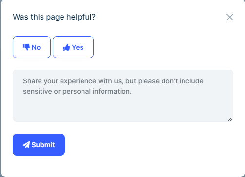
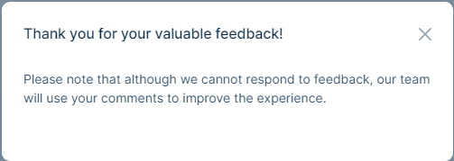
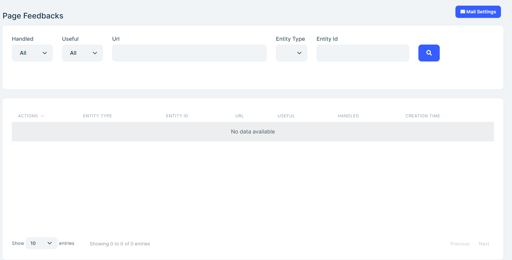
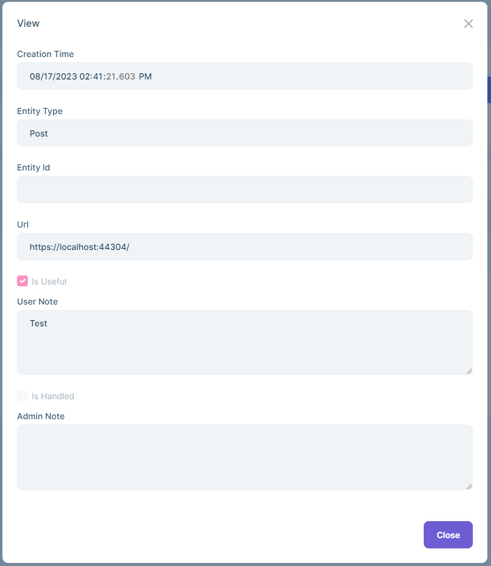
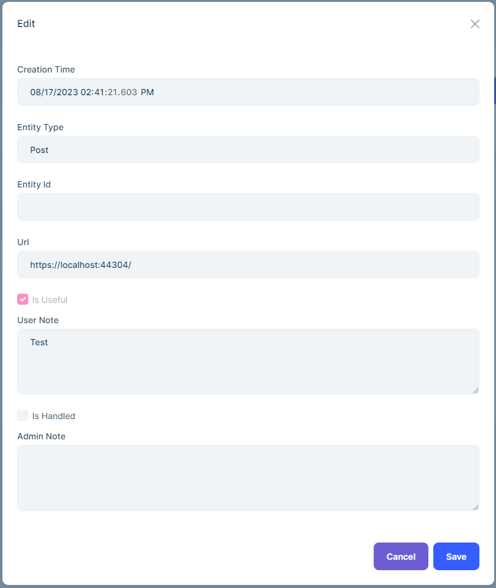
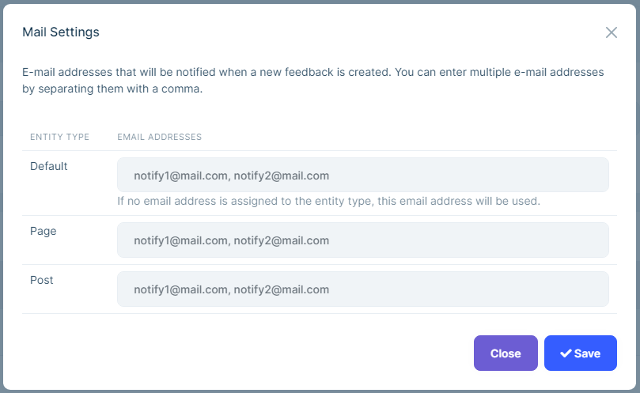

# CMS Kit Pro: Page Feedback System

> You must have an ABP Team or a higher license to use CMS Kit Pro module's features.

The CMS Kit provides a **Page Feedback** system to collect feedback from users about pages.

|  |  |
| ------------------------------------------------------------------------------------------ | -------------------------------------------------------------------------------------------- |

## Enabling the Page Feedback System

All CMS Kit features are disabled bu default. Therefore, you need to enable the features you want before starting to use it. You can use the [Global Feature](../../framework/infrastructure/global-features.md) system to enable/disable the CMS Kit features on development time. Alternatively, you can use the ABP's [Feature System](../../framework/infrastructure/features.md) to disable a CMS Kit feature on runtime.

> Check the ["How to Install" section of the CMS Kit Module documentation](index.md#how-to-install) to see how to enable/disable CMS Kit features on development time.

## User Interface

### Menu Items

The CMS Kit module admin side adds the following items to the main menu, under the **CMS** menu item:

**Page Feedbacks**: Page feedback management page.

The `CmsKitProAdminMenus` class has the constants for the menu items names.

### Pages

#### Page Feedbacks

You can list, view, update and delete page feedbacks in the admin side of your solution, and you can also set the email addresses to send notifications.






## Page Feedback Widget

The page feedback system provides a page feedback [widget](../../framework/ui/mvc-razor-pages/widgets.md) for users to send feedback about the current page. You can place the widget on a page like the below:

```csharp
@(await Component.InvokeAsync(typeof(PageFeedbackViewComponent), new PageFeedbackViewDto
    {
        EntityType = "Page",
    }))
```

### PageFeedbackViewDto Properties

- `EntityType`: Entity type name. It is used to group feedbacks by entity types. For example, you can group feedbacks by pages, blog posts, etc.

- `EntityId`: Entity id. It is used to group feedbacks by entities. For example, you can group feedbacks by blog post id, page id, etc.

- `YesButtonText`: Yes button text. Used to change the default text of the yes button. Default value is `Yes`.

- `NoButtonText`: No button text. Used to change the default text of the no button. Default value is `No`.

- `UserNotePlaceholder`: User note placeholder. Used to change the default placeholder of the user note input.

- `SubmitButtonText`: Submit button text. Used to change the default text of the submit button. Default value is `Submit`.

- `ReverseButtons`: Reverse buttons. Used to reverse the order of the yes and no buttons.

- `ThankYouMessageDescription`: Thank you message description. Used to change the default thank you message.

- `ThankYouMessageTitle`: Thank you message title. Used to change the default title of the thank you message.

- `HeaderVisible`: Header visible. Used to hide the header of the widget.

- `HeaderText`: Header text. Used to change the default text of the header.

### Page Feedback Modal Widget

The page feedback system provides a page feedback modal [widget](../../framework/ui/mvc-razor-pages/widgets.md) for users to send feedback about the current page. You can place the widget on a page like the below:

```html
<button type="button" class="btn btn-primary mb-5" data-bs-toggle="modal" data-bs-target="#page-feedback-modal">
       Feedback
</button>
```

```csharp
@(await Component.InvokeAsync(typeof(PageFeedbackModalViewComponent), new PageFeedbackModalViewDto
    {
        EntityType = "Page",
        ModalId = "page-feedback-modal",
    }))
```

### PageFeedbackModalViewDto Properties

It inherits from the [PageFeedbackViewDto](#pagefeedbackviewdto-properties) and has the following additional properties:

- `ModalId`: Modal id. Used to set the id of the modal. Default value is `page-feedback-modal`.

## Page Feedback Notification

The page feedback system sends an email notification to the configured email addresses when a user sends a feedback. You can configure the email addresses from the admin side of your solution.


## Options

The page feedback system provides a mechanism to group feedbacks by entity types. For example, you can group feedbacks by pages, blog posts, etc.

`CmsKitPageFeedbackOptions` can be configured in the domain layer, in the `ConfigureServices` method of your [module](../../framework/architecture/modularity/basics.md) class.

**Example: Adding page feedback support for the post entity type**

```csharp
Configure<CmsKitPageFeedbackOptions>(options =>
{
    options.EntityTypes.Add(new PageFeedbackEntityTypeDefinition("Post"));
});
```

`CmsKitPageFeedbackOptions` properties:

- `EntityTypes`: A list of the defined entity types(`PageFeedbackEntityTypeDefinition`) in the page feedback system.

`PageFeedbackEntityTypeDefinition` properties:

- `EntityType`: Name of the entity type.
- `DisplayName`: Display name of the entity type. You can use a user friendly display name to show the entity type definition on the admin website.
- `CreatePolicies`: List of policy/permission names allowing users to create tags under the entity type.
- `UpdatePolicies`: List of policy/permission names allowing users to update tags under the entity type.
- `DeletePolicies`: List of policy/permission names allowing users to delete tags under the entity type.

## Internals

### Domain Layer

#### Aggregates

This module follows the [Entity Best Practices & Conventions](../../framework/architecture/best-practices/entities.md) guide.

##### PageFeedback

A page feedback is a feedback sent by a user about a page.

- `PageFeedback`(Aggregate Root): Represents a page feedback.

##### PageFeedbackSetting

A page feedback setting is a setting to configure the page feedback system.

- `PageFeedbackSetting`(Aggregate Root): Represents a page feedback setting.

#### Repositories

This module follows the [Repository Best Practices & Conventions](../../framework/architecture/best-practices/repositories.md) guide.

The following custom repositories are defined for these features:

- `IPageFeedbackRepository`: Used to get a page feedback.
- `IPageFeedbackSettingRepository`: Used to get a page feedback setting.

#### Domain Services

This module follows the [Domain Services Best Practices & Conventions](../../framework/architecture/best-practices/domain-services.md) guide.

##### Page Feedback Manager

`PageFeedbackManager` is used to perform some operations for the `PageFeedback` and `PageFeedbackSetting` aggregate roots.

### Application layer

#### Application services

- `PageFeedbackAdminAppService`(implements `IPageFeedbackAdminAppService`): Used to manage page feedbacks in the admin side of your solution.
- `PageFeedbackPublicAppService`(implements `IPageFeedbackPublicAppService`): Used to manage page feedbacks in the public side of your solution.

### Database providers

#### Common

##### Table / collection prefix & schema

All tables/collections use the `Cms` prefix by default. Set static properties in the `CmsKitDbProperties` class if you need to change the table prefix or set a schema name (if supported by your database provider).

##### Connection string

This module uses `CmsKit` for the connection string name. If you don't define a connection string with this name, it fallbacks to the `Default` connection string.

See the [connection strings](../../framework/fundamentals/connection-strings.md) documentation for details.

#### Entity Framework Core

##### Tables

- CmsPageFeedbacks
- CmsPageFeedbackSettings

#### MongoDB

##### Collections

- **CmsPageFeedbacks**
- **CmsPageFeedbackSettings**

## Entity Extensions

Check the ["Entity Extensions" section of the CMS Kit Module documentation](index.md#entity-extensions) to see how to extend entities of the Poll Feature of the CMS Kit Pro module.
