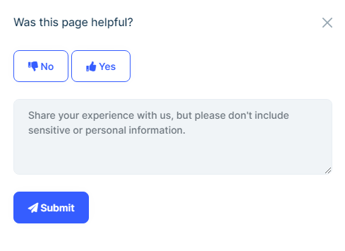
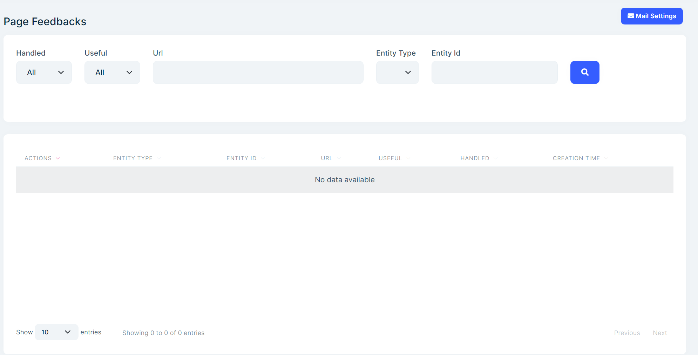
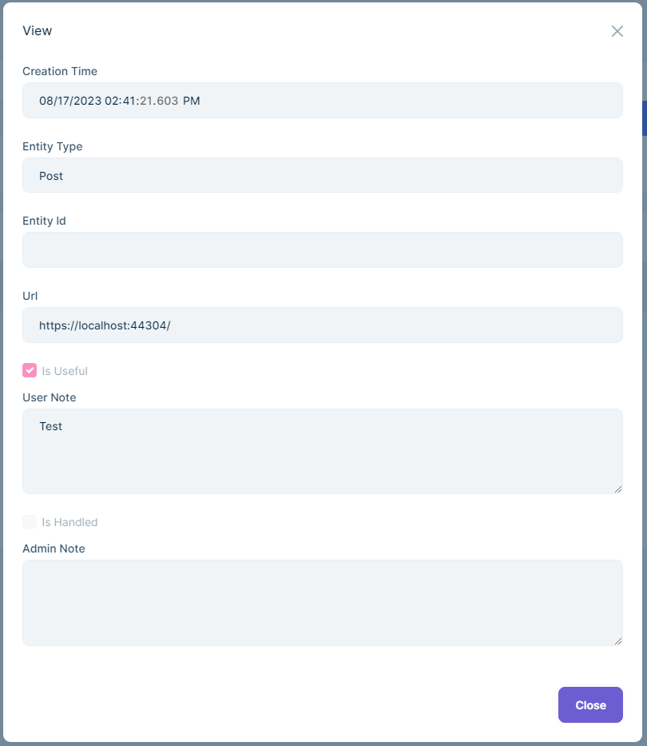
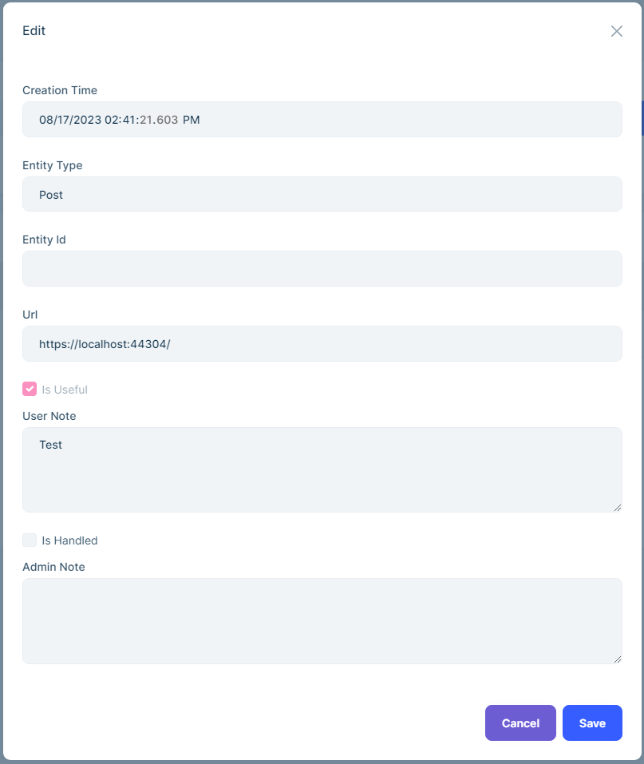
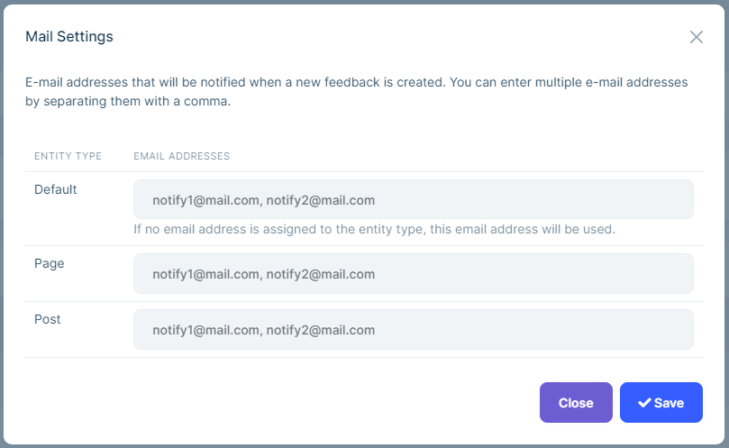

```json
//[doc-seo]
{
    "Description": "Discover how to implement the Page Feedback system in CMS Kit Pro, enabling user feedback collection with ease for enhanced engagement."
}
```

# CMS Kit Pro: Page Feedback System

> You must have an [ABP Team or a higher license](https://abp.io/pricing) to use CMS Kit Pro module's features.

The CMS Kit Pro module provides a comprehensive **Page Feedback** system that enables you to collect valuable user feedback about your website pages. This system allows visitors to quickly rate their experience and provide comments, helping you understand user satisfaction and identify areas for improvement.



## Enabling the Page Feedback System

All CMS Kit features are disabled by default. Therefore, you need to enable the features you want before starting to use them. You can use the [Global Feature](../../framework/infrastructure/global-features.md) system to enable or disable CMS Kit features at development time. Alternatively, you can use ABP's [Feature System](../../framework/infrastructure/features.md) to disable a CMS Kit feature at runtime.

> Check the ["How to Install" section of the CMS Kit Module documentation](index.md#how-to-install) to see how to enable or disable CMS Kit features at development time.

## User Interface

### Menu Items

The CMS Kit module admin side adds the following items to the main menu, under the **CMS** menu item:

**Page Feedbacks**: Page feedback management page.

The `CmsKitProAdminMenus` class defines the menu item name constants.

### Pages

#### Page Feedbacks

You can list, view, update and delete page feedback from the administration interface. You can also configure the email addresses that receive notifications.






## Page Feedback Widget

The page feedback system accepts only registered entity types. Register the entity type in the domain layer before rendering its widget:

```csharp
Configure<CmsKitPageFeedbackOptions>(options =>
{
    options.EntityTypes.Add(new PageFeedbackEntityTypeDefinition("Page"));
});
```

You can then place the page feedback [widget](../../framework/ui/mvc-razor-pages/widgets.md) on a page:

```csharp
@(await Component.InvokeAsync(typeof(PageFeedbackViewComponent), new PageFeedbackViewDto
    {
        EntityType = "Page",
    }))
```

### PageFeedbackViewDto Properties

- `EntityType`: Entity type name. It is used to group feedbacks by entity types. For example, you can group feedbacks by pages, blog posts, etc.

- `EntityId`: Entity id. It is used to group feedbacks by entities. For example, you can group feedbacks by blog post id, page id, etc.

- `YesButtonText`: Yes button text. Used to change the default text of the yes button. Default value is `Yes`.

- `VeryHelpfulText`: Description shown with the positive feedback choice.

- `NoButtonText`: No button text. Used to change the default text of the no button. Default value is `No`.

- `NeedsImprovementText`: Description shown with the negative feedback choice.

- `UserNotePlaceholder`: User note placeholder. Used to change the default placeholder of the user note input.

- `SubmitButtonText`: Submit button text. Used to change the default text of the submit button. Default value is `Submit`.

- `ReverseButtons`: Reverse buttons. Used to reverse the order of the yes and no buttons.

- `ThankYouMessageDescription`: Thank you message description. Used to change the default thank you message.

- `ThankYouMessageTitle`: Thank you message title. Used to change the default title of the thank you message.

- `HeaderVisible`: Header visible. Used to hide the header of the widget.

- `HeaderText`: Header text. Used to change the default text of the header.

### Page Feedback Modal Widget

The page feedback system provides a page feedback modal [widget](../../framework/ui/mvc-razor-pages/widgets.md) for users to send feedback about the current page. You can place the widget on a page as shown below:

```html
<button type="button" class="btn btn-primary mb-5" data-bs-toggle="modal" data-bs-target="#page-feedback-modal">
       Feedback
</button>
```

```csharp
@(await Component.InvokeAsync(typeof(PageFeedbackModalViewComponent), new PageFeedbackModalViewDto
    {
        EntityType = "Page",
        ModalId = "page-feedback-modal",
    }))
```

### PageFeedbackModalViewDto Properties

`PageFeedbackModalViewDto` inherits from [PageFeedbackViewDto](#pagefeedbackviewdto-properties) and adds the following property:

- `ModalId`: Modal id. Used to set the id of the modal. Default value is `page-feedback-modal`.

The current modal component does not forward the inherited `ReverseButtons` and `HeaderVisible` values to its rendered model. These two properties work with `PageFeedbackViewComponent`, but setting them on `PageFeedbackModalViewDto` has no effect. The other inherited widget text and entity properties are forwarded by the modal component.

## Page Feedback Notification

The page feedback system sends an email notification to the configured email addresses when feedback includes a user note. You can configure addresses for each entity type and a default fallback from the admin side of your solution.


The CMS settings page also provides these tenant-aware behavior settings:

- **Automatically handle feedback without comments** (default: `true`): Marks new feedback as handled when no user note is provided.
- **Require comments for negative feedback** (default: `false`): When a new negative feedback record is created, rejects it if no user note is provided. This setting is not re-evaluated when an existing record's usefulness value is changed.

## Options

The page feedback system provides a mechanism to group feedbacks by entity types. For example, you can group feedbacks by pages, blog posts, etc.

`CmsKitPageFeedbackOptions` can be configured in the domain layer, in the `ConfigureServices` method of your [module](../../framework/architecture/modularity/basics.md) class.

`CmsKitPageFeedbackOptions` properties:

- `EntityTypes`: A list of the defined entity types (`PageFeedbackEntityTypeDefinition`) in the page feedback system.

`PageFeedbackEntityTypeDefinition` properties:

- `EntityType`: Name of the entity type.

The earlier `Page` example registers the same entity type used by both widget examples. Only registered entity types can accept feedback or have entity-specific notification settings.

## Internals

### Domain Layer

#### Aggregates

This module follows the [Entity Best Practices & Conventions](../../framework/architecture/best-practices/entities.md) guide.

##### PageFeedback

A page feedback is a feedback sent by a user about a page.

- `PageFeedback` (Aggregate Root): Represents a page feedback.

##### PageFeedbackSetting

A page feedback setting is a setting to configure the page feedback system.

- `PageFeedbackSetting` (Aggregate Root): Represents a page feedback setting.

#### Repositories

This module follows the [Repository Best Practices & Conventions](../../framework/architecture/best-practices/repositories.md) guide.

The following custom repositories are defined for these features:

- `IPageFeedbackRepository`: Used to get a page feedback.
- `IPageFeedbackSettingRepository`: Used to get a page feedback setting.

#### Domain Services

This module follows the [Domain Services Best Practices & Conventions](../../framework/architecture/best-practices/domain-services.md) guide.

##### Page Feedback Manager

`PageFeedbackManager` is used to perform some operations for the `PageFeedback` and `PageFeedbackSetting` aggregate roots.

### Application layer

#### Application services

- `PageFeedbackAdminAppService` (implements `IPageFeedbackAdminAppService`): Manages page feedback from the administration interface.
- `PageFeedbackPublicAppService` (implements `IPageFeedbackPublicAppService`): Implements the public page feedback use cases.

### Database providers

#### Common

##### Table / collection prefix & schema

All tables/collections use the `Cms` prefix by default. Set static properties on the `AbpCmsKitDbProperties` class if you need to change the table prefix or set a schema name (if supported by your database provider).

##### Connection string

This module uses `CmsKit` for the connection string name. If you don't define a connection string with this name, it falls back to the `Default` connection string.

See the [connection strings](../../framework/fundamentals/connection-strings.md) documentation for details.

#### Entity Framework Core

##### Tables

- CmsPageFeedbacks
- CmsPageFeedbackSettings

#### MongoDB

##### Collections

- **CmsPageFeedbacks**
- **CmsPageFeedbackSettings**
