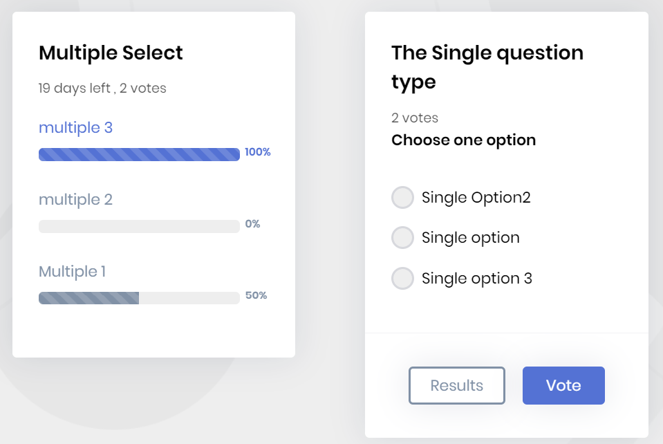
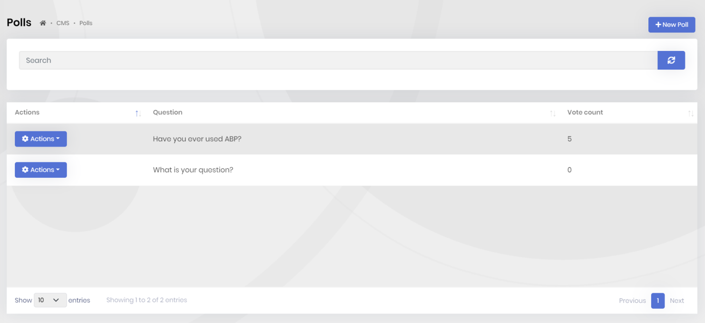
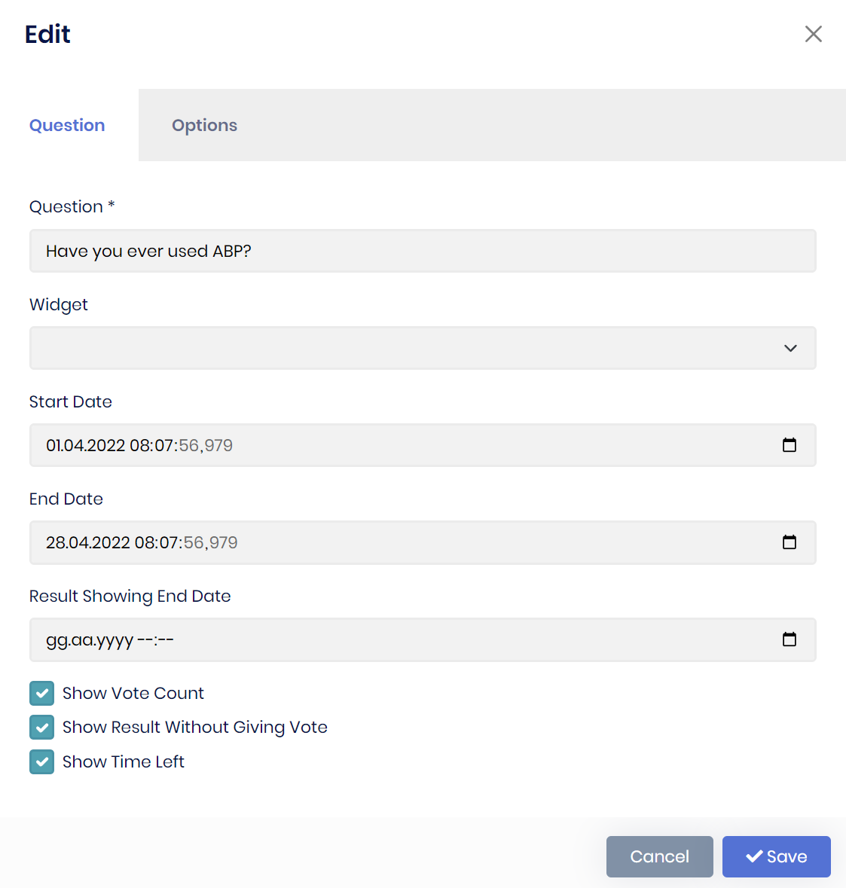
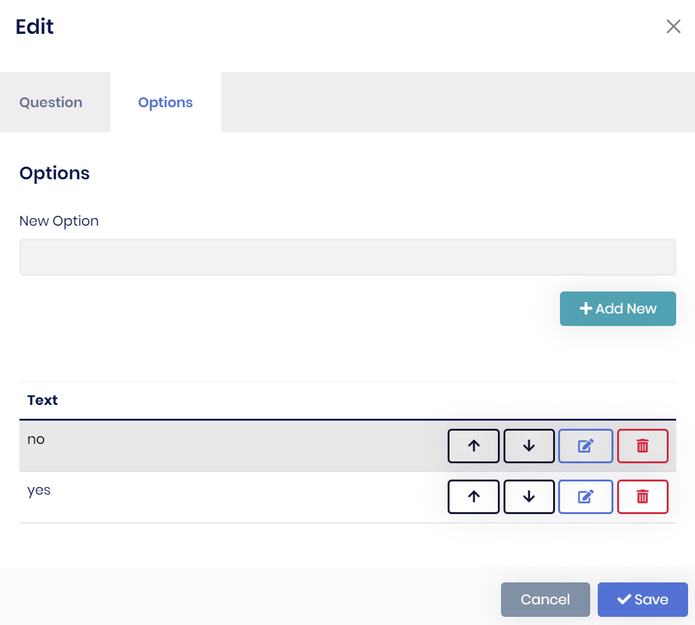

# CMS Kit Pro: Poll System

> You must have an ABP Team or a higher license to use CMS Kit Pro module's features.

CMS Kit provides a **poll** system to allow users to create, edit and delete polls. Here is a screenshot of the poll widget:



## Enabling the Poll System

By default, CMS Kit features are disabled. Therefore, you need to enable the features you want, before starting to use it. You can use the [Global Feature](../../framework/infrastructure/global-features.md) system to enable/disable CMS Kit features on development time. Alternatively, you can use the ABP's [Feature System](../../framework/infrastructure/features.md) to disable a CMS Kit feature on runtime.

> Check the ["How to Install" section of the CMS Kit Module documentation](index.md#how-to-install) to see how to enable/disable CMS Kit features on development time.

## User Interface

### Menu Items

CMS Kit module admin side adds the following items to the main menu, under the **CMS** menu item:

**Polls**: Poll management page.

`CmsKitProAdminMenus` class has the constants for the menu item names.

### Pages

#### Polls

You can list, create, update and delete polls on the admin side of your solution.





## Poll Widget

The poll system provides a poll [widget](../../framework/ui/mvc-razor-pages/widgets.md) for users to vote and show the result. You can place the widget on a page like the below:

```csharp
@await Component.InvokeAsync(
    typeof(PollViewComponent),
    new
    {
        widgetName = "my-poll-1"
    })
```

## Options

Before using the poll system, you need to define the widgets. You can use the `CmsKitPollingOptions`. `CmsKitPollingOptions` can be configured in the domain layer, in the `ConfigureServices` method of your [module](../../framework/architecture/modularity/basics.md).

**Example:**

```csharp
Configure<CmsKitPollingOptions>(options =>
    {
        options.AddWidget("my-poll-1");
    });
```

`CmsKitPollingOptions` properties:

- `WidgetNames`: List of defined widgets in the poll system. `options.AddWidget` method was a shortcut to add a new widget to this list.

## Internals

### Domain Layer

#### Aggregates

This module follows the [Entity Best Practices & Conventions](../../framework/architecture/best-practices/entities.md) guide.

##### Poll

A poll represents a created poll with its options: 

- `Poll` (aggregate root): Represents a poll by including the options in the system.
- `PollOption` (entity): Represents the defined poll options related to the poll in the system.

##### PollUserVote

A poll user vote represents voted poll from a user:

- `PollUserVote` (aggregate root): Represents poll user votes in the system.

#### Repositories

This module follows the [Repository Best Practices & Conventions](../../framework/architecture/best-practices/repositories.md) guide.

Following custom repositories are defined for these features:

- `IPollRepository`
- `IPollUserVoteRepository`

#### Domain services

This module follows the [Domain Services Best Practices & Conventions](../../framework/architecture/best-practices/domain-services.md) guide.

##### Poll Manager

`PollManager` is used to perform some operations for the `Poll` aggregate root.

### Application layer

#### Application services

- `PollAdminAppService` (implements `IPollAdminAppService`): Implements the use cases of poll management for admin side.
- `PollPublicAppService` (implements `IPollPublicAppService`): Implements the use cases of polls for public websites.

### Database providers

#### Common

##### Table / collection prefix & schema

All tables/collections use the `Cms` prefix by default. Set static properties on the `CmsKitDbProperties` class if you need to change the table prefix or set a schema name (if supported by your database provider).

##### Connection string

This module uses `CmsKit` for the connection string name. If you don't define a connection string with this name, it fallbacks to the `Default` connection string.

See the [connection strings](../../framework/fundamentals/connection-strings.md) documentation for details.

#### Entity Framework Core

##### Tables

- CmsPolls
  - CmsPollOptions
- CmsPollUserVotes

#### MongoDB

##### Collections

- **CmsPolls**
- **CmsPollUserVotes**

## Entity Extensions

Check the ["Entity Extensions" section of the CMS Kit Module documentation](index.md#entity-extensions) to see how to extend entities of the Poll Feature of the CMS Kit Pro module.