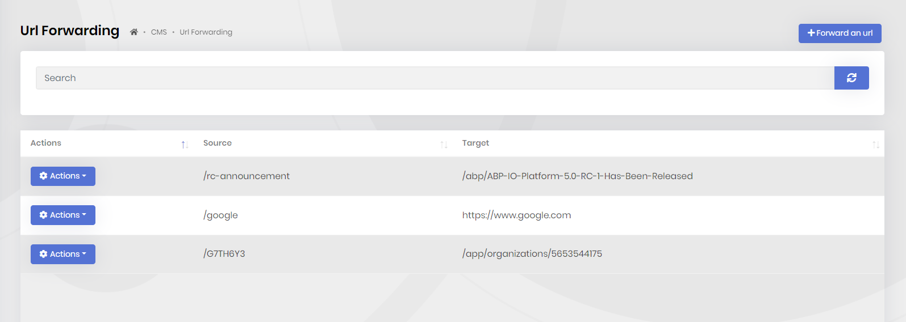

# CMS Kit Pro: URL Forwarding System

> You must have an ABP Team or a higher license to use CMS Kit Pro module's features.

CMS Kit provides a **URL forwarding** system to create URLs that redirect to other pages or external websites.

## Enabling the URL Forwarding System

By default, CMS Kit features are disabled. Therefore, you need to enable the features you want, before starting to use it. You can use the [Global Feature](../../framework/infrastructure/global-features.md) system to enable/disable CMS Kit features on development time. Alternatively, you can use the ABP's [Feature System](../../framework/infrastructure/features.md) to disable a CMS Kit feature on runtime.

In addition to enabling [Url Shorting global feature](index.md), you need to add `UrlShortingMiddleware` to your final application.

```csharp
using Volo.CmsKit.Pro.Public.Web.Middlewares;
.
.
        public override void OnApplicationInitialization(ApplicationInitializationContext context)
        {
            var app = context.GetApplicationBuilder();

            app.UseMiddleware<UrlShortingMiddleware>();
            .
            .
```

## User Interface

### Menu Items

URL Forwarding: Opens the URL Forwarding management page.

### Pages

#### URL Forwarding management page

You can create new forwardings or update/delete existing ones, in the admin side of your solution.



# Internals

## Domain Layer

#### Aggregates

This module follows the [Entity Best Practices & Conventions](../../framework/architecture/best-practices/entities.md) guide.

##### **ShortenedUrl**

- `ShortenedUrl` (aggregate root): Represents a URL mapping in the system.

#### Repositories

This module follows the [Repository Best Practices & Conventions](../../framework/architecture/best-practices/repositories.md) guide.

Following custom repositories are defined for this feature:

- `IShortenedUrlRepository`

### Application layer

#### Application services

- `UrlShortingAdminAppService` (implements `IUrlShortingAdminAppService`): Implements the use cases of URL Forwarding management.
- `UrlShortingPublicAppService` (implements `IUrlShortingPublicAppService`): Implements the use cases of URL Forwarding for public websites.

### Database providers

#### Common

##### Table / collection prefix & schema

All tables/collections use the `Cms` prefix by default. Set static properties on the `CmsKitDbProperties` class if you need to change the table prefix or set a schema name (if supported by your database provider).

##### Connection string

This module uses `CmsKit` for the connection string name. If you don't define a connection string with this name, it fallbacks to the `Default` connection string.

See the [connection strings](../../framework/fundamentals/connection-strings.md) documentation for details.

#### Entity Framework Core

##### Tables

- **CmsShortenedUrls**

#### MongoDB

##### Collections

- **CmsShortenedUrls**
