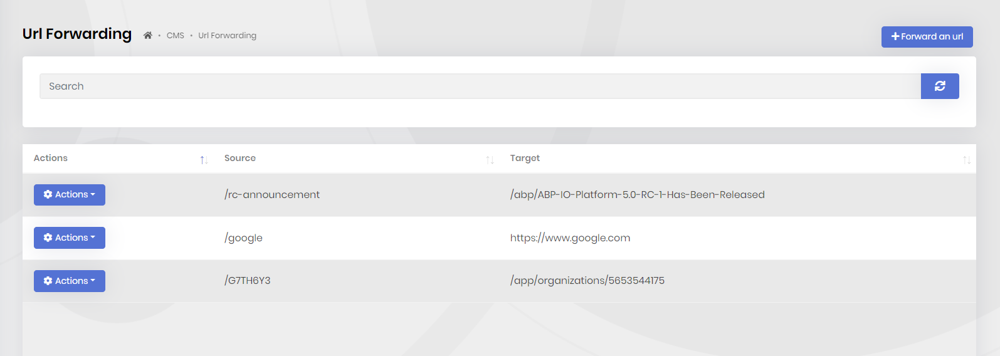

```json
//[doc-seo]
{
    "Description": "Learn how to enable and use the URL forwarding system in CMS Kit Pro for seamless redirection of pages and external links."
}
```

# CMS Kit Pro: URL Forwarding System

> You must have an [ABP Team or a higher license](https://abp.io/pricing) to use CMS Kit Pro module's features.

CMS Kit provides a **URL forwarding** system to create URLs that redirect to other pages or external websites.

## Enabling the URL Forwarding System

By default, CMS Kit features are disabled. Therefore, you need to enable the features you want before starting to use them. You can use the [Global Feature](../../framework/infrastructure/global-features.md) system to enable or disable CMS Kit features at development time. Alternatively, you can use ABP's [Feature System](../../framework/infrastructure/features.md) to disable a CMS Kit feature at runtime.

In addition to enabling the [URL Forwarding global feature](index.md#how-to-install), add `UrlShortingMiddleware` to the final web application. Register it before middleware that may produce a `404 Not Found` response so it can evaluate unmatched request paths after the rest of the pipeline runs.

```csharp
using Volo.CmsKit.Pro.Public.Web.Middlewares;

public override void OnApplicationInitialization(
    ApplicationInitializationContext context)
{
    var app = context.GetApplicationBuilder();

    app.UseMiddleware<UrlShortingMiddleware>();

    app.UseRouting();
    app.UseAuthentication();
    app.UseAuthorization();

    app.UseConfiguredEndpoints();
}
```

This example focuses on the relative middleware order. Keep the other middleware required by your application in the pipeline.

The middleware looks up the decoded request path and query string when the downstream pipeline returns `404`. Matching exact or regular-expression rules return a permanent redirect. Same-host relative targets must start with `/`, for example `/products/current`; the middleware expands them using the current request scheme and host. Absolute targets are used as absolute destinations.

## User Interface

### Menu Items

URL Forwarding: Opens the URL Forwarding management page.

### Pages

#### URL Forwarding management page

You can create, update and delete forwarding rules from the administration interface.




## Options

### ShortenedUrlCacheOptions

`ShortenedUrlCacheOptions` is used to configure the cache settings for the URL forwarding system. Example:

```csharp
Configure<ShortenedUrlCacheOptions>(options =>
{
    options.CacheAllOnStartup = true;
    options.Expiration = TimeSpan.FromMinutes(30);
});
```

- `Expiration` (default: one hour): Absolute lifetime applied when a single URL lookup result, including a negative result, is cached.
- `CacheAllOnStartup` (default: `false`): Enqueues a background job during application initialization to populate all URL rules in the cache.

### UrlShortingOptions

`UrlShortingOptions` controls regular-expression matching and conflicts:

```csharp
Configure<UrlShortingOptions>(options =>
{
    options.RegexIgnoreCase = true;
    options.PreventRegexLoop = true;
    options.TrackingQueryStringParameter = "__redirect";
    options.OnConflict = context =>
        Task.FromResult(context.ConflictUrls[0]);
});
```

- `RegexIgnoreCase` (default: `true`): Uses case-insensitive regular-expression matching.
- `PreventRegexLoop` (default: `true`): Adds and checks a tracking query-string value when a regular-expression rule redirects to the same host.
- `TrackingQueryStringParameter` (default: `__redirect`): Name of that tracking query-string parameter.
- `OnConflict`: Selects a rule when more than one regular expression matches. The default selects the first matching rule.

## Internals

### Domain Layer

#### Aggregates

This module follows the [Entity Best Practices & Conventions](../../framework/architecture/best-practices/entities.md) guide.

##### **ShortenedUrl**

- `ShortenedUrl` (aggregate root): Represents a URL mapping in the system.

#### Repositories

This module follows the [Repository Best Practices & Conventions](../../framework/architecture/best-practices/repositories.md) guide.

Following custom repositories are defined for this feature:

- `IShortenedUrlRepository`

### Application layer

#### Application services

- `UrlShortingAdminAppService` (implements `IUrlShortingAdminAppService`): Implements the use cases of URL Forwarding management.
- `UrlShortingPublicAppService` (implements `IUrlShortingPublicAppService`): Implements the use cases of URL Forwarding for public websites.

### Database providers

#### Common

##### Table / collection prefix & schema

All tables/collections use the `Cms` prefix by default. Set static properties on the `AbpCmsKitDbProperties` class if you need to change the table prefix or set a schema name (if supported by your database provider).

##### Connection string

This module uses `CmsKit` for the connection string name. If you don't define a connection string with this name, it falls back to the `Default` connection string.

See the [connection strings](../../framework/fundamentals/connection-strings.md) documentation for details.

#### Entity Framework Core

##### Tables

- **CmsShortenedUrls**

#### MongoDB

##### Collections

- **CmsShortenedUrls**
