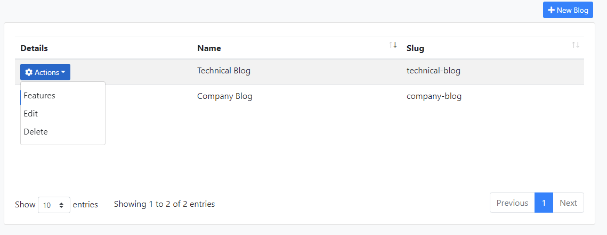
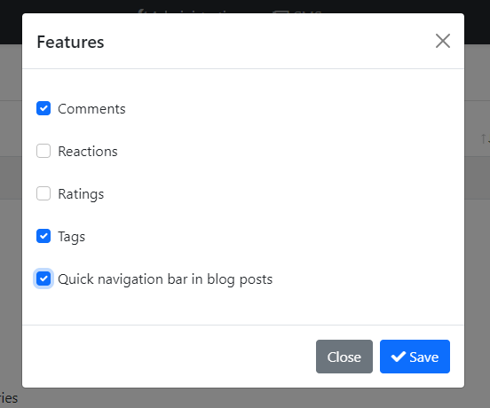
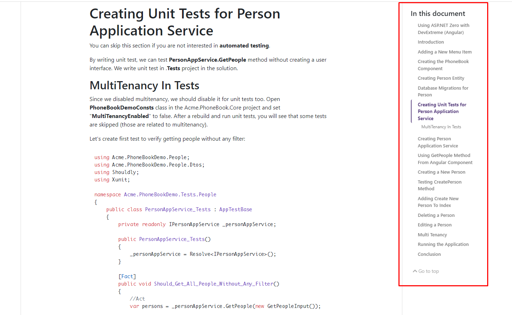

# CMS Kit: Blogging

The blogging feature provides the necessary UI to manage and render blogs and blog posts.

## Enabling the Blogging Feature

By default, CMS Kit features are disabled. Therefore, you need to enable the features you want, before starting to use it. You can use the [Global Feature](../../framework/infrastructure/global-features.md) system to enable/disable CMS Kit features on development time. Alternatively, you can use the ABP's [Feature System](../../framework/infrastructure/features.md) to disable a CMS Kit feature on runtime.

> Check the ["How to Install" section of the CMS Kit Module documentation](index.md#how-to-install) to see how to enable/disable CMS Kit features on development time.

## User Interface

### Menu Items

The following menu items are added by the blogging feature to the admin application:

* **Blogs**: Blog management page.
* **Blog Posts**: Blog post management page.

## Pages

### Blogs

Blogs page is used to create and manage blogs in your system. 


A screenshot from the new blog creation modal:


**Slug** is the URL part of the blog. For this example, the root URL of the blog becomes `your-domain.com/blogs/technical-blog/`.

- You can change the default slug by using `CmsBlogsWebConsts.BlogRoutePrefix` constant. For example, if you set it to `foo`, the root URL of the blog becomes `your-domain.com/foo/technical-blog/`.

    ```csharp
    public override void PreConfigureServices(ServiceConfigurationContext context)
    {
        CmsBlogsWebConsts.BlogsRoutePrefix = "foo";
    }
    ```

#### Blog Features

Blog feature uses some of the other CMS Kit features. You can enable or disable the features by clicking the features action for a blog.



You can select/deselect the desired features for blog posts. 



##### Quick Navigation Bar In Blog Post
If you enable "Quick navigation bar in blog posts", it will enabled scroll index as seen below.



### Blog Post Management

When you create blogs, you can manage blog posts on this page.


You can create and edit an existing blog post on this page. If you enable specific features such as tags, you can set tags for the blog post on this page.


## Internals

### Domain Layer

#### Aggregates

This module follows the [Entity Best Practices & Conventions](../../framework/architecture/best-practices/entities.md) guide.

- `Blog` _(aggregate root)_: Presents blogs of application.
- `BlogPost`_(aggregate root)_: Presents blog posts in blogs.
- `BlogFeature`:_(aggregate root)_: Presents blog features enabled/disabled state. Such as reactions, ratings, comments, etc.

#### Repositories

This module follows the [Repository Best Practices & Conventions](../../framework/architecture/domain-driven-design/repositories.md) guide. The following repositories are defined for this feature:

- `IBlogRepository`
- `IBlogPostRepository`
- `IBlogFeatureRepository`

#### Domain services

This module follows the [Domain Services Best Practices & Conventions](../../framework/architecture/domain-driven-design/domain-services.md) guide.

- `BlogManager`
- `BlogPostManager`
- `BlogFeatureManager`

### Application layer

#### Application Services

##### Common

- `BlogFeatureAppService` _(implements `IBlogFeatureAppService`)_

##### Admin

- `BlogAdminAppService` _(implements `IBlogAdminAppService`)_
- `BlogFeatureAdminAppService` _(implements `IBlogFeatureAdminAppService`)_
- `BlogPostAdminAppService` _(implements `IBlogPostAdminAppService`)_

##### Public

- `BlogPostPublicAppService` _(implements `IBlogPostPublicAppService`)_

### Database providers

#### Entity Framework Core

##### Tables

- CmsBlogs
- CmsBlogPosts
- CmsBlogFeatures

#### MongoDB

##### Collections

- CmsBlogs
- CmsBlogPosts
- CmsBlogFeatures

## Entity Extensions

Check the ["Entity Extensions" section of the CMS Kit Module documentation](index.md#entity-extensions) to see how to extend entities of the Blogging Feature of the CMS Kit module.