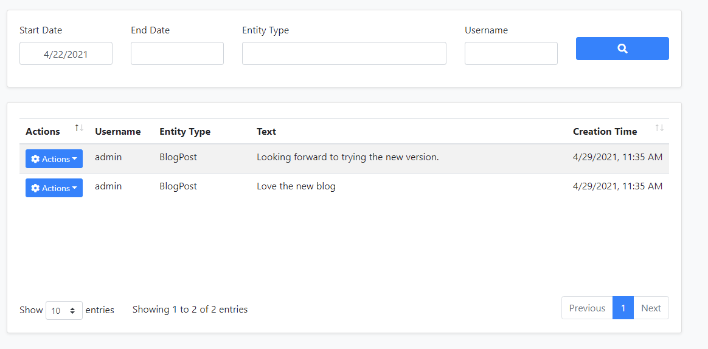
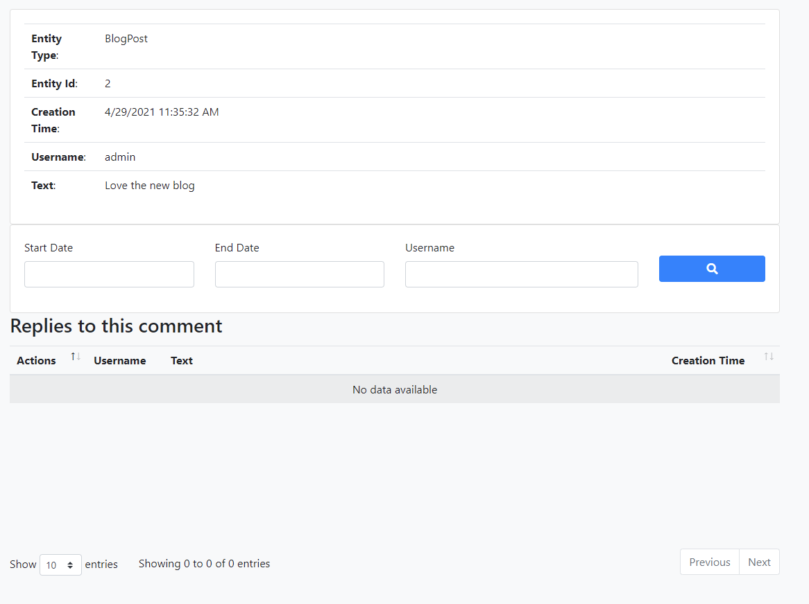
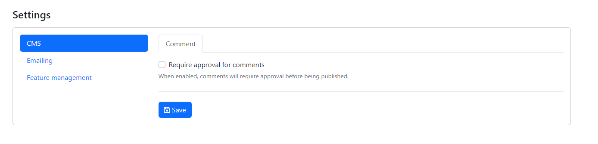

```json
//[doc-seo]
{
    "Description": "Learn how to enable and configure the CMS Kit's comment system for various resources like blog posts and products efficiently."
}
```

# CMS Kit: Comments

CMS Kit provides a **comment** system to add the comment feature to any kind of resource, like blog posts, products, etc.

## Enabling the Comment Feature

By default, CMS Kit features are disabled. Therefore, you need to enable the features you want, before starting to use it. You can use the [Global Feature](../../framework/infrastructure/global-features.md) system to enable/disable CMS Kit features on development time. Alternatively, you can use the ABP's [Feature System](../../framework/infrastructure/features.md) to disable a CMS Kit feature on runtime.

> Check the ["How to Install" section of the CMS Kit Module documentation](index.md#how-to-install) to see how to enable/disable CMS Kit features on development time.

## Options

The comment system provides a mechanism to group comment definitions by entity types. For example, if you want to use the comment system for blog posts and products, you need to define two entity types named `BlogPosts` and `Product`, and add comments under these entity types.

`CmsKitCommentOptions` can be configured in the domain layer, in the `ConfigureServices` method of your [module](../../framework/architecture/modularity/basics.md). Example:

```csharp
Configure<CmsKitCommentOptions>(options =>
{
    options.EntityTypes.Add(new CommentEntityTypeDefinition("Product"));
    options.IsRecaptchaEnabled = true;
    options.AllowedExternalUrls = new Dictionary<string, List<string>>
    {
        {
            "Product",
            new List<string>
            {
                "https://abp.io/"
            }
        }
    };
});
```

> If you're using the [Blogging Feature](./blogging.md), the ABP defines an entity type for the blog feature automatically. You can easily override or remove the predefined entity types in `Configure` method like shown above.

`CmsKitCommentOptions` properties:

- `EntityTypes`: List of defined entity types (`CommentEntityTypeDefinition`) in the comment system.
- `IsRecaptchaEnabled`: This flag enables or disables the reCaptcha for the comment system. You can set it as **true** if you want to use reCaptcha in your comment system.
- `AllowedExternalUrls`: The allowed external URLs for each entity type. When it is specified for an entity type, every detected HTTP(S) URL in a comment text is checked, and the comment is rejected when a detected URL doesn't include any of the configured values. The comparison is a case-insensitive substring check on the normalized URLs, not an exact origin match.

`CommentEntityTypeDefinition` properties:

- `EntityType`: Name of the entity type.

## The Comments Widget

The comment system provides a commenting [widget](../../framework/ui/mvc-razor-pages/widgets.md) to allow users to send comments to resources on public websites. You can simply place the widget on a page like below. 

```csharp
@await Component.InvokeAsync(typeof(CommentingViewComponent), new
{
  entityType = "Product",
  entityId = "...",
  isReadOnly = false,
  referralLinks  = new [] {"nofollow"}
})
```

`entityType` was explained in the previous section. `entityId` should be the unique id of the product, in this example. If you have a Product entity, you can use its Id here. `referralLinks` is an optional parameter. You can use this parameter to add values (such as "nofollow", "noreferrer", or any other values) to the [rel attributes](https://developer.mozilla.org/en-US/docs/Web/HTML/Attributes/rel) of links. 

Creating, updating and deleting a comment requires an authenticated user. Users can update only their own comments. They can delete their own comments, while the `CmsKitPublic.Comments.DeleteAll` permission allows deleting comments created by other users. Deleting a comment also deletes its direct replies.

Reactions are enabled inside the MVC comments widget by default when the Reactions global feature is available. Disable them without disabling reactions for other entity types by configuring the UI options in the web project:

```csharp
Configure<CmsKitUiOptions>(options =>
{
    options.CommentsOptions.IsReactionsEnabled = false;
});
```

## User Interface

### Menu Items

The following menu items are added by the commenting feature to the admin application:

* **Comments**: Opens the comment management page.

### Pages

#### Comment Management

You can view and manage comments on this page.



You can also view and manage replies on this page.



## Settings

You can configure the approval status of comments using the **Comment** tab under the **Cms** section on the Settings page. When approval is required, new comments wait for an administrator and public queries return only approved comments. When approval is disabled, waiting comments are also visible. The setting is stored globally, not per tenant, and is `false` by default. Changing it requires the `CmsKit.Comments.SettingManagement` permission.



## Internals

### Domain Layer

#### Aggregates

This module follows the [Entity Best Practices & Conventions](../../framework/architecture/best-practices/entities.md) guide.

##### Comment

A comment represents a written comment from a user.

- `Comment` (aggregate root): Represents a written comment in the system.

#### Repositories

This module follows the [Repository Best Practices & Conventions](../../framework/architecture/best-practices/repositories.md) guide.

The following custom repositories are defined for this feature:

- `ICommentRepository`

#### Domain services

This module follows the [Domain Services Best Practices & Conventions](../../framework/architecture/best-practices/domain-services.md) guide.

##### Comment Manager

`CommentManager` is used to perform some operations for the `Comment` aggregate root.

### Application layer

#### Application services

- `CommentAdminAppService` (implements `ICommentAdminAppService`): Implements the use cases of the comment management system, like listing or removing comments etc.
- `CommentPublicAppService` (implements `ICommentPublicAppService`):  Implements the use cases of the comment management on the public websites, like listing comments, adding comments etc.

### Database providers

#### Common

##### Table / collection prefix & schema

All tables/collections use the `Cms` prefix by default. Set static properties on the `AbpCmsKitDbProperties` class if you need to change the table prefix or set a schema name (if supported by your database provider).

##### Connection string

This module uses `CmsKit` for the connection string name. If you don't define a connection string with this name, it fallbacks to the `Default` connection string.

See the [connection strings](../../framework/fundamentals/connection-strings.md) documentation for details.

#### Entity Framework Core

##### Tables

- CmsComments

#### MongoDB

##### Collections

- **CmsComments**
