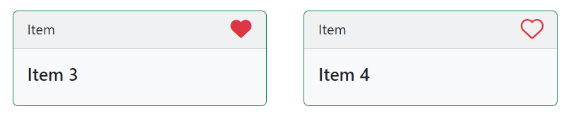

# CMS Kit: Marked Item System

CMS kit provides a marking system to mark any kind of resource, like a blog post or a product, as a favorite, starred, flagged, or bookmarked.

Marked toggling component allows users to mark your items via pre-defined icons/emojis. Here how the marked toggling components may look like:




you can also customize the marking icons shown in the toggling components.

## Enabling the Marked Item Feature

By default, CMS Kit features are disabled. Therefore, you need to enable the features you want, before starting to use it. You can use the [Global Feature](../../Global-Features.md) system to enable/disable CMS Kit features on development time. Alternatively, you can use the ABP Framework's [Feature System](https://docs.abp.io/en/abp/latest/Features) to disable a CMS Kit feature on runtime.

> Check the ["How to Install" section of the CMS Kit Module documentation](Index.md#how-to-install) to see how to enable/disable CMS Kit features on development time.

## Options

Marking system provides a simple approach to define your entity type with mark types like favorite or starred. For example, if you want to use the marking system for products, you need to define an entity type named `product` with the icon name.

`CmsKitMarkedItemOptions` can be configured in YourModule.cs, in the `ConfigureServices` method of your [module](https://docs.abp.io/en/abp/latest/Module-Development-Basics). Example:

```csharp
Configure<CmsKitMarkedItemOptions>(options =>
{
    options.EntityTypes.Add(
        new MarkedItemEntityTypeDefinition(
            "product",
            StandardMarkedItems.Favorite
            )
        );
});
```

`CmsKitMarkedItemOptions` properties:

- `EntityTypes`: List of defined entity types (`CmsKitMarkedItemOptions`) in the marking system.

`MarkedItemEntityTypeDefinition` properties:

- `EntityType`: Name of the entity type.
- `IconName`: The name of the icon.

## The Marked Item widget

The marking system provides a toggle widget to allow users to add/remove the marks from an item. You can place the widget with the item as shown below:

``` csharp
@await Component.InvokeAsync(typeof (MarkedItemToggleViewComponent), new
{
    entityId = "...",
    entityType = "product",
    needsConfirmation = true // (optional)
})
```
* `entityType` was explained in the previous section. 
* `entityId` should be the unique id of the product, in this example. If you have a Product entity, you can use its Id here. 
* `needsConfirmation` An optional parameter to let the user confirm when removing the mark.

### Filtering on Marked Items

Users can filter their marked items to easily find their favorites. Here's how to utilize the `GetEntityIdsFilteredByUserAsync` method to filter the user's marked items within your repository queries:

```csharp
List<string> entityIdFilters = null;
if (userId.HasValue)
{
    entityIdFilters = await UserMarkedItemRepository.GetEntityIdsFilteredByUserAsync(
        userId.Value, 
        entityType, 
        cancellationToken: cancellationToken
    );
}

var queryable = (await GetDbSetAsync())
    .WhereIf(entityIdFilters != null, x => entityIdFilters.Contains(x.Id.ToString()));

// Additional query logic...
```

- `GetEntityIdsFilteredByUserAsync`: Retrieves a list of entity IDs marked by the user for the given entity type.
- `userId`: The ID of the user performing the filtering.
- `entityType`: The type of entity being filtered (e.g., "product").
- `entityIdFilters`: A list of marked entity IDs that will be used to filter the items in the database.

# Internals

## Domain Layer

#### Aggregates

This module follows the [Entity Best Practices & Conventions](https://docs.abp.io/en/abp/latest/Best-Practices/Entities) guide.

##### UserMarkedItem

A user markedItem represents a user has marking on the item.

- `UserMarkedItem` (aggregate root): Represents a marked item in the system.

#### Repositories

This module follows the [Repository Best Practices & Conventions](https://docs.abp.io/en/abp/latest/Best-Practices/Repositories) guide.

Following custom repositories are defined for this feature:

- `IUserMarkedItemRepository`


#### Domain services

This module follows the [Domain Services Best Practices & Conventions](https://docs.abp.io/en/abp/latest/Best-Practices/Domain-Services) guide.

##### Marked Item Manager

`MarkedItemManager` is used to perform some operations for the `UserMarkedItem` aggregate root.

### Application layer

#### Application services

- `MarkedItemPublicAppService` (implements `IMarkedItemPublicAppService`): Implements the use cases of marking system.

### Database providers

#### Common

##### Table / collection prefix & schema

All tables/collections use the `Cms` prefix by default. Set static properties on the `CmsKitDbProperties` class if you need to change the table prefix or set a schema name (if supported by your database provider).

##### Connection string

This module uses `CmsKit` for the connection string name. If you don't define a connection string with this name, it fallbacks to the `Default` connection string.

See the [connection strings](https://docs.abp.io/en/abp/latest/Connection-Strings) documentation for details.

#### Entity Framework Core

##### Tables

- CmsUserMarkedItems

#### MongoDB

##### Collections

- **CmsUserMarkedItems**

