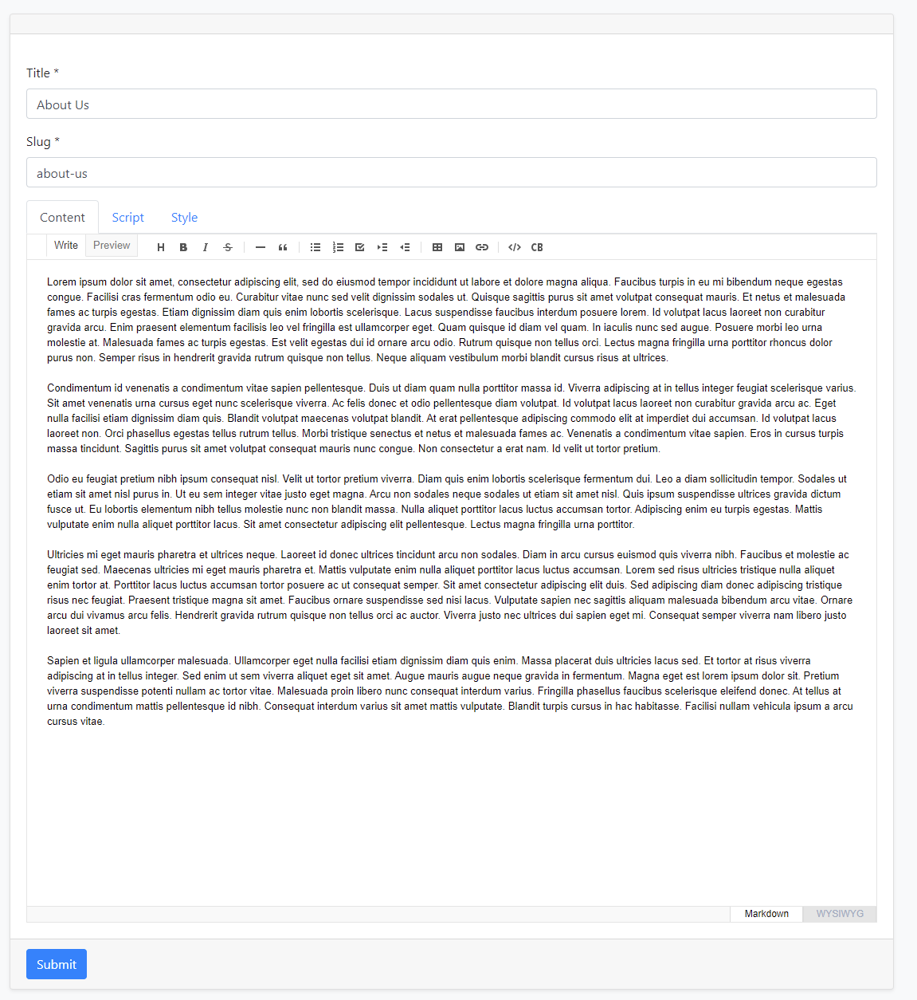
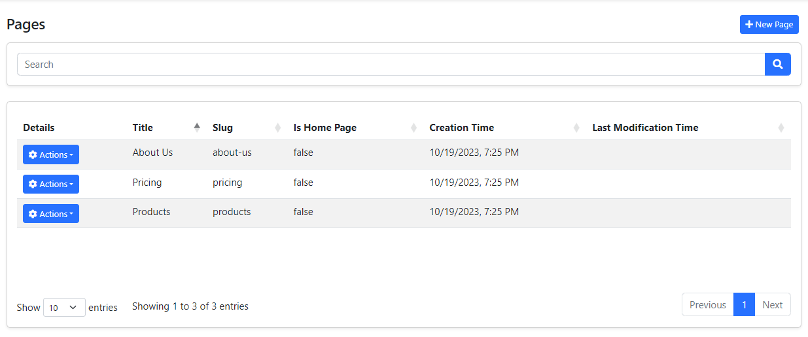

```json
//[doc-seo]
{
    "Description": "Learn how to enable and manage dynamic pages in the CMS Kit, enhancing your ABP Framework applications with customizable content features."
}
```

# CMS Kit: Pages

CMS Kit Page system allows you to create dynamic pages by specifying URLs, which is the fundamental feature of a CMS.

## Enabling the Pages Feature

By default, CMS Kit features are disabled. Therefore, you need to enable the features you want, before starting to use it. You can use the [Global Feature](../../framework/infrastructure/global-features.md) system to enable/disable CMS Kit features on development time. Alternatively, you can use the ABP's [Feature System](../../framework/infrastructure/features.md) to disable a CMS Kit feature on runtime.

> Check the ["How to Install" section of the CMS Kit Module documentation](index.md#how-to-install) to see how to enable/disable CMS Kit features on development time.

## The User Interface

### Menu items

CMS Kit module admin side adds the following items to the main menu, under the *CMS* menu item:

* **Pages**: Page management page.

`CmsKitAdminMenus` class has the constants for the menu item names.

### Pages

#### Page Management

**Pages** page is used to manage dynamic pages in the system. You can create/edit pages with dynamic routes and contents on this page:



After you have created pages, you can set one of them as the *home page*. CMS Kit keeps at most one home page for the current tenant. Setting or clearing it requires the `CmsKit.Pages.SetAsHomePage` permission.



Each page has a `Draft` or `Publish` status. Only published pages are returned by the public application service. A published home page is rendered at `/`, while any other published page is rendered at `/{slug}`. Draft pages return a not-found result on these public routes.

The public page lookup is cached. The home page has a one-hour absolute cache lifetime, and CMS Kit invalidates the relevant entries when an administrator creates, updates, deletes or changes the home page.

### Layout and Custom Resources

The optional **Layout Name** selects a layout from the current theme. A page can also contain CSS in its **Style** field and JavaScript in its **Script** field. CMS Kit adds the style to the page's style section and the script to its script section.

> Page content, style and script are trusted administrator input. The built-in public page renders the content with HTML enabled and XSS prevention disabled, and writes the style and script without sanitization. Grant the page create and update permissions only to users who are allowed to publish executable content.

## Internals

### Domain Layer

`Page` is a multi-tenant aggregate root. `PageManager` normalizes and checks slugs, changes publication status and enforces the single-home-page rule.

### Application Layer

`PageAdminAppService` provides permission-gated management operations. `PagePublicAppService` exposes only published pages and manages the distributed page cache.

### Database Providers

The Entity Framework Core table and MongoDB collection are named `CmsPages` by default. Use `AbpCmsKitDbProperties` to change the common prefix or the relational schema.
