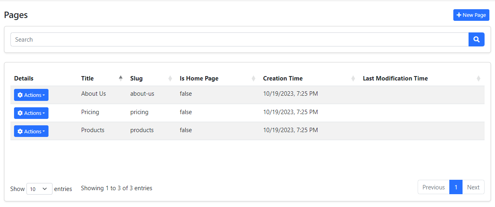

# CMS Kit: Pages

CMS Kit Page system allows you to create dynamic pages by specifying URLs, which is the fundamental feature of a CMS.

## Enabling the Pages Feature

By default, CMS Kit features are disabled. Therefore, you need to enable the features you want, before starting to use it. You can use the [Global Feature](../../framework/infrastructure/global-features.md) system to enable/disable CMS Kit features on development time. Alternatively, you can use the ABP's [Feature System](../../framework/infrastructure/features.md) to disable a CMS Kit feature on runtime.

> Check the ["How to Install" section of the CMS Kit Module documentation](index.md#how-to-install) to see how to enable/disable CMS Kit features on development time.

## The User Interface

### Menu items

CMS Kit module admin side adds the following items to the main menu, under the *CMS* menu item:

* **Pages**: Page management page.

`CmsKitAdminMenus` class has the constants for the menu item names.

### Pages

#### Page Management

**Pages** page is used to manage dynamic pages in the system. You can create/edit pages with dynamic routes and contents on this page:

After you have created pages, you can set one of them as a *home page*. Then, whenever anyone navigates to your application's homepage, they see the dynamic content of the page that you have defined on this page.

Also when you create a page, you can access the created page via `/{slug}` URL.

